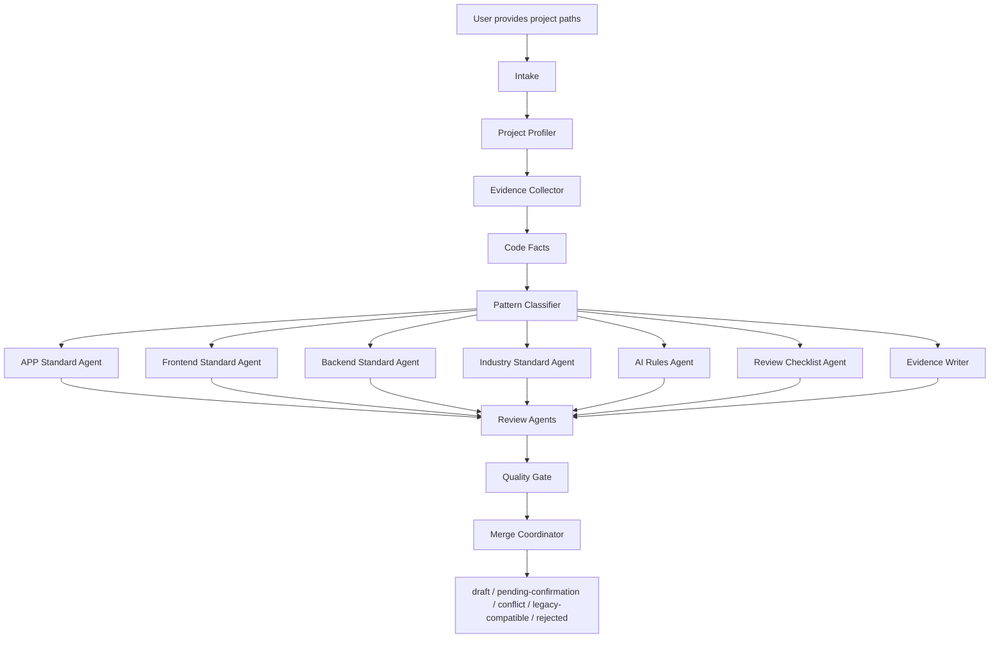

# feat: Build project-standard-extractor workflow

> 路径迁移说明：`project-standard-extractor` 的当前 canonical source package 已迁移到 `skills/project-standard-extractor/`。本计划正文中出现的 `engineering-standards/08-ai-coding/project-standard-extractor/` 是该计划执行时的历史路径。

## Summary

本计划将 `project-standard-extractor` 落地为一个对外单一 Skill 的规范萃取 workflow：第一阶段交付 Markdown Skill 资产、agent 合约、输出模板、质量门禁、规范目录入口和最小可运行萃取闭环证明，不建设 CLI、平台、向量库或自动合入机制。

---

## Problem Frame

源需求要求把当前依赖端负责人人工编写规范的过程，升级为可复用的规范萃取 workflow：Skill 基于真实项目代码和团队上下文，提炼 APP、前端、后端和行业维度的团队级规范，并直接写入正式规范目录，初始状态为 `draft`。计划必须保留源文档的核心边界：不做平台化、不做完整 CLI、不自动发布 `active`，不把项目说明书误写成团队标准。

---

## Requirements

- R1. 建立一个对外 Skill：`project-standard-extractor`，它是 workflow orchestrator，不拆成 APP / 前端 / 后端 / 行业多个入口。覆盖 origin R1-R4、R10-R12。
- R2. Skill 必须采用交互式输入引导，支持从一个或多个项目路径开始，并按项目路径、研发域、行业场景、输出范围、子领域、业务模块、正反例候选、已有文档、质量关注点、输出目标和确认声明逐步补齐上下文。覆盖 origin R5-R9、AE1。
- R3. Skill 内部必须定义通用阶段 agent、领域生成 agent、证据 agent、分面评审 agent、Quality Gate 和 Merge Coordinator，所有专项输出基于同一份代码事实和模式分类结果。覆盖 origin R11-R16、AE4。
- R4. 输出结构必须支持 APP、前端、后端和独立行业规范，并采用统一主结构：`overview`、`standard`、`ai-rules`、`review-checklist`、`examples`、`evidence`、`pending-confirmation`、`merge-suggestions`、`conflicts`。覆盖 origin R17-R22。
- R5. 规则正文必须保持团队级抽象，真实代码路径和正反例证据放入独立 `evidence`，不得把规范写成某个项目或微服务的代码说明书。覆盖 origin R2、R23-R28、AE2。
- R6. 规则必须支持 `draft`、`active`、`pending-confirmation`、`conflict`、`legacy-compatible`、`rejected` 等状态；Skill 写入正式规范目录时只能追加 `draft`、证据、合并建议和冲突待确认，不覆盖已有 `active` 或 `draft`。覆盖 origin R29-R40、AE3、AE5、AE6。
- R7. 质量门禁必须由多个内部评审 agent 分面完成，检查证据、团队级抽象、AI 可执行性、Review 可检查性、正反例、规则数量、人工确认、冲突和行业风险，Quality Gate 负责汇总状态建议。覆盖 origin R41-R46。
- R8. 第一阶段必须避免把 `rules-index.json`、`llms.txt`、CI、自动静态扫描、Web 平台和完整 CLI 变成主交付；这些只保留兼容设计或后续演进说明。覆盖 origin Scope Boundaries。

**Origin actors:** A1 端负责人、A2 架构负责人、A3 Skill Workflow、A4 专业 Agent、A5 AI 使用者、A6 Reviewer。
**Origin flows:** F1 交互式萃取启动、F2 分阶段 agent 萃取、F3 规范写入和重复运行、F4 审核和使用。
**Origin acceptance examples:** AE1 输入引导、AE2 团队级抽象与 evidence、AE3 单项目高质量规则进入 draft、AE4 多 agent 编排、AE5 高风险 draft 提示、AE6 重复运行不覆盖。

---

## Assumptions

- A1. 第一阶段 Skill 资产以本仓库内的 Markdown / 模板 / prompt 文件落地，作为可安装或可复制到具体 AI 宿主的源资产；不直接修改 `.agents/skills/**` 这类运行时镜像。
- A2. 前端、后端和行业规范第一阶段先交付结构入口、模板引用、evidence policy 和“等待萃取”状态；没有真实 evidence 或负责人确认的内容不得写成 AI 可执行 `draft` 规则。
- A3. 现有 APP 规范文件数量较多，第一阶段不强制迁移为单文件 `standard.md`；通过映射说明和 evidence 目录补齐统一主结构兼容。
- A4. 行业规范目录采用 `engineering-standards/09-industry/`，因为行业规则跨 APP / PC / 前端 / 后端使用，且需要独立 owner、独立 AI prompt 消费入口和清晰 discoverability；不放入 `00-global/industry-risk/` 是为了避免把行业共性误收敛成全局风险规则，不挂在各端目录下是为了避免多端重复维护。

---

## Scope Boundaries

- 不建设规范管理 Web 平台。
- 不建设完整 CLI 或自动运行器。
- 不实现真实代码 AST 分析、向量检索或跨仓库索引。
- 不自动把 `draft` 发布为 `active`。
- 不自动创建 MR、issue 或 CI 检查。
- 不整改历史代码。
- 不把 `.agents/skills/**` 运行时镜像作为本次 source 变更目标。
- 不把无证据模板规则写入正式 `standard.md` / `ai-rules.md` 作为 AI 可执行规范。
- 不把行业通用最佳实践直接升级为团队 P0 / FORBIDDEN 规则；没有代码证据或负责人确认的行业规则保留为模板说明或 `pending-confirmation`。

### Deferred to Follow-Up Work

- CLI 入口、`rules-index.json` 生成、`llms.txt`、多 AI 工具导出和 CI 检查：作为 V2 工具化能力单独规划。
- 独立 `standard-reviewer` Skill：等 `draft -> active` 批量流转和人工改写复核成为高频场景后再拆分。
- 对真实 APP / 前端 / 后端 / 行业项目执行批量萃取并补充完整 evidence：在 Skill 资产和最小 dogfood 验证通过后，按端负责人提供的项目路径分批执行。

---

## Graph Readiness

- target_repo: `.`
- status: unavailable
- source_revision: unavailable
- current_revision: `686e734`
- stale: unknown
- primary_providers: none
- degraded_providers: none
- fallback_capabilities: bounded direct repo reads
- runtime_mcp_evidence: not used
- confidence: medium
- limitations: `.spec-first/graph/` readiness artifacts are absent; this is a docs/skill planning task, so direct repository reads are sufficient and graph impact evidence is not required.

---

## Context & Research

### Relevant Code and Patterns

- `docs/brainstorms/2026-05-21-001-project-standard-extractor-requirements.md` defines the source requirements, agent roles, state model, evidence policy and acceptance examples.
- `docs/02-技术方案/第一阶段技术方案.md` is the current phase-one baseline and already describes the single Skill, output structure and internal agent split.
- `docs/02-技术方案/skill建设.md` contains detailed prompt-chain, domain detection, sample selection and quality-control content to convert into reusable Skill assets.
- `docs/02-技术方案/高质量萃取.md` provides the quality-bar language: evidence, AI executability, Review checkability and正反例门禁.
- `docs/01-版本路线/产品定位说明.md` anchors product positioning and confirms one external Skill with internal multi-agent execution.
- `engineering-standards/01-app-client/` is the existing APP规范样板; it should be preserved and mapped into the unified output structure rather than rewritten wholesale.
- `engineering-standards/prompts/app-client-standard-extraction.md` and `engineering-standards/prompts/app-client-ai-development-input.md` show the current prompt style to extend for the new Skill.
- `AGENTS.md` requires Chinese output and `CHANGELOG.md` updates for user-visible source changes.

### Institutional Learnings

- No `docs/solutions/` files exist in this repo yet, so there are no prior institutional learning docs to incorporate.

### External References

- External research was not used. The requirements, local technical方案 and existing规范目录 are sufficient for a docs-first Skill implementation plan.

---

## Key Technical Decisions

- Use `engineering-standards/08-ai-coding/project-standard-extractor/` as the canonical Skill source package: this keeps the product asset inside the standards repository and avoids editing generated runtime mirrors.
- Represent internal agents as Markdown role contracts first, not as executable subprocesses: the first-stage product is a workflow Skill and规范文档生成方法. 但第一阶段必须通过一个 golden sample 和一个 thin dogfood run 证明 `SKILL.md` 作为入口可以驱动 intake -> code facts -> pattern classification -> rule generation -> quality gate -> merge coordination 的完整闭环；actual host-specific agent dispatch can be added later.
- Store evidence outside rule正文: `standard.md` rules reference evidence by Rule ID or evidence section anchor, while code paths live under `evidence/`.
- Preserve existing APP docs and add a compatibility map: APP already has mature per-topic files, so first-stage work should add `README.md` / mapping / evidence without flattening the docs into one file.
- Add `engineering-standards/09-industry/` for independent industry rules: this satisfies the “独立行业规范” requirement and keeps行业共性、合规、高风险模块规则 separate from security-only guidance. Decision note: compared with `00-global/industry-risk/` and per-domain overlays, a top-level directory is preferred because industry rules cross研发域, require independent owner review, and need to be pulled into AI inputs as a separate rule pack.
- Use Markdown templates and review checklists as the first quality gate implementation: script validation is deferred, but every rule template must make evidence, state, AI要求 and Review检查项 explicit.
- Treat `draft` as AI-usable only when it has minimal evidence or explicit owner confirmation. `ai-rules.md` and prompt templates must tell AI to surface evidence tier and unreviewed status for P0、FORBIDDEN、行业高风险、conflict and `pending-confirmation` rules. No-evidence scaffold content must stay in templates, examples or `pending-confirmation`, not in default AI execution paths.

---

## Open Questions

### Resolved During Planning

- Agent 落地机制：第一阶段用 Markdown agent contracts under the Skill package; no new executable agent runtime.
- 现有 APP 结构：保留现有细分文件，通过 mapping 和 evidence 目录与统一主结构对齐。
- Evidence 组织方式：第一阶段按领域目录组织，使用 `code-facts.md`、`positive-examples.md`、`forbidden-examples.md`、`legacy-compatible.md`；后续可按 Rule ID 拆分。
- Draft 未审核提示：进入 `ai-rules.md` 模板、AI 开发输入模板和 Skill 输出自检要求。
- 规则状态：持久化状态只使用 `draft`、`active`、`pending-confirmation`、`conflict`、`legacy-compatible`、`rejected`；升级候选只能表达为非持久化 `recommended_action: consider promotion`。
- 质量门禁：第一阶段采用分面评审 agent 合约 + Quality Gate checklist + 人工确认，不实现脚本校验；门禁覆盖证据、团队级抽象、AI 可执行性、Review 可检查性、正反例、规则数量、人工确认、冲突和行业风险。

### Deferred to Implementation

- 最终文件命名是否完全采用英文：执行时按已有目录中文环境和现有文件命名风格微调，但计划中的路径保持 repo-relative。
- 各端 evidence-backed 规则数量：实现时根据真实材料 right-size，避免为了数量填充无证据规则；无证据内容只能作为模板、占位说明或 `pending-confirmation`。
- 行业初版覆盖证券、信贷、银行中的哪些子行业：模板保留扩展位，具体规则由后续真实项目和负责人确认补充。

---

## Output Structure

```text
engineering-standards/
├── README.md
├── 00-global/
│   ├── README.md
│   ├── rule-lifecycle.md
│   ├── standard-template.md
│   ├── ai-rules-template.md
│   ├── review-checklist-template.md
│   ├── evidence-template.md
│   └── quality-gate.md
├── 01-app-client/
│   ├── README.md
│   ├── pending-confirmation.md
│   ├── merge-suggestions.md
│   ├── conflicts.md
│   └── evidence/
│       ├── README.md
│       ├── code-facts.md
│       ├── positive-examples.md
│       ├── forbidden-examples.md
│       └── legacy-compatible.md
├── 03-frontend/
│   ├── overview.md
│   ├── standard.md
│   ├── ai-rules.md
│   ├── review-checklist.md
│   ├── pending-confirmation.md
│   ├── merge-suggestions.md
│   ├── conflicts.md
│   ├── examples/
│   └── evidence/
│       ├── README.md
│       ├── code-facts.md
│       ├── positive-examples.md
│       ├── forbidden-examples.md
│       └── legacy-compatible.md
├── 04-backend/
│   ├── overview.md
│   ├── standard.md
│   ├── ai-rules.md
│   ├── review-checklist.md
│   ├── pending-confirmation.md
│   ├── merge-suggestions.md
│   ├── conflicts.md
│   ├── examples/
│   └── evidence/
│       ├── README.md
│       ├── code-facts.md
│       ├── positive-examples.md
│       ├── forbidden-examples.md
│       └── legacy-compatible.md
├── 08-ai-coding/
│   └── project-standard-extractor/
│       ├── SKILL.md
│       ├── README.md
│       ├── workflow.md
│       ├── input-guide.md
│       ├── installation-or-consumption.md
│       ├── config/
│       ├── agents/
│       ├── templates/
│       ├── prompts/
│       ├── quality-gate.md
│       └── examples/
├── 09-industry/
│   ├── overview.md
│   ├── standard.md
│   ├── ai-rules.md
│   ├── review-checklist.md
│   ├── pending-confirmation.md
│   ├── merge-suggestions.md
│   ├── conflicts.md
│   ├── examples/
│   └── evidence/
│       ├── README.md
│       ├── code-facts.md
│       ├── positive-examples.md
│       ├── forbidden-examples.md
│       └── legacy-compatible.md
└── prompts/
    ├── project-standard-extraction-input.md
    ├── project-standard-extractor-run.md
    └── draft-output-self-review.md
```

---

## High-Level Technical Design

> *This illustrates the intended approach and is directional guidance for review, not implementation specification. The implementing agent should treat it as context, not code to reproduce.*



---

## Implementation Units

### U1. Global Rule Lifecycle And Templates

**Goal:** 建立所有研发域共用的规则状态、Rule ID、evidence、AI Rules 和 Review Checklist 模板，作为后续 Skill 输出的统一契约。

**Requirements:** R4, R5, R6, R7, R8

**Dependencies:** None

**Files:**
- Create: `engineering-standards/00-global/README.md`
- Create: `engineering-standards/00-global/rule-lifecycle.md`
- Create: `engineering-standards/00-global/standard-template.md`
- Create: `engineering-standards/00-global/ai-rules-template.md`
- Create: `engineering-standards/00-global/review-checklist-template.md`
- Create: `engineering-standards/00-global/evidence-template.md`
- Create: `engineering-standards/00-global/quality-gate.md`

**Approach:**
- Define the canonical rule states: `draft`、`active`、`pending-confirmation`、`conflict`、`legacy-compatible`、`rejected`.
- Distinguish persisted rule state from Quality Gate recommendation. Promotion candidacy is not a persisted state; use `recommended_action: consider promotion` in review reports.
- Define rule levels and AI behavior: `P0`、`P1`、`P2`、`LEGACY`、`FORBIDDEN`.
- Define `source_kind`: `extracted`、`owner-confirmed`、`template-placeholder`; only `extracted` and `owner-confirmed` may enter default AI execution paths.
- Make evidence references mandatory for P0 and FORBIDDEN candidates, and require at least minimal evidence or owner confirmation for any AI-usable `draft`, but keep real paths in `evidence/`.
- Include high-risk draft warning language in the AI Rules template.
- Make `quality-gate.md` the canonical policy for all gates: evidence、团队级抽象、AI 可执行性、Review 可检查性、正反例、规则数量、人工确认、冲突、行业风险.

**Patterns to follow:**
- `docs/02-技术方案/第一阶段技术方案.md`
- `docs/02-技术方案/高质量萃取.md`
- `docs/02-技术方案/skill建设.md`

**Test scenarios:**
- Happy path: a P0 rule template includes Rule ID, status, scope, AI requirement, Review check item and evidence reference -> reviewer can decide whether it may enter `draft`.
- Edge case: a rule has no evidence -> template routes it to `pending-confirmation`, not `active`.
- Error path: a FORBIDDEN rule lacks Review check items -> quality gate marks it as failed.
- Integration: `ai-rules-template.md` references the same rule levels and states as `rule-lifecycle.md`.
- Integration: `quality-gate.md` states which gate is checked by which reviewer role, which gate is summarized by Quality Gate, and which gate requires human confirmation.

**Verification:**
- The global templates can be used to fill a sample rule without adding project-specific paths to the rule正文.
- `quality-gate.md` covers evidence, team-level abstraction, AI executability, Review checkability, positive/forbidden examples, rule count, human confirmation, conflict and industry-risk gates.

---

### U2. Project Standard Extractor Skill Package

**Goal:** Create the canonical `project-standard-extractor` Skill package as a portable Markdown workflow asset.

**Requirements:** R1, R2, R3, R8

**Dependencies:** U1

**Files:**
- Create: `engineering-standards/08-ai-coding/project-standard-extractor/SKILL.md`
- Create: `engineering-standards/08-ai-coding/project-standard-extractor/README.md`
- Create: `engineering-standards/08-ai-coding/project-standard-extractor/workflow.md`
- Create: `engineering-standards/08-ai-coding/project-standard-extractor/input-guide.md`
- Create: `engineering-standards/08-ai-coding/project-standard-extractor/installation-or-consumption.md`
- Create: `engineering-standards/08-ai-coding/project-standard-extractor/config/domain-taxonomy.md`
- Create: `engineering-standards/08-ai-coding/project-standard-extractor/config/output-targets.md`

**Approach:**
- `SKILL.md` should be the concise runtime entry point: trigger, purpose, inputs, workflow phases, output contract, safety boundaries.
- `workflow.md` should hold the full staged process from Intake through Merge Coordinator.
- `input-guide.md` should encode the confirmed interactive input order and auto-inference rules.
- `installation-or-consumption.md` should state the first-stage usability boundary: source package + manual reference/copy is in scope; automatic host runtime installation is not.
- Config docs should define domain / sub-domain names and output target mapping without implementing a CLI.

**Execution note:** Keep this implementation docs-first; do not attempt to install the Skill into any host runtime during this unit. U2 creates the package skeleton and entry contract; final link completeness to `agents/` and `templates/` is verified after U3/U4 in U8.

**Patterns to follow:**
- Current skill style from existing local Skill docs, but without editing `.agents/skills/**`.
- `docs/02-技术方案/skill建设.md` for prompt chain and workflow content.

**Test scenarios:**
- Happy path: user provides only `project_paths` -> `input-guide.md` says the next prompt is `dev_domain`, then `industry_domain`, not a full form.
- Edge case: code structure implies frontend but user selected backend -> workflow records inferred conflict and asks for confirmation.
- Error path: user points to sensitive config files -> workflow records existence only and does not read secrets.
- Integration: `SKILL.md` delegates detailed agent instructions to `agents/` and output schemas to `templates/`, avoiding duplicated rules; U8 verifies those links after the dependent files exist.

**Verification:**
- A reader can start the workflow from `SKILL.md` and know which file to open next for each phase once U3/U4 are complete.
- The Skill package states that first-stage evidence-backed output may enter `draft`, while no-evidence content goes to templates or `pending-confirmation`; it does not overwrite `active` or existing `draft`.
- The Skill package states that first-stage delivery is a source package, not an installed host runtime Skill.

---

### U3. Internal Agent Contracts

**Goal:** Define the internal agent roles, inputs, outputs and quality boundaries needed for萃取、生成、证据写入和分面评审.

**Requirements:** R3, R5, R7

**Dependencies:** U1, U2

**Files:**
- Create: `engineering-standards/08-ai-coding/project-standard-extractor/agents/README.md`
- Create: `engineering-standards/08-ai-coding/project-standard-extractor/agents/intake-and-scope.md`
- Create: `engineering-standards/08-ai-coding/project-standard-extractor/agents/facts-and-classification.md`
- Create: `engineering-standards/08-ai-coding/project-standard-extractor/agents/generation.md`
- Create: `engineering-standards/08-ai-coding/project-standard-extractor/agents/review-and-quality-gate.md`
- Create: `engineering-standards/08-ai-coding/project-standard-extractor/agents/merge-coordinator.md`

**Approach:**
- Use phase-level contracts for V1 to keep the workflow operable and maintainable. Each contract may define several internal roles, but must share one input/output handoff surface for the phase.
- Give each role a single responsibility, required inputs, output file(s), forbidden behavior and handoff contract.
- Keep all generation roles dependent on `code-facts` and `pattern-classifier`; they must not invent independent evidence口径.
- Put review personas in `review-and-quality-gate.md`: Evidence Auditor、Team Standard Reviewer、AI Executability Reviewer、Review Checklist Reviewer、Conflict Reviewer、Industry Risk Reviewer.
- Make Quality Gate the only aggregator that assigns state recommendations.

**Patterns to follow:**
- Requirements R13 role list in `docs/brainstorms/2026-05-21-001-project-standard-extractor-requirements.md`.
- The “先输出代码事实，不直接给结论” pattern in `docs/02-技术方案/skill建设.md`.

**Test scenarios:**
- Happy path: Code Facts emits evidence-backed facts -> Pattern Classifier produces recommended / forbidden / legacy / pending-confirmation buckets -> domain agents generate rules only from those buckets.
- Edge case: Industry Standard Agent proposes a P0 rule without code evidence -> Industry Risk Reviewer downgrades to `pending-confirmation`.
- Error path: Domain Standard Agent includes a concrete service path in rule正文 -> Team Standard Reviewer rejects or requests rewrite into evidence.
- Integration: Quality Gate receives all six review outputs and produces one state recommendation per rule.

**Verification:**
- Every agent role listed in origin R13 has a documented home inside one phase contract and an output contract.
- No agent contract lets a generator bypass evidence or overwrite existing规范.

---

### U4. Skill Templates, Prompts, And Output Contracts

**Goal:** Provide reusable templates and prompts so the Skill can produce consistent `overview`、`standard`、`ai-rules`、`review-checklist`、`examples`、`evidence`、`pending-confirmation`、`merge-suggestions` and `conflicts` files.

**Requirements:** R2, R4, R5, R6, R7

**Dependencies:** U1, U2, U3

**Files:**
- Create: `engineering-standards/08-ai-coding/project-standard-extractor/templates/overview-template.md`
- Create: `engineering-standards/08-ai-coding/project-standard-extractor/templates/standard-template.md`
- Create: `engineering-standards/08-ai-coding/project-standard-extractor/templates/ai-rules-template.md`
- Create: `engineering-standards/08-ai-coding/project-standard-extractor/templates/review-checklist-template.md`
- Create: `engineering-standards/08-ai-coding/project-standard-extractor/templates/evidence-template.md`
- Create: `engineering-standards/08-ai-coding/project-standard-extractor/templates/pending-confirmation-template.md`
- Create: `engineering-standards/08-ai-coding/project-standard-extractor/templates/merge-suggestions-template.md`
- Create: `engineering-standards/08-ai-coding/project-standard-extractor/templates/conflicts-template.md`
- Create: `engineering-standards/08-ai-coding/project-standard-extractor/prompts/project-profile.md`
- Create: `engineering-standards/08-ai-coding/project-standard-extractor/prompts/code-facts.md`
- Create: `engineering-standards/08-ai-coding/project-standard-extractor/prompts/pattern-classification.md`
- Create: `engineering-standards/08-ai-coding/project-standard-extractor/prompts/rule-generation.md`
- Create: `engineering-standards/08-ai-coding/project-standard-extractor/prompts/ai-rules-generation.md`
- Create: `engineering-standards/08-ai-coding/project-standard-extractor/prompts/review-checklist-generation.md`
- Create: `engineering-standards/08-ai-coding/project-standard-extractor/prompts/quality-review.md`

**Approach:**
- Keep templates generic and team-level; placeholders may mention domain / sub-domain but not concrete project paths.
- Each template should include frontmatter fields for `status`、`source_kind`、`evidence_tier`、`domain`、`sub_domain`、`owner` and `last_reviewed` where useful.
- Prompts should be short, ordered, and explicit about forbidden behavior such as reading secrets or upgrading unsupported industry rules to P0.
- Evidence prompts must record sensitive file existence only and must not copy secrets、tokens、private keys、生产域名凭据 or full production config values.

**Patterns to follow:**
- Existing APP prompts in `engineering-standards/prompts/`.
- Prompt chain from `docs/02-技术方案/skill建设.md`.

**Test scenarios:**
- Happy path: applying the backend standard template produces a document with rule status, Rule ID, AI requirements, Review checks and evidence references.
- Edge case: applying the evidence template for a single-project rule marks the rule as `draft`, not `active`.
- Error path: a prompt receives DTO paths but no mapper evidence -> it routes DTO mapper rule to `pending-confirmation`.
- Error path: a prompt receives `.env`、secret、credential or production config paths -> it records sanitized existence facts only.
- Integration: `quality-review.md` asks the same gate questions defined in `engineering-standards/00-global/quality-gate.md`.

**Verification:**
- Templates cover every output required by R18.
- Prompts clearly separate code facts, pattern classification, rule generation and review.

---

### U5. Standards Output Scaffolds For Frontend, Backend, Industry, And APP Mapping

**Goal:** Bring the规范结果目录 into alignment with the unified output structure while preserving existing APP docs.

**Requirements:** R4, R5, R6

**Dependencies:** U1, U4

**Files:**
- Create: `engineering-standards/01-app-client/README.md`
- Create: `engineering-standards/01-app-client/pending-confirmation.md`
- Create: `engineering-standards/01-app-client/merge-suggestions.md`
- Create: `engineering-standards/01-app-client/conflicts.md`
- Create: `engineering-standards/01-app-client/evidence/README.md`
- Create: `engineering-standards/01-app-client/evidence/code-facts.md`
- Create: `engineering-standards/01-app-client/evidence/positive-examples.md`
- Create: `engineering-standards/01-app-client/evidence/forbidden-examples.md`
- Create: `engineering-standards/01-app-client/evidence/legacy-compatible.md`
- Create: `engineering-standards/03-frontend/overview.md`
- Create: `engineering-standards/03-frontend/standard.md`
- Create: `engineering-standards/03-frontend/ai-rules.md`
- Create: `engineering-standards/03-frontend/review-checklist.md`
- Create: `engineering-standards/03-frontend/pending-confirmation.md`
- Create: `engineering-standards/03-frontend/merge-suggestions.md`
- Create: `engineering-standards/03-frontend/conflicts.md`
- Create: `engineering-standards/03-frontend/examples/README.md`
- Create: `engineering-standards/03-frontend/evidence/README.md`
- Create: `engineering-standards/03-frontend/evidence/code-facts.md`
- Create: `engineering-standards/03-frontend/evidence/positive-examples.md`
- Create: `engineering-standards/03-frontend/evidence/forbidden-examples.md`
- Create: `engineering-standards/03-frontend/evidence/legacy-compatible.md`
- Create: `engineering-standards/04-backend/overview.md`
- Create: `engineering-standards/04-backend/standard.md`
- Create: `engineering-standards/04-backend/ai-rules.md`
- Create: `engineering-standards/04-backend/review-checklist.md`
- Create: `engineering-standards/04-backend/pending-confirmation.md`
- Create: `engineering-standards/04-backend/merge-suggestions.md`
- Create: `engineering-standards/04-backend/conflicts.md`
- Create: `engineering-standards/04-backend/examples/README.md`
- Create: `engineering-standards/04-backend/evidence/README.md`
- Create: `engineering-standards/04-backend/evidence/code-facts.md`
- Create: `engineering-standards/04-backend/evidence/positive-examples.md`
- Create: `engineering-standards/04-backend/evidence/forbidden-examples.md`
- Create: `engineering-standards/04-backend/evidence/legacy-compatible.md`
- Create: `engineering-standards/09-industry/overview.md`
- Create: `engineering-standards/09-industry/standard.md`
- Create: `engineering-standards/09-industry/ai-rules.md`
- Create: `engineering-standards/09-industry/review-checklist.md`
- Create: `engineering-standards/09-industry/pending-confirmation.md`
- Create: `engineering-standards/09-industry/merge-suggestions.md`
- Create: `engineering-standards/09-industry/conflicts.md`
- Create: `engineering-standards/09-industry/examples/README.md`
- Create: `engineering-standards/09-industry/evidence/README.md`
- Create: `engineering-standards/09-industry/evidence/code-facts.md`
- Create: `engineering-standards/09-industry/evidence/positive-examples.md`
- Create: `engineering-standards/09-industry/evidence/forbidden-examples.md`
- Create: `engineering-standards/09-industry/evidence/legacy-compatible.md`

**Approach:**
- Frontend and backend first-stage docs should expose the完整使用结构, but may contain only directory guidance, template references and “暂无 evidence-backed 规则，等待萃取” placeholders until real evidence exists.
- Rules without真实代码证据 or owner confirmation must go to `pending-confirmation.md` or examples, not AI-usable `draft`.
- Industry docs should separate行业共性关注点 from团队代码萃取特性 and avoid unsupported P0 claims.
- APP `README.md` should map existing files such as KMP、Android、iOS、DataCenter、多展业地、AI Rules and Review Checklist to the unified structure.
- Evidence directories should describe what belongs there and what must not be copied, especially secrets and production credentials.
- Add a sub-domain coverage matrix per domain: APP KMP/Android/iOS/DataCenter/多展业地, frontend H5/Admin/components/API/state/permission/types, backend Java/Python/API/database/cache/MQ/jobs, and industry securities/credit/banking or “暂无证据”.

**Patterns to follow:**
- Existing APP docs in `engineering-standards/01-app-client/`.
- Global templates from U1.

**Test scenarios:**
- Happy path: a new user opens `engineering-standards/03-frontend/overview.md` and can find standard, ai-rules, review-checklist and evidence.
- Edge case: APP keeps multiple topic files -> mapping README still satisfies the unified主结构 without deleting existing files.
- Error path: industry rule has no code evidence -> document marks it `pending-confirmation`, not P0.
- Error path: frontend/backend scaffold has no evidence -> `standard.md` and `ai-rules.md` do not expose it as a rule AI must follow.
- Integration: all domain directories use the same status vocabulary and evidence policy as `00-global/rule-lifecycle.md`.

**Verification:**
- APP, frontend, backend and industry docs all expose the same core usage surface.
- Pending, merge, conflict and evidence files have stable domain-level locations.
- New industry directory is linked from repo entry docs so it is discoverable.

---

### U6. Quality Gate, Review Report, And Draft Usage Flow

**Goal:** Make the internal review stage usable by humans and AI before any rule is promoted from `draft` to `active`.

**Requirements:** R6, R7, R8

**Dependencies:** U1, U3, U4, U5

**Files:**
- Create: `engineering-standards/08-ai-coding/project-standard-extractor/quality-gate.md`
- Create: `engineering-standards/08-ai-coding/project-standard-extractor/templates/standard-review-report-template.md`
- Create: `engineering-standards/08-ai-coding/project-standard-extractor/templates/rule-state-decision-template.md`
- Create: `engineering-standards/08-ai-coding/ai-development-input-standard.md`
- Create: `engineering-standards/08-ai-coding/ai-self-checklist.md`
- Create: `engineering-standards/08-ai-coding/ai-review-rules.md`

**Approach:**
- Define persisted rule states by reference to U1 only. Review reports may use `recommended_action: keep_draft`、`move_to_pending_confirmation`、`mark_conflict`、`mark_legacy_compatible`、`mark_rejected`、`consider promotion`, but must not introduce new rule states.
- Require high-risk draft warnings in AI usage templates.
- Add a review-report template that shows per-rule findings from each review agent and the Quality Gate summary.
- Keep human confirmation explicit:端负责人 owns `draft -> active`; architecture、industry、security or compliance owners join only for high-risk rules, not for every rule.
- Define actor-path acceptance: A1 can go from review report to rule-state decision to `active`; A5 can consume `ai-rules` and see draft/evidence warnings; A6 can use `review-checklist` and feed recurring review problems back as new rule candidates.
- State that `engineering-standards/00-global/quality-gate.md` is the canonical policy and this Skill package `quality-gate.md` is only the workflow adapter.

**Patterns to follow:**
- Review flow in `docs/02-技术方案/第一阶段技术方案.md`.
- Quality gates in `docs/02-技术方案/高质量萃取.md`.

**Test scenarios:**
- Happy path: P1 rule with evidence and可检查项 -> Quality Gate keeps `draft` and may emit `recommended_action: consider promotion`.
- Edge case: low-risk draft naming rule with minimal evidence -> AI usage template allows use with evidence tier shown, without repeated high-risk warning.
- Error path: P0 draft rule is used by AI -> self-checklist requires warning that it is not reviewed.
- Error path: no-evidence low-risk naming rule -> self-checklist blocks treating it as a mandatory AI rule.
- Integration: review report links each issue back to a Rule ID and evidence reference.

**Verification:**
- Draft usage behavior is visible in both AI input standard and self-checklist.
- Quality Gate docs cover all origin R41-R46门禁.
- Review and state-decision templates show the A1/A5/A6 user paths without requiring an independent `standard-reviewer` Skill.

---

### U7. Public Prompts And Repository Entry Points

**Goal:** Make the new Skill and规范输出 discoverable from repo-level docs and reusable prompt files.

**Requirements:** R1, R2, R4, R8

**Dependencies:** U2, U4, U5, U6

**Files:**
- Create: `engineering-standards/prompts/project-standard-extraction-input.md`
- Create: `engineering-standards/prompts/project-standard-extractor-run.md`
- Create: `engineering-standards/prompts/draft-output-self-review.md`
- Create: `engineering-standards/README.md`
- Modify: `README.md`
- Modify: `docs/01-版本路线/README.md`
- Modify: `docs/02-技术方案/README.md`
- Modify: `CHANGELOG.md`

**Approach:**
- Add a concise repo entry point that tells users where to find global templates、APP、frontend、backend、industry and the Skill package.
- Prompts should point to `project-standard-extractor` and describe standard输入包、禁止事项 and expected outputs.
- Update changelog once, using the repository format and `(user-visible)`.

**Patterns to follow:**
- Existing `CHANGELOG.md` format.
- Existing prompt style in `engineering-standards/prompts/app-client-standard-extraction.md`.

**Test scenarios:**
- Happy path: a user starting from `README.md` can find the Skill package and the domain standard docs within two links.
- Edge case: a user only needs APP guidance -> README points to the existing APP docs and mapping, not only the new unified template.
- Error path: changelog is missing for user-visible source changes -> implementation is not complete.
- Integration: prompt files reference the same input order as `input-guide.md`.

**Verification:**
- Repo entry docs contain no absolute local paths.
- `CHANGELOG.md` records the implementation with author and `(user-visible)`.

---

### U8. Minimum Operable Workflow Proof And Consistency Validation

**Goal:** Validate that the docs-first Skill can actually drive a minimum萃取闭环 before considering the plan implemented.

**Requirements:** R2, R3, R5, R6, R7, R8

**Dependencies:** U1-U7

**Files:**
- Create: `engineering-standards/08-ai-coding/project-standard-extractor/examples/golden-sample-run.md`
- Create: `engineering-standards/08-ai-coding/project-standard-extractor/examples/thin-dogfood-run.md`
- Create: `engineering-standards/08-ai-coding/project-standard-extractor/examples/consistency-checklist.md`

**Approach:**
- Write one compact golden sample that demonstrates input引导, fact extraction, rule state assignment, evidence references, high-risk draft warning and merge/conflict behavior, covering AE1-AE6.
- Write one thin dogfood run using a real low-risk repo subdir or脱敏 fixture project path. It must produce `code-facts`, one evidence-backed `draft` rule, matching `ai-rules` entry, `review-checklist` entry, evidence record, review report and merge suggestion.
- Include negative cases in the dogfood run: no-evidence rule, concrete path accidentally written into rule正文, re-run with existing `draft` / `active`, and sensitive config path that must be sanitized.
- Run a manual consistency sweep using repository search to ensure the stale wording listed in `consistency-checklist.md` does not reappear, including old generated-output claims, mandatory-owner-review overreach, promotion labels as persisted states, noncanonical rejection labels, or `active` auto-publish.

**Execution note:** Treat this unit as characterization-first for the docs: before final edits, search current docs for known old terms and then verify they remain absent after implementation.

**Patterns to follow:**
- Acceptance examples AE1-AE6 from the origin requirements.

**Test scenarios:**
- Covers AE1. Golden sample starts with only project paths -> next prompts confirm研发域 and行业场景.
- Covers AE2. Golden sample rule正文 is team-level while concrete code paths appear only in evidence.
- Covers AE3 / AE5. A high-risk P0 candidate enters `draft` and AI usage warns it is not reviewed.
- Covers AE4. Golden sample shows shared facts feeding domain standard、AI Rules、Review Checklist and evidence outputs.
- Covers AE6. Re-run sample appends evidence and produces merge/conflict notes without overwriting existing rules.
- Product path. A1 can review a generated report and make a rule-state decision; A5 can consume `ai-rules` with evidence warnings; A6 can use `review-checklist` and file a new rule candidate.
- Security path. Sensitive files are mentioned only as sanitized existence facts; no token、secret、private key、production credential or full production config value appears in evidence.

**Verification:**
- `SKILL.md` is the only starting point used in the golden sample and thin dogfood run.
- The thin dogfood run exercises a real or脱敏 fixture project path, not only invented sample text.
- Every generation artifact traces back to `code-facts` or an explicit owner-confirmed source.
- Search checks find no stale first-stage wording that contradicts the current direct-draft-write model.

---

## System-Wide Impact

- **Interaction graph:** This plan touches repository documentation, standards output directories, prompt templates and the future Skill source package. It intentionally avoids runtime `.agents/skills/**` mirrors.
- **Error propagation:** Invalid or unsupported rules should flow into `pending-confirmation.md` or `conflicts.md`, not silently into `standard.md` as strong rules.
- **State lifecycle risks:** The biggest lifecycle risk is accidental overwrite of existing `active` or `draft`; Merge Coordinator docs must state append-only behavior clearly.
- **Evidence safety:** Sensitive config, tokens, private keys and production credentials must not be copied into evidence; only sanitized existence facts are allowed.
- **API surface parity:** APP, frontend, backend and industry docs should share status vocabulary, evidence policy and Review checklist expectations.
- **Integration coverage:** Golden sample and thin dogfood run should prove that input guide, agent contracts, templates, quality gate and output directories agree with each other.
- **Unchanged invariants:** Existing APP detail docs remain valid; this plan adds mapping and evidence rather than restructuring them.

---

## Risks & Dependencies

| Risk | Mitigation |
|------|------------|
| Skill becomes too large and hard to use | Keep `SKILL.md` concise and move details into workflow, agents, templates and examples. |
| Rules become project说明书 | Enforce Team Standard Reviewer and evidence separation in templates and sample runs. |
| Industry规范 overclaims without evidence | Industry Risk Reviewer downgrades unsupported rules to `pending-confirmation`. |
| Existing APP docs diverge from new unified structure | Add mapping README and evidence directory instead of rewriting APP files. |
| Multi-agent评审 sounds executable but is only Markdown | State clearly that first stage defines agent contracts; runtime dispatch is a later integration choice; require golden sample and thin dogfood run to prove the contract is operable. |
| Too many placeholder docs reduce trust | Keep scaffolded content out of AI-usable rules; no-evidence content stays in templates, examples or `pending-confirmation`. |
| Evidence accidentally exposes secrets | Evidence templates and dogfood validation sanitize sensitive files and never copy secret values. |

---

## Documentation / Operational Notes

- All generated docs should be Chinese by default, matching `AGENTS.md`.
- All file references inside docs must be repo-relative.
- Any source change must update `CHANGELOG.md` with the current author format.
- The implementation should preserve existing user-created docs and avoid deleting or rewriting APP content unless a specific mapping requires a narrow edit.

---

## Sources & References

- **Origin document:** [docs/brainstorms/2026-05-21-001-project-standard-extractor-requirements.md](../brainstorms/2026-05-21-001-project-standard-extractor-requirements.md)
- [docs/02-技术方案/第一阶段技术方案.md](../02-技术方案/第一阶段技术方案.md)
- [docs/02-技术方案/skill建设.md](../02-技术方案/skill建设.md)
- [docs/02-技术方案/高质量萃取.md](../02-技术方案/高质量萃取.md)
- [docs/01-版本路线/产品定位说明.md](../01-版本路线/产品定位说明.md)
- [engineering-standards/01-app-client/00-app-client-overview.md](../../engineering-standards/01-app-client/00-app-client-overview.md)
- [engineering-standards/prompts/app-client-standard-extraction.md](../../engineering-standards/prompts/app-client-standard-extraction.md)
