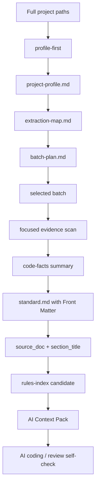

# refactor: Add context-governed extraction and lightweight fast indexing

## Summary

本计划把 `project-standard-extractor` 升级为上下文治理型规范萃取流水线：允许用户输入完整项目、完整仓库或多个服务路径，但必须先做 `profile-first` 项目画像、生成 extraction map 和 batch plan，再按批次聚焦读取代表性 evidence。随后再把输出契约调整为 V1 轻量快速索引方案：Front Matter 做文件级索引，`rules-index.json` 做规则标题级过滤，AI 自检和 Review 引用 `source_doc + section_title`，不要求 Rule ID、稳定 HTML anchor 或人工维护编号。

---

## Problem Frame

`docs/02-技术方案/AI快速索引最终方案.md` 已经确认 V1 应遵循 28 原则：不要引入向量库、Rule ID、复杂 anchor 或重型知识库，而是通过 `llms.txt`、Front Matter、`rules-index.json`、最小规范加载和规则标题自检形成闭环。

用户进一步确认：完整 APP 仓库只是典型案例，完整后端仓库、前端 Admin、PC 客户端、多微服务目录或行业规范萃取也会遇到相同上下文风险。因此 Skill 的第一性原理应从“读取代码生成规范”升级为“大输入 -> 小批次 -> 代表性证据 -> 团队级规则 -> 可索引文档”。

本计划最初还覆盖 `skills/project-standard-extractor/` 中的 Rule ID / anchor 残留清理，例如 `STD-{DOMAIN}-{SUBDOMAIN}-{LEVEL}-{NUMBER}`、`rule_id`、`#RuleID` 和“新增 Rule ID 列表”。截至 `825c465`，这些当前 source assets 已基本迁移到 `source_doc + section_title` 二元组；剩余执行重点是核验无回归，并补上上下文治理流水线与候选索引产物契约。

---

## Requirements

- R1. Skill 必须支持完整项目 / 仓库 / 多服务路径输入，但禁止一次性读取完整代码。
- R2. 所有完整或大范围输入默认先进入 `profile-first`，只输出项目画像、extraction map、batch plan 和代表性文件候选，不生成正式规范规则。
- R3. 所有正式萃取必须限定到一个 batch，batch 至少包含 domain、sub_domain、module 或 task_type、读取文件候选、排除范围、候选规则数量上限和 evidence 数量上限。
- R4. 阶段之间必须通过 artifact handoff 传递摘要和路径，不传递完整源码；后续阶段优先读取 `project-profile`、`extraction-map`、`batch-plan`、`code-facts` 摘要。
- R5. Skill 输出的 Markdown 文档必须保留统一 Front Matter，用于文件级索引。
- R6. 规则正文不使用 Rule ID，不要求稳定 HTML anchor；规则标题统一使用 `## (P0|P1|P2|FORBIDDEN) {规则标题}`。
- R7. 规则引用统一使用 `source_doc + section_title`，例如 `04-backend/02-java/java-standard.md「P0 Controller 不得写业务逻辑」`。
- R8. `rules-index.json` 契约必须使用 `title`、`domain`、`sub_domain`、`level`、`source_doc`、`section_title`、`evidence_doc` 和 `tags` 支持过滤，不使用 `rule_id` 或 `anchor`。
- R9. `project-standard-extractor` 的 workflow、agent contracts、prompts、templates、examples 和 evals 必须同时符合上下文治理和无 Rule ID 方案。
- R10. 第一阶段只交付文档契约、模板和候选索引产物，不实现 CLI、自动索引生成器、向量库或业务仓库自动接入。
- R11. 人工审核仍只确认规则内容、级别、证据、状态和负责人，不确认编号或 anchor。
- R12. 所有 source 变更必须同步更新根目录 `CHANGELOG.md`。

---

## Scope Boundaries

- 不实现真实 `.index/rules-index.json` 自动扫描生成器。
- 不创建或发布向量数据库。
- 不全量读取或总结完整项目代码。
- 不把 `profile-first` 画像输出直接升级为团队规范规则。
- 不把 Rule ID 重新作为 V1 约束引入。
- 不要求修改历史计划文档中的 Rule ID 表述；历史计划作为当时决策记录保留。
- 不直接生成业务项目的 `AGENTS.md`，只提供模板或接入说明。
- 不改 `.agents/skills/**`、`.claude/**`、`.codex/**` 等运行时镜像。
- 不自动把 `draft` 规则发布为 `active`。

### Deferred to Follow-Up Work

- 根据规范文档自动生成正式 `.index/rules-index.json` 的脚本或 CLI。
- 自动生成或校验根 `llms.txt` 的工具。
- 在业务代码仓库中自动注入 `AGENTS.md` 接入说明。
- 基于真实代码图谱自动推荐代表性样本的工具化能力。
- 当规则数量显著增长后再评估 Rule ID、anchor 或向量检索是否需要进入 V2。

---

## Graph Readiness

- target_repo: `.`
- status: unavailable
- source_revision: `825c465` (bounded direct-read snapshot)
- current_revision: `825c465`
- stale: false for bounded direct-read evidence; graph freshness remains unavailable
- primary_providers: none
- degraded_providers: none
- fallback_capabilities: bounded direct repo reads
- runtime_mcp_evidence: not used
- confidence: medium
- limitations: `.spec-first/graph/` readiness artifacts are absent; this is a docs / skill-contract refactor, so direct repository reads from `825c465` are sufficient and graph impact evidence is not required.

---

## Context & Research

### Relevant Code and Patterns

- `docs/02-技术方案/AI快速索引最终方案.md` is the source decision: V1 uses Front Matter + `rules-index.json` + rule title references, not Rule ID.
- `skills/project-standard-extractor/SKILL.md` defines the external Skill contract and currently already requires Front Matter and `source_doc + section_title` rule references.
- `skills/project-standard-extractor/workflow.md`, `config/frontmatter-format.md`, `config/output-targets.md`, templates, agents, prompts, examples and evals have already been aligned to the no Rule ID / no HTML anchor model in `825c465`.
- `skills/project-standard-extractor/input-guide.md` defines current interactive inputs but does not yet expose `extraction_mode: profile-first` or batch-scoped execution as a first-class contract.
- `skills/project-standard-extractor/prompts/project-profile.md` exists as a project profile prompt, but the workflow does not yet make profile-first the universal entry for large inputs.
- `skills/project-standard-extractor/workflow.md` still uses `intake-and-scope -> facts-and-classification -> generation -> review-and-quality-gate -> merge-coordinator`; it does not yet require `project-profile -> extraction-map -> batch-plan -> selected-batch facts` artifact handoff.
- `skills/project-standard-extractor/config/frontmatter-format.md` and `config/output-targets.md` do not yet enumerate the new `project-profile`、`extraction-map`、`batch-plan`、`ai-context-pack` candidate artifacts or their `doc_type` / `doc_id` / `indexable` rules.
- `skills/project-standard-extractor/config/task-tags.md`, `config/context-governance.md`, `config/extraction-batch-policy.md`, `config/domain-sampling-adapters.md`, `templates/project-profile-template.md`, `templates/extraction-map-template.md`, `templates/batch-plan-template.md`, `templates/rules-index-template.json`, `templates/llms-template.txt`, `templates/ai-context-pack-template.md`, `prompts/batch-plan-generation.md` and `prompts/context-pack-generation.md` do not yet exist.

### Institutional Learnings

- No `docs/solutions/` files exist in this repo yet, so there are no prior institutional learning docs to incorporate.

### External References

- External research was not used. The source scheme and local Skill assets are sufficient for this refactor plan.

---

## Key Technical Decisions

- **Keep Front Matter as file-level formatter:** It solves document discovery without adding rule-level maintenance cost.
- **Make profile-first universal:** Full APP repositories, backend services, frontend apps, PC clients and multi-service directories all start with project profile and batch planning before evidence extraction.
- **Use domain sampling adapters, not domain-specific workflows:** APP, backend, frontend, PC and industry only customize sampling signals and representative file selection; they do not fork the main pipeline.
- **Use artifacts as stage boundaries:** profile, extraction map, batch plan and code facts are written as durable evidence artifacts so later stages read summaries instead of carrying large context forward.
- **Use section titles as V1 rule identity:** `source_doc + section_title` is readable, stable enough for V1, and avoids manual numbering.
- **Add candidate index templates, not production generators:** The Skill should help produce `rules-index` and `llms` candidates, but not own a full indexing toolchain in this phase.
- **Use `rule_ref` only where a structured field is needed:** Internal reports can use a lightweight object or string containing `source_doc` and `section_title`; they should not introduce a hidden replacement ID.
- **Preserve evidence separation:** Rules stay team-level; real project paths remain in `evidence/`.
- **Treat old Rule ID mentions in historical plans as non-targets:** The new plan should align current source assets, not rewrite historical decision records.

---

## Open Questions

### Resolved During Planning

- Rule ID 是否保留：不保留，V1 直接使用规则标题引用。
- anchor 是否保留：不保留为 V1 要求，避免人工和模板复杂度。
- 完整项目输入如何处理：抽象为通用 `profile-first`，不是 APP 专用；所有领域都先画像、再生成 batch plan、再聚焦萃取。
- APP / 后端 / 前端 / PC 是否需要不同 workflow：不需要，不同领域只提供 sampling adapter。
- `rules-index.json` 是否仍然需要：需要，但它索引的是规则标题、来源文档、级别和标签，不索引 Rule ID。
- Skill 是否直接输出正式全局索引：不直接覆盖正式索引，优先输出候选模板和合并建议。

### Deferred to Implementation

- `section_title` 是否允许中文全角标点：实现时保持与 Markdown 标题完全一致，不做额外规范化。
- 是否要在模板中加入 `rule_ref` YAML 块：执行时根据现有模板可读性决定；不得把它变成新 Rule ID。
- `llms.txt` 候选输出是 `.txt` 还是 `.md`：执行时选择最容易被 AI 宿主读取的文本格式，并在 README 中说明。

---

## Output Structure

本计划主要修改现有文件，并新增少量索引候选模板：

```text
skills/project-standard-extractor/
├── config/
│   ├── context-governance.md
│   ├── extraction-batch-policy.md
│   ├── domain-sampling-adapters.md
│   ├── frontmatter-format.md
│   ├── output-targets.md
│   └── task-tags.md
├── templates/
│   ├── project-profile-template.md
│   ├── extraction-map-template.md
│   ├── batch-plan-template.md
│   ├── llms-template.txt
│   ├── rules-index-template.json
│   ├── ai-context-pack-template.md
│   └── ...
└── prompts/
    ├── batch-plan-generation.md
    └── context-pack-generation.md
```

---

## High-Level Technical Design

> *This illustrates the intended approach and is directional guidance for review, not implementation specification. The implementing agent should treat it as context, not code to reproduce.*



---

## Implementation Units

### Current Baseline Note

`825c465` 已经完成大部分 Rule ID / HTML anchor 口径迁移：当前 `SKILL.md`、workflow、Front Matter、output targets、templates、agents、prompts、examples 和 evals 已经使用 `source_doc + section_title` 二元组。下面的 U1 / U2 / U3 / U5 因此是核验与补缺单元；真正新增的剩余范围集中在 U0 的上下文治理流水线和 U4 的候选索引产物。

### U0. Add context-governed extraction pipeline

**Goal:** 把 `project-standard-extractor` 的默认执行模型升级为通用上下文治理流水线，支持完整项目路径输入但强制先画像、分批、聚焦采样。

**Requirements:** R1, R2, R3, R4, R9

**Dependencies:** None

**Files:**
- Modify: `skills/project-standard-extractor/SKILL.md`
- Modify: `skills/project-standard-extractor/workflow.md`
- Modify: `skills/project-standard-extractor/input-guide.md`
- Modify: `skills/project-standard-extractor/agents/intake-and-scope.md`
- Modify: `skills/project-standard-extractor/agents/facts-and-classification.md`
- Modify: `skills/project-standard-extractor/config/frontmatter-format.md`
- Modify: `skills/project-standard-extractor/config/output-targets.md`
- Modify: `skills/project-standard-extractor/prompts/project-profile.md`
- Create: `skills/project-standard-extractor/config/context-governance.md`
- Create: `skills/project-standard-extractor/config/extraction-batch-policy.md`
- Create: `skills/project-standard-extractor/config/domain-sampling-adapters.md`
- Create: `skills/project-standard-extractor/templates/project-profile-template.md`
- Create: `skills/project-standard-extractor/templates/extraction-map-template.md`
- Create: `skills/project-standard-extractor/templates/batch-plan-template.md`
- Create: `skills/project-standard-extractor/prompts/batch-plan-generation.md`
- Modify: `CHANGELOG.md`
- Test: none -- workflow and prompt contract change; validation is by document review, sample-run checks and search-based regressions.

**Approach:**
- Add `extraction_mode` values: `profile-first`, `batch-extraction`, `focused-module`, `review-only`, `merge-only`.
- Make `profile-first` the default for full project, multi-project, multi-service, unknown domain, or broad domain inputs.
- Define `context-governance.md` with hard rules: no full-code read, staged minimal loading, artifact handoff, batch limits, evidence limits, and examples/evals read boundaries.
- Define `extraction-batch-policy.md` with the generic batch fields: domain, sub_domain, module, task_type, candidate files, excluded paths, evidence target, rule limit, stop conditions.
- Define `domain-sampling-adapters.md` with per-domain sampling sections for APP, backend, frontend, PC and industry; adapters only select representative files and do not fork the workflow.
- Add `project-profile`, `extraction-map` and `batch-plan` templates as intermediate evidence artifacts.
- Extend `frontmatter-format.md` and `output-targets.md` with `project-profile`、`extraction-map` and `batch-plan` `doc_type` / `doc_id` / `indexable` rules so these handoff artifacts can be indexed and referenced consistently.
- Update workflow to become `intake -> project-profile -> extraction-map -> batch-plan -> selected-batch facts -> classification -> generation -> review -> merge -> index-candidate`.

**Patterns to follow:**
- Existing `skills/project-standard-extractor/input-guide.md` interaction style.
- Existing `skills/project-standard-extractor/prompts/project-profile.md` as the profile prompt seed.
- The user-confirmed abstraction: “完整输入可以给，但执行必须先画像、再分批、再聚焦萃取”.

**Test scenarios:**
- Happy path: when user provides a full APP repo, Skill enters `profile-first`, outputs project profile and batch plan, and does not generate `standard.md`.
- Happy path: when user provides a backend service group, Skill identifies backend/API/database/job batches and representative file candidates without reading every service file.
- Edge case: when user already provides a focused module and `extraction_mode: focused-module`, Skill may skip broad profiling but still records the scoped context budget.
- Error path: if a batch has no representative evidence candidates, it remains `pending-confirmation` / skipped rather than generating rules.
- Regression: generation and review stages consume artifacts and evidence summaries, not complete project source.

**Verification:**
- Workflow docs describe profile-first and batch-extraction as universal, not APP-specific.
- New templates make project profile, extraction map and batch plan concrete enough for downstream `$spec-work`.
- `frontmatter-format.md` and `output-targets.md` explicitly list the new intermediate artifact types and output paths.
- Search confirms no guidance says to read a full project or full Skill directory in ordinary extraction.

---

### U1. Verify and finish fast-index contracts

**Goal:** 核验当前 Skill 顶层契约、workflow 和 config 已经使用 Front Matter + 规则标题引用口径，并补齐 U0 / U4 引入的新 artifact 契约。

**Requirements:** R5, R6, R7, R8, R11

**Dependencies:** U0

**Files:**
- Modify: `skills/project-standard-extractor/SKILL.md`
- Modify: `skills/project-standard-extractor/workflow.md`
- Modify: `skills/project-standard-extractor/config/frontmatter-format.md`
- Modify: `skills/project-standard-extractor/config/output-targets.md`
- Modify: `skills/project-standard-extractor/README.md`
- Modify: `skills/project-standard-extractor/usage-guide.md`
- Modify: `CHANGELOG.md`
- Test: none -- docs and template contract change; validation is by document checks and search-based regressions.

**Approach:**
- Search for active “规则锚点”“稳定 HTML anchor”“新增 Rule ID 列表”等要求；只修复当前 source assets 的残留，不改历史计划记录。
- Define rule heading format as `## (P0|P1|P2|FORBIDDEN) {title}`.
- Define rule reference format as `source_doc + section_title`.
- Update output summaries to list “新增规则标题 / section_title 列表” and evidence references.
- Keep Front Matter required and clarify it is document-level metadata, not rule identity.
- Ensure new candidate and handoff artifacts from U0 / U4 have explicit output-target and Front Matter rules where applicable.

**Patterns to follow:**
- `docs/02-技术方案/AI快速索引最终方案.md` section “Markdown Front Matter” and “rules-index.json”.
- Existing `config/frontmatter-format.md` field table style.

**Test scenarios:**
- Happy path: generated contract docs state that indexed Markdown must include Front Matter and rule titles, but do not require Rule ID or HTML anchors.
- Error path: a generated rule without evidence is still routed to `pending-confirmation.md`, not made executable because it lacks an ID.
- Regression: `rg` over `skills/project-standard-extractor` does not find active requirements for `STD-*`, `rule_id`, `#RuleID`, or stable HTML anchor outside migration notes or explicitly historical examples removed in later units.

**Verification:**
- Skill entry, workflow and config all describe the same V1 indexing model.
- `git diff --check` passes after edits.

---

### U2. Verify output templates use rule-title references

**Goal:** 核验所有 generated Markdown templates 已输出无 Rule ID 的规范结构，并修复任何遗漏模板。

**Requirements:** R5, R6, R7, R8, R9

**Dependencies:** U0, U1

**Files:**
- Modify: `skills/project-standard-extractor/templates/standard-template.md`
- Modify: `skills/project-standard-extractor/templates/ai-rules-template.md`
- Modify: `skills/project-standard-extractor/templates/review-checklist-template.md`
- Modify: `skills/project-standard-extractor/templates/standard-review-report-template.md`
- Modify: `skills/project-standard-extractor/templates/rule-state-decision-template.md`
- Modify: `skills/project-standard-extractor/templates/evidence-template.md`
- Modify: `skills/project-standard-extractor/templates/pending-confirmation-template.md`
- Modify: `skills/project-standard-extractor/templates/merge-suggestions-template.md`
- Modify: `skills/project-standard-extractor/templates/conflicts-template.md`
- Test: none -- Markdown template change; validation is by Front Matter parsing and template content checks.

**Approach:**
- Verify no template still emits `## STD-...`; any residual heading must be replaced with `## {level} {规则标题}`.
- Verify no template still treats `Rule ID` as required field; any residual field must become `规则引用` or `rule_ref` containing `source_doc` and `section_title`.
- Keep `status`、`level`、`source_kind`、`evidence_tier` and owner fields; these are still useful and not tied to Rule ID.
- Ensure review reports group by `source_doc` / `section_title` / `状态建议` / `evidence` / `主要问题`.

**Patterns to follow:**
- Existing template Front Matter added under `templates/*.md`.
- Source scheme example for `rules-index.json` entries.

**Test scenarios:**
- Happy path: a P0 rule template renders as `## P0 Activity 和 Fragment 不得直接发起网络请求` with AI requirements, Review checks and evidence reference.
- Happy path: a review report table can identify a finding by source document and section title.
- Regression: every Markdown template frontmatter remains valid YAML after placeholder substitution style is preserved.

**Verification:**
- Ruby YAML parsing of template Front Matter succeeds.
- Search confirms no template emits `STD-{DOMAIN}` or `Rule ID` as a required field.

---

### U3. Verify agents, prompts and quality gate use section-title identity

**Goal:** 核验生成、评审、质量门禁和合并协调阶段都以规则标题和来源文档作为识别依据，并修复任何残留 `rule_id` 口径。

**Requirements:** R7, R8, R9, R11

**Dependencies:** U0, U1, U2

**Files:**
- Modify: `skills/project-standard-extractor/agents/generation.md`
- Modify: `skills/project-standard-extractor/agents/merge-coordinator.md`
- Modify: `skills/project-standard-extractor/agents/review-and-quality-gate.md`
- Modify: `skills/project-standard-extractor/prompts/rule-generation.md`
- Modify: `skills/project-standard-extractor/prompts/review-checklist-generation.md`
- Modify: `skills/project-standard-extractor/prompts/ai-rules-generation.md`
- Modify: `skills/project-standard-extractor/prompts/quality-review.md`
- Modify: `skills/project-standard-extractor/quality-gate.md`
- Test: none -- prompt and workflow contract change; validation is by drift search and sample-run checks.

**Approach:**
- Search active agents/prompts/quality gate for residual `rule_id` / `Rule ID`; any active identifier must become `rule_ref` or explicit `source_doc` + `section_title`.
- Verify merge coordinator index model uses `rule_refs` / `title_fingerprints`, not `rule_ids`.
- Define duplicate detection by normalized title, level, domain, sub_domain, scope and evidence, not by numeric ID.
- Keep conflict handling append-only and evidence-first.

**Patterns to follow:**
- `agents/merge-coordinator.md` existing append-only protocol.
- `quality-gate.md` state table.

**Test scenarios:**
- Happy path: same `section_title` in same `source_doc` appends evidence or merge suggestion rather than creating a duplicate.
- Edge case: same title in different `source_doc` is allowed when domain or sub_domain differs.
- Error path: conflicting same-title rules with different forbidden behavior go to `conflicts.md`.
- Regression: quality gate output no longer requires `rule_id` to decide target state.

**Verification:**
- Agent and prompt files consistently use `source_doc` / `section_title` terminology.
- No active prompt asks the model to invent or preserve Rule ID.

---

### U4. Add candidate fast-index artifacts

**Goal:** 给 `project-standard-extractor` 增加 V1 快速索引候选产物模板，让 Skill 能输出可人工合并的 `llms`、`rules-index` 和 AI Context Pack 内容。

**Requirements:** R8, R10

**Dependencies:** U0, U1, U2, U3

**Files:**
- Create: `skills/project-standard-extractor/config/task-tags.md`
- Create: `skills/project-standard-extractor/templates/rules-index-template.json`
- Create: `skills/project-standard-extractor/templates/llms-template.txt`
- Create: `skills/project-standard-extractor/templates/ai-context-pack-template.md`
- Create: `skills/project-standard-extractor/prompts/context-pack-generation.md`
- Modify: `skills/project-standard-extractor/config/frontmatter-format.md`
- Modify: `skills/project-standard-extractor/config/output-targets.md`
- Modify: `skills/project-standard-extractor/workflow.md`
- Modify: `skills/project-standard-extractor/README.md`
- Modify: `skills/project-standard-extractor/usage-guide.md`
- Test: none -- new documentation and template artifacts; validation is by JSON shape checks and template inspection.

**Approach:**
- Encode the fixed task tag vocabulary from the source scheme in `config/task-tags.md`.
- Add `rules-index-template.json` with `index_format: engineering-standards-rules-index-v1` and no `rule_id` or `anchor`.
- Add `llms-template.txt` as an entry-map template, not a generated official root file.
- Add `ai-context-pack-template.md` showing task recognition, matched rules, required docs, code paths and self-check requirements.
- Extend `frontmatter-format.md` and `output-targets.md` with `ai-context-pack` as a Markdown candidate artifact; document that `rules-index-template.json` and `llms-template.txt` are candidate non-source publishing aids and do not use Markdown Front Matter.
- Mark these as candidate / merge-suggestion artifacts unless the user explicitly asks to publish root-level `llms.txt` or `.index/rules-index.json`.

**Patterns to follow:**
- Source scheme sections “任务类型与标签词表” and “AI Context Pack 模板”.
- Existing `templates/*` style and Front Matter where Markdown applies.

**Test scenarios:**
- Happy path: a backend API task maps to `api-development` and tags `api`, `controller`, `service`, `dto`.
- Happy path: a candidate rule index entry contains `title`, `domain`, `sub_domain`, `level`, `source_doc`, `section_title`, `evidence_doc`, `tags`.
- Error path: candidate index template does not include `rule_id` or `anchor`.
- Integration: AI Context Pack references the matched rule by `source_doc + section_title`.

**Verification:**
- JSON template shape is syntactically valid after placeholder replacement in a sample.
- Markdown candidate templates have valid Front Matter where applicable; JSON / txt candidate templates are covered by output-targets rather than Markdown Front Matter.

---

### U5. Verify examples, evals and documentation checks

**Goal:** 核验示例、回归用例和用户指南已覆盖新的 V1 轻量索引口径，并补齐上下文治理与候选索引产物相关用例。

**Requirements:** R9, R12

**Dependencies:** U0, U1, U2, U3, U4

**Files:**
- Modify: `skills/project-standard-extractor/examples/golden-sample-run.md`
- Modify: `skills/project-standard-extractor/examples/thin-dogfood-run.md`
- Modify: `skills/project-standard-extractor/examples/consistency-checklist.md`
- Modify: `skills/project-standard-extractor/evals/expected-behavior.md`
- Modify: `skills/project-standard-extractor/evals/boundary-cases.md`
- Modify: `skills/project-standard-extractor/evals/failure-cases.md`
- Modify: `skills/project-standard-extractor/evals/trigger-cases.md`
- Modify: `skills/project-standard-extractor/evals/README.md`
- Modify: `CHANGELOG.md`
- Test: none -- eval fixture and example text change; validation is by expected-behavior review and skill audit.

**Approach:**
- Verify sample generated rules use `## P1 Controller 只负责请求接入和响应返回` style headings; repair any remaining `STD-*` examples.
- Verify “新增 Rule ID 列表” has become “新增规则引用列表” in active examples/evals.
- Add eval expectations that `rules-index` uses `section_title` and rejects `rule_id` / `anchor` in V1.
- Add eval expectations for `profile-first`、batch-scoped extraction、artifact handoff and candidate index artifacts.
- Keep evidence and state-gate assertions unchanged.
- Run the existing skill audit after edits if available, but treat it as validation, not implementation logic.

**Patterns to follow:**
- Existing sample structure in `examples/golden-sample-run.md`.
- Current eval format in `evals/expected-behavior.md`.

**Test scenarios:**
- Happy path: sample run shows rules, AI warnings, review checklist and quality gate without Rule ID.
- Error path: conflicting rules are reported by source doc and section title.
- Regression: `rg` over `skills/project-standard-extractor` finds no V1-forbidden `STD-*`, `rule_id`, `#RuleID`, or “稳定 HTML anchor” requirements.
- Regression: `git diff --check` passes.

**Verification:**
- Examples match the source scheme’s user-facing examples.
- Skill audit reports no P0/P1 issues after the refactor.

---

## System-Wide Impact

- **Interaction graph:** The change affects Skill contract docs, context-governance config, generated templates, prompts, examples and eval expectations. It does not change business code.
- **Error propagation:** Incorrect residual Rule ID text would confuse generated standards and downstream reviewers; search-based regression checks are required.
- **Context lifecycle risks:** Without a hard profile-first boundary, large project inputs can still cause context blow-up or low-quality broad conclusions; batch-scoped artifact handoff is required before generation.
- **State lifecycle risks:** `draft` / `active` / `pending-confirmation` states remain unchanged; only the rule reference mechanism changes.
- **API surface parity:** All user-facing Skill docs must use the same terms: `profile-first`, `extraction-map`, `batch-plan`, Front Matter, `source_doc`, `section_title`, `rules-index candidate`.
- **Integration coverage:** Examples and evals must exercise both the context-governed extraction model and the same reference model used by templates and prompts.
- **Unchanged invariants:** Evidence remains separate from rule正文; append-only merge behavior remains mandatory; no automatic `active` promotion.

---

## Risks & Dependencies

| Risk | Mitigation |
|------|------------|
| `profile-first` becomes optional and users still ask for whole-repo extraction | Make it the default for broad inputs and document explicit conditions for skipping it. |
| Domain sampling adapters become mini-workflows | Keep adapters limited to signals, representative file types, exclusions and sample counts; the main pipeline remains shared. |
| Batch plans become too fine-grained or too broad | Require each batch to include domain, sub_domain, module/task_type, file candidates, excluded paths, rule limit and stop conditions. |
| Removing Rule ID weakens duplicate detection | Use `source_doc + section_title` plus normalized title, domain, sub_domain, level, scope and evidence fingerprint for V1. |
| Rule titles drift after editing | Require `section_title` to match Markdown heading exactly and regenerate candidate index after title changes. |
| Residual Rule ID text remains in examples or prompts | Add search-based verification and update evals to fail this drift. |
| Candidate index is mistaken for authoritative index | Label index artifacts as candidate / merge-suggestion until user explicitly publishes root-level files. |
| Historical docs still mention Rule ID | Limit refactor to current Skill source assets; do not rewrite completed historical plans unless requested. |

---

## Documentation / Operational Notes

- Update `CHANGELOG.md` for the plan and for the eventual Skill source refactor.
- The implementation should not edit generated runtime mirrors.
- After implementation, run `spec-skill-audit` against `skills/project-standard-extractor` to confirm trigger, scope and output contracts remain coherent.

---

## Sources & References

- Origin document: `docs/02-技术方案/AI快速索引最终方案.md`
- Related plan: `docs/plans/2026-05-21-001-feat-project-standard-extractor-plan.md`
- Skill entry: `skills/project-standard-extractor/SKILL.md`
- Workflow: `skills/project-standard-extractor/workflow.md`
- Front Matter contract: `skills/project-standard-extractor/config/frontmatter-format.md`
