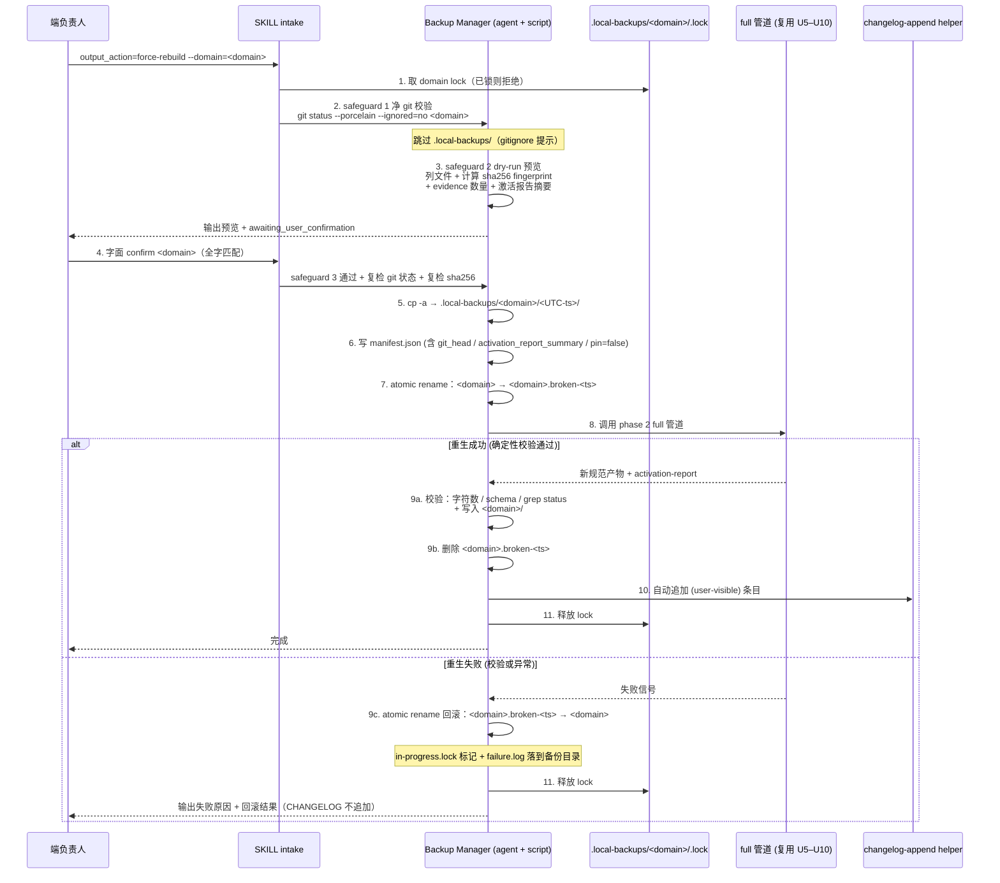

# feat: Project Standard Extractor — Phase 2 维度框架与端 Adapter 升级

**Target repo:** ai-engineering-standards

> 本计划基于 `docs/brainstorms/2026-05-24-001-project-standard-extractor-dimension-framework-requirements.md`（751 行需求文档）执行落地。所有 R-ID、AE-ID、A-ID、F-ID 引用都来自该 origin。

---

## Origin & Context

本计划是 `project-standard-extractor` skill 的第二阶段实现。第一阶段（`docs/plans/2026-05-21-001-feat-project-standard-extractor-plan.md`）已落地 6-agent 编排管道、状态机（draft/active/pending/conflict）、基础质量门禁（R41–R46）、写入规则与对外单 skill 入口。

第一阶段跑出的真实产出（参考 `engineering-standards/01-app-client/standard-*.md`）暴露质量差距：与人工编写的标杆 `00-*` 系列对比，单子领域规则数从 ~30 条降到 3–5 条，分层职责矩阵 / 命名规范 / DTO 转换链路 / 错误模型 / 平台差异 / 单测规范等关键维度全部缺失。

第二阶段的核心命题是把萃取从"发现什么写什么"的浅层 bottom-up，升级为"按维度池 + 代码 signal 三态激活 + 端 adapter 子领域分发"的标杆质量，同时补充 GitNexus 图谱集成、增量更新模式、跨项目对比三项能力。

origin requirements 文档同时确认了一项业务现实：**用户公司专做证券**，含港美股交易。证券作为独立行业子领域展开到 SEC-01 ~ SEC-10（10 维主体）+ XSEC-01 ~ XSEC-06（6 维跨境扩展），是 PoC 的优先验证场景。

**本次 deepening (2026-05-24)**：origin requirements 文档在末尾追加了 Force Rebuild 模式增量章节（R84–R92 / AE23–AE25 / A13 Backup Manager / F10–F12），本计划同步增加 **Phase F (U23–U26)** 实现该增量；原 Phase A–E 与 U1–U22 编号、内容完全保持稳定。Phase F 未与 Phase E 并行：Phase F 串行插入到 Phase E 中段（U21 完成后、U22 之前），让 U22 集成验证可覆盖 force-rebuild / restore 全链路。本次 deepening 同时通过 4 个 read-only 评审 agent（coherence / feasibility / correctness / architecture）共识别 38 条 finding，全部用户 accept；其设计影响在本计划下游各章节具体落地。

**本次 deepening (2026-05-25)**：`docs/reviews/2026-05-24-001-feat-skill-phase-2-dimension-framework-code-review.md` 对 U1-U27 的完成态进行了最终复审，并将 70 条原始 finding 归并为 F1-F13 十三个修复包，同时追加 N-01 / N-02 / N-03 三个推论级阻断。当前计划不再把 U1-U27 的 `Status: ✅ 已完成` 视为可发布证明；它们只是历史交付状态。Phase 2 runtime 能力在 U28-U40 关闭前保持 `blocked`，默认 append 管道、跨项目聚合、证券 PoC、EA-Doc 与 force-rebuild 系列都必须按本次新增修复阶段重新验收。

---

## Graph Readiness

- target_repo: ai-engineering-standards
- status: unavailable
- source_revision: n/a
- current_revision: n/a
- stale: n/a
- primary_providers: none
- degraded_providers: none
- fallback_capabilities: bounded direct repo reads + ast-grep（U2 中作为 signal library 的语言无关 AST 工具）
- runtime_mcp_evidence: unavailable
- confidence: medium
- limitations:
  - target_repo 当前未运行 `spec-first init` / `graph-bootstrap`，无 `.spec-first/graph/` artifacts；本计划的 evidence 全部来自直接 repo reads
  - GitNexus 集成在 U13 / U14 落地，落地后 target_repo 也仍需自行 bootstrap GitNexus，本计划只实现 skill 内的 readiness 检测与 fallback 逻辑，不为 target_repo 启用 GitNexus

---

## Problem Frame

继承自 origin Problem Frame（见 origin §Problem Frame）。简化要点：

1. **缺少自上而下的维度框架**：当前 skill 不知道"一份完整的子领域规范应该长什么样"，只能从代码事实底部向上萃取命中的 pattern，缺少"还差哪些维度"的元判断。
2. **缺少代码驱动的激活机制**：即使引入维度框架，固定清单会产出一堆 pending 章节噪音；需要让代码事实决定每个项目实际激活哪些维度，同时保留关键维度的保底产出。
3. **单项目运行无法捕捉跨模块依赖与调用链路结构性事实**：需要 GitNexus 图谱作为 advisory facts。
4. **全量重跑成本高，无法响应代码演进**：需要增量模式按 git diff 只刷新受影响维度。
5. **多项目运行会产出 N 份独立规范而不是团队统一规范**：需要跨项目对比与合并。

---

## Goals & Non-Goals

### Goals

- **G1**. 引入维度框架与"三态激活机制"（baseline / activated / candidate），让萃取产出贴合代码实际同时关键维度兜底，输出章节都有真实 evidence 或显式 pending。
- **G2**. 把第一阶段的端规范 agent 升级为"端 adapter"职责，内部按 profile 分发子领域骨架（KMP/Android/iOS、H5/Admin/SDK、Java/Python/Go/Node、证券/金融/其他行业）。
- **G3**. 新增 Dimension Activator agent 作为端无关元判定，输出统一的维度激活 map 供端 adapter 消费。
- **G4**. 新增 Dimension Coverage Reviewer 作为评审阶段并行 agent，核验三态准确性。
- **G5**. 集成 GitNexus 图谱作为 advisory facts（read-only），不可用时 fallback 到代码扫描。
- **G6**. 支持增量更新模式（`--mode=diff`），按 git diff 只对受影响维度执行萃取。
- **G7**. 支持多项目对比与统一，产出"一份统一规范 + 项目差异说明"而非 N 份独立规范。
- **G8**. 证券子领域作为 PoC 验证场景，SEC-01 ~ SEC-10 + XSEC-01 ~ XSEC-06 全维度覆盖。
- **G9**. 保持对外单 skill 入口不变；继续承接第一阶段 R1–R46 全部已落地需求与 actor。
- **G10**. **新增 Force Rebuild 能力**：通过新字段 `output_action: append | force-rebuild | restore`（与 `extraction_mode` 正交）实现规范产物的"反悔棋"——domain 级清空 + 重生 + skill-local 备份 + 三道 safeguard（净 git 校验 / dry-run 预览 / 字面 `confirm <domain>` 二次确认）+ 失败自动回滚（atomic rename）+ 强制 CHANGELOG 追加 + 与 `extraction_mode=diff` / 跨项目模式互斥；Backup Manager 升级为独立 agent + helper script，确保 IO 操作的确定性与跨 host 一致性。
- **G11**. **新增 post-review 修复目标**：把 code review 归并出的 F1-F13 修复包转化为 U28-U40，先关闭 N-01 / N-02 / N-03 与 F1-F4 的主管线阻断，再分批恢复入口、增量 / 跨项目、破坏性 IO、证券真实验收、EA-Doc 与最终 eval / walkthrough。U40 通过前不得把 Phase 2 标记为 runtime 可用。

### Non-Goals

- 不推翻第一阶段 6-agent 核心管道，不重写 actor、key flow、状态机或现有 agent 角色清单（仅升级 generation agent 为端 adapter 职责，并新增 5 个 agent 文件 [含 backup-manager]）。
- 不支持子领域 / 单文件 / 单维度的局部 force-rebuild（R85；理由是部分 force 会破坏横切文件与 overview "未激活维度地图" 的整体一致性）。
- 不支持非 git 仓库 / shallow clone 上的 force-rebuild / restore 模式。
- force-rebuild **不在 auto / headless / pipeline 模式下启用**（safeguard 三步必须 interactive）；CI 场景需走显式 `--confirm-rebuild=<domain>` flag 由独立 plan 设计。
- 不在本计划承担 git pre-commit hook 安装；CHANGELOG 强制追加由 skill 内确定性逻辑落地（自动追加而非依赖 hook 拒绝）。
- 不为子领域新建独立 sub-agent；子领域差异由端 adapter 内部骨架模板池承载。
- 不改变第一阶段产物格式约定（inline blockquote 元数据、evidence 编号体系、append-only 写入规则）。
- 不引入向量库、复杂检索系统或外部规范管理平台。
- 不强制要求 GitNexus 必须接入；GitNexus 是 advisory，不可用时整体流程仍可工作。
- 不在本计划定义维度池、激活信号、文件骨架的完整 JSON Schema 完整字段穷举；schema 字段集合在 U1 落地，后续可扩展。
- 不支持客户端鸿蒙子领域。
- 不在 U28-U40 中继续扩展新能力；本轮 deepening 只关闭 review 已确认的阻断、契约漂移和验收反固化问题。
- 不用 eval / walkthrough 迁就当前错误产物；U40 的目标是拦截旧契约，而不是让旧契约继续通过。
- 不把 synthetic PoC 或结构性断言作为 AE22 / U22 的通过证据；真实或脱敏输入、端负责人反馈和可执行链路闭环才是发布证据。
- 不要求第一阶段已生成的 `engineering-standards/01-app-client/standard-*.md` 强制迁移；迁移策略由独立 plan 决定（见 Deferred to Follow-Up Work）。

---

## Scope Boundaries

### Deferred to Follow-Up Work（本计划之外但已规划的工作）

- 现有 `engineering-standards/01-app-client/standard-*.md` 按新目录结构与文件骨架迁移：单独 refactor plan，本计划只保证新跑出的规范遵循新结构。
- `00-cross-domain/` 顶级横切目录（跨端跨行业总纲）：可选扩展，本计划不强制启用。
- 业务线（经纪 / 自营 / 资管 / 投行 / 量化 / 期权期货 / 融资融券）拆为独立子骨架文件：当前默认按维度产出，业务线拆分作为后续 plan。
- 港美股 4 种业务模式（港股通 / 美股通 / 直接美股 / 直接港股）全 signal 差异覆盖：本计划首期仅覆盖公司当前主营业务模式，其他业务模式 signal 后续补齐。
- **force-rebuild 备份压缩或远程对象存储**：本期备份为普通目录拷贝（默认排除 `evidence/raw-*` 等大文件目录，缓解磁盘占用），后续 tar.zst / S3 上传作为独立 plan。
- **force-rebuild 备份差异比对 UI / 可视化工具**：差异核验由 git diff / 人工完成；可视化作为独立 plan。
- **CI / non-interactive 模式下的 `--confirm-rebuild=<domain>` flag**：本期 force-rebuild 强制 interactive 模式；CI 场景的非交互确认机制留作独立 plan。
- **git pre-commit hook 安装强制 CHANGELOG**：本期由 skill 内确定性逻辑保证（自动追加而非告警）；hook 集成留作独立 plan。

### Deferred for later（origin Outstanding Questions 中确认本期不解决的）

- 第一阶段 outstanding question 中"AI 使用 draft 时的未审核提示如何进入 AI 开发输入模板"问题。
- AST signal 是否统一通过 ast-grep 实现，还是允许端 adapter 选用语言原生 AST 工具：本计划默认 ast-grep + 文件名/依赖兜底，语言原生 AST 留作后续优化。
- 维度框架启用是否需要新增 feature flag / 灰度开关：本计划不引入 feature flag，新版本直接替换旧 bottom-up 模式（理由：第一阶段产出质量不达标，无回退价值）。
- **多 domain 一次 force（`--domain=01-app-client,02-frontend`）的失败语义**：本计划默认事务语义（任一 domain 失败 → 全部已处理 domain 回滚 + CHANGELOG 不追加），具体失败链路与中断恢复细节由 implementation 阶段验证。

### Outside this product's identity（明确不属于本产品身份的）

- 不做规范管理 Web 平台。
- 不做向量库或复杂检索系统。
- 不做多 AI 工具规则自动导出。
- 不做全量历史代码整改。
- 不让维度框架自动学习新维度——维度池由人工配置维护以避免命名漂移。

---

## Key Technical Decisions

| 决策 | 选择 | 理由 |
| --- | --- | --- |
| **维度激活机制** | 混合三态（baseline / activated / candidate） | 固定清单产出 pending 噪音；纯代码驱动会漏关键维度（如安全）。三态在兜底 / 贴合 / 透明提示之间取得平衡。详见 origin Key Decisions。 |
| **Dimension Activator agent 形态** | 独立 agent 文件 `agents/dimension-activator.md` | 激活判定是端无关元决策，独立 agent 保证跨端口径一致；端 adapter 只消费、不重新判定。 |
| **端 adapter 实现方式** | 改造现有 `agents/generation.md`，新增内部端分发逻辑 + 端子骨架模板池；**不**新建 4 个独立 agent 文件 | 当前 skill 实际是 6 阶段聚合 agent 架构，generation agent 承载端规范生成职责；新建独立端 agent 会破坏现有 workflow 编排。 |
| **子领域分发** | 端 adapter 内部按 profile 选取骨架模板池中的子领域骨架；不另建 sub-agent | 子领域差异主要在内容层面，独立 sub-agent 会显著增加协调成本；骨架模板池足够承载差异。 |
| **维度池配置存储** | `config/dimension-framework/` 子目录 | 与现有 `config/` 同级，分离 dimension 配置和现有 config（domain-taxonomy / extraction-batch-policy 等）以保持 governance 清晰。 |
| **文件骨架存储** | `templates/skeletons/` 子目录 | 与现有 `templates/` 模板（rule-state-decision / standard-template 等）同级，分离骨架模板和片段模板。 |
| **激活 signal 类型** | grep + AST（ast-grep）+ 文件存在性 + 依赖声明 + GitNexus 图谱事实 5 类，组合 `any` / `all` / `weighted` | 与 R76 / R77 完全对齐；ast-grep 是 spec-first 已有的语言无关 AST 工具。 |
| **GitNexus 接入方式** | read-only advisory，先读 `.spec-first/graph/graph-facts.json` 再决定查询；不可用时 fallback 到代码扫描 | 与 spec-first 仓库 GitNexus 接入策略对齐（见 spec-first/CLAUDE.md GitNexus 段）。 |
| **增量模式触发** | `--mode=diff` 启动参数 + 自动检测（上次萃取产物存在且 git 可读时建议增量） | 与 origin R60 一致；全量仍为默认入口。 |
| **维度激活报告路径** | `evidence/dimension-activation-report.json`（每次萃取 run 产出一份） | 作为产物附属物，供增量更新比对、跨项目合并、Coverage Reviewer 复核使用。 |
| **证券子领域文件组织** | 首期保持单文件 `01-securities-standard.md`，长度约 2000 行 | 第一阶段 R50 设计是 sub_domain = file；单文件阅读连贯。拆分子目录作为 Deferred to Follow-Up Work（见 origin Outstanding Questions）。 |
| **行业 adapter 与端 adapter 协作** | 行业 adapter 独立产出 SEC-* / XSEC-* 规则；端 adapter 在遇到证券相关 evidence 时引用而不复述（见 AE22） | 避免规则在端文件和行业文件双写造成不一致。 |
| **force-rebuild mode 字段命名** | 新增正交字段 `output_action: append \| force-rebuild \| restore`（默认 append），与 `extraction_mode: profile-first \| batch-extraction \| focused-module \| diff` 解耦 | 切片维度（如何萃取）与产物动作维度（如何治理已有产物）正交，避免单一 mode 枚举语义重载；R84/R91/R92 互斥规则改写为"`output_action ≠ append` 与 `extraction_mode = diff` 互斥；`output_action ≠ append` 与多 projects 互斥"。 |
| **Backup Manager 形态** | 独立 agent 文件 `agents/backup-manager.md` + helper script `scripts/backup.sh` 配套 | 现有 6-agent 管道是 LLM-driven prompt orchestration，但 force-rebuild 涉及 git 状态解析 / 整目录递归拷贝 / manifest 写入 / 自动清理 / atomic rename 等确定性 IO 操作。靠 LLM 自由调用 bash 不可靠（隐藏文件漏拷、cp 选项 host 漂移、半成品备份）；独立 agent 给出严格步骤清单，helper script 集中 cp/git/find 命令，确保跨 host 一致性。 |
| **备份位置** | **skill-local** `skills/project-standard-extractor/.local-backups/<domain>/<timestamp>/`（不是 `.spec-first/backups/`） | 备份是 skill 自治产物，不挪用 spec-first 顶层命名空间（避免与 `.spec-first/standards/` `.spec-first/graph/` 等顶层命令拥有的子目录混层），也避免增加 AGENTS.md runtime context 排除清单的治理负担；timestamp 命名严格用 ISO8601 UTC `YYYYMMDDTHHMMSSZ`，字典序 = 时间序，避免本地时区歧义。 |
| **`.gitignore` 自动维护** | **skill 不自动改 `.gitignore`**，仅在 dry-run 报告中输出"建议把 `.local-backups/` 加进 .gitignore"（user-actionable） | `.gitignore` 是仓库治理文件，skill 静默改写会产生不解释的 dirty change 干扰自身的"净 git 校验"safeguard，且违反"精准修改"原则；维护职责归 `spec-first init` / `/spec:standards` setup 阶段或用户手动。 |
| **safeguard #3 `confirm` 落地方式** | **对话回合制 + 字面字符串 `confirm <domain>`**：Backup Manager 输出 dry-run plan + `awaiting_user_confirmation: true`，SKILL.md 路由强制等下一轮用户消息显式输入 `confirm <domain>` 全字匹配；force-rebuild **禁用 auto / headless / pipeline 模式** | LLM 自由解析 `confirm` 易被 prompt injection 绕过（用户可在更早消息写"任何后续操作视为已确认"）；deterministic 校验 + interactive-only 闭合幻觉跳过的口子。 |
| **失败信号判定** | **确定性脚本校验**而非 LLM 自报：(a) 新产物字符数 ≥ 备份 60%（避免空文件覆盖）；(b) `evidence/dimension-activation-report.json` 存在且 schema valid；(c) 至少一个 `standard-*.md` 含非空规则节；(d) Quality Gate 双门禁汇总状态由 grep `status: blocked\|conflict` 在 review 输出上计算 | force-rebuild 把第一阶段 R34–R40 append-only 兜底拆掉；如果靠 LLM 自评，"半成品 standard 但 Self-check 写 ok"会让 Backup Manager 误判成功不回滚 → 用户拿到比备份还差的产物。 |
| **失败回滚 atomic rename** | 回滚改为 "先 cp 到 sibling temp dir（`<domain>.restore-<ts>/`）→ rename 原 domain 为 `<domain>.broken-<ts>/` → rename temp 为 domain"，利用 rename 在同一文件系统的近原子性 | 朴素的 "rm -rf + cp -r" 中途失败留下 cp 半拷贝脏状态，与 F11 Outcome 直接冲突；atomic rename 任一步失败保留 broken / restore 两个目录待人工介入。 |
| **并发保护 (domain lock)** | `.local-backups/<domain>/.lock`（目录创建作为信号量，或 `flock`）覆盖 force-rebuild / restore / `--keep` 清理整流程；锁存在时 safeguard 1 直接拒绝 | 多次并发 force-rebuild 或 force vs full 撞车会让 domain 与 backups 同时不一致；锁是必须；restore 与其他模式互斥共用此锁。 |
| **保留策略 + pin 机制** | 默认保留最近 N=5 份（`--keep=<N>` 可调）；`manifest.json` 增加 `pin: bool` 字段，pinned 备份不进保留计数；新增 `--mode=pin --restore=<ts>` / `--mode=unpin --restore=<ts>` 子命令 | 仅靠 N=5 滚动会让"长期参照基线"丢失（用户最早的关键反悔点被自动清理），pin 机制保留显式锚点。 |
| **manifest schema** | `config/backup/manifest-schema.json`，纳入 ajv 校验集合，字段 snake_case：`backup_id / created_at / source_paths / git_head / domain / mode_args / kept_count / pin / dimension_activation_report_summary / operator` | 与 Phase 2 已有的 schema 体系（U1 schema.json / U17 activation-report-schema.json）字段命名风格 + 校验路线一致，避免备份产物没有 schema 校验、字段风格漂移。 |
| **CHANGELOG 强制追加 abstraction** | 抽出 `prompts/orchestrator/changelog-append.md` helper（U21 与 U24 共用）；force-rebuild success path 末段由 helper **自动追加**而非告警；不依赖 git pre-commit hook | "skill 输出告警 → 后续 review/commit 拒绝"在 skill 层无法落地（skill 只是 markdown 指令）；自动追加保证治理记录与产物原子一致；hook 集成留作 Deferred to Follow-Up Work。 |

---

## High-Level Technical Design

> 本节是直观结构说明，是审阅用的方向性指引，**不是实施规范**。实施者应把它当成 context，不是要复刻的代码。

### 维度框架数据流

```text
project_paths
     │
     ▼
intake-and-scope                              [既有，微调]
     │  scope_summary + run_id
     ▼
profile-and-batch-planner                     [既有，扩展]
     │  project-profile + extraction-map
     │  batch-plan（含维度池子集）
     ▼
facts-and-classification                      [既有，扩展]
     │  code_facts + classification + signal_hits
     │  （signal_hits 是端无关的，命中所有 signal 类型）
     ▼
dimension-activator                           [新增 agent]
     │  消费 signal_hits + activation_rules 配置
     │  输出 dimension_activation_map：
     │    每端 / 每子领域 / 每维度 → {state: baseline|activated|candidate,
     │                              evidence_count, depth_check}
     ▼
generation (端 adapter)                       [既有，重构升级]
     │  消费 dimension_activation_map
     │  内部按 profile 分发子领域骨架（KMP/Android/iOS,
     │    H5/Admin/SDK, Java/Python/Go/Node, 证券/金融/其他)
     │  只对 baseline + activated 维度产出章节
     │  candidate 维度上报到 merge-coordinator 等待汇总
     ▼
review-and-quality-gate                       [既有，扩展]
     │  ├─ Team Standard / AI Executability / Review Checklist /
     │  │  Conflict / Industry Risk Reviewer（既有）
     │  └─ Dimension Coverage Reviewer        [新增评审项]
     │     核验三态准确性（baseline 是否真覆盖、
     │     activated 是否达深度、candidate 是否准确反映项目）
     │  Quality Gate（双门禁汇总）：R41-R46 + R53
     ▼
merge-coordinator                             [既有，扩展]
     │  append-only 写入规范目录
     │  汇总所有 adapter 上报的 candidate → 写入
     │    00-{domain}-overview.md 的"未激活维度地图"章节
     │  写入 evidence/dimension-activation-report.json
     ▼
完成
```

### 端 adapter 内部分发示意

```text
generation agent (端 adapter 升级版)
  │
  ├─ if profile.domain == "app-client":
  │     persona = "APP Standard adapter"
  │     for sub_domain in {kmp-shared, android, ios} 命中的子领域:
  │        load templates/skeletons/app-client/{sub_domain}-skeleton.md
  │        apply dimension_activation_map[sub_domain]
  │        生成 0N-{sub_domain}-standard.md
  │
  ├─ if profile.domain == "frontend":
  │     persona = "Frontend Standard adapter"
  │     for sub_domain in {h5, admin, sdk} 命中的子领域:
  │        ...
  │
  ├─ if profile.domain == "backend":
  │     persona = "Backend Standard adapter"
  │     for sub_domain in {java, python, go, node} 命中的子领域:
  │        ...
  │
  └─ if profile.industries 非空:
        persona = "Industry Standard adapter"
        for industry in profile.industries:
           load templates/skeletons/industry/{industry}-skeleton.md
           apply dimension_activation_map[industry]
           生成 0N-{industry}-standard.md
        # 证券子领域加载 SEC-01~10 + XSEC-01~06 完整骨架
```

### 激活 signal 组合示意

```yaml
# config/dimension-framework/activation-rules-backend.yaml 片段（示意）
dimensions:
  EA-Backend-04-mq-async:
    state_default: candidate         # 未激活时
    signals:
      - type: dependency
        manifests: [pom.xml, build.gradle, package.json, requirements.txt]
        patterns: [kafka, rocketmq, rabbitmq, "@nestjs/microservices"]
        weight: 2
      - type: grep
        pattern: "@KafkaListener|@RocketMQMessageListener"
        weight: 2
      - type: file_existence
        paths: [src/**/producer/**, src/**/consumer/**, src/**/mq/**]
        weight: 1
    combination: weighted
    threshold: 2                     # >= 2 触发 activated

  D11-security:
    state_default: baseline          # 无 signal 也必出，无 evidence 时标 pending
    signals: [...]
    combination: any                 # 任一命中即 activated
```

### Force Rebuild 流程示意

> 本节描述 Phase F (U23–U26) 引入的 force-rebuild / restore mode。所有 IO 操作集中在 `agents/backup-manager.md` + `scripts/backup.sh`，safeguard 三步走对话回合制 + interactive-only。



### 并发与原子性 invariant

- **I1**：force-rebuild / restore / `--keep` 清理 / pin 子命令必须先取 `.local-backups/<domain>/.lock`，未取到锁直接拒绝
- **I2**：force-rebuild 顺序固定为 safeguard → backup → atomic rename → generate → 确定性校验 → success/rollback
- **I3**：restore 本身**不产生** backup（用户已显式选定历史快照）；restore 与 full / diff / force-rebuild 互斥（共用 domain lock）
- **I4**：`--keep=N` 计入所有 backup（pinned 除外，pinned 不计数）；timestamp 字典序 = 时间序（ISO8601 UTC）
- **I5**：失败回滚源 = 本次 run_id 在备份阶段写入的 manifest 路径（内存中唯一持有），**不依赖**"扫最新 timestamp"
- **I6**：CHANGELOG 追加由 changelog-append helper 在 success path 末段自动执行；如果追加失败 → 触发回滚（视为 force-rebuild 未完成）

---

## Output Structure

skill 改造完成后的目录结构：

```text
skills/project-standard-extractor/
│
├── SKILL.md                              # 修改：增加维度框架 / 三态 / 增量模式说明
├── README.md                             # 修改：phase 2 能力描述
├── workflow.md                           # 修改：插入 dimension-activator 阶段
├── input-guide.md                        # 修改：增量模式输入说明
├── usage-guide.md                        # 修改：三态产物使用方式
├── installation-or-consumption.md        # 沿用
├── quality-gate.md                       # 修改：双门禁
│
├── agents/
│   ├── intake-and-scope.md               # 修改：增量模式 / 多项目识别
│   ├── profile-and-batch-planner.md      # 修改：维度池子集 batch-plan
│   ├── facts-and-classification.md       # 修改：signal_hits 端无关收集
│   ├── dimension-activator.md            # 【新增】维度激活判定 agent
│   ├── generation.md                     # 重构：端 adapter 内部分发
│   ├── diff-scoper.md                    # 【新增】增量模式 git diff → 维度映射
│   ├── cross-project-aggregator.md       # 【新增】多项目激活 map 合并
│   ├── review-and-quality-gate.md        # 修改：增加 Dimension Coverage Reviewer + 双门禁
│   ├── merge-coordinator.md              # 修改：三态汇总 + 未激活维度地图写入
│   ├── backup-manager.md                 # 【Phase F 新增】force-rebuild / restore / pin 的确定性 IO + safeguard 编排
│   └── README.md                         # 修改
│
├── config/
│   ├── (既有配置文件不变)
│   └── dimension-framework/              # 【新增子目录】
│       ├── README.md
│       ├── schema.json                   # 维度池 + 激活规则的 JSON Schema
│       ├── baseline-dimensions.yaml      # 保底维度清单（跨端通用）
│       ├── dimensions-app-client.yaml    # 客户端维度池
│       ├── dimensions-frontend.yaml      # 前端维度池
│       ├── dimensions-backend.yaml       # 后端维度池
│       ├── dimensions-industry.yaml      # 行业通用 IND-01 ~ IND-06
│       ├── dimensions-industry-securities.yaml  # 证券 SEC-01~10 + XSEC-01~06
│       ├── activation-rules-app-client.yaml
│       ├── activation-rules-frontend.yaml
│       ├── activation-rules-backend.yaml
│       ├── activation-rules-industry.yaml
│       ├── depth-indicator.yaml          # 深度指标阈值
│       └── activation-report-schema.json # 激活报告 schema
│   └── backup/                            # 【Phase F 新增子目录】
│       ├── README.md
│       └── manifest-schema.json          # backup manifest JSON Schema(纳入 ajv 校验集)
│
├── prompts/
│   ├── (既有 prompt 文件不变)
│   ├── signal-library/                   # 【新增子目录】
│   │   ├── README.md
│   │   ├── grep-signal.md
│   │   ├── ast-signal.md
│   │   ├── file-existence-signal.md
│   │   ├── dependency-signal.md
│   │   └── gitnexus-signal.md
│   ├── orchestrator/                     # 【新增子目录】
│   │   ├── routing-decision.md           # skill 路由决策（跳过无关 adapter）
│   │   ├── candidate-aggregation.md      # 三态汇总
│   │   └── activation-map-passing.md     # 激活 map 传递规约
│   ├── gitnexus/                         # 【新增子目录】
│   │   ├── readiness-check.md
│   │   └── query-and-fallback.md
│   └── force-rebuild/                    # 【Phase F 新增子目录】
│       ├── force-rebuild.md              # safeguard / backup / rollback / changelog 编排单文件
│       ├── backup-manager.md             # 通用备份/恢复/清理/pin 决策算法(force-rebuild 与 restore 共用)
│       └── changelog-append.md           # CHANGELOG 自动追加 helper(U21 与 U24 共用)
│
├── scripts/                              # 【Phase F 新增目录】
│   ├── README.md                         # script 边界说明
│   ├── backup.sh                         # 跨 host 一致的备份/恢复/清理 helper(cp -a / rename / find -name 集中)
│   └── force-rebuild-validate.sh         # 重生成功的确定性校验(字符数 / schema / grep status)
│
├── templates/
│   ├── (既有 template 文件不变)
│   └── skeletons/                        # 【新增子目录】
│       ├── README.md
│       ├── overview-skeleton.md          # Overview 骨架（含未激活维度地图）
│       ├── sub-domain-skeleton.md        # 子领域骨架
│       ├── cross-cutting-skeleton.md     # 横切维度骨架
│       ├── app-client/
│       │   ├── kmp-shared-skeleton.md
│       │   ├── android-skeleton.md
│       │   └── ios-skeleton.md
│       ├── frontend/
│       │   ├── h5-skeleton.md
│       │   ├── admin-skeleton.md
│       │   └── sdk-skeleton.md
│       ├── backend/
│       │   ├── java-skeleton.md
│       │   ├── python-skeleton.md
│       │   ├── go-skeleton.md
│       │   └── node-skeleton.md
│       └── industry/
│           ├── securities-skeleton.md    # SEC-01~10 + XSEC-01~06 完整骨架
│           ├── finance-skeleton.md
│           ├── ecommerce-skeleton.md
│           ├── education-skeleton.md
│           ├── healthcare-skeleton.md
│           ├── government-skeleton.md
│           └── saas-skeleton.md
│
├── evals/
│   ├── (既有 eval 文件不变)
│   └── dimension-framework/              # 【新增子目录】
│       ├── README.md
│       ├── three-state-cases.md          # AE7 / AE8 / AE10 验证
│       ├── activation-signal-cases.md    # AE9 / AE18 验证
│       ├── routing-coverage-cases.md     # AE19 / AE20 验证
│       ├── industry-coexist-cases.md     # AE21 验证
│       ├── securities-poc-cases.md       # AE22 + 证券子领域 PoC
│       └── force-rebuild-cases.md        # 【Phase F 新增】AE23/AE24/AE25 + 并发 / TOCTOU / 失败回滚 ≥9 场景
│
└── examples/
    ├── (既有 example 文件不变)
    └── phase-2/                          # 【新增子目录】
        ├── golden-sample-securities-run.md  # 证券子领域 golden sample
        ├── incremental-mode-walkthrough.md
        ├── cross-project-walkthrough.md
        └── force-rebuild-walkthrough.md   # 【Phase F 新增】force-rebuild + restore 端到端 walkthrough(成功 + 失败回滚两条路径)
```

Phase F 还会在 skill 工作目录之外产生**运行时 backup 目录**：

```text
skills/project-standard-extractor/.local-backups/        # 【Phase F 新增,skill-local 备份】
└── <domain>/                                            # 01-app-client / 02-frontend / 03-backend / 04-industry
    ├── .lock                                            # 目录创建作为信号量,force-rebuild / restore / pin / 清理共用
    ├── .gitignore                                       # 内含 `*` 默认排除整个备份子树
    ├── <YYYYMMDDTHHMMSSZ>/                              # ISO8601 UTC 时间戳,字典序 = 时间序
    │   ├── manifest.json                                # 字段:backup_id / created_at / source_paths /
    │   │                                                #       git_head / domain / mode_args /
    │   │                                                #       dimension_activation_report_summary /
    │   │                                                #       operator / pin: bool
    │   ├── failure.log                                  # 仅失败回滚时写入(成功路径不写)
    │   ├── 00-{domain}-overview.md                      # 整目录原状拷贝(默认排除 evidence/raw-* / temp/ / .git)
    │   ├── 0N-{sub_domain}-standard.md
    │   ├── ...
    │   ├── ai-rules.md
    │   ├── review-checklist.md
    │   └── evidence/                                    # 整目录拷贝
    └── <YYYYMMDDTHHMMSSZ>.broken/                       # atomic rename 失败遗留目录(待人工介入)
```

仓库根目录 `.gitignore` **建议**(skill 不自动写,只在 dry-run 中提示):

```gitignore
# project-standard-extractor force-rebuild 备份(Phase F)
skills/project-standard-extractor/.local-backups/
```

---

## Implementation Phases & Units

按 5 个 phase 顺序实施，phase 内允许部分并行。

### Phase A — 配置基础（U1–U4）

构建维度池、激活规则、骨架模板、信号库。Phase A 是后续所有 phase 的依赖底座。

### U1. 维度池配置与 schema

> **Status**: ✅ 已完成 — CHANGELOG @ 2026-05-25 00:08:00

**Goal**：定义维度池、激活规则、三态、深度指标的 machine-readable schema（JSON Schema），并产出客户端 / 前端 / 后端 / 行业（含证券）的初始维度池 fixture。

**Requirements**：R47, R48, R49, R52

**Dependencies**：无

**Files**:
- `skills/project-standard-extractor/config/dimension-framework/README.md`（新增）
- `skills/project-standard-extractor/config/dimension-framework/schema.json`（新增）
- `skills/project-standard-extractor/config/dimension-framework/baseline-dimensions.yaml`（新增）
- `skills/project-standard-extractor/config/dimension-framework/dimensions-app-client.yaml`（新增）
- `skills/project-standard-extractor/config/dimension-framework/dimensions-frontend.yaml`（新增）
- `skills/project-standard-extractor/config/dimension-framework/dimensions-backend.yaml`（新增）
- `skills/project-standard-extractor/config/dimension-framework/dimensions-industry.yaml`（新增，IND-01~IND-06 + 行业子领域目录）
- `skills/project-standard-extractor/config/dimension-framework/dimensions-industry-securities.yaml`（新增，SEC-01~10 + XSEC-01~06）
- `skills/project-standard-extractor/config/dimension-framework/depth-indicator.yaml`（新增）

**Approach**：
- schema.json 顶层结构：`{layer: "common"|"extension"|"industry", dimensions: {<id>: {name, core_concerns, must_check_items, owner_phase}}}`
- baseline-dimensions.yaml 至少包含 D01 架构概览、D02 目录与命名、D06 错误处理、D09 测试策略、D11 安全与合规、D12 可观测性（origin R52 列出的最少 6 项）
- 每端的 dimensions-*.yaml 文件按 origin Per-End Dimension Catalog 内容 1:1 落地：
  - 客户端：8 维（EA-Client-01 ~ EA-Client-08）+ 3 子领域
  - 前端：11 维（EA-Web-01 ~ EA-Web-11）+ 3 子领域
  - 后端：10 维（EA-Backend-01 ~ EA-Backend-10）+ 4 子领域
  - 行业：6 维（IND-01 ~ IND-06）+ 6 子领域
  - 证券：单独文件，SEC-01 ~ SEC-10 + XSEC-01 ~ XSEC-06，共 16 维
- depth-indicator.yaml：`min_rules_per_dimension: 3`、`min_evidence_per_rule: 1`、`min_code_examples: 2`、`min_positive_negative_pair: 1`（baseline）

**Patterns to follow**：
- 参考现有 `config/domain-taxonomy.md`、`config/extraction-batch-policy.md` 的 YAML 风格
- 参考 origin Per-End Dimension Catalog（line 380–520）的字段命名

**Test scenarios**:
- **Covers AE7**：用 KMP App 项目 profile 测试，加载 dimensions-app-client.yaml 后维度池总数 ≥ 8 + 13（Layer 1 + 客户端扩展）
- baseline-dimensions.yaml 必须包含 D11 安全与合规（origin AE8 显式约束）
- schema.json 用 ajv 或等效 JSON Schema validator 校验 5 个 dimensions-*.yaml 文件全部 valid
- 证券 dimensions-industry-securities.yaml 必须包含 SEC-01 到 SEC-10 与 XSEC-01 到 XSEC-06 全部 16 维（每维 name + core_concerns + must_check_items 非空）
- 故意构造一个缺失 D02 的客户端 dimension 池，schema 校验必须报错

**Verification**：所有 dimensions-*.yaml schema valid；baseline-dimensions.yaml 列表覆盖 origin R52 强制的最少 6 维；证券 fixture 维度数等于 16。

---

### U2. 激活信号库 prompt 模板

> **Status**: ✅ 已完成 — CHANGELOG @ 2026-05-25 00:18:00

**Goal**：实现 5 类激活信号的判定 prompt 模板：grep / AST / 文件存在性 / 依赖声明 / GitNexus 图谱事实。

**Requirements**：R52, R76, R77

**Dependencies**：U1

**Files**:
- `skills/project-standard-extractor/prompts/signal-library/README.md`（新增）
- `skills/project-standard-extractor/prompts/signal-library/grep-signal.md`（新增）
- `skills/project-standard-extractor/prompts/signal-library/ast-signal.md`（新增）
- `skills/project-standard-extractor/prompts/signal-library/file-existence-signal.md`（新增）
- `skills/project-standard-extractor/prompts/signal-library/dependency-signal.md`（新增）
- `skills/project-standard-extractor/prompts/signal-library/gitnexus-signal.md`（新增）

**Approach**：
- 每类 signal 一个 prompt 文件，定义 input schema（pattern / paths / manifests / weight）+ 输出 schema（`{signal_id, hit: bool, evidence: [{file_path, line, snippet}]}`）+ 判定逻辑描述
- ast-signal.md：默认使用 ast-grep（spec-first 已有），如需语言原生 AST 工具记录在 limitations
- dependency-signal.md：支持 `package.json`、`pom.xml`、`build.gradle`、`requirements.txt`、`go.mod`、`Cargo.toml`、`Podfile`、`composer.json` 全部主流 manifest
- gitnexus-signal.md：先检查 `.spec-first/graph/graph-facts.json` readiness，可用则查询模块依赖 / 调用链 / 分层结构，不可用则降级为 file_existence + grep
- 全部 prompt 必须明确"signal hit 不等于 dimension activated"——activation 由 activator agent 按 combination 逻辑判定

**Patterns to follow**：
- 参考现有 `prompts/code-facts.md`、`prompts/pattern-classification.md` 的轻量 prompt 风格
- 每个 prompt < 100 行；明确 input / output / 边界条件

**Test scenarios**:
- grep-signal.md：给定一个含 `@KafkaListener` 注解的 Java 文件，pattern 命中后返回 `hit: true` + 该文件路径
- ast-signal.md：给定一个 Compose `@Composable` 函数定义，ast-grep pattern 命中
- file-existence-signal.md：给定项目根含 `migrations/` 目录，路径 `migrations/**` 命中
- dependency-signal.md：给定 `pom.xml` 含 `<artifactId>rocketmq-spring-boot-starter</artifactId>`，pattern `rocketmq` 命中
- gitnexus-signal.md：`.spec-first/graph/graph-facts.json` 不存在时，输出降级原因，不抛 error
- 5 个 signal prompt 输出格式统一（同 schema），可被 dimension-activator 消费

**Verification**：5 个 signal prompt 文件存在并描述完整 input/output/边界；signal output schema 统一。

---

### U3. 激活规则配置（per-端 activation rules）

> **Status**: ✅ 已完成 — CHANGELOG @ 2026-05-25 00:25:07

**Goal**：把维度池中的每个维度与具体激活 signal 关联，定义 combination 逻辑（`any` / `all` / `weighted`）与阈值；为每端独立配置文件。

**Requirements**：R52, R76, R77

**Dependencies**：U1, U2

**Files**:
- `skills/project-standard-extractor/config/dimension-framework/activation-rules-app-client.yaml`（新增）
- `skills/project-standard-extractor/config/dimension-framework/activation-rules-frontend.yaml`（新增）
- `skills/project-standard-extractor/config/dimension-framework/activation-rules-backend.yaml`（新增）
- `skills/project-standard-extractor/config/dimension-framework/activation-rules-industry.yaml`（新增，包含证券子领域规则）

**Approach**：
- 每端独立 YAML 文件，便于端 adapter 内部消费、独立维护
- 字段结构遵循 U1 schema：`dimensions.<id>: {state_default: baseline|candidate, signals: [...], combination: any|all|weighted, threshold: <int|null>}`
- baseline 维度的 `state_default: baseline`（无 signal 也必出，无 evidence 时 pending）；其他维度 `state_default: candidate`，命中 signal 后变为 activated
- 关键维度（如 EA-Backend-04 mq-async、SEC-01 行情系统）使用 `weighted` + 多 signal 阈值，避免单源误判
- 平凡维度（如 D02 命名）使用 `any`

**Patterns to follow**：
- 参考 High-Level Technical Design 中的 EA-Backend-04 / D11-security YAML 示意
- 关键维度全部使用多 signal 命中（≥2 类 signal），降低误判率

**Test scenarios**:
- **Covers AE9**：dimensions-backend.yaml 中 EA-Backend-02（数据库与持久化）的 signal 组合 `any`，命中 `pom.xml` 含 `mybatis` 后判定 activated
- **Covers AE10**：dimensions-backend.yaml 中 EA-Backend-04（消息队列与异步）默认 `state_default: candidate`，项目无 MQ 代码时保持 candidate
- **Covers AE18**：dimensions-app-client.yaml 中 D08 UI 与组件的 signal 组合 `weighted`，Compose @Composable 注解权重 2、SwiftUI View 协议权重 2、XML 布局文件权重 1，阈值 2；Compose 单源命中即激活，仅 XML 单源不达阈值
- 证券维度 SEC-09 金融工程与定价 `state_default: candidate`，经纪业务项目无 pricing/ 模块时保持 candidate
- 证券维度 SEC-06 监管报送默认 `state_default: baseline`（合规风险高，必出）
- XSEC-01 跨时区 signal 包含 `ZoneId.of\("America/New_York"\)` grep pattern 与 `hk-stock`/`us-stock` 模块名 file_existence

**Verification**：4 个 activation-rules 文件 schema valid；关键维度（mq-async / security / 证券核心维度）均使用 ≥2 类 signal 与 weighted 或 all 组合。

---

### U4. 文件骨架模板池

> **Status**: ✅ 已完成 — CHANGELOG @ 2026-05-25 00:46:03（+ 00:49:06 hybrid-bridge 增量）

**Goal**：定义 overview / 子领域 / 横切维度三种统一文件骨架；为每端 + 行业产出子领域骨架（KMP/Android/iOS、H5/Admin/SDK、Java/Python/Go/Node、证券/金融/电商/教育/医疗/政企/SaaS）。

**Requirements**：R50, R51, R55

**Dependencies**：U1

**Files**:
- `skills/project-standard-extractor/templates/skeletons/README.md`（新增）
- `skills/project-standard-extractor/templates/skeletons/overview-skeleton.md`（新增）
- `skills/project-standard-extractor/templates/skeletons/sub-domain-skeleton.md`（新增）
- `skills/project-standard-extractor/templates/skeletons/cross-cutting-skeleton.md`（新增）
- `skills/project-standard-extractor/templates/skeletons/app-client/kmp-shared-skeleton.md`（新增）
- `skills/project-standard-extractor/templates/skeletons/app-client/android-skeleton.md`（新增）
- `skills/project-standard-extractor/templates/skeletons/app-client/ios-skeleton.md`（新增）
- `skills/project-standard-extractor/templates/skeletons/frontend/h5-skeleton.md`（新增）
- `skills/project-standard-extractor/templates/skeletons/frontend/admin-skeleton.md`（新增）
- `skills/project-standard-extractor/templates/skeletons/frontend/sdk-skeleton.md`（新增）
- `skills/project-standard-extractor/templates/skeletons/backend/java-skeleton.md`（新增）
- `skills/project-standard-extractor/templates/skeletons/backend/python-skeleton.md`（新增）
- `skills/project-standard-extractor/templates/skeletons/backend/go-skeleton.md`（新增）
- `skills/project-standard-extractor/templates/skeletons/backend/node-skeleton.md`（新增）
- `skills/project-standard-extractor/templates/skeletons/industry/securities-skeleton.md`（新增，含 SEC-01~10 + XSEC-01~06 全部章节占位）
- `skills/project-standard-extractor/templates/skeletons/industry/finance-skeleton.md`（新增）
- `skills/project-standard-extractor/templates/skeletons/industry/ecommerce-skeleton.md`（新增）
- `skills/project-standard-extractor/templates/skeletons/industry/education-skeleton.md`（新增）
- `skills/project-standard-extractor/templates/skeletons/industry/healthcare-skeleton.md`（新增）
- `skills/project-standard-extractor/templates/skeletons/industry/government-skeleton.md`（新增）
- `skills/project-standard-extractor/templates/skeletons/industry/saas-skeleton.md`（新增）

**Approach**：
- 三种统一骨架严格遵循 R51 章节清单：
  - **overview-skeleton.md**：适用范围、架构目标、分层依赖图、分层职责矩阵、文档索引、强制规则摘要、落地要求、规则等级定义、**未激活维度地图**（最后一节，列出 candidate 维度 + 未使用原因 + 候选 evidence 信号 + 启用条件）
  - **sub-domain-skeleton.md**：规范定位、职责边界（应/不应承载）、推荐目录、分层规则、命名规范、核心规则（含正反例）、数据流链路（条件）、平台差异（条件）、错误模型（条件）、AI 生成要求、Review 检查项、Evidence 参考。每章节标题旁带 `[{{activation_state}}]` 占位符
  - **cross-cutting-skeleton.md**：适用范围、激活态、统一原则、子领域差异对比（§3 必须含"统一要求"列）、候选 evidence 信号、规则（强制/推荐/禁止）、正反例、AI 生成要求、Review 检查项、Evidence 参考
- 子领域骨架在通用骨架基础上嵌入子领域特有内容：
  - **KMP shared**：§4 嵌入 expect/actual 边界规则、Coroutines/Flow 跨端模式
  - **Android**：§4 嵌入 Compose vs XML 选型、Hilt/Dagger DI、ProGuard 规则
  - **iOS**：§4 嵌入 SwiftUI vs UIKit 选型、Combine/async-await 模式
  - **H5/Admin/SDK** 类似按 origin Per-End Catalog 子领域特有内容
  - **证券骨架**：长文，包含 R51 子领域骨架 §1-§5 + 核心维度章节 §6.1-§6.10（SEC-01~SEC-10） + §7.1-§7.6（XSEC-01~XSEC-06） + §8-§12

**Patterns to follow**：
- 参考现有 `templates/standard-template.md`、`templates/overview-template.md` 的占位符风格（`{{var}}`）与 metadata blockquote
- 子领域骨架中嵌入的特有维度章节使用 `[baseline]` / `[activated]` / `[pending]` 标注

**Test scenarios**:
- **Covers AE7**：overview-skeleton.md 必须包含"未激活维度地图"章节（grep 验证）
- **Covers AE7**：sub-domain-skeleton.md 必须包含 12 个 R51 强制章节（§1 规范定位 ~ §12 Evidence 参考）
- cross-cutting-skeleton.md §3 必须含"统一要求"列（R55 强制）
- 证券 securities-skeleton.md 必须包含 SEC-01 到 SEC-10 与 XSEC-01 到 XSEC-06 全部 16 维章节占位符
- KMP shared 骨架 §4 必须包含 expect/actual 关键字（origin AE17 约束）
- 全部 22 个骨架文件（3 通用 + 3 客户端 + 3 前端 + 4 后端 + 7 行业 = 20 个子领域 + 3 = 23 个文件，实际 22 含 3 通用骨架）schema 一致：占位符语法、激活态标注位置一致

**Verification**：22 个骨架文件齐备；每个子骨架包含原 origin Per-End Catalog 中列出的子领域特有维度。

---

### Phase B — Agent 改造（U5–U10）

改造现有 6 agent + 新增 4 agent 文件，让 workflow 编排消费维度框架与三态机制。

### U5. 新增 dimension-activator agent

> **Status**: ✅ 已完成 — CHANGELOG @ 2026-05-25 01:05:00

**Goal**：实现端无关的维度激活判定 agent，消费 profile + signal_hits + activation_rules 配置，输出每端/每子领域的维度激活 map（baseline/activated/candidate 三态 + 命中 signal + evidence 数 + 深度核验结果）。

**Requirements**：R75, R76, R77, A10, F5

**Dependencies**：U1, U2, U3

**Files**:
- `skills/project-standard-extractor/agents/dimension-activator.md`（新增）
- `skills/project-standard-extractor/config/dimension-framework/activation-report-schema.json`（新增）

**Approach**：
- agent prompt 结构参照现有 `agents/facts-and-classification.md` 的输入/输出契约风格
- 输入 schema：`{run_id, project_profile, signal_hits[], activation_rules_config_path[]}`
- 输出 schema：`dimension_activation_map.json`：
  ```yaml
  run_id: ...
  evaluations:
    - dimension_id: D11-security
      end_type: app-client
      sub_domain: android
      state: baseline                  # baseline | activated | candidate | pending | shallow
      hit_signals: [grep-1, dependency-2]
      evidence_count: 5
      depth_check:
        rules_met: true
        evidence_per_rule_met: true
        examples_met: false           # 触发 shallow
      reason: "命中 2/3 signal，evidence 充足但缺少正反例"
  ```
- 决策逻辑：
  1. 加载该 end_type 的 activation-rules-*.yaml
  2. 对每个 dimension：按 combination 逻辑（any / all / weighted + threshold）评估 signal_hits
  3. baseline 维度即使无 hit 也产出 `state: baseline + evidence_count: 0 + pending: true`
  4. activated 维度走深度核验，未达 depth_indicator 阈值标 `shallow`
  5. 跨子领域汇总到端无关层（同 dimension 在多个子领域可能不同态）
- agent 自检（Self-check）：所有 baseline 维度在输出中存在；所有 activated 维度的 evidence_count > 0

**Patterns to follow**：
- 现有 `agents/facts-and-classification.md` 的"输入契约 / 输出契约 / Self-check / 失败模式"四段式

**Test scenarios**:
- **Covers AE8**：给定 app-client profile 但 signal_hits 中 D11 安全相关 hit 为空，输出 D11 `state: baseline + pending: true + reason 含 "无 evidence"`
- **Covers AE9**：给定 backend profile + `pom.xml` 含 mybatis 的 dependency signal hit，输出 EA-Backend-02 `state: activated`
- **Covers AE10**：给定 backend profile + 无 MQ 相关 signal hit，输出 EA-Backend-04 `state: candidate + reason 含 "默认 candidate, 无 signal 命中"`
- **Covers AE18**：给定 app-client profile + Compose @Composable signal hit（权重 2），输出 D08 UI `state: activated`（达阈值 2）；仅 XML 单源命中（权重 1）则保持 candidate
- 输出 dimension_activation_map.json 通过 activation-report-schema.json 校验
- baseline 维度 D11 在端无关汇总中始终出现，即使所有子领域都无 hit
- 同维度在多个子领域中可以有不同态：D08 UI 在 android（activated）+ ios（candidate）共存

**Verification**：agent prompt 文件包含完整输入/输出契约 + Self-check + 失败模式；样例 signal_hits 输入跑出符合 schema 的激活 map。

---

### U6. 改造 facts-and-classification agent

> **Status**: ✅ 已完成 — CHANGELOG @ 2026-05-25 01:18:00

**Goal**：让现有 facts-and-classification agent 在产出 code_facts + classification 之外，**额外产出 signal_hits**（端无关）供 dimension-activator 消费。

**Requirements**：R68, F5

**Dependencies**：U2, U5

**Files**:
- `skills/project-standard-extractor/agents/facts-and-classification.md`（修改）

**Approach**：
- 在 agent 现有 batch 处理逻辑后增加一步"信号扫描"：对每个 batch 的 candidate_files，按 U2 的 5 类 signal prompt 逐类匹配，累积 signal_hits
- 输出契约扩展：`{code_facts, classification, signal_hits[]}`；signal_hits 不与 classification 强耦合，端无关收集
- 失败模式：单个 signal 类型扫描失败（如 ast-grep crash）不阻塞，记录在 limitations，继续其他类型

**Patterns to follow**：
- 现有 `agents/facts-and-classification.md` 已有的 "evidence_limit" / "skipped batch" 处理模式

**Test scenarios**:
- 单个 batch 跑完后 signal_hits 数组非空（命中的 signal 都被记录）
- 给定不含任何 MQ 代码的项目，signal_hits 中无 EA-Backend-04 相关 hit
- ast-grep 不可用时，ast-signal 类型 hit 为空但不抛 error，limitations 中记录降级原因
- 增量模式下（只扫描 changed files），signal_hits 仅覆盖变更涉及的维度

**Verification**：agent 输出 signal_hits 数组符合 U2 signal output schema；跑历史 batch 后 signal_hits 数量与代码实际匹配数量一致。

---

### U7. 改造 profile-and-batch-planner agent

> **Status**: ✅ 已完成 — CHANGELOG @ 2026-05-25 01:30:00

**Goal**：让 batch-planner 在生成 batch-plan 时额外产出"该 batch 适用的维度池子集"（Layer 1 通用 + Layer 2 端类型扩展 + 行业），写入 batch-plan。

**Requirements**：R47, R68

**Dependencies**：U1

**Files**:
- `skills/project-standard-extractor/agents/profile-and-batch-planner.md`（修改）
- `skills/project-standard-extractor/templates/batch-plan-template.md`（修改，增加 dimensions 字段）

**Approach**：
- 在 profile 推断 domain（app-client / frontend / backend / industry）后，加载对应 `dimensions-*.yaml` 维度池
- batch-plan 增加 `dimensions: {pool: [...], baseline: [...], domain: ...}` 字段
- 不引入维度激活判定（那是 dimension-activator 的职责）；只是"该 batch 应该关注哪些维度"

**Patterns to follow**：
- 现有 `agents/profile-and-batch-planner.md` 的 batch-plan 生成结构

**Test scenarios**:
- 客户端项目 profile 跑完后 batch-plan 包含 13 Layer 1 + 8 客户端扩展共 21 个维度 id
- 后端项目 profile 包含 13 Layer 1 + 10 后端扩展共 23 个维度 id
- 同时识别为后端 + 证券行业的项目，batch-plan 包含后端维度池 + 证券维度池

**Verification**：batch-plan 模板含 dimensions 字段；客户端 / 前端 / 后端 / 行业各跑一次得到正确维度池。

---

### U8. 重构 generation agent 为端 adapter

> **Status**: ✅ 已完成 — CHANGELOG @ 2026-05-25 01:48:00

**Goal**：把现有 generation agent 升级为"端 adapter"角色：消费 dimension_activation_map，内部按 profile 分发子领域骨架，只对 baseline + activated 维度产出章节，candidate 维度上报到 merge-coordinator。

**Requirements**：R70, R71, R72, R73, R74, F5, F9, A11

**Dependencies**：U4, U5

**Files**:
- `skills/project-standard-extractor/agents/generation.md`（重构，约 17KB → 预计 25KB+）
- `skills/project-standard-extractor/prompts/orchestrator/end-adapter-dispatch.md`（新增，端分发逻辑）
- `skills/project-standard-extractor/prompts/orchestrator/activation-map-passing.md`（新增，激活 map 传递规约）

**Execution note**：重构涉及大文件，建议先把现有 generation agent 拆为"端无关 wrapper + 4 个端 persona 段（app-client / frontend / backend / industry）"，再注入维度激活消费逻辑；不要试图原位替换。

**Approach**：
- agent 顶层 wrapper：消费 `dimension_activation_map` + `project_profile`，根据 profile.domain 选择 persona
- 4 个 persona 段（在同一 agent 文件内）：
  - **APP Standard adapter persona**：分发到 KMP/Android/iOS 子骨架
  - **Frontend Standard adapter persona**：分发到 H5/Admin/SDK 子骨架
  - **Backend Standard adapter persona**：分发到 Java/Python/Go/Node 子骨架
  - **Industry Standard adapter persona**：分发到证券/金融/电商/教育/医疗/政企/SaaS 子骨架
- 子领域分发：根据 profile 中识别的子领域标签，加载对应 `templates/skeletons/{end}/{sub_domain}-skeleton.md`，逐章节填充
- 激活态消费：
  - baseline 维度 evidence 充足 → 正常填充章节内容
  - baseline 维度无 evidence → 章节标 `[pending]`，内容写"候选 evidence 信号清单 + 待团队负责人确认"
  - activated 维度 → 正常填充
  - candidate 维度 → 不产出该章节；将该维度上报到端无关汇总池
- agent 内部不重新执行激活判定（R74 强制），所有态决策来自 dimension_activation_map

**Patterns to follow**：
- 现有 `agents/generation.md` 已有的 "Sub-step A 写 evidence / Sub-step B 综合编写 Developer Guide" 二步结构
- 现有 `templates/standard-template.md` 元数据 inline blockquote 格式

**Test scenarios**:
- **Covers AE7**：KMP App 项目跑完后产出 `01-kmp-shared-standard.md` + `02-android-standard.md` + `03-ios-standard.md`，每个文件章节标题都带 `[baseline]` / `[activated]` / `[pending]` 标注
- **Covers AE17**：单次运行同时含 KMP shared 与 Android 子领域，generation agent 不调用 sub-agent，内部从骨架模板池选取两套子骨架并行填充；KMP shared 文件含 expect/actual 边界章节，Android 文件含 Compose vs XML 选型 + Hilt DI 章节
- **Covers AE10**：后端项目无 MQ 代码，generation 不产出 `14-mq-async-standard.md`，而是把 EA-Backend-04 上报到 candidate 池
- baseline 维度 D11 安全无 evidence 时，章节标 `[pending]`，内容含"候选 evidence 信号清单"而非空白
- candidate 维度计数：跑一个纯后端项目（无 frontend / app-client 代码），candidate 池仅含 backend 维度，不含 frontend / app-client 维度噪音
- 证券项目跑 industry adapter，产出 `01-securities-standard.md` 含 SEC-01 ~ SEC-10 + XSEC-01 ~ XSEC-06 全部 16 维章节（按各维度激活态填充或标 pending）

**Verification**：4 个端 persona 段在 agent 文件内独立可调用；激活态消费逻辑（baseline pending / activated / candidate）三种行为都有测试覆盖；不在 agent 内部重新执行激活判定。

---

### U9. 改造 review-and-quality-gate agent（含 Dimension Coverage Reviewer + 双门禁）

> **Status**: ✅ 已完成 — CHANGELOG @ 2026-05-25 02:05:00

**Goal**：在现有 6 个分面 reviewer（Team Standard / AI Executability / Review Checklist / Conflict / Industry Risk + Evidence Auditor）之外新增 **Dimension Coverage Reviewer**；Quality Gate 在汇总时同时执行 R41–R46（第一阶段）与 R53（维度激活门禁）两套门禁。

**Requirements**：R53, R69, R81, A12

**Dependencies**：U5, U8

**Files**:
- `skills/project-standard-extractor/agents/review-and-quality-gate.md`（修改）
- `skills/project-standard-extractor/quality-gate.md`（修改，增加双门禁说明）
- `skills/project-standard-extractor/prompts/quality-review.md`（修改）

**Approach**：
- 在 review-and-quality-gate agent 内增加 **Dimension Coverage Reviewer persona**，与现有 reviewer 并行
- Dimension Coverage Reviewer 核验三件事：
  1. **baseline 准确性**：所有 baseline 维度在产物中存在；baseline pending 是否有端负责人确认链路（或标 `candidate_with_warning`）
  2. **activated 准确性**：每个 activated 章节至少 1 条 evidence；evidence 深度达 depth_indicator
  3. **candidate 准确性**：候选未激活维度是否准确反映项目状态；不得把代码有 signal 的维度误判为 candidate（翻转规则：发现误判时回写到 dimension_activation_map，要求 generation 重新生成）
- Quality Gate 双门禁汇总规则：
  - R41–R46 不通过 → 拒绝进入 draft
  - R53 不通过（baseline pending 无确认 / activated shallow / candidate 误判）→ 拒绝进入 draft
  - 任一通过即 draft 不变；两者都通过才进入 draft

**Patterns to follow**：
- 现有 `agents/review-and-quality-gate.md` 已有的 multi-reviewer 并行结构

**Test scenarios**:
- **Covers AE8**：baseline 维度 D11 无 evidence + 无端负责人确认时，Coverage Reviewer 报 fail，Quality Gate 拒绝进 draft
- **Covers AE20**：故意把 D08 UI 配置为 candidate（state_default: candidate）但项目实际有 Compose @Composable 代码，Coverage Reviewer 必须把 D08 翻转为 activated 并要求 generation 重新生成该章节
- **Covers AE16**：跑一次完整萃取，Quality Gate 同时执行 R41–R46（evidence / 团队级抽象 / AI 可执行 / Review 可检查 / 冲突 / 行业风险 / 正反例 / 规则数量 / 人工确认 9 项门禁）与 R53（三态门禁 3 项）
- shallow 章节（activated 但 evidence < depth_indicator）必须被 Coverage Reviewer 拦截，不得进入 draft
- 6 个原有 reviewer + 1 个 Coverage Reviewer 都在 review 输出中各占一段

**Verification**：agent 文件内 7 个 reviewer persona 都有独立段；Quality Gate 决策逻辑同时考虑两套门禁。

---

### U10. 改造 merge-coordinator agent（三态汇总 + 未激活维度地图写入）

> **Status**: ✅ 已完成 — CHANGELOG @ 2026-05-25 02:30:00

**Goal**：merge-coordinator 在 append-only 写入规范目录之外，**额外汇总所有端 adapter 上报的 candidate 维度**，写入 `00-{domain}-overview.md` 的"未激活维度地图"章节；同时写入 `evidence/dimension-activation-report.json`。

**Requirements**：R54, R80

**Dependencies**：U4, U5, U8

**Files**:
- `skills/project-standard-extractor/agents/merge-coordinator.md`（修改）
- `skills/project-standard-extractor/prompts/orchestrator/candidate-aggregation.md`（新增，汇总规约）

**Approach**：
- 在 merge-coordinator 现有 append-only 逻辑后增加两步：
  1. **三态汇总**：合并所有端 adapter 上报的 candidate 维度，按维度类型分组（端通用 / 端扩展 / 行业），写入 overview 文件的"未激活维度地图"章节（按 overview-skeleton.md 模板）
  2. **激活报告写入**：把完整 dimension_activation_map 落到 `engineering-standards/{domain}/evidence/dimension-activation-report.json`
- 三态汇总规则：
  - candidate 维度跨端去重（同 dimension_id 多端都 candidate 时只列一次，注明哪些端）
  - 按 origin Per-End Catalog 中维度名输出，每行：`| 维度 | 未使用原因 | 候选 evidence 信号 | 启用条件 |`
- 不破坏第一阶段 R34–R40 重复运行规则：现有 active / draft 不覆盖；新增 draft 追加；冲突 / 相近规则进入 merge-suggestions / conflicts

**Patterns to follow**：
- 现有 `agents/merge-coordinator.md` 的 "append-only" 与 "merge-suggestions" / "conflicts" 处理

**Test scenarios**:
- **Covers AE10**：纯后端项目跑完后 `00-backend-overview.md` 含"未激活维度地图"章节，列出 EA-Backend-04 消息队列与异步等 candidate 维度
- **Covers AE19**：项目 profile 仅识别到 backend，merge-coordinator 不在 overview 中列出 app-client / frontend 的 candidate 维度（已被 orchestrator 路由跳过）
- 同维度（如 D08 UI）在 KMP shared 与 Android 都 candidate 时，overview 表格只列一行 "D08 UI 与组件 - 端：kmp-shared, android"
- `evidence/dimension-activation-report.json` 文件存在并符合 U5 schema
- 第二次跑同一项目，merge-coordinator 不覆盖现有 `01-android-standard.md` 中的 active 规则；新增 draft 追加

**Verification**：单项目跑完后 overview "未激活维度地图" 章节包含合理 candidate 列表；activation-report.json schema valid；R34–R40 行为不变。

---

### Phase C — Workflow & SKILL.md（U11–U12）

把 Dimension Activator 插入 workflow 阶段；skill 顶层入口承接路由决策。

### U11. workflow.md 阶段图与流程更新

> **Status**: ✅ 已完成 — CHANGELOG @ 2026-05-25 02:55:00

**Goal**：在 workflow.md 中把 Dimension Activator 插入到 facts-and-classification 之后、generation 之前；Dimension Coverage Reviewer 加入 review 并行阶段。

**Requirements**：R68, R78, F5

**Dependencies**：U5, U9

**Files**:
- `skills/project-standard-extractor/workflow.md`（修改）

**Approach**：
- 更新现有 `## 2. Auto 模式执行流程` 与 `interactive 模式` 阶段图
- 在 `facts-and-classification` 之后插入新阶段：

  ```
  [Agent N] dimension-activator
      消费 signal_hits + activation_rules
      输出 dimension_activation_map
  ```
- generation 阶段说明改为"端 adapter persona 分发"
- review 阶段说明增加"Dimension Coverage Reviewer 并行"
- merge-coordinator 阶段说明增加"三态汇总 + activation-report 写入"

**Patterns to follow**：现有 workflow.md 阶段图与失败处理风格

**Test scenarios**:
- **Covers AE16**：workflow.md 中 6 个原阶段 + 1 个新阶段（dimension-activator）共 7 阶段，且执行顺序符合 R78
- workflow.md 提到 review 阶段含 7 个 reviewer
- 增量模式与跨项目对比作为可选 mode 在 workflow.md 中描述

**Verification**：workflow.md 阶段图准确反映新流程；与 agent 文件交叉一致。

---

### U12. SKILL.md 路由决策与三态对外说明

> **Status**: ✅ 已完成 — CHANGELOG @ 2026-05-25 03:10:00

**Goal**：SKILL.md 增加路由决策（profile-driven 跳过无关端 adapter）与三态产物对外说明；调用协议保持向后兼容。

**Requirements**：R67, R79, R80

**Dependencies**：U7, U10

**Files**:
- `skills/project-standard-extractor/SKILL.md`（修改）
- `skills/project-standard-extractor/usage-guide.md`（修改）

**Approach**：
- SKILL.md `## 执行步骤` 增加路由决策说明：profile 推断 domain 后跳过不相关端 adapter
- 调用协议新增可选字段：`extraction_mode: "diff" | "full"`（默认 full，diff 触发增量模式）
- 强制边界增加：
  - 第 7 条："维度激活由 dimension-activator 单点判定；端 adapter 不重新判定"
  - 第 8 条："未激活维度地图必须出现在 overview，不静默丢弃"
- usage-guide.md 增加"三态产物使用方式"章节：开发者如何读 activation-report、未激活维度地图、章节激活态标注

**Patterns to follow**：现有 SKILL.md 的调用协议 + 强制边界写法

**Test scenarios**:
- **Covers AE16**：SKILL.md 显式声明对外只暴露 `project-standard-extractor` 一个 skill
- **Covers AE19**：SKILL.md 提到路由决策（profile 跳过无关 adapter）
- 调用协议向后兼容：第一阶段调用方式（仅传 project_paths）仍能工作
- usage-guide.md 含"如何读 dimension-activation-report.json"段落

**Verification**：SKILL.md / usage-guide.md 更新完整，向后兼容性测试通过。

---

### Phase D — 三个新能力（U13–U17）

按 origin 建议顺序：GitNexus → 增量模式 → 跨项目对比。

### U13. GitNexus 集成 - readiness 检测与查询封装

> **Status**: ✅ 已完成 — CHANGELOG @ 2026-05-25 03:30:00

**Goal**：实现 GitNexus readiness 检测（读 `.spec-first/graph/graph-facts.json`）与查询封装；不可用时降级到 file_existence + grep。

**Requirements**：R56, R57, R58, R59, A7, F6

**Dependencies**：U2

**Files**:
- `skills/project-standard-extractor/prompts/gitnexus/readiness-check.md`（新增）
- `skills/project-standard-extractor/prompts/gitnexus/query-and-fallback.md`（新增）
- `skills/project-standard-extractor/prompts/signal-library/gitnexus-signal.md`（U2 创建，本 unit 完善查询逻辑）

**Approach**：
- readiness-check.md 流程：
  1. 检查 `.spec-first/graph/graph-facts.json` 文件存在
  2. 解析 JSON，确认 `capabilities.query_global_graph: true`
  3. 确认 `worktree_status_hash` 与当前 git 状态匹配（不 stale）
  4. 任一不满足 → readiness: unavailable
- query-and-fallback.md：
  - 可用时查询模块依赖图（D03）、调用链（D04/D05）、分层结构（D01）
  - evidence 标注 `source: gitnexus` + 关联具体代码路径（R58）
  - 不可用时 fallback 到 file_existence + grep + ast，记录降级原因
- gitnexus 不得作为唯一证据（R59）：所有从 gitnexus 来的 evidence 必须有至少 1 个代码文件路径关联

**Patterns to follow**：
- spec-first 仓库的 GitNexus 集成模式（见 `.spec-first/graph/graph-facts.json` schema）

**Test scenarios**:
- **Covers AE12**：`.spec-first/graph/graph-facts.json` 不存在时，readiness-check 输出 `readiness: unavailable + reason: "graph-facts.json missing"`，gitnexus signal 全部 hit: false 不抛 error
- **Covers AE12**：graph-facts.json 存在 + `query_global_graph: true` 时，gitnexus 查询返回模块依赖事实，evidence 标注 `source: gitnexus` + 关联具体代码路径
- **Covers AE13**：gitnexus 返回一条调用链事实但无法关联具体代码片段时，该事实降级为"待人工确认"，不写进规则正文
- worktree_status_hash 不匹配时 readiness: stale，gitnexus 查询禁用

**Verification**：readiness-check 与 query-and-fallback prompt 覆盖 5 种状态（available / unavailable / stale / blocked / query-failed）；R59 单源约束在 prompt 中显式声明。

---

### U14. 增量模式 - Diff Scoper agent + intake 扩展

> **Status**: ✅ 已完成 — CHANGELOG @ 2026-05-25 03:55:00

**Goal**：实现增量模式 agent（diff-scoper）读取 git diff 并映射到受影响维度；intake-and-scope agent 支持 `--mode=diff` 启动参数。

**Requirements**：R60, R61, R62, A9, F7

**Dependencies**：U1

**Files**:
- `skills/project-standard-extractor/agents/diff-scoper.md`（新增）
- `skills/project-standard-extractor/agents/intake-and-scope.md`（修改）
- `skills/project-standard-extractor/config/diff-scoper/file-to-dimension-map.yaml`（新增）
- `skills/project-standard-extractor/input-guide.md`（修改）

**Approach**：
- diff-scoper agent 流程：
  1. 读 `git diff <baseline>..HEAD` 或 `git diff <last_extraction_commit>..HEAD`
  2. 解析 changed files 列表
  3. 加载 `file-to-dimension-map.yaml`，把每个 changed file 映射到受影响维度集合
  4. 输出 `affected_dimensions[]` + `changed_files[]` 给后续阶段
- file-to-dimension-map.yaml 结构示意：
  ```yaml
  patterns:
    - glob: "src/**/Repository*.kt"
      dimensions: [EA-Client-04, D05]
    - glob: "src/**/migrations/*.sql"
      dimensions: [EA-Backend-02]
    - glob: "**/SecurityConfig.java"
      dimensions: [D11, EA-Backend-06]
  ```
- intake-and-scope 扩展：当 `extraction_mode: diff` 时，调用 diff-scoper 而非全量扫描；baseline 默认是上次萃取产物中记录的 commit（从 `evidence/dimension-activation-report.json.last_commit` 读取），否则 `git diff main..HEAD`
- 增量模式产出走第一阶段 R34–R40 重复运行规则

**Patterns to follow**：
- 现有 `agents/intake-and-scope.md` 的输入推断与模式选择风格

**Test scenarios**:
- **Covers AE14**：上次萃取产物存在 + git diff 显示仅 5 个 Repository 文件变更，启动 `--mode=diff` 后 diff-scoper 输出 affected_dimensions 仅含 EA-Backend-02 / D05 等
- 后续 facts-and-classification 仅扫描 changed_files，不全量扫描
- 增量模式产出走 R34–R40：现有 active 规则不被覆盖，新增 draft 追加
- 非 git 仓库或浅克隆时，diff-scoper 输出 limitations，intake 降级为全量模式
- file-to-dimension-map.yaml 至少覆盖 30 个常见 file pattern → 维度映射（客户端 + 前端 + 后端 + 证券）

**Verification**：diff-scoper agent 输出符合契约；intake-and-scope 支持 `--mode=diff` 启动；file-to-dimension-map.yaml 覆盖核心 pattern。

---

### U15. 跨项目对比 - Cross-Project Aggregator agent + planner 扩展

> **Status**: ✅ 已完成 — CHANGELOG @ 2026-05-25 04:20:00

**Goal**：实现多项目运行时的 profile + 激活 map 合并 agent；profile-and-batch-planner 支持多项目 profile 独立产出。

**Requirements**：R63, R64, R65, R66, A8, F8

**Dependencies**：U5, U7

**Files**:
- `skills/project-standard-extractor/agents/cross-project-aggregator.md`（新增）
- `skills/project-standard-extractor/agents/profile-and-batch-planner.md`（修改，多项目支持）
- `skills/project-standard-extractor/agents/merge-coordinator.md`（U10 修改基础上扩展，跨项目差异写入）
- `skills/project-standard-extractor/templates/project-specific-divergence-template.md`（新增）

**Approach**：
- cross-project-aggregator 触发条件：`len(project_paths) > 1`
- profile-and-batch-planner 多项目支持：每个 project 独立产出 profile + extraction-map，写入 `temp/{run_id}-project-N-profile.md`
- cross-project-aggregator 流程：
  1. 收集所有项目的 dimension_activation_map
  2. 同维度跨项目比对：
     - 全部 activated → 统一 activated
     - 全部 candidate → 统一 candidate
     - 部分 activated → 标 `partial_activated`，写入差异列
  3. 输出统一激活 map + 差异说明
- 横切维度文件 §3 子领域差异对比章节按合并结果填充"统一要求"列
- 项目特有差异写入 `evidence/project-specific-divergence.md`，使用新模板

**Patterns to follow**：
- 现有 `agents/profile-and-batch-planner.md` 的 profile 生成逻辑

**Test scenarios**:
- **Covers AE15**：3 个后端项目作为输入，cross-project-aggregator 独立产出 3 份 profile 与激活 map 后合并；同维度仅 2 个项目激活时标 `partial_activated` 并写入差异列；项目特有差异（如不同的限流策略）写入 `evidence/project-specific-divergence.md`
- 单项目运行时 cross-project-aggregator 不触发；单项目仍能完整工作
- **Covers AE11**：多项目运行覆盖 KMP App 与 Android Native App，横切维度文件 `M-state-error-standard.md` §3 含 2 个子领域差异 + 统一要求列
- 项目数 ≥ 3 时合并性能可接受（< 5 分钟）

**Verification**：cross-project-aggregator agent 输出统一激活 map + 差异说明；单项目向后兼容。

---

### U16. quality-gate.md 双门禁汇总文档

> **Status**: ✅ 已完成 — CHANGELOG @ 2026-05-25 04:30:00

**Goal**：把 R41–R46（第一阶段）与 R53（本期）两套门禁清单写入 `skills/project-standard-extractor/quality-gate.md`，作为 Quality Gate agent 的 source of truth。

**Requirements**：R53, R69

**Dependencies**：U9

**Files**:
- `skills/project-standard-extractor/quality-gate.md`（修改）

**Approach**：
- 文件结构：
  - §1 R41–R46 门禁清单（第一阶段，保留）
  - §2 R53 维度激活门禁清单（本期新增）
  - §3 双门禁汇总规则（任一不通过 → 拒绝 draft）
  - §4 失败模式与人工确认链路
- R53 三态门禁详细：
  - **baseline 维度门禁**：无 evidence 时标 pending；不得直接进入 draft；端负责人显式确认后可降级 `candidate_with_warning`
  - **activated 维度门禁**：每章节至少 1 条 evidence；evidence 数达 depth_indicator 阈值
  - **candidate 维度门禁**：在 overview 未激活维度地图列出；不出独立章节
  - **shallow 检测**：activated 但 evidence 不达深度 → 标 shallow，不进 draft

**Test scenarios**:
- quality-gate.md 同时含 R41–R46 与 R53 两套门禁清单
- 双门禁汇总规则描述明确（任一不通过则拒绝 draft）
- shallow 检测在文档中明确

**Verification**：quality-gate.md 双门禁清单完整可读，agent 在执行时可作为 source 引用。

---

### U17. 维度激活报告输出与持久化

> **Status**: ✅ 已完成 — CHANGELOG @ 2026-05-25 04:50:00

**Goal**：保证 `evidence/dimension-activation-report.json` 在每次萃取 run 落盘，记录维度激活态、命中 signal、evidence 数、深度核验，作为增量更新 / 跨项目合并 / Coverage Reviewer 复核的产物附属物。

**Requirements**：R54

**Dependencies**：U5, U10

**Files**:
- `skills/project-standard-extractor/agents/merge-coordinator.md`（U10 修改基础上确认 activation-report 写入）
- `skills/project-standard-extractor/templates/dimension-activation-report-template.json`（新增，可选 schema 参考）

**Approach**：
- activation-report.json 路径：`{output_dir}/{domain}/evidence/dimension-activation-report.json`
- 增量模式下读取上次 activation-report.json 作为基线对比，记录态变迁（如 candidate → activated）
- 跨项目对比模式下合并后的统一 activation-report 写入主输出目录，各项目独立 activation-report 写入 `evidence/per-project/`
- 报告 schema 必填字段：`{run_id, timestamp, project_paths, last_commit, evaluations[], summary: {baseline_count, activated_count, candidate_count, pending_count, shallow_count}}`

**Test scenarios**:
- 单项目跑完后 `evidence/dimension-activation-report.json` 存在 + schema valid
- 增量模式跑两次后第二次 report 含态变迁记录
- 跨项目模式合并后主 report + 子 report 都存在

**Verification**：activation-report.json 在所有模式下落盘且 schema valid。

---

### Phase F — Force Rebuild 模式增量（U23–U26）

新增 `output_action: force-rebuild | restore | pin | unpin`（与 `extraction_mode` 正交字段，默认 `append`），实现规范产物的"反悔棋"。Phase F 在物理顺序上排在 Phase D 之后、Phase E 之前；执行依赖 Phase A–D 已完成（U10 / U12 / U17）；Phase E 的 U22 集成验证依赖 Phase F 已完成（U22 场景 7 / 8）。

---

### U23. Backup Manager agent + helper script（safeguard / 备份 / 恢复 / pin 编排）

> **Status**: ✅ 已完成 — CHANGELOG @ 2026-05-25 05:10:00

**Goal**：把 force-rebuild / restore / pin / unpin 涉及的所有 IO 操作集中到独立 agent `agents/backup-manager.md` + helper script `scripts/backup.sh` 中，避免 LLM 自由调用 bash 导致的隐藏文件漏拷、host 漂移、半成品备份等问题；agent 给出严格步骤清单，script 集中 cp / git / find / rename 等确定性命令；safeguard 三步走对话回合制 + 强制 interactive；备份位置改 skill-local。

**Requirements**：R84, R85, R87, R88, A13, F10, F12

**Dependencies**：U10（merge-coordinator append-only 与 dimension_activation_map 写入）、U12（SKILL.md 路由决策）、U17（dimension-activation-report.json 摘要源）

**Files**:
- `skills/project-standard-extractor/SKILL.md`（修改，调用协议增加正交字段 `output_action`，强制边界增加 #9/#10）
- `skills/project-standard-extractor/agents/backup-manager.md`（新增，独立 agent 文件）
- `skills/project-standard-extractor/agents/intake-and-scope.md`（修改，识别 `output_action` 字段并调度 backup-manager / 跳过原 full 管道）
- `skills/project-standard-extractor/prompts/orchestrator/force-rebuild/force-rebuild.md`（新增，safeguard / backup / rollback / changelog 编排单文件，§ 分节）
- `skills/project-standard-extractor/prompts/orchestrator/force-rebuild/backup-manager.md`（新增，备份 / 恢复 / 清理 / pin 通用决策算法）
- `skills/project-standard-extractor/scripts/README.md`（新增，script 边界说明）
- `skills/project-standard-extractor/scripts/backup.sh`（新增，跨 host 一致的 cp -a / rename / find -name / manifest.json 写入）
- `skills/project-standard-extractor/config/backup/README.md`（新增）
- `skills/project-standard-extractor/config/backup/manifest-schema.json`（新增，纳入 ajv 校验）
- `skills/project-standard-extractor/templates/backup-manifest-template.json`（新增）
- `skills/project-standard-extractor/usage-guide.md`（修改，新增"force-rebuild / restore / pin 使用方式"段）
- `skills/project-standard-extractor/input-guide.md`（修改，`output_action` 字段输入说明）

**Execution note**：先建 backup-manager agent + script + manifest schema 的最小可跑骨架（safeguard 1 + 备份 + manifest 写入），再迭代 atomic rename / 失败回滚 / `--keep` 清理 / restore / pin 子能力；不要在第一次提交里铺开所有边界。

**Approach**：
- **SKILL.md 调用协议**新增正交字段 `output_action: append | force-rebuild | restore | pin | unpin`（默认 `append`）；`extraction_mode` 维持原枚举（`profile-first | batch-extraction | focused-module | diff`）。R91 / R92 互斥规则改写为：`output_action ≠ append` 与 `extraction_mode = diff` 互斥；`output_action ≠ append` 与多 projects 互斥。
- **强制边界 #9**：`output_action ∈ {force-rebuild, restore, pin, unpin}` 必须有 `--domain=<>` 显式参数；不得跳过 safeguard 任何一步
- **强制边界 #10**：`output_action = force-rebuild` 必须在 interactive 模式（host 提供 AskUserQuestion / request_user_input）下启动；auto / headless / pipeline 一律拒绝
- **backup-manager agent prompt 结构**（参考 facts-and-classification 四段式）：
  - **输入契约**：`{run_id, output_action, domain, mode_args, dimension_activation_report_summary, operator}`
  - **输出契约**：`{action_taken, backup_path, manifest_path, retained_count, success: bool, failure_reason, log_path}`
  - **决策算法**：12 步严格流程（见下）
  - **Self-check** + **失败模式**
- **safeguard 三步**（决策算法 step 1–4）：
  1. **取 domain lock**：`mkdir skills/project-standard-extractor/.local-backups/<domain>/.lock` 失败 → 拒绝（提示"另一 force-rebuild 进行中"）
  2. **safeguard 1 净 git 校验**：`git status --porcelain --ignored=no engineering-standards/<domain>/`，非空则拒绝；非 git / shallow clone 拒绝；`.local-backups/` 不参与校验（依赖用户已加 `.gitignore`，未加则在 dry-run 中提示）
  3. **safeguard 2 dry-run 预览**：列出待覆盖文件清单 + 计算 sha256 fingerprint（保存到内存）+ 备份目标路径 + 原 evidence 数量 + dimension-activation-report 摘要 + 操作员标识；输出 `awaiting_user_confirmation: true`
  4. **safeguard 3 二次确认**：等下一轮用户消息显式输入 `confirm <domain>`（全字 case-sensitive 匹配）；输入其他内容或非交互上下文 → 释放 lock + 中止；通过后**复检 git 状态 + 复检 sha256 fingerprint**（两项任一变化 → 释放 lock + 中止 + 提示"工作区在确认期间被修改"）
- **备份 + atomic rename**（决策算法 step 5–7）：
  5. `mkdir -p .local-backups/<domain>/<UTC-ts>/`，调用 `scripts/backup.sh` 用 `cp -a engineering-standards/<domain>/. <backup_dir>/`（默认排除 `evidence/raw-*` / `temp/` / `.git`，路径在 manifest 中记录）
  6. 写 `manifest.json`（含 `backup_id` = `<UTC-ts>` / `created_at` / `source_paths` / `git_head` / `domain` / `mode_args` / `dimension_activation_report_summary` / `operator` / `pin: false`）
  7. **atomic rename**：`mv engineering-standards/<domain> engineering-standards/<domain>.broken-<ts>`
- **`--keep=<N>` 自动清理**（决策算法 step 8）：以 manifest 为准列出所有 backup（按 `backup_id` 字典序）→ 跳过 `pin: true` → 删除"超出 N 个非 pinned"的最旧份；用 backup-manager.md 中 deterministic 逻辑实现，不调用 `head -n -N`（macOS BSD 不兼容）
- **重生 + 确定性校验**（决策算法 step 9）：调用 phase 2 default `full` 管道；管道完成后 `scripts/force-rebuild-validate.sh` 执行：
  (a) 新产物字符数 ≥ 备份的 60%
  (b) `evidence/dimension-activation-report.json` 存在 + ajv schema valid
  (c) 至少一个 `0N-{sub_domain}-standard.md` 含非空规则节
  (d) Quality Gate 双门禁汇总：grep `status:\s*(blocked|conflict)` 在 review 输出 0 命中
  任一失败 → 触发 step 10b 回滚
- **success path**（决策算法 step 10a）：
  10a-1. 把新产物写入 `engineering-standards/<domain>/`（实际上 phase 2 管道直接写到这里，atomic rename 已保证 .broken-<ts> 是旧版）
  10a-2. 删除 `.broken-<ts>` 目录
  10a-3. 调用 `prompts/orchestrator/force-rebuild/changelog-append.md` helper 自动追加 root `CHANGELOG.md`（见 U24 changelog helper）
  10a-4. 释放 domain lock
- **failure path**（决策算法 step 10b）：
  10b-1. **从内存中 run_id 持有的 manifest 路径**（**不是**扫最新 timestamp）反向 atomic rename：`mv .broken-<ts> engineering-standards/<domain>`
  10b-2. 失败原因写入 `<backup_dir>/failure.log`
  10b-3. CHANGELOG **不**追加
  10b-4. 释放 domain lock
- **restore mode**（`output_action = restore --restore=<ts>`）：
  - 取 domain lock；校验 `<backup_dir>/manifest.json` 存在 + ajv valid
  - 不产生新 backup（I3 invariant）
  - atomic rename：`mv engineering-standards/<domain> engineering-standards/<domain>.pre-restore-<now>` → `cp -a <backup_dir>/. engineering-standards/<domain>/` → 删 `.pre-restore-<now>`
  - changelog-append helper 追加恢复条目
  - 释放 lock
- **`.gitignore` 检测**：dry-run 阶段 `git check-ignore skills/project-standard-extractor/.local-backups/test`；未生效 → 在预览中输出黄色警示"建议把 `skills/project-standard-extractor/.local-backups/` 加入 `.gitignore`"，但 **skill 不自动改**

**Patterns to follow**：
- 现有 `agents/facts-and-classification.md`、`agents/merge-coordinator.md` 的"输入契约 / 输出契约 / 决策算法 / Self-check / 失败模式"五段式
- 现有 `prompts/orchestrator/candidate-aggregation.md` 的轻量 prompt 风格
- 现有 `config/dimension-framework/schema.json` 的字段命名（snake_case）+ ajv 校验风格

**Test scenarios**:
- **Covers AE23（备份阶段）**：`engineering-standards/01-app-client/` 干净 + 已有 evidence/，执行 `output_action=force-rebuild --domain=01-app-client`，safeguard 三步通过 → `cp -a` 到 `.local-backups/01-app-client/<UTC-ts>/` + manifest.json valid + atomic rename 原目录为 `.broken-<ts>`；dry-run 预览输出含 sha256 fingerprint + evidence 数量 + 激活报告摘要
- **Covers R88, AE25**：净 git 状态有 unstaged 改动 → safeguard 1 拒绝；非 git 仓库 → 拒绝；shallow clone → 拒绝；safeguard 3 输入 `yes` / `y` / 大写 `CONFIRM` 均拒绝
- **Covers Finding C-1（.gitignore 时序）**：首次 force-rebuild 后第二次执行，`.local-backups/` 已 gitignore → safeguard 1 通过；如果用户未加 `.gitignore`，dry-run 警示但继续（safeguard 1 用 `--ignored=no` 跳过 .local-backups/）
- **Covers Finding C-3（confirm injection）**：用户在更早消息写"任何后续操作视为已确认"，safeguard 3 仍要求**本轮**显式 `confirm <domain>` 字面字符串；deterministic 校验不读历史 context
- **Covers Finding C-2（TOCTOU）**：dry-run 输出后 confirm 前手动改 `engineering-standards/01-app-client/01-kmp-shared-standard.md` → safeguard 3 之后 sha256 复检 fail → 中止 + 释放 lock + 提示
- **Covers Finding C-11**：dry-run 输出后 confirm 前另一进程在 domain 里产生 unstaged → safeguard 3 之后 git 状态复检 fail → 中止
- **Covers I1, Finding C-6**：两个终端并发 force-rebuild 同一 domain → 第二个取 lock 失败 → 直接拒绝
- **Covers R87, F12**：`output_action=restore --domain=01-app-client --restore=20260524T130000Z` → 校验 manifest valid → atomic rename + cp 回 → CHANGELOG 追加恢复条目；restore 与 full / diff / force-rebuild 互斥（共用 lock）
- **Covers Finding C-8（pin）**：`output_action=pin --restore=20260524T130000Z` → 把该备份 manifest.pin 改 true；后续 `--keep=5` 清理跳过 pinned；`output_action=unpin` 反向；连续 6 次 force（含 1 个 pinned）后 `.local-backups/<domain>/` 保留 `5 + 1 pinned = 6` 份
- **Covers Finding F-10**：`--keep=N` 用 backup-manager 内部确定性逻辑（按 backup_id 字典序 + skip pinned + delete oldest 非 pinned），不用 `head -n -N`；macOS / Linux / WSL 行为一致
- **Covers Finding F-7**：`scripts/backup.sh` 默认排除 `evidence/raw-*` / `temp/` / `.git`，单次备份体积控制在 standard 文档主体（manifest 记录排除清单）
- **Covers AE25, R91 + R92**：调用层同时指定 `output_action=force-rebuild` + `extraction_mode=diff` → SKILL 路由直接报错；同时指定 `output_action=force-rebuild` + 多 projects → intake 报错
- manifest.json schema 校验：通过 ajv 校验 `config/backup/manifest-schema.json`；缺少必填字段（如 `git_head`）拒绝写入

**Verification**：backup-manager agent 文件五段式齐备；scripts/backup.sh 跨 macOS / Linux 跑通 cp -a + rename + 清理；mock 一次完整 force-rebuild + restore + pin + unpin 场景在 demo 项目跑通；manifest schema 通过 ajv 校验。

---

### U24. Force Rebuild 重生流程对接 + 失败 atomic rollback + CHANGELOG helper

> **Status**: ✅ 已完成 — CHANGELOG @ 2026-05-25 02:26:39

**Goal**：U23 完成 safeguard + 备份 + atomic rename 之后，转入 phase 2 default `full` 管道（复用 U5–U10）；监听 generation / Quality Gate / merge-coordinator 失败信号（确定性校验为准，不依赖 LLM 自评）；任一失败 → backup-manager 自动从内存中 run_id 持有的 manifest 路径反向 atomic rename 回滚；成功重生由 changelog-append helper 自动追加 `CHANGELOG.md`，追加失败也触发回滚。

**Requirements**：R86, R89, R90, F11

**Dependencies**：U23, U5（dimension-activator）, U8（generation 端 adapter）, U9（Quality Gate 双门禁）, U10（merge-coordinator）

**Files**:
- `skills/project-standard-extractor/agents/intake-and-scope.md`（U23 修改基础上扩展，监听 full 管道完成 / 失败信号）
- `skills/project-standard-extractor/agents/backup-manager.md`（U23 修改基础上扩展，increment success path / failure path）
- `skills/project-standard-extractor/agents/merge-coordinator.md`（U10 修改基础上扩展，force-rebuild 模式下追加确定性 success 信号到 review summary）
- `skills/project-standard-extractor/agents/review-and-quality-gate.md`（U9 修改基础上扩展，输出 yaml `quality_gate_decisions[].status` 字段统一格式以便 grep 校验）
- `skills/project-standard-extractor/scripts/force-rebuild-validate.sh`（新增，确定性校验脚本，输入 `<domain>` + `<backup_dir>`，输出 `valid: true|false` + 失败原因）
- `skills/project-standard-extractor/prompts/orchestrator/force-rebuild/changelog-append.md`（新增，CHANGELOG 追加 helper，**U21 与 U24 共用**）
- `skills/project-standard-extractor/prompts/orchestrator/force-rebuild/force-rebuild.md`（U23 扩展，§rollback / §changelog 节落地）

**Approach**：
- **重生主流程**：
  1. backup-manager 完成 step 1–8（U23 实现）
  2. intake-and-scope 调用 phase 2 `full` 管道（profile-and-batch-planner → facts-and-classification → dimension-activator → generation → review-and-quality-gate → merge-coordinator）
  3. merge-coordinator 完成后，`scripts/force-rebuild-validate.sh` 执行四项确定性校验
  4. 全部通过 → 进入 success path（changelog-append + 删 .broken）
  5. 任一失败 → 进入 failure path（atomic rename 回滚）
- **失败信号确定性校验**（U24 与 U23 step 9 共用）：
  - **(a) 字符数比对**：新产物所有 `0N-{sub_domain}-standard.md` 总字符数 / 备份所有同名文件总字符数 ≥ 0.6（避免 LLM 输出空 Standard 但自报 ok）
  - **(b) schema 校验**：`evidence/dimension-activation-report.json` 通过 ajv 校验 `config/dimension-framework/activation-report-schema.json`
  - **(c) 非空规则节**：至少一个 `0N-{sub_domain}-standard.md` 含至少一条 inline blockquote 元数据规则（grep `^> level:`）
  - **(d) Quality Gate grep**：review 输出含 `quality_gate_decisions:` 段，且段内 `status:\s*(blocked|conflict)` 0 命中
  - 任一失败 → 失败原因写入 `<backup_dir>/failure.log`（含具体校验项 + 实测值），触发 atomic rename 回滚
- **changelog-append helper**（`prompts/orchestrator/force-rebuild/changelog-append.md`）：
  - 通用接口：`{event_type, domain, backup_path?, dimension_activation_report_summary?, restored_from_ts?, run_id, operator}`
  - **读 host developer profile**：优先 `.claude/spec-first/.developer`，其次 `.codex/spec-first/.developer`；不存在则告警并要求用户先运行 `spec-first init`
  - **格式**（与既有 CHANGELOG 风格对齐）：
    ```
    - v0.1.0 YYYY-MM-DD HH:MM:SS <operator>: project-standard-extractor force-rebuild <domain>，备份至 .local-backups/<domain>/<ts>/；新激活 map 摘要 baseline=N1 activated=N2 candidate=N3 pending=N4 (user-visible)
    ```
  - **U21 复用同一 helper**：U21 的 phase 2 上线 CHANGELOG 条目改为调用此 helper（避免双实现漂移）
  - **追加失败处理**（atomic 保护）：helper 在 success path 末段执行；如果追加失败（磁盘满 / 权限 / git 锁住）→ 触发 backup-manager failure path（视为 force-rebuild 未完成，回滚 + 释放 lock）
- **`in-progress.lock` 治理标记**：
  - 备份阶段写 `.local-backups/<domain>/<ts>/in-progress.lock`（含 run_id + 期望 CHANGELOG 锚 + 起始 timestamp）
  - changelog-append 成功后才删除
  - 后续 skill 任何 mode 启动时检查 `.local-backups/<domain>/` 下是否有 in-progress.lock 残留 → 提示"上次 force-rebuild 未完成，请检查 CHANGELOG 或运行 restore"
- **跨 host 失败信号统一**：
  - merge-coordinator 输出 `final_status: success | partial | failed` 字段（明确枚举），review 输出 `quality_gate_decisions[].status: ok | blocked | conflict`
  - script 用 `jq` / 简单 grep 解析这些字段，不读 LLM 自由文本
- **互斥校验在 SKILL 调用协议层 + intake 双层保护**：
  - SKILL 层：`output_action ≠ append` + `extraction_mode = diff` 在 schema 上禁止
  - intake 层：再次校验 `len(project_paths) <= 1` when `output_action ≠ append`
- **多 domain 一次 force 的事务语义**（关闭 origin Outstanding Q）：`--domain=01-app-client,02-frontend` 时，**任一 domain 在校验阶段失败 → 全部已处理 domain 回滚 + CHANGELOG 不追加**；按顺序处理（不并行），每个 domain 独立 lock + 独立 backup_dir + 独立 manifest

**Patterns to follow**：
- 现有 `agents/merge-coordinator.md` 的失败信号上报模式
- 现有 `agents/review-and-quality-gate.md` 双门禁汇总规则（U9 已扩展）
- 既有 changelog 治理 prompt（target_repo CLAUDE.md "Changelog" 段）

**Test scenarios**:
- **Covers AE23（完整 e2e）**：`output_action=force-rebuild --domain=03-backend`，干净 git + 已有产物 → safeguard 三步 → 备份 → atomic rename → full 管道 → 4 项确定性校验全过 → 写入新 standard → 删 .broken → changelog-append 自动追加 (user-visible) → 释放 lock；最终 CHANGELOG 含新条目，作者 = host developer profile，激活 map 摘要正确
- **Covers AE24, F11, Finding C-4（最新备份语义）**：故意构造 Quality Gate 双门禁不通过的项目（baseline 维度无 evidence + 无端负责人确认）→ Quality Gate 输出 `status: blocked` → 校验 (d) fail → backup-manager 用**内存中 run_id 持有的 manifest 路径**反向 atomic rename（不是扫最新 timestamp）→ `engineering-standards/01-app-client/` 与 force 之前 byte-level 一致 → CHANGELOG 不追加 → failure.log 写入 backup_dir
- **Covers Finding F-3（LLM 幻觉成功）**：mock 让 generation 输出空 standard 文档但 Self-check 写 `status: ok` → 校验 (a) 字符数比对 fail（< 60%）→ 触发回滚（backup-manager 不信 LLM 自评）
- **Covers Finding C-5（回滚二次失败）**：mock 让 atomic rename 第二步（`mv .broken-<ts> <domain>`）失败（权限/磁盘满）→ 系统保留 `<domain>.broken-<ts>` + `<domain>.restore-<ts>` 两个目录 + failure.log 详细记录 → 用户人工介入；不留下半成品 cp 状态
- **Covers Finding C-7（CHANGELOG 非原子）**：mock 让 changelog-append 写失败（CHANGELOG.md 锁住或磁盘满）→ 触发 backup-manager failure path → atomic rename 回滚 → 释放 lock；in-progress.lock 仍在 → 后续启动告警
- **Covers Finding F-6（CHANGELOG 强制追加 abstraction）**：U24 不依赖任何 hook；CHANGELOG 追加由 changelog-append helper 在 success path 末段自动完成；没追加 = 触发回滚（强约束变成 deterministic 校验，而非"告警 → 后续拒绝"的悬空声明）
- **Covers AE25, R91 + R92**：`output_action=force-rebuild` + `extraction_mode=diff` 在 SKILL 层报错；`output_action=force-rebuild` + `len(projects) > 1` 在 intake 报错
- **Covers Finding C-12（多 domain 失败语义）**：`--domain=01-app-client,02-frontend,03-backend`，第 2 个 domain 校验 fail → backup-manager 把 domain1（已 success）也按 manifest 路径回滚 → CHANGELOG 不追加任一 domain 条目；3 个 domain 各自独立 lock + 独立 manifest
- **Covers Finding F-5（Phase 串行）**：U22 集成验证场景 7 / 8（force-rebuild + restore）必须在 U23 + U24 + U25 + U26 全部完成后才能跑；Phased Delivery 表显式标 Phase F 串行于 Phase D 之后
- 失败回滚后 backup_dir 仍然保留（`pin: false` 但供 restore 用）；`--keep=5` 滚动清理时和 success backup 一视同仁
- failure.log 含失败的具体校验项（如"check (a): char_ratio=0.42, expected ≥ 0.6"）+ run_id + git_head + LLM 输出片段（前 200 字符），便于排查

**Verification**：force-rebuild 主流程在 mock 项目跑通成功 + 失败两条路径；changelog-append helper 在 U21 与 U24 共用且产生格式一致的 CHANGELOG 条目；多 domain 事务语义验证通过；U22 场景 7 / 8 后续可跑。

---

### U25. Force Rebuild 文档 + evals + walkthrough

> **Status**: ✅ 已完成 — CHANGELOG @ 2026-05-25 02:41:34

**Goal**：把 force-rebuild / restore / pin / unpin 模式的对外说明纳入 SKILL.md / README.md / usage-guide.md / quality-gate.md / installation-or-consumption.md；在 `evals/` 下新增 force-rebuild 评估场景（覆盖 AE23/AE24/AE25 + 9 个 finding 衍生的失败模式 case）；在 `examples/phase-2/` 增加 walkthrough（成功 + 失败 + restore + pin 四个段）。

**Requirements**：R84, R88（safeguard 文档）, AE23, AE24, AE25, 以及本计划交付一致性

**Dependencies**：U23, U24

**Files**:
- `skills/project-standard-extractor/README.md`（U21 扩展，phase 2 能力清单加 force-rebuild / restore / pin / unpin）
- `skills/project-standard-extractor/SKILL.md`（U23 扩展，调用协议 `output_action` + 强制边界 #9/#10 + 路由示意）
- `skills/project-standard-extractor/usage-guide.md`（U23 扩展，新增"Force Rebuild / Restore / Pin 使用方式"完整章节）
- `skills/project-standard-extractor/quality-gate.md`（U16 扩展，增加"force-rebuild 模式下双门禁 fail 触发自动回滚"段）
- `skills/project-standard-extractor/installation-or-consumption.md`（U21 扩展，备份目录 + .gitignore 维护说明）
- `skills/project-standard-extractor/evals/dimension-framework/force-rebuild-cases.md`（新增）
- `skills/project-standard-extractor/examples/phase-2/force-rebuild-walkthrough.md`（新增）

**Approach**：
- **README.md 顶部** phase 2 能力清单增加：`force-rebuild / restore / pin / unpin（domain 级清空 + 重生 + 备份 + atomic rollback + CHANGELOG 治理 + 保留份 pin 机制）`
- **SKILL.md 调用协议** 改为正交字段（U23 已落）+ 路由示意：
  ```
  output_action=append    → 走原 phase 2 default 管道（U1–U17）
  output_action=force-rebuild → 走 backup-manager + safeguard + 重生（U23 + U24）
  output_action=restore --restore=<ts> → 走 backup-manager 反向恢复（U23）
  output_action=pin/unpin --restore=<ts> → 走 backup-manager pin 子命令（U23）
  ```
- **usage-guide.md** 新增章节结构：
  - `## Force Rebuild / Restore / Pin 模式`
    - 触发场景（维度框架升级 / draft+pending 噪音 / 代码库重大重构）
    - 调用方式（`output_action` 字段 + safeguard 三步示例）
    - 备份目录与保留策略（`.local-backups/` + `--keep=<N>` + pin）
    - 失败回滚行为
    - 与 full / diff / 跨项目模式的互斥关系
    - `.gitignore` 维护建议
    - host adaptation matrix（interactive 必需 / auto 拒绝 / CI 见 Deferred to Follow-Up Work）
- **quality-gate.md** 增加段落：
  - "force-rebuild 模式下，Quality Gate 双门禁失败由 backup-manager 转译为 atomic rollback；CHANGELOG 不追加；in-progress.lock 残留警示"
- **evals/dimension-framework/force-rebuild-cases.md** 场景清单（≥ 9 个）：
  1. AE23 完整 force-rebuild Given/When/Then
  2. AE24 失败回滚 Given/When/Then（Quality Gate fail）
  3. AE25 互斥校验 Given/When/Then
  4. confirm prompt injection 反例（Finding C-3）
  5. TOCTOU 反例（Finding C-2）
  6. 并发 lock 反例（Finding C-6）
  7. CHANGELOG 追加失败回滚（Finding C-7）
  8. pin / unpin 一致性（Finding C-8）
  9. 多 domain 部分失败回滚（Finding C-12）
- **examples/phase-2/force-rebuild-walkthrough.md** 四段:
  - §1 完整成功 force-rebuild（含 dry-run 输出片段、`confirm <domain>` 输入、备份目录树、CHANGELOG 条目示例）
  - §2 Quality Gate 失败 atomic rollback（含 failure.log 片段）
  - §3 restore（含 `output_action=restore --restore=<ts>`）
  - §4 pin / unpin 子命令使用

**Patterns to follow**：
- 现有 SKILL.md 调用协议 + 强制边界写法（U12 已扩展）
- 现有 evals/dimension-framework/* Given/When/Then 三段式
- 现有 examples/golden-sample-run.md 的格式

**Test scenarios**:
- README.md / SKILL.md / usage-guide.md / quality-gate.md / installation-or-consumption.md grep `force-rebuild` / `output_action` 引用一致
- evals/dimension-framework/force-rebuild-cases.md 含 9 个场景 + Given/When/Then
- examples/phase-2/force-rebuild-walkthrough.md 含 4 个段落（成功 / 回滚 / restore / pin）
- evals/dimension-framework/README.md 把 AE23/AE24/AE25 加入 AE → 场景 1:1 映射表
- usage-guide.md 含 host adaptation matrix 表（interactive / auto / CI 三态）
- 文档交叉一致性：所有提到 `extraction_mode` 的地方（U14 / U15 / U21）同步更新为正交两字段

**Verification**：5 个文档新增或修改完毕；evals + examples 完整；grep 一致性通过；host adaptation matrix 在 usage-guide.md 落地。

---

### U26. Pin / Unpin 子命令 + manifest schema 扩展

> **Status**: ✅ 已完成 — CHANGELOG @ 2026-05-25 03:05:00

**Goal**：实现 `output_action=pin --restore=<ts>` 与 `output_action=unpin --restore=<ts>` 子命令，让用户显式标记关键反悔点不被 `--keep=<N>` 自动清理；扩展 `manifest.json` schema 增加 `pin: bool` 字段；提供 list 子命令查看现有备份与 pin 状态。

**Requirements**：origin Force Rebuild 增量"保留份机制 +pin"（衍生自 finding C-8）

**Dependencies**：U23

**Files**:
- `skills/project-standard-extractor/agents/backup-manager.md`（U23 扩展，pin / unpin / list 子能力）
- `skills/project-standard-extractor/scripts/backup.sh`（U23 扩展，新增 list / pin / unpin 子命令）
- `skills/project-standard-extractor/config/backup/manifest-schema.json`（U23 扩展，`pin: bool` 字段必填，默认 false）
- `skills/project-standard-extractor/usage-guide.md`（U25 扩展，pin / unpin / list 使用方式段）

**Approach**：
- **`output_action=pin --restore=<ts>`**：取 domain lock → 校验 backup_dir 存在 → 读 manifest → 设 `pin: true` → 写回 manifest → 释放 lock
- **`output_action=unpin --restore=<ts>`**：同上但设 `pin: false`
- **`output_action=list --domain=<>`**（新增子命令，便于 pin / restore 之前查询）：列出 `.local-backups/<domain>/` 下所有 backup（按 backup_id 字典序），输出表格 `| backup_id | created_at | git_head | pin | size |`
- **`--keep=<N>` 与 pin 交互**：清理时跳过 `pin: true` 的 backup（不计入 N），保证 pinned 永不被自动清理
- **schema 校验**：所有备份 manifest 必须含 `pin: bool` 字段；老 backup（无该字段）默认按 `pin: false` 处理（向后兼容）

**Patterns to follow**：
- `agents/backup-manager.md` 现有四段式
- `scripts/backup.sh` 子命令风格（`backup.sh backup` / `backup.sh restore` / `backup.sh pin` / `backup.sh unpin` / `backup.sh list`）

**Test scenarios**:
- pin 一个备份后连续 6 次 force-rebuild + `--keep=5`，pinned 那份始终保留，非 pinned 滚动清理（最终 `5 + 1 pinned = 6` 份）
- unpin 后下次 `--keep` 清理把它纳入
- `list` 输出按字典序（= 时间序）；表格列齐全
- 老 backup（无 pin 字段）当作 false 处理，不阻塞清理
- pin 与 force-rebuild 取同一 domain lock，不允许 pin 并发执行 force-rebuild

**Verification**：pin / unpin / list 三个子命令在 mock 跑通；manifest schema 通过 ajv valid；与 `--keep=N` 清理互动正确。

---

### Phase E — 验证、PoC 与文档（U18–U22）

证券子领域 PoC + 集成测试 + 文档与 CHANGELOG。

### U18. 证券子领域 PoC 端到端跑通

> **Status**: ✅ 已完成 — CHANGELOG @ 2026-05-25 03:10:00

**Goal**：用真实证券系统代码（或脱敏样例）跑全链路萃取，产出 `01-securities-standard.md` PoC，验证 SEC-01 ~ SEC-10 + XSEC-01 ~ XSEC-06 全 16 维骨架可行性 + 三态激活准确性。

**Requirements**：AE22 + 整体集成

**Dependencies**：U1–U17

**Execution note**：PoC 应当在 plan 后期独立执行，验证骨架与激活机制在真实证券代码上的可读性、可用性、可维护性；如发现骨架结构问题需回炉调整 U4。

**Files**:
- 输入：用户公司证券系统代码路径（脱敏后；如不可用则用证券领域开源项目或团队内部 demo 项目）
- 输出：`engineering-standards/04-industry/01-securities-standard.md`（PoC 产物）
- 输出：`engineering-standards/04-industry/evidence/dimension-activation-report.json`
- 验证记录：`skills/project-standard-extractor/examples/phase-2/golden-sample-securities-run.md`

**Approach**：
1. 端负责人提供一个或多个证券系统代码路径（可脱敏）
2. 启动 skill，等待全链路跑完
3. 检查产物 `01-securities-standard.md`：
   - 12 大节齐全（§1 规范定位 ~ §12 Evidence 参考）
   - SEC-01 ~ SEC-10 章节按激活态填充
   - XSEC-01 ~ XSEC-06 章节按激活态填充（港美股相关）
   - 每章节标题旁有 `[baseline]` / `[activated]` / `[pending]` 标注
4. 检查 `dimension-activation-report.json`：
   - baseline 维度（SEC-06 监管报送、SEC-10 灾备等）全部出现
   - activated 维度数量符合代码实际（典型经纪业务应有 SEC-01/02/03/04/05/07/08 + XSEC-01/02/03/05 等）
   - candidate 维度（SEC-09 金融工程对经纪业务、XSEC-04 跨境行情对仅做 A 股项目）正确归类
5. 检查 overview `00-industry-overview.md`：含"未激活维度地图"章节列出 candidate
6. 把 PoC 跑出来的产物 + activation-report + 团队 review 反馈写到 `examples/phase-2/golden-sample-securities-run.md`

**Test scenarios**（PoC 通过条件）:
- **Covers AE22**：证券经纪业务系统跑完后产出 SEC + XSEC 全 16 维章节
- 单文件 `01-securities-standard.md` 长度 ≤ 3000 行（如超长，回炉 U4 考虑拆子目录方案）
- 章节激活态标注准确：随机抽 5 个章节核验态准确率 ≥ 80%
- baseline 维度兜底：SEC-06 监管报送即使无 evidence 也产出章节标 pending
- candidate 维度准确：项目无自营定价时 SEC-09 正确归为 candidate
- 端负责人 review 反馈"骨架结构可用 + 内容准确"

**Verification**：PoC 产物 + activation-report + 端负责人 review 三件套齐全；记录归档到 examples。

---

### U19. evals 套件扩展：维度框架场景

> **Status**: ✅ 已完成 — CHANGELOG @ 2026-05-25 03:20:00

**Goal**：在 `evals/` 增加维度框架专用评估场景，覆盖 AE7 ~ AE22 全部 16 条 acceptance example。

**Requirements**：AE7–AE22

**Dependencies**：U1–U17（理论可与 U18 并行，但建议在 U18 之后微调）

**Files**:
- `skills/project-standard-extractor/evals/dimension-framework/README.md`（新增）
- `skills/project-standard-extractor/evals/dimension-framework/three-state-cases.md`（新增，AE7/AE8/AE10）
- `skills/project-standard-extractor/evals/dimension-framework/activation-signal-cases.md`（新增，AE9/AE18）
- `skills/project-standard-extractor/evals/dimension-framework/end-adapter-dispatch-cases.md`（新增，AE17）
- `skills/project-standard-extractor/evals/dimension-framework/gitnexus-cases.md`（新增，AE12/AE13）
- `skills/project-standard-extractor/evals/dimension-framework/incremental-mode-cases.md`（新增，AE14）
- `skills/project-standard-extractor/evals/dimension-framework/cross-project-cases.md`（新增，AE15/AE11）
- `skills/project-standard-extractor/evals/dimension-framework/orchestration-cases.md`（新增，AE16/AE19/AE20）
- `skills/project-standard-extractor/evals/dimension-framework/industry-coexist-cases.md`（新增，AE21）
- `skills/project-standard-extractor/evals/dimension-framework/securities-poc-cases.md`（新增，AE22）

**Approach**：
- 每个 AE 一个评估场景：Given / When / Then 三段式
- 输入数据：mock 项目结构 + signal_hits + activation_rules
- 期望输出：activation_map / 产物章节 / candidate 池 / quality_gate 决策
- 评估脚本（如有自动化）放在 `evals/dimension-framework/scripts/` 子目录（可选）

**Patterns to follow**：
- 现有 `evals/boundary-cases.md`、`evals/expected-behavior.md` 的场景写法

**Test scenarios**:
- 16 个评估场景文件齐全
- 每个场景明确 Given / When / Then
- AE 与场景的 1:1 映射在 README.md 中列出

**Verification**：evals/dimension-framework/ 子目录含 16 个 AE 评估场景。

---

### U20. examples 扩展：phase 2 walkthrough

> **Status**: ✅ 已完成 — CHANGELOG @ 2026-05-25 03:30:00

**Goal**：在 `examples/` 增加 phase 2 端到端 walkthrough，覆盖证券 PoC、增量模式、跨项目对比三个典型场景。

**Requirements**：整体使用方说明

**Dependencies**：U18

**Files**:
- `skills/project-standard-extractor/examples/phase-2/README.md`（新增）
- `skills/project-standard-extractor/examples/phase-2/golden-sample-securities-run.md`（新增，PoC 归档）
- `skills/project-standard-extractor/examples/phase-2/incremental-mode-walkthrough.md`（新增）
- `skills/project-standard-extractor/examples/phase-2/cross-project-walkthrough.md`（新增）

**Approach**：
- golden-sample-securities-run.md：U18 PoC 的归档版本，包含输入 / 调用 / 产物片段 / 关键决策 / 端负责人 review 反馈
- incremental-mode-walkthrough.md：示意一次小范围代码变更后跑 `--mode=diff` 的完整过程
- cross-project-walkthrough.md：示意 3 个后端项目同时萃取产出统一规范 + 差异说明

**Patterns to follow**：
- 现有 `examples/golden-sample-run.md`、`examples/thin-dogfood-run.md` 的格式

**Test scenarios**:
- 3 个 walkthrough 文件齐全
- 每个 walkthrough 含输入 / 调用 / 产物片段
- README.md 把 3 个 walkthrough 串到 phase 2 使用故事

**Verification**：examples/phase-2/ 子目录完整。

---

### U21. 文档与 CHANGELOG 全面更新

> **Status**: ✅ 已完成 — CHANGELOG @ 2026-05-25 03:40:00

**Goal**：更新 skill 根目录文档（SKILL.md / README.md / usage-guide.md / quality-gate.md / input-guide.md 已在前面 unit 内分别更新；本 unit 额外做 README.md + CHANGELOG.md + workflow.md 收尾 + 一致性核查）；在 target_repo 根目录 CHANGELOG.md 追加变更记录。

**Requirements**：本计划交付一致性 + spec-first 项目 changelog 规则

**Dependencies**：U11, U12, U18

**Files**:
- `skills/project-standard-extractor/README.md`（修改，phase 2 能力描述）
- `CHANGELOG.md`（修改，target_repo 根目录）
- `skills/project-standard-extractor/installation-or-consumption.md`（修改，三态产物消费方式）

**Approach**：
- README.md 顶部加 phase 2 能力清单：维度框架 + 三态机制 + 端 adapter + GitNexus + 增量 + 跨项目对比 + 证券子领域
- CHANGELOG.md 按 target_repo 现行格式追加：
  ```
  ## [unreleased]
  - feat(project-standard-extractor): phase 2 维度框架与三态激活、端 adapter 升级、Dimension Activator agent、GitNexus 集成、增量模式、跨项目对比、证券子领域 SEC-01~10 + XSEC-01~06 (user-visible)
  ```
- 作者按 target_repo `.claude/spec-first/.developer` 或 `.codex/spec-first/.developer` 当前 host developer profile
- 一致性核查：grep 全部 phase 2 引用，确保 SKILL.md / workflow.md / agents/*.md / README.md / quality-gate.md / usage-guide.md 互引一致

**Test scenarios**:
- README.md 顶部含 phase 2 能力清单
- target_repo `CHANGELOG.md` 含新条目，遵循现行格式
- grep 全部 `phase 2` / `dimension-framework` 引用一致
- target_repo `.claude/spec-first/.developer` 或 `.codex/spec-first/.developer` 存在；不存在时本 unit 不执行 commit，提示先运行 `spec-first init --claude|--codex -u <name> --lang <zh|en>`

**Verification**：6 个文档 + CHANGELOG 全部更新完毕；grep 一致性通过。

---

### U22. 集成验证 + smoke test

> **Status**: ✅ 已完成 — CHANGELOG @ 2026-05-25 03:50:00

**Goal**：跑一次完整端到端萃取，验证 phase 2 全链路工作；smoke test 覆盖 6 种典型场景（单 / 多项目 × 单 / 多端 × 全量 / 增量 + GitNexus 可用 / 不可用）。

**Requirements**：整体集成验证

**Dependencies**：U18, U19, U20, U21

**Files**:
- 不新增文件；执行已有 evals / examples
- 记录验证结果到 `examples/phase-2/integration-validation-report.md`（新增）

**Approach**：
1. **场景 1 - 单 backend 项目全量**：跑通 baseline + activated + candidate 三态
2. **场景 2 - 单 app-client（KMP + Android + iOS）项目全量**：跑通端 adapter 子领域分发
3. **场景 3 - 单 frontend 项目全量**：跑通前端子领域骨架
4. **场景 4 - 证券 PoC 项目（U18）**：行业 adapter 跑通
5. **场景 5 - 增量模式**（`extraction_mode=diff`）：场景 1 项目代码变更后跑通
6. **场景 6 - 跨项目对比**：场景 1 + 2 项目作为多项目输入跑通
7. **场景 7 - force-rebuild 模式**（依赖 U23 + U24 + U25 + U26 完成）：取场景 1 已跑过的 backend 项目目录，执行 `output_action=force-rebuild --domain=03-backend`，验证 safeguard 三步 + atomic rename 备份 + 重生 + 4 项确定性校验 + changelog-append 自动追加；再故意触发 Quality Gate 双门禁 fail，验证 atomic rollback + failure.log + CHANGELOG 不追加 + lock 释放
8. **场景 8 - restore + pin 模式**：取场景 7 留下的某份备份，执行 `output_action=pin --restore=<ts>` 标记 → 连续触发 6 次 force-rebuild 验证 pinned 不被 `--keep=5` 清理 → `output_action=restore --restore=<ts>` 反向恢复 → 验证 domain 与 pinned 备份 byte-level 一致 + CHANGELOG 追加恢复条目
9. GitNexus 可用 / 不可用各跑一次（覆盖场景 1–4）

**Test scenarios**（smoke test 通过条件）:
- 8 种场景跑完都产出符合预期的规范文档 + activation-report
- 没有 critical error（容许 limitations 记录的非阻塞降级）
- Quality Gate 决策合理（无 false-pass、无 false-block）
- 跨场景一致性：同维度在不同场景下的 baseline / activated / candidate 决策稳定
- force-rebuild 失败回滚后 domain 与备份 byte-level 一致（用 `diff -r` 验证）
- pinned 备份在连续 force 后保留计数为 `--keep=N + pinned`
- 性能基线：单项目全量 < 10 分钟；增量 < 3 分钟；跨项目（3 个）< 25 分钟；**force-rebuild < 12 分钟（含 backup IO + atomic rename）**；**restore < 2 分钟**；**pin / unpin / list < 5 秒**

**Verification**：integration-validation-report.md 记录 8 场景结果 + 性能指标 + 已知限制；至少 6/8 场景全部通过（其中场景 7 / 8 是 Phase F 验证，必须通过；场景 1–6 是 Phase A–E 主线验证，至少 5/6 通过）。

---

## System-Wide Impact

| 影响面 | 描述 | 影响等级 |
| --- | --- | --- |
| **现有 skill 用户** | 调用协议向后兼容（仅传 project_paths 仍工作）；产出格式变化（章节激活态标注、未激活维度地图、维度激活报告），需要用户重新熟悉 | 中 |
| **现有 6 agent 文件** | 5 个 agent 文件修改（intake / profile / facts / generation 大改 / review / merge）+ 4 个新增（dimension-activator / diff-scoper / cross-project-aggregator + 隐含 reviewer persona）；agent 接口契约扩展（新增 signal_hits / dimension_activation_map / candidate_pool 等数据流） | 高 |
| **现有 config / prompts / templates / evals / examples** | 全部新增子目录（dimension-framework / signal-library / orchestrator / gitnexus / skeletons / phase-2 / dimension-framework-evals）；既有文件最小修改 | 中 |
| **第一阶段产出 `engineering-standards/01-app-client/standard-*.md`** | 不自动迁移；新跑出的规范遵循新骨架；迁移作为 Deferred to Follow-Up Work | 低 |
| **target_repo `engineering-standards/` 目录结构** | 新跑出的规范遵循新目录结构（00-overview / 0N-子领域 / NN-横切 / evidence/ + activation-report.json） | 中 |
| **target_repo CHANGELOG.md** | 追加 phase 2 user-visible 变更记录 | 低 |
| **GitNexus 接入** | skill 内实现 readiness 检测 + fallback；不强制要求 target_repo bootstrap GitNexus；GitNexus 可用时 evidence 数量与质量提升 | 中 |
| **增量模式与跨项目对比** | 新增 `--mode=diff` 与多 project_paths 输入；可选，不影响默认全量单项目流程 | 低 |
| **证券子领域** | 新增 industry adapter 内的证券骨架，含 SEC-01~10 + XSEC-01~06；公司主营业务首期受益最大 | 高 |
| **skill-local backup 目录** | 新增 `skills/project-standard-extractor/.local-backups/<domain>/<UTC-ts>/`，每次 force-rebuild 整 domain 全量拷贝 × 默认 5 份保留；建议加入 `.gitignore`（skill 不自动写） | 中 |
| **`.gitignore` 检测提示** | dry-run 阶段检测 `.local-backups/` 是否被 gitignore，未生效则黄色警示；不自动改 | 低 |
| **target_repo `CHANGELOG.md` 治理 abstraction** | 抽出 changelog-append helper，U21 与 U24 共用；force-rebuild 成功后强制自动追加 (user-visible) 条目；追加失败触发 atomic rollback | 中 |
| **新增 scripts/ 目录** | skill 引入 `scripts/backup.sh` + `scripts/force-rebuild-validate.sh` 作为确定性 IO + 校验 helper；跨 host 一致性的核心保护层 | 中 |
| **`output_action` 正交字段** | SKILL 调用协议从单一 mode 升级为 `extraction_mode` × `output_action` 二维正交字段；既有调用方传 `extraction_mode=full` 等价于 `output_action=append`（向后兼容） | 中 |

---

## Risk Analysis & Mitigation

| 风险 | 等级 | 影响 | 缓解 |
| --- | --- | --- | --- |
| **维度池配置漂移**：人工维护的 dimensions-*.yaml 与 activation-rules-*.yaml 随时间产生不一致 | 中 | activation 误判 / 覆盖缺失 | (1) U1 schema.json 强制校验；(2) U9 Dimension Coverage Reviewer 翻转误判；(3) CI 集成 schema 校验（独立 plan） |
| **generation agent 重构爆炸**：U8 是最大改造，agent 文件预计从 17KB 膨胀到 25KB+，可能引入回归 | 高 | 第一阶段已稳定的 generation 行为受影响 | (1) U8 execution note 要求先拆"端无关 wrapper + 4 persona"再注入维度激活消费；(2) U22 smoke test 6 场景兜底；(3) 可选回滚到第一阶段 generation.md（保留 git tag） |
| **证券 PoC 单文件过长**：U18 PoC 可能产出 > 3000 行单文件，可读性差 | 中 | 团队拒绝采纳 PoC | (1) PoC 跑出后立即评估长度；(2) 触发 Deferred to Follow-Up Work 的"拆子目录方案"；(3) 不阻塞 U19/U20 |
| **激活信号误判（false positive / false negative）** | 中 | 维度态错位 → 章节内容不准 | (1) 关键维度多 signal + weighted 组合（U3）；(2) Coverage Reviewer 翻转机制（U9）；(3) Eval AE9/AE18/AE20 专测 signal 准确性 |
| **GitNexus 集成失败但流程未降级** | 低 | gitnexus 不可用时 skill 卡住 | (1) U13 readiness-check 5 状态全覆盖；(2) U22 smoke test 场景 GitNexus 不可用必跑 |
| **增量模式 baseline commit 不存在** | 低 | 首次跑增量模式时无基线 | (1) U14 intake 自动降级为全量；(2) input-guide.md 显式说明 |
| **跨项目合并算法歧义**：同维度 partial_activated 时应取激活 = 严格 还是 = 宽松 | 中 | 不同合并策略产出差异规范 | (1) U15 默认"任一激活即 partial_activated"+ 写入差异列；(2) Open Question 留作后续调优 |
| **port `01-app-client/standard-*.md` 旧产物与新产物共存的混淆** | 中 | 用户不清楚哪份是新版 | (1) 产物中 frontmatter `generated_by: phase-2-extractor`；(2) usage-guide 说明迁移路径作为 Deferred to Follow-Up Work |
| **U18 PoC 依赖证券真实代码可用性** | 中 | 无可用代码时 PoC 无法验证 | (1) 端负责人提前协调代码样本；(2) fallback 用证券领域开源 / demo 项目；(3) 不阻塞 U19/U20 |
| **force-rebuild 误操作丢失人工补充**（evidence/legacy-compatible.md / pending-confirmation.md 等）| 高 | 端负责人误调用 force-rebuild → 人工补充内容被清空 | (1) U23 三道 safeguard 强制（净 git + dry-run sha256 + 字面 confirm）+ confirm 后 git/sha256 复检；(2) 默认保留 5 份备份 + pin 机制（U26）保护关键反悔点；(3) atomic rename 失败两侧目录都保留待人工介入；(4) `output_action=restore` 反向恢复；(5) CHANGELOG 强制追加保留审计轨迹 |
| **`.gitignore` 时序漏洞 → 第二次 force-rebuild 失败** | 高 | 首次 force 后 .local-backups/ 是 untracked，未加 gitignore 则下次 safeguard 1 永久 fail | (1) safeguard 1 用 `git status --porcelain --ignored=no engineering-standards/<domain>/`，仅校验目标 domain，不扫 `.local-backups/`；(2) dry-run 阶段检测 `.gitignore` 是否含 `.local-backups/`，未含则黄色警示；(3) usage-guide 显式说明手动加 `.gitignore` 流程 |
| **`confirm` prompt injection 绕过** | 高 | LLM 自由解析 `confirm` 易被前序消息"任何后续视为已确认"绕过 | (1) safeguard 3 用 deterministic 校验：本轮用户消息显式输入 `confirm <domain>` 全字 case-sensitive 匹配，不读历史 context；(2) 强制 interactive 模式（auto / headless / pipeline 一律拒绝） |
| **失败回滚自身二次失败** | 中 | atomic rename 第二步（`mv .broken-<ts> <domain>`）失败导致 domain 目录缺失 | (1) atomic rename 利用同文件系统 rename 的近原子性；(2) 失败保留 `.broken-<ts>` + `.restore-<ts>` 两个目录待人工介入；(3) failure.log 详细记录便于排查；(4) Risk-test 在 U24 验证 |
| **多次并发 force-rebuild 缺锁撞车** | 中 | 两个终端同时跑 force 同一 domain → backups 与 domain 同时不一致 | (1) `.local-backups/<domain>/.lock`（mkdir 作信号量）覆盖 force-rebuild / restore / pin / 清理整流程；(2) 取锁失败直接拒绝；(3) restore 与其他模式共用此 lock |
| **CHANGELOG 追加非原子 → 治理记录与产物不一致** | 中 | 重生已落盘但 CHANGELOG 因磁盘满 / 锁住失败 → "未追加视为未完成" 在 skill 层落不了地 | (1) changelog-append 失败 → 触发 backup-manager failure path（atomic rollback）；(2) `in-progress.lock` 标记直到 changelog 成功才删除；(3) 后续 skill 启动检测残留 lock 警示 |
| **LLM 自报"成功"幻觉** | 高 | LLM 给出空 standard 但 Self-check 写 `status: ok` → backup-manager 误判不回滚 → 用户拿到比备份还差的产物 | (1) 4 项确定性校验脚本（字符数 60% / schema valid / 非空规则节 / Quality Gate grep status）取代 LLM 自评；(2) 任一校验 fail 触发回滚；(3) U22 场景 7 mock 此场景验证 |
| **Backup Manager 作为 prompt 不可靠** | 高 | 让 LLM 自由调用 cp / git / find 会漏拷贝隐藏文件、host 漂移、半成品备份 | (1) Backup Manager 升级为独立 agent + helper script `scripts/backup.sh`；(2) 严格步骤清单 + cp -a + ISO8601 UTC timestamp + 不依赖 `head -n -N`（macOS BSD 兼容）；(3) ajv 校验 manifest schema |
| **保留份耗尽磁盘**（domain 全量 × 5 份累积上 GB）| 低 | `.local-backups/` 长期占用 | (1) 默认 N=5 自动滚动清理；(2) backup.sh 默认排除 `evidence/raw-*` / `temp/` / `.git`；(3) `--keep=<N>` 可下调；(4) Outstanding Q 留 tar.zst 压缩作为 follow-up |

---

## Phased Delivery

6 phase 顺序实施，phase 内允许部分并行；**Phase F 串行插入到 Phase D 之后、Phase E 之前**（不与 Phase E 并行，因为 U22 集成验证场景 7 / 8 反向依赖 Phase F 完成）；总预估周期 **4-5 周**（取决于 generation agent 重构难度、证券 PoC 代码可用性、Phase F backup-manager + helper script 调试时长）。

| Phase | Units | 描述 | 预估时长 | 可独立验收 |
| --- | --- | --- | --- | --- |
| **Phase A 配置基础** | U1–U4 | 维度池 / 激活规则 / 信号库 / 骨架模板池全部就绪 | 5–7 天 | ✓ schema valid + 22 个骨架文件齐备 |
| **Phase B Agent 改造** | U5–U10 | 4 个新增 agent + 5 个 agent 修改 + 双门禁 | 7–10 天 | ✓ workflow 阶段图跑通 + 单 batch 端到端 |
| **Phase C Workflow & SKILL** | U11, U12 | workflow.md + SKILL.md + usage-guide.md 更新 | 1–2 天 | ✓ 文档一致性 |
| **Phase D 三个新能力** | U13–U17 | GitNexus + 增量 + 跨项目 + activation-report 持久化 | 5–7 天 | ✓ 三个新能力各自可独立跑通 |
| **Phase F Force Rebuild** | U23–U26 | backup-manager agent + helper script + safeguard 三步 + atomic rollback + CHANGELOG helper + pin/unpin + 文档 evals walkthrough | 5–7 天 | ✓ AE23–AE25 + 9 个 finding 衍生 evals 通过；mock 跑通成功 + 失败两条路径 + restore + pin |
| **Phase E 验证文档** | U18–U22 | 证券 PoC + evals + examples + CHANGELOG + 集成验证（含场景 7 force-rebuild + 场景 8 restore/pin） | 5–7 天 | ✓ 8 场景 smoke test 至少 6/8 通过（场景 7/8 必须通过） |

**关键依赖链**：
- 主线：U1 → U2 → U3 → U5 → U8 → U9 → U18（证券 PoC）
- Force Rebuild：U10 → U12 → U17 → U23 → U24 → U25 → U26 → U22（场景 7/8）
- 任一关键节点延期会顺延 PoC 或 force-rebuild 集成验证。

**Phase F 与 Phase B 接口契约锁**：U24 假设 generation 产物字段（dimension_activation_map / activation-report.json schema / standard-*.md inline blockquote 元数据格式）在 Phase F 开始后保持稳定；Verification Strategy 增加"force-rebuild 前后空数据集回放 byte-level diff"的回归用例（见下节）锁定接口契约，避免 Phase B 后续微调静默打破 Phase F。

---

## Verification Strategy

### 单元验证（unit-level）

每个 U-ID 的 Test scenarios 单独跑：
- **配置类（U1, U3, U4, U16）**：schema 校验 + grep 完整性检查
- **prompt 类（U2, U5, U13）**：mock 输入跑出符合契约的输出
- **agent 类（U6, U7, U8, U9, U10, U14, U15）**：mock 项目跑通单 batch，检查输出契约
- **workflow / 文档类（U11, U12, U21）**：文档交叉一致性 grep
- **集成类（U17）**：activation-report 落盘 + schema valid

### 端到端验证（end-to-end）

U18（证券 PoC）+ U22（6 场景 smoke test）作为最终验收。通过条件：
- 6 场景至少 5/6 通过（GitNexus 不可用场景容许 limitations 但不应 critical error）
- 证券 PoC 产物章节激活态标注准确率 ≥ 80%
- 性能基线达标

### Acceptance Examples 覆盖（origin AE7–AE22）

| AE | 验证 unit | 验证方式 |
| --- | --- | --- |
| AE7 维度框架批次产出 | U1, U4, U8 | Test scenario + U22 场景 2 |
| AE8 baseline 维度无 evidence | U5, U9 | Test scenario + U19 |
| AE9 activation signal `any` 命中 | U3 | Test scenario + U19 |
| AE10 候选未激活维度 | U5, U10 | Test scenario + U22 场景 1 |
| AE11 多项目横切维度对比 | U15 | Test scenario + U22 场景 6 |
| AE12 GitNexus 不可用 fallback | U13 | Test scenario + U22 GitNexus 不可用场景 |
| AE13 GitNexus 单源约束 | U13 | Test scenario |
| AE14 增量模式 | U14 | Test scenario + U22 场景 5 |
| AE15 多项目独立 profile + 差异 | U15 | Test scenario + U22 场景 6 |
| AE16 双门禁汇总 | U9, U16 | Test scenario + U22 |
| AE17 端 adapter 内部分发 | U8 | Test scenario + U22 场景 2 |
| AE18 weighted signal 阈值 | U3, U5 | Test scenario |
| AE19 路由跳过无关 adapter | U10, U12 | Test scenario + U22 场景 1 |
| AE20 Coverage Reviewer 翻转 | U9 | Test scenario |
| AE21 多行业并存 | U8 | Test scenario |
| AE22 证券 + 港美股 PoC | U18 | PoC 跑通 |
| AE23 force-rebuild 完整 e2e | U23, U24 | Test scenario + U25 evals + U22 场景 7 |
| AE24 失败 atomic rollback | U24 | Test scenario + U25 evals + U22 场景 7 失败子路径 |
| AE25 force-rebuild 互斥校验 | U24 | Test scenario + U25 evals |

### Requirements 覆盖（origin R47–R92）

**46 个 requirement** 全部在 U1–U26 中映射（R47–R83 由 U1–U22 承接 + R84–R92 由 U23–U26 承接）；详见每个 unit 的 Requirements 字段（U-ID R-ID 双向追溯）。

### Phase F 接口契约锁（byte-level 回归）

force-rebuild 假设 phase 2 default `full` 管道输出契约稳定（dimension_activation_map / dimension-activation-report.json / standard-*.md inline blockquote 元数据格式）。Verification 增加：
- **空数据集回放**：在 mock empty signal_hits 输入下，跑一次 full 管道 → 备份产物（A）；跑一次 force-rebuild → backup-manager 备份产物（B）+ 重生产物（C）。要求 A ≡ C（byte-level diff 0 差异），证明 force-rebuild 重生路径与 full 路径产物同构
- **接口契约 freeze test**：U22 场景 7 完成后，把 dimension-activation-report.json 的 schema + standard-*.md 的 inline blockquote 字段集 grep 出来作为 Phase F 接口锁文件 `.spec-first/audits/phase-f-interface-contract.json`（仅 audit，不参与 runtime context），后续 Phase B 微调时由 audit 工具 diff 提示

---

## Documentation & Changelog Plan

| 文档 | 修改内容 | 落地 unit |
| --- | --- | --- |
| `skills/project-standard-extractor/SKILL.md` | phase 2 能力 / 路由决策 / 调用协议扩展 | U12 |
| `skills/project-standard-extractor/README.md` | phase 2 能力清单 | U21 |
| `skills/project-standard-extractor/workflow.md` | 新阶段图 / 7 阶段流程 | U11 |
| `skills/project-standard-extractor/usage-guide.md` | 三态产物使用 / 增量模式 / 跨项目 | U12 |
| `skills/project-standard-extractor/input-guide.md` | extraction_mode: diff 输入说明 | U14 |
| `skills/project-standard-extractor/installation-or-consumption.md` | 三态产物消费方式 | U21 |
| `skills/project-standard-extractor/quality-gate.md` | 双门禁清单 R41-R46 + R53 | U16 |
| `skills/project-standard-extractor/agents/README.md` | 新增 agent 列表 + 角色升级说明 | U21 |
| `skills/project-standard-extractor/config/dimension-framework/README.md` | 维度框架配置说明 | U1 |
| `skills/project-standard-extractor/prompts/signal-library/README.md` | 信号库说明 | U2 |
| `skills/project-standard-extractor/templates/skeletons/README.md` | 骨架模板池说明 | U4 |
| `skills/project-standard-extractor/evals/dimension-framework/README.md` | 评估场景说明 | U19 |
| `skills/project-standard-extractor/examples/phase-2/README.md` | walkthrough 说明 | U20 |
| `CHANGELOG.md`（target_repo 根目录） | phase 2 user-visible 变更记录（**通过 changelog-append helper 写入**，与 force-rebuild 共用同一 helper） | U21 |
| `skills/project-standard-extractor/agents/backup-manager.md`（新增） | Backup Manager 独立 agent 描述（safeguard / 备份 / 恢复 / pin 决策算法） | U23 |
| `skills/project-standard-extractor/agents/README.md` | 在 U21 修改基础上追加 backup-manager.md 说明 | U23 |
| `skills/project-standard-extractor/scripts/README.md` 与 `scripts/backup.sh` / `scripts/force-rebuild-validate.sh`（新增） | scripts 目录边界说明 + 跨 host 一致的 IO + 校验 helper | U23, U24 |
| `skills/project-standard-extractor/config/backup/README.md` 与 `config/backup/manifest-schema.json`（新增） | manifest schema + ajv 校验集成 | U23 |
| `skills/project-standard-extractor/templates/backup-manifest-template.json`（新增） | manifest.json 模板参考 | U23 |
| `skills/project-standard-extractor/prompts/orchestrator/force-rebuild/`（新增子目录）`force-rebuild.md` / `backup-manager.md` / `changelog-append.md` | force-rebuild 编排 + 备份决策 + CHANGELOG 自动追加 helper | U23, U24 |
| `skills/project-standard-extractor/evals/dimension-framework/force-rebuild-cases.md`（新增） | AE23/AE24/AE25 + 9 个 finding 衍生的失败模式 case | U25 |
| `skills/project-standard-extractor/examples/phase-2/force-rebuild-walkthrough.md`（新增） | 成功 / 失败回滚 / restore / pin 四段 walkthrough | U25 |
| `skills/project-standard-extractor/SKILL.md` / `usage-guide.md` / `quality-gate.md` / `installation-or-consumption.md` | force-rebuild 调用协议 + 强制边界 + 使用方式 + 双门禁 fail 转译 + 备份目录维护 | U23, U25 |
| `.gitignore`（target_repo 根目录） | **skill 不自动写**；usage-guide 提示用户加 `skills/project-standard-extractor/.local-backups/`；force-rebuild dry-run 检测未加则黄色警示 | （手动维护） |

按 target_repo CLAUDE.md 规则，作者按当前 host developer profile 读取（Codex 读 `.codex/spec-first/.developer`，Claude 读 `.claude/spec-first/.developer`）。changelog-append helper 是 U21 与 U24 共用的统一入口，避免双实现漂移。

---

## Open Questions / Deferred to Implementation

以下问题在 plan 阶段不解决，推迟到 implementation 阶段 / spec-work 阶段决定：

1. **[Affects U2, U14] AST signal 选型最终决定**：默认 ast-grep，端 adapter 是否允许使用语言原生 AST 工具（JavaParser / go/ast / Python ast 模块等）？implementation 时按性能与精度权衡决定。
2. **[Affects U3] activation-rules 权重数值校准**：weighted 组合的具体阈值（如 D08 UI threshold=2）需要 implementation 时跑真实项目数据校准；当前 U3 的数值是预设起点。
3. **[Affects U8] generation agent 内部端 persona 拆分粒度**：4 个 persona 段在同一 agent 文件内，是否需要进一步抽取共享前置 / 后置逻辑？implementation 时按重构清晰度决定。
4. **[Affects U14] 增量模式 baseline 默认选择**：上次 activation-report 中的 commit，还是 main 分支，还是 HEAD~N？implementation 时根据用户使用模式决定默认值。
5. **[Affects U15] 跨项目合并算法 partial_activated 处理**：严格（多数激活才统一） vs 宽松（任一激活即统一）；当前默认宽松 + 差异列，implementation 时根据真实多项目用例调优。
6. **[Affects U18] 证券 PoC 代码样本**：是否需要端负责人提前准备脱敏样本？implementation 时联系。
7. **[Affects 整体] 是否引入 feature flag**：本计划默认不引入 feature flag（Scope Boundaries 已声明）；如 implementation 阶段发现新版本回归严重，可临时引入回退开关。
8. **[Affects U23, U25] `.local-backups/` 的 `.gitignore` 维护策略**：本计划默认 skill 仅检测 + dry-run 警示，不自动写 `.gitignore`；implementation 时如果用户反馈"忘加导致 force-rebuild fail"频发，可考虑首次运行时落实 `spec-first init` 接管。
9. **[Affects U23] safeguard #3 在非交互上下文的具体行为**：本期默认拒绝；`--confirm-rebuild=<domain>` flag + `--non-interactive` 双标志由独立 plan 设计（avoid 单 flag 误用）。
10. **[Affects U23, U26] `manifest.json` schema 的版本字段**：实施时是否纳入 `schema_version: int`（首版 = 1），便于后续兼容老 backup？建议是，但 implementation 阶段决策。
11. **[Affects U24] atomic rename 的具体实现**：目前默认目录级 rename（同文件系统近原子）；如果 `engineering-standards/` 与 `.local-backups/` 跨文件系统（如 mounted volume），rename 退化为 cp + 删除，原子性丢失。implementation 时 detect + 警示，不主动跨 fs 处理。
12. **[Affects U24] 失败回滚后是否保留 failure backup**：当前默认保留 `<backup_dir>` 与 `failure.log` 不自动清理；用户用 `output_action=list` 可看到失败标记的备份。是否引入 `--auto-cleanup-failures` flag 由 implementation 阶段调优。
13. **[Affects U25] `force-rebuild --dry-run-only` 是否独立子命令**：当前 dry-run 是 safeguard #2 的内嵌步骤，不能脱离 force-rebuild 独立运行；如果 implementation 发现"用户想看预览但不打算执行"频发，可作为 follow-up 单独 mode。

---

## Acceptance Criteria

本计划完工的总体验收标准：

1. **维度框架与三态机制可用**：22 个骨架文件 + 4 个 activation-rules + 6+ baseline 维度 + 5 类 signal 全部就绪；mock 项目跑通三态判定。
2. **端 adapter 与子领域分发可用**：generation agent 重构后单次运行可同时产出多个子领域规范（KMP + Android、Java + Python 等）；不引入新增 agent 数量膨胀。
3. **Dimension Activator + Coverage Reviewer 跑通**：维度激活 map 与 activation-report 落盘；Coverage Reviewer 翻转机制工作。
4. **三个新能力可独立跑通**：GitNexus 可用 / 不可用场景；增量模式 `--mode=diff`；多项目对比 + 差异说明。
5. **双门禁并存**：R41–R46 + R53 在 Quality Gate 同时执行。
6. **证券 PoC 通过**：U18 产出 + 端负责人 review 通过。
7. **6 场景 smoke test 至少 5/6 通过**：U22 验证报告归档。
8. **AE7–AE25 全部 19 条 acceptance example 在 evals 中有对应场景**（AE7–AE22 在 U19 + AE23–AE25 在 U25 force-rebuild-cases.md）。
9. **R47–R92 全部 46 个 requirement 在 U1–U26 中有 unit 映射**（R47–R83 由 U1–U22 承接 + R84–R92 由 U23–U26 承接）。
10. **文档与 CHANGELOG 同步**：所有 phase 2 引用一致；CHANGELOG 含 user-visible 变更；U21 与 U24 共用 changelog-append helper。
11. **Force Rebuild 模式可用**：U23 三道 safeguard（净 git 校验 / dry-run sha256 / 字面 `confirm <domain>`）+ Backup Manager agent + helper script 跑通；U24 主流程 + 4 项确定性校验 + atomic rollback + changelog-append 失败回滚 + in-progress.lock 治理；U25 文档 / evals / walkthrough 完备；U26 pin/unpin/list 子命令与 `--keep` 自动清理协同正确。
12. **AE23–AE25 全部 3 条 acceptance example 在 evals 中有对应场景** + 9 个 finding 衍生的失败模式 case：confirm injection / TOCTOU / 并发 lock / CHANGELOG 失败回滚 / pin 一致性 / 多 domain 部分失败 / `.gitignore` 时序 / LLM 幻觉成功 / 回滚二次失败。
13. **U22 集成验证场景 7 / 8 通过**：force-rebuild 成功路径 + 失败 atomic rollback + restore 反向恢复 + pin 持久化均在真实 demo 项目跑通；性能基线达标（force-rebuild < 12 分钟、restore < 2 分钟、pin/unpin/list < 5 秒）。
14. **Phase F 接口契约锁通过**：空数据集回放 byte-level diff = 0（force-rebuild 重生路径与 full 路径产物同构）；Phase B 后续微调时由 audit 工具 diff `.spec-first/audits/phase-f-interface-contract.json` 提示。
15. **U27 EA-Doc 维度组就绪**：5 个 EA-Doc-* 维度（Glossary / DomainModel / Standard / API / Decision）配置 + 信号库 + 骨架 + doc-source-scanner agent + evals + walkthrough 全部齐备；mock 项目跑通文档源萃取；§9 未激活维度地图正确归类；CHANGELOG 含 user-visible 条目。

---

## U27. EA-Doc 维度组 — 文档源萃取（项目 markdown / ADR / OpenAPI / Wiki）

> **Status**: ✅ 已完成 — CHANGELOG @ 2026-05-25 04:10:00

**Goal**：在 phase 2 收尾后，新增 EA-Doc 维度组（EA-Doc-Glossary / EA-Doc-DomainModel / EA-Doc-Standard / EA-Doc-API / EA-Doc-Decision），从项目内已有的代码文档（README / `docs/` / ADR / RFC / OpenAPI / 业务术语表 / Wiki/Confluence 离线导出）萃取业务知识、领域模型、开发规范、API 契约。EA-Doc 与代码维度并行参与 dimension-activator 判定（不替代代码 evidence，二者互补）；产出独立 `evidence/knowledge/` 副产物（glossary.md / domain-model.md / decisions-summary.md / api-contract.md）+ 主路径 standard / ai-rules / review-checklist 章节。

> **执行节奏**：本任务作为 phase 2 收尾**最后**执行（在 U18–U22 集成验证全部通过后启动），不打断 force-rebuild / 证券 PoC / 跨项目对比的主线节奏。EA-Doc 与现有 16 维（D01–D12 + SEC + XSEC）并存，不替代任何已落地维度。

**Requirements**：R93（用户在 phase 2 收尾期追加：从已有代码文档中萃取业务知识 / 领域知识 / 开发规范 / API 规范）

**Dependencies**：U1（维度池 schema）, U2（信号库）, U3（activation rules）, U4（骨架池）, U5（dimension-activator）, U6（facts-and-classification）, U8（generation 端 adapter）, U18（证券 PoC 验证骨架可读性）, U19（evals）, U20（examples）, U21（CHANGELOG helper）, U22（集成验证）

**Files**:
- `skills/project-standard-extractor/config/dimension-framework/dimensions-doc.yaml`（新增；EA-Doc-Glossary / EA-Doc-DomainModel / EA-Doc-Standard / EA-Doc-API / EA-Doc-Decision 维度池）
- `skills/project-standard-extractor/config/dimension-framework/activation-rules-doc.yaml`（新增；doc 维度激活规则；any/all/weighted 同代码维度）
- `skills/project-standard-extractor/prompts/signal-library/doc-content-signals.md`（新增；`type: doc-content` 信号库）
- `skills/project-standard-extractor/templates/skeletons/doc/`（新增子目录）：
  - `EA-Doc-Glossary-skeleton.md`
  - `EA-Doc-DomainModel-skeleton.md`
  - `EA-Doc-Standard-skeleton.md`
  - `EA-Doc-API-skeleton.md`
  - `EA-Doc-Decision-skeleton.md`
- `skills/project-standard-extractor/agents/doc-source-scanner.md`（新增；docs / README / wiki 扫描 agent，输出 `evidence/knowledge/doc-inventory.json`）
- `skills/project-standard-extractor/agents/facts-and-classification.md`（U6 修改基础上扩展，集成 doc-source-scanner 输出，新增 `doc_facts[]` 字段）
- `skills/project-standard-extractor/agents/dimension-activator.md`（U5 修改基础上扩展，识别 `signal_type: doc-content` 并参与组合判定）
- `skills/project-standard-extractor/agents/generation.md`（U8 修改基础上扩展，EA-Doc 维度章节生成 + 副产物 `evidence/knowledge/*.md`）
- `skills/project-standard-extractor/evals/dimension-framework/doc-source-cases.md`（新增；EA-Doc-* 5 维度激活/候选/混合场景）
- `skills/project-standard-extractor/examples/phase-2/doc-source-walkthrough.md`（新增）
- `engineering-standards/00-global/ea-doc-dimensions.md`（新增；EA-Doc 维度组全局说明 + Wiki/Confluence 离线注入流程）
- `skills/project-standard-extractor/SKILL.md`（追加 EA-Doc 维度组对外说明 + doc 来源边界）
- `skills/project-standard-extractor/usage-guide.md`（追加 EA-Doc 输入引导）
- `skills/project-standard-extractor/input-guide.md`（追加 `doc_paths[]` 可选字段说明）

**Approach**：

- **EA-Doc 维度池（5 维）**：
  | 维度 ID | 内容 | 主要信号 |
  | --- | --- | --- |
  | EA-Doc-Glossary | 业务术语表 / Ubiquitous Language / 领域词汇 | `glossary*.md` / `terms*.md` / `ubiquitous-language*.md` / docs heading 含 "术语表"/"glossary" |
  | EA-Doc-DomainModel | 领域模型 / 实体关系 / Bounded Context / 上下文映射 | `domain-model*.md` / `architecture*.md` / docs heading 含 "领域模型"/"bounded context"/"上下文" |
  | EA-Doc-Standard | 团队 dev standard / convention / style guide | `CONTRIBUTING.md` / `STYLE.md` / `docs/standard*` / `docs/conventions*` / `docs/guidelines*` |
  | EA-Doc-API | API 契约 / OpenAPI / Swagger / RAML / GraphQL schema | `openapi*.{yaml,json}` / `swagger*.{yaml,json}` / 含 `openapi:` / `swagger:` / `paths:` / `*.graphql` |
  | EA-Doc-Decision | ADR / RFC / 设计决策 | `docs/adr/*.md` / `docs/decisions/*.md` / `docs/rfc/*.md` / 含 `# ADR-NNN` / `# RFC-NNN` 头 |

- **doc-source-scanner agent**（新增独立 agent，与 facts-and-classification 串接）：
  - 输入：`scope_summary.project_paths` + 可选 `scope_summary.doc_paths[]`（用户离线注入 Wiki/Confluence 导出目录）
  - 扫描：递归找 `*.md` / `*.mdx` / `*.rst` / `openapi*.{yaml,json}` / `swagger*.{yaml,json}` / `*.graphql`
  - 排除（继承 intake-and-scope Step 5 sensitive_file_policy）：`node_modules/` / `dist/` / `build/` / `target/` / `.git/` / `*.env*` / `secrets/`
  - 输出：`evidence/knowledge/doc-inventory.json`，schema：
    ```json
    {
      "schema": "doc-inventory.v1",
      "scanned_at": "2026-05-25T10:00:00Z",
      "total_docs": 0,
      "docs": [
        {
          "file_path": "docs/glossary.md",
          "doc_type": "glossary | domain-model | standard | api | decision | unknown",
          "size_bytes": 0,
          "heading_signature": ["# 业务术语表", "## 交易"],
          "last_modified": "2026-05-25T08:00:00Z",
          "source": "in-repo | wiki-export | confluence-export"
        }
      ]
    }
    ```

- **signal-library 扩展**（`prompts/signal-library/doc-content-signals.md`）：
  - 新增 `type: doc-content` 信号类（与既有 `type: ast` / `type: filename` / `type: import` / `type: keyword` 并列）
  - 信号匹配支持：filename glob / heading regex / keyword in heading / OpenAPI schema 字段存在
  - 示例信号：
    ```yaml
    - id: SIG-DOC-GLOSSARY-001
      type: doc-content
      match:
        filename_glob: ["**/glossary*.md", "**/terms*.md"]
        heading_regex: ["^#\\s*(术语表|glossary)"]
      activates: [EA-Doc-Glossary]
    ```

- **dimension-activator 扩展**：
  - 识别 `signal_hits[].signal_type == "doc-content"` 并按 activation-rules-doc.yaml 的 any/all/weighted 组合判定
  - EA-Doc 维度激活态遵循同 5-state 体系（baseline / activated / pending / shallow / candidate）
  - 默认 baseline：EA-Doc-Decision（任何团队都应有 ADR / 即使 candidate 也保留入口章节）

- **generation 扩展**：
  - EA-Doc 维度激活 → `standard-{sub_domain}.md` 末尾追加 §EA-Doc 节，含 inline blockquote 元数据（与代码维度规则同格式）
  - 副产物（evidence-only，不进 standard 强制规则）：
    - `evidence/knowledge/glossary.md`：从 docs/glossary 提炼术语表（保留原文 + 来源 file_path）
    - `evidence/knowledge/domain-model.md`：从 docs/domain-model + ADR 提炼实体 / 上下文
    - `evidence/knowledge/decisions-summary.md`：从 ADR / RFC 提炼决策摘要（不重写原文，仅汇总编号 + 标题 + 状态）
    - `evidence/knowledge/api-contract.md`：从 OpenAPI 提炼端点列表 + 请求 / 响应 shape

- **不读敏感文档**：继承 intake-and-scope Step 5 sensitive_file_policy；EA-Doc 仅记录 doc 存在事实 + heading_signature，不读 doc 中内嵌的密钥 / token 段。

- **Wiki/Confluence 离线注入流程**（写入 `00-global/ea-doc-dimensions.md`）：
  1. 用户从 Wiki/Confluence 后台导出 markdown 包（保留 frontmatter `source: wiki | confluence` 和 `original_url`）
  2. 把导出包放到本地目录（建议 `<project_root>/.local-docs/wiki-export-<YYYYMMDD>/`）
  3. 调用 skill 时传 `doc_paths[]` 字段指向该目录
  4. doc-source-scanner 扫描该目录与 project_paths 内 docs/ 并集
  5. 离线注入产物写入 `evidence/knowledge/wiki-snapshot-<YYYYMMDD>.md` 留痕

**Patterns to follow**：
- 现有维度池配置（U1 dimensions-baseline.yaml / dimensions-app-client.yaml 等）的 yaml 字段集
- 现有 signal-library 格式（U2 type/match/activates 三段式）
- 现有骨架模板池（U4 inline blockquote 元数据 + status 状态机）
- 现有 dimension-activator 5-state 判定（U5）
- 现有 generation §9 未激活维度地图（U10）
- 现有 evidence/ 目录组织（pending-confirmation.md / forbidden-examples.md / positive-examples.md）

**Test scenarios**:
- **场景 A — 全 doc 项目**：mock 项目含 `docs/glossary.md` + `docs/adr/0001-*.md` + `openapi.yaml` + `CONTRIBUTING.md` → activator 判定 EA-Doc-Glossary / EA-Doc-Decision / EA-Doc-API / EA-Doc-Standard 全 activated；EA-Doc-DomainModel candidate（无 docs/domain-model.md）
- **场景 B — 无 doc 项目**：mock 项目只含代码无任何 markdown → EA-Doc-* 5 维全 candidate；§9 未激活维度地图列出 5 项
- **场景 C — Wiki/Confluence 注入**：用户传 `doc_paths: ["./.local-docs/wiki-export-20260525/"]` 含 glossary 与 domain-model markdown → EA-Doc-Glossary / EA-Doc-DomainModel activated；evidence/knowledge/wiki-snapshot-20260525.md 留痕
- **场景 D — sensitive 排除**：`docs/secrets/api-keys.md` 命中 sensitive_file_policy → doc-source-scanner 不读取内容，仅记录 path_class
- **场景 E — 副产物质量**：evidence/knowledge/glossary.md 含 ≥ 5 条术语条目（从 docs/glossary.md 提炼），每条含 `<term>` + `<definition>` + `<source: file_path:line>`
- **场景 F — 与代码维度协同**：EA-Doc-API activated + D08-API（代码 controller 维度）activated → 二者 evidence 互引，不重复规则
- **场景 G — Force Rebuild + EA-Doc**：U22 场景 7 force-rebuild 后产物含 EA-Doc 章节 + evidence/knowledge/* 副产物；备份目录 evidence/knowledge/ 子目录纳入 sha256 fingerprint
- **场景 H — 跨项目对比 + EA-Doc**：U22 场景 6 多项目场景下，EA-Doc-Glossary 在 3 个项目中术语合并 + 差异列（如术语命名差异）

**Verification**：
- EA-Doc 5 维度全部就绪（dimensions-doc.yaml schema valid）
- mock 项目跑通文档源萃取（场景 A/B/C 通过）
- evals/dimension-framework/doc-source-cases.md 含 8 个场景 + Given/When/Then
- examples/phase-2/doc-source-walkthrough.md 含输入 / 调用 / 产物片段
- CHANGELOG 含 user-visible 条目（通过 changelog-append helper 写入）
- Wiki/Confluence 离线注入流程在 `00-global/ea-doc-dimensions.md` 落地
- §9 未激活维度地图正确归类 EA-Doc-* 候选项
- 与 force-rebuild 协同：场景 G/H 通过

---

> **Phase 收尾说明**：U27 是 phase 2 的最后任务，标志着"代码维度 + 文档维度"双源萃取能力齐备。此后任何新维度组（EA-DataModel / EA-Process / EA-Security 等）按相同模式扩展，不修改 phase 2 主框架。
