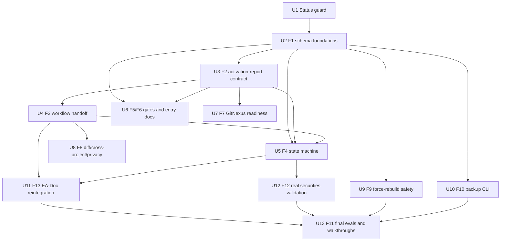

# fix: 修复 Phase 2 Dimension Framework runtime 阻断

## Summary

本计划把 Phase 2 Dimension Framework 最终代码审查报告中的 F1-F13 修复包、N-01/N-02/N-03 推论级阻断，转化为一份独立的修复执行计划。目标不是继续扩展新能力，而是先恢复机器契约、主 workflow、baseline 状态机和真实端到端验收，让 Phase 2 从 `blocked` 回到可发布的 runtime 能力。

---

## Problem Frame

`source_review` 已确认：U1-U27 虽然在原计划中标记完成，但当前实现存在关键契约断裂。最严重的问题是 `activation-report` 主契约缺 schema 且字段漂移，`generation` 读取 `dimensions[]` 但 PoC / eval 仍验收 `evaluations[]`，baseline 维度引用不存在的 `default_content`，主 workflow 把 `dimension-activator` 放到 `facts-and-classification` 之前导致 handoff 方向倒置。

二次复核新增的 N-01 / N-02 / N-03 把风险从“可能不一致”提升为“主管线必失败”：现有 `generation` 在真实 `activation-report.dimensions[]` 为空或 baseline 无 `default_content` 时会失败；跨项目模式会因 `schema` / `schema_version` 不一致被判为 `SCHEMA_MISMATCH`。因此本计划把 Phase 2 runtime 继续保持 `blocked`，先做修复和回归，不把既有 synthetic PoC、结构性 smoke 或 walkthrough 当作发布证据。

---

## Requirements

- R1. 在 F1-F4 和 N-01/N-02 被端到端验证关闭前，Phase 2 默认 append 管道、跨项目、EA-Doc、证券 PoC evidence 和 force-rebuild runtime 必须继续标记为 blocked。
- R2. 维度池、activation-rules、EA-Doc 和 doc-content signal 必须收敛到同一 loader 可校验的 schema 体系，补齐 13 个 Layer 1 通用维度。
- R3. `activation-report.v1` 必须有可执行 JSON Schema，且所有生产者、消费者、模板、eval 和样例统一字段名与主数组契约。
- R4. 主 workflow 必须统一为单一数据流，删除 activator / facts / doc-source-scanner 之间的循环依赖和本地重算 state。
- R5. 三态状态机必须覆盖 baseline、activated、pending-confirmation、shallow、candidate 的生成、门禁、merge 和 owner confirmation 归档。
- R6. Quality Gate、`recommended_action`、入口枚举、文档和文件名必须使用同一权威契约。
- R7. GitNexus readiness 必须按 `capabilities.query_global_graph`、worktree 状态、新鲜度和 `source: gitnexus` evidence source 规则执行。
- R8. diff / cross-project 必须在 F1-F3 后重新接入，维度 ID、unified map、path privacy 和 schema 字段不得漂移。
- R9. force-rebuild / backup / restore / rollback 必须修复 lock、path traversal、manifest 写入、atomic rename、CHANGELOG helper 和 schema validation 后才能作为 runtime 能力发布。
- R10. pin / unpin / list / backup manifest CLI 必须纳入顶层入口、lock、schema 校验和脚本文档。
- R11. EA-Doc 必须在 F1/F2/F3 后重新接入主框架，合法写入 `dimensions[]`，并统一敏感文档 inventory 策略。
- R12. 证券 PoC 必须从 synthetic dry-run 降级为设计样例，真实或脱敏端到端跑批和 owner review 才能作为 AE22 证据。
- R13. evals、walkthrough 和 integration report 必须重写为拦截旧契约的回归集合，包含 N-01 / N-02 的 generation 闭环验证。

**Origin actors:** A7 GitNexus Provider, A8 Cross-Project Aggregator, A9 Diff Scoper, A10 Dimension Activator, A11 端 Adapter 集, A12 Dimension Coverage Reviewer, A13 Backup Manager.

**Origin flows:** F5 混合三态维度激活萃取, F6 GitNexus 图谱辅助证据, F7 增量更新模式, F8 跨项目对比与统一, F9 端 adapter 子领域分发, F10-F12 Force Rebuild / Restore / Backup Manager 流程。

**Origin acceptance examples:** AE7-AE25 全部保留为最终回归范围；本修复计划优先关闭 AE7/AE8/AE10/AE11/AE16/AE22/AE23/AE24/AE25 的当前反固化问题。

---

## Scope Boundaries

- 不新增 Phase 2 产品能力，不扩展新维度组；本计划只修复 review 已确认的阻断、契约漂移、入口不一致和验收反固化。
- 不把 `docs/plans/2026-05-24-001-feat-skill-phase-2-dimension-framework-plan.md` 中的 U1-U27 完成状态改写为发布证明；该文件保留历史计划身份。
- 不把 synthetic PoC、结构性断言、grep 文件存在性或未实跑性能目标当作 runtime 验收。
- 不在 F9/F10 完成前执行真实破坏性 `force-rebuild` / `restore` runtime 操作；只能修文档、脚本、fixture 和安全校验。
- 不迁移第一阶段已经稳定的 profile-first / batch-extraction 管道；Phase 1 继续作为用户当前可用路径。

### Deferred to Follow-Up Work

- CI / non-interactive force-rebuild 确认机制：单独计划，不在本修复范围内设计 `--confirm-rebuild=<domain>`。
- 旧 `engineering-standards/01-app-client/standard-*.md` 的大规模迁移：等 Phase 2 runtime 解除 blocked 后另起迁移计划。
- 多 host Linux 大型项目性能基线：本计划要求记录真实数据，但 100K+ 文件级压测可作为后续优化。

---

## Graph Readiness

- target_repo: ai-engineering-standards
- status: unavailable
- source_revision: n/a
- current_revision: n/a
- stale: n/a
- primary_providers: none
- degraded_providers: none
- fallback_capabilities: bounded direct repo reads, `rg`, YAML / JSON parser checks, existing review evidence
- runtime_mcp_evidence: GitNexus MCP 可枚举其他 repo，但当前索引列表没有 `ai-engineering-standards`
- confidence: medium
- limitations:
  - 当前仓库缺 `.spec-first/graph/graph-facts.json`
  - 本计划不使用 GitNexus 图谱作为当前 repo 的 source of truth
  - GitNexus 相关修复只在 U6 中按 prompt / readiness 契约规划，不声称已验证 runtime provider

---

## Graph / GitNexus Evidence

- provider: unavailable
- native_tool_or_resource: `mcp__gitnexus__.list_repos`
- repo_scope: ai-engineering-standards
- capability_status: unavailable
- evidence_grade: session-local
- evidence_posture: fallback
- freshness_state: query-unverified
- source_tags: [live-mcp-tool, session-local-inference]
- source_contract_fields: `.spec-first/graph/graph-facts.json`, `capabilities.query_global_graph`, `provider_summary.ready_primary_providers`
- source_reads_required: none for plan writing beyond local repo files
- impact_on_plan: use review report and direct file reads as primary evidence; keep GitNexus repair as a planned unit
- capabilities_used: repo list only
- key_findings:
  - `ai-engineering-standards` is not present in the current GitNexus indexed repo list
  - `.spec-first/graph/graph-facts.json` is absent in the current worktree
- limitations:
  - no graph impact query was used for code paths
  - no cross-repo contract evidence was available for this repair plan

---

## Context & Research

### Relevant Code and Patterns

- `docs/reviews/2026-05-24-001-feat-skill-phase-2-dimension-framework-code-review.md` is the authoritative repair backlog and grouping source.
- `docs/plans/2026-05-24-001-feat-skill-phase-2-dimension-framework-plan.md` is the historical Phase 2 implementation plan and must remain linked for traceability.
- `skills/project-standard-extractor/config/dimension-framework/` 是当前维度池与 activation-rule 配置所在目录，也是 F1 必须统一的核心输入。
- `skills/project-standard-extractor/agents/dimension-activator.md`, `skills/project-standard-extractor/agents/facts-and-classification.md`, `skills/project-standard-extractor/agents/generation.md`, `skills/project-standard-extractor/agents/review-and-quality-gate.md`, and `skills/project-standard-extractor/agents/merge-coordinator.md` are the core broken handoff chain.
- `skills/project-standard-extractor/workflow.md`, `skills/project-standard-extractor/SKILL.md`, `skills/project-standard-extractor/input-guide.md`, and `skills/project-standard-extractor/usage-guide.md` are public contract surfaces and must not advertise blocked Phase 2 runtime paths as usable.

### Institutional Learnings

- `docs/solutions/architecture-patterns/multi-layer-skill-contract-drift-2026-05-23.md` records the same class of multi-layer skill contract drift. This repair plan follows its lesson: choose a single authority for machine contracts, then update prompts, docs, evals, examples and generated outputs around it instead of letting each layer carry local dialects.

### Source Review Facts Carried Forward

- 审查报告把 70 条原始 finding 归并为 F1-F13，并确认 P1/P2 分布。
- 二次复核实测验证 13/13 条核心断言，并追加 N-01/N-02/N-03。
- 三次方案更新设置 `phase2_runtime_status: blocked`，并把主管线修复顺序收紧为 F1 -> F2 -> F3 -> F4。

---

## Key Technical Decisions

| Decision | Choice | Rationale |
| --- | --- | --- |
| 修复产物形态 | 新增独立 fix plan，不继续把修复单元追加到原 Phase 2 计划 | 原计划已经是历史实施记录；修复计划需要不同成功标准，也不能让 U1-U27 看起来可发布。 |
| `activation-report` schema 字段 | 使用 `schema: "activation-report.v1"` 作为唯一机器字段；`evaluations[]` 的兼容窗口在 F2 实施时由执行者决定 | 代码审查实测：`dimension-activator`、`facts`、`merge-coordinator` 主流程、模板实际字段均使用 `schema`；`schema_version` 只在 cross-project-aggregator 和 merge self-check 出现（少数派）。统一选 `schema` 改动面最小，不引入额外迁移风险。cross-project-aggregator 和 merge self-check 的 `schema_version` 在 U3/U8 中同步修正为 `schema`。 |
| 主报告数组 | `dimensions[]` 是主契约；`evaluations[]` 要么删除，要么作为 schema 约束的兼容镜像 | `generation.md` 已读取 `dimensions[]`；当前 eval 读取 `evaluations[]` 会掩盖真实失败。 |
| 首批修复顺序 | F1 -> F2 -> F3 -> F4 必须串行 | F4 需要合法 schema 字段；F2 需要 F1 定义可加载配置；F3 需要 F2 提供 handoff 契约；N-02 让 F4 成为主管线阻断。 |
| Runtime 发布姿态 | N-01 和 N-02 被可执行测试关闭前，Phase 2 保持 blocked | 审查证据证明当前 synthetic 产物不能证明 generation runtime 可用。 |
| Force-rebuild 姿态 | F9/F10 可并行修复，但 lock / rollback / manifest / schema 门禁通过前不得发布 runtime | 该能力涉及破坏性 IO，不能只从 prompt 文本或 example 推断安全。 |
| 最终验证 | evals 最后重写 | 契约修复前重写 evals，容易再次把测试适配到错误行为。 |

---

## Open Questions

### Resolved During Planning

- 是否继承原始 `spec_id`？是。本计划是同一 Phase 2 spec 的修复链，必须同时链接 `origin` 与 `source_plan`。
- F11 是否应先于 F13 执行？否。F13 负责 EA-Doc 最小契约用例；F11 负责所有修复单元落地后的最终 integration / walkthrough / eval 重写。
- Phase 2 文档是否还能描述设计？可以，但 public docs 必须把 runtime 状态标为 blocked 或 design-only，直到对应修复单元验证通过。

### Deferred to Implementation

- `evaluations[]` 的兼容窗口：F2 实施时先盘点全部消费者，再决定是否保留兼容镜像；最终状态必须明确一个主字段。
- 具体测试 harness 名称：本仓库偏文档 / prompt 资产，没有统一 package-level test runner；执行者应在相关 `evals/` 或 `scripts/` 下补聚焦的 parser / fixture 检查，不要凭空引入全局测试框架。
- 真实或脱敏证券样本路径：U12 需要真实输入路径或被批准的脱敏 fixture；如果拿不到，应把 AE22 标为 blocked，而不是让 synthetic evidence 通过。

---

## High-Level Technical Design

> 本图只说明依赖方向，供评审确认修复顺序；它不是实现规范。执行者应把它当作上下文，而不是要复刻的代码。

---

## Implementation Units

### U1. Phase 2 runtime status guard

**Goal:** Make current blocked state explicit across public entry points before repairing internals, so users do not consume known-broken Phase 2 runtime paths.

**Requirements:** R1

**Dependencies:** None

**Files:**
- Modify: `skills/project-standard-extractor/SKILL.md`
- Modify: `skills/project-standard-extractor/README.md`
- Modify: `skills/project-standard-extractor/usage-guide.md`
- Modify: `skills/project-standard-extractor/workflow.md`
- Test: `skills/project-standard-extractor/evals/dimension-framework/orchestration-cases.md`

**Approach:**
- Add a visible `Phase 2 Status: BLOCKED` section to public entry surfaces.
- Keep Phase 1 profile-first / batch-extraction documented as the stable path.
- Mark Phase 2 default append, cross-project, EA-Doc, synthetic securities PoC and force-rebuild runtime as blocked / design-only until their owning units pass.

**Patterns to follow:**
- Existing status frontmatter in `source_review`
- Current public route descriptions in `skills/project-standard-extractor/SKILL.md`

**Test scenarios:**
- Happy path: user reads `SKILL.md` for a normal Phase 1 extraction -> Phase 1 route remains available and is not labeled blocked.
- Error path: user requests Phase 2 default append before U2-U5 are complete -> entry docs route to blocked explanation, not runtime execution.
- Integration: orchestration eval asserts Phase 2 blocked status appears in `SKILL.md`, `README.md`, and `usage-guide.md` until final release criteria are met.

**Verification:**
- Public docs no longer advertise blocked Phase 2 runtime paths as ready.
- Phase 1 usage remains discoverable and unchanged.

---

### U2. F1 schema foundations

**Goal:** Normalize dimension pools, activation rules, doc dimensions and diff-scoper IDs so all configs load through one schema family.

**Requirements:** R2, R8

**Dependencies:** U1

**Files:**
- Modify: `skills/project-standard-extractor/config/dimension-framework/schema.json`
- Modify: `skills/project-standard-extractor/config/dimension-framework/baseline-dimensions.yaml`
- Modify: `skills/project-standard-extractor/config/dimension-framework/dimensions-doc.yaml`
- Modify: `skills/project-standard-extractor/config/dimension-framework/activation-rules.schema.json`
- Modify: `skills/project-standard-extractor/config/dimension-framework/activation-rules-doc.yaml`
- Modify: `skills/project-standard-extractor/config/diff-scoper/file-to-dimension-map.yaml`
- Modify: `skills/project-standard-extractor/config/dimension-framework/README.md`
- Test: `skills/project-standard-extractor/evals/dimension-framework/three-state-cases.md`
- Test: `skills/project-standard-extractor/evals/dimension-framework/doc-source-cases.md`
- Test: `skills/project-standard-extractor/evals/dimension-framework/incremental-mode-cases.md`

**Approach:**
- Decide and document the Layer 1 ID shape once. The preferred repair is to keep stable D01-D13 common IDs for Layer 1 and map extension IDs separately.
- Add all 13 Layer 1 common dimensions required by R48.
- Extend schemas deliberately for `layer: doc` or normalize EA-Doc to an existing controlled layer. Do not let `dimensions-doc.yaml` use an unvalidated shape.
- Add `doc-content` to signal types only after loader and activation-rule schema accept it.
- Make diff-scoper references use dimension IDs that exist in the dimension pool.

**Execution note:** Start with parser / schema characterization checks that reproduce current failures, especially invalid `dimensions-doc.yaml` and orphan diff-scoper IDs.

**Patterns to follow:**
- Current Draft-7 style in `activation-rules.schema.json`
- Existing dimension config naming under `config/dimension-framework/`

**Test scenarios:**
- Happy path: loading all `config/dimension-framework/*.yaml` and `*.json` succeeds under the selected schema family.
- Happy path: common dimension pool contains D01-D13 exactly once and baseline minimum dimensions are a subset, not a conflicting separate universe.
- Edge case: EA-Doc config with `doc-content` signals validates only when its layer and signal type are registered.
- Error path: diff-scoper map references a non-existent dimension ID -> validation fails with a targeted orphan mapping error.
- Integration: incremental-mode eval maps a changed `build.gradle` or `pom.xml` file to an existing D13 / backend dimension ID, not an orphan short ID.

**Verification:**
- All dimension / activation / diff-scoper YAML and JSON parse and validate.
- Review F1 covered findings are no longer reproducible by the commands cited in `source_review`.

---

### U3. F2 activation-report v1 contract

**Goal:** Create the single executable `activation-report.v1` contract and update every producer, consumer, template, sample and eval to the same field names.

**Requirements:** R3, R8, R13

**Dependencies:** U2

**Files:**
- Create: `skills/project-standard-extractor/config/dimension-framework/activation-report-schema.json`
- Modify: `skills/project-standard-extractor/agents/dimension-activator.md`
- Modify: `skills/project-standard-extractor/agents/facts-and-classification.md`
- Modify: `skills/project-standard-extractor/agents/generation.md`
- Modify: `skills/project-standard-extractor/agents/review-and-quality-gate.md`
- Modify: `skills/project-standard-extractor/agents/merge-coordinator.md`
- Modify: `skills/project-standard-extractor/agents/cross-project-aggregator.md`
- Modify: `skills/project-standard-extractor/templates/dimension-activation-report-template.json`
- Modify: `skills/project-standard-extractor/scripts/force-rebuild-validate.sh`
- Modify: `engineering-standards/09-industry/evidence/dimension-activation-report.json`
- Test: `skills/project-standard-extractor/evals/dimension-framework/activation-signal-cases.md`
- Test: `skills/project-standard-extractor/evals/dimension-framework/cross-project-cases.md`
- Test: `skills/project-standard-extractor/evals/dimension-framework/orchestration-cases.md`

**Approach:**
- Define `activation-report-schema.json` as the source of truth for `schema`, `run_id`, `dimensions[]`, `summary`, `last_commit`, `gitnexus`, `evolution`, and allowed state values. The field name is `schema` (not `schema_version`), matching the majority implementation.
- Make `dimensions[]` the primary array. If `evaluations[]` remains for temporary compatibility, it must be a schema-constrained mirror and consumers must prefer `dimensions[]`.
- Make persistence failure a hard failure or explicit incomplete run state, not a warning.
- Update force-rebuild validation so missing schema never degrades to JSON parse success.

**Execution note:** Characterization-first: add checks that fail on current `evaluations[]`-only or `$comment` placeholder reports before editing consumers.

**Patterns to follow:**
- `templates/backup-manifest-template.json` for explicit schema-versioned machine artifact style
- `config/backup/manifest-schema.json` for strict required fields and enum treatment

**Test scenarios:**
- Happy path: dimension-activator output with populated `dimensions[]` validates and generation consumes it without `EMPTY_ACTIVATION_REPORT`.
- Error path: report uses `schema_version` instead of `schema` -> schema validation fails with clear field-name mismatch error.
- Error path: report has only `evaluations[]` and empty `dimensions[]` -> generation path rejects it unless compatibility mirror is explicitly enabled and valid.
- Integration: cross-project aggregator consumes two valid per-project reports and does not raise `SCHEMA_MISMATCH`.
- Integration: merge-coordinator persists `engineering-standards/<domain>/evidence/dimension-activation-report.json` with `last_commit` and run metadata.

**Verification:**
- No production prompt, template or eval treats `evaluations[]` as the only source of truth.
- N-01 有直接的 activator -> generation 非空 standard 验证路径。
- N-03 字段漂移通过 grep 与 schema validation 双重验证关闭。

---

### U4. F3 main workflow and agent handoff

**Goal:** Reorder the Phase 2 pipeline into one non-circular flow that lets facts, doc-source signals and activator state reach generation consistently.

**Requirements:** R4, R8, R11

**Dependencies:** U3

**Files:**
- Modify: `skills/project-standard-extractor/workflow.md`
- Modify: `skills/project-standard-extractor/agents/README.md`
- Modify: `skills/project-standard-extractor/agents/profile-and-batch-planner.md`
- Modify: `skills/project-standard-extractor/agents/doc-source-scanner.md`
- Modify: `skills/project-standard-extractor/agents/facts-and-classification.md`
- Modify: `skills/project-standard-extractor/agents/dimension-activator.md`
- Modify: `skills/project-standard-extractor/agents/generation.md`
- Create: `skills/project-standard-extractor/prompts/orchestrator/activation-map-passing.md`
- Create: `skills/project-standard-extractor/prompts/orchestrator/end-adapter-dispatch.md`
- Test: `skills/project-standard-extractor/evals/dimension-framework/orchestration-cases.md`
- Test: `skills/project-standard-extractor/evals/dimension-framework/end-adapter-dispatch-cases.md`

**Approach:**
- Set the intended flow as: intake -> profile / planner -> doc-source-scanner and signal scan -> facts-and-classification signal hits -> dimension-activator -> generation -> review -> merge.
- Treat planner `candidate_dimension_ids` only as a search hint, never a state decision.
- Stop generation and review from locally recomputing activation state.
- Add the missing orchestrator prompt files or remove their references and identify one authoritative handoff source. Prefer adding thin prompt files if current docs already reference them.

**Patterns to follow:**
- Current `agents/README.md` handoff table structure
- `workflow.md` artifact ownership table

**Test scenarios:**
- Happy path: mock project with code signals and docs signals produces facts / doc facts before activator state is computed.
- Edge case: project has docs only and no code signals -> EA-Doc candidate / activated states are still computed before generation.
- Error path: generation receives no activation-report or stale run_id -> hard failure before writing standards.
- Integration: orchestration eval proves there is exactly one state authority and no stage consumes an artifact that is produced later.

**Verification:**
- Review F3 findings are no longer true in `workflow.md` or agent handoff docs.
- No prompt says dimension-activator both consumes facts output and runs before facts in the same flow.

---

### U5. F4 three-state and owner-confirmation state machine

**Goal:** Make baseline, pending-confirmation, shallow and candidate behavior executable and consistent through generation, Quality Gate, merge and owner review.

**Requirements:** R5, R13

**Dependencies:** U2, U3, U4

**Files:**
- Modify: `skills/project-standard-extractor/config/dimension-framework/baseline-dimensions.yaml`
- Modify: `skills/project-standard-extractor/config/dimension-framework/depth-indicator.yaml`
- Modify: `skills/project-standard-extractor/agents/dimension-activator.md`
- Modify: `skills/project-standard-extractor/agents/generation.md`
- Modify: `skills/project-standard-extractor/agents/review-and-quality-gate.md`
- Modify: `skills/project-standard-extractor/agents/merge-coordinator.md`
- Modify: `skills/project-standard-extractor/templates/skeletons/overview-skeleton.md`
- Modify: `skills/project-standard-extractor/templates/skeletons/cross-cutting-skeleton.md`
- Modify: `engineering-standards/09-industry/pending-confirmation.md`
- Test: `skills/project-standard-extractor/evals/dimension-framework/three-state-cases.md`
- Test: `skills/project-standard-extractor/evals/dimension-framework/orchestration-cases.md`

**Approach:**
- Add a legitimate baseline default-content strategy. Options are schema-backed `default_content`, per-dimension skeleton snippets, or a deliberate pending-only baseline path; implementation must pick one and update schema / docs consistently.
- Ensure baseline without evidence becomes `pending-confirmation` and does not enter active / draft output without owner confirmation.
- Ensure shallow cannot be silently treated as normal draft if the chosen product rule says shallow is blocking.
- Keep candidate out of standard / ai-rules / review-checklist and list it in overview unactivated map.

**Execution note:** 先实现 N-02 回归：六个 baseline 维度、零个 activated 维度的输入不得让 generation 崩溃，且必须产出预期的最小章节或 pending 记录。

**Patterns to follow:**
- `pending-confirmation.md` existing status pattern
- `quality-gate.md` Gate B section after U6 normalizes it

**Test scenarios:**
- Covers AE8. Baseline dimension has no evidence -> activation report marks `pending-confirmation`, generation writes pending route only, merge does not publish it as normal draft.
- Covers N-02. 输入六个 baseline 维度、零个 activated 维度 -> generation 不崩溃，并产出预期的最小章节或 pending 记录。
- Happy path: activated dimension with sufficient evidence -> standard section, ai-rules, review-checklist and evidence all reference the same dimension ID.
- Error path: shallow dimension enters normal draft without low-coverage / pending treatment -> Quality Gate blocks.
- Integration: `pending-confirmation.md` and generated standard do not contradict each other for SEC / XSEC owner-review items.

**Verification:**
- Baseline path is executable and schema-backed.
- N-02 由回归测试关闭，而不是只靠文档说明关闭。

---

### U6. F5 Quality Gate and F6 public entry consistency

**Goal:** Normalize Quality Gate machine fields, `recommended_action` enums, public input enums, mode constraints and filenames across all user-visible and machine-readable surfaces.

**Requirements:** R6

**Dependencies:** U2, U3, U5

**Files:**
- Modify: `skills/project-standard-extractor/config/frontmatter-format.md`
- Modify: `skills/project-standard-extractor/quality-gate.md`
- Modify: `skills/project-standard-extractor/prompts/quality-review.md`
- Modify: `skills/project-standard-extractor/agents/review-and-quality-gate.md`
- Modify: `skills/project-standard-extractor/agents/merge-coordinator.md`
- Modify: `skills/project-standard-extractor/SKILL.md`
- Modify: `skills/project-standard-extractor/input-guide.md`
- Modify: `skills/project-standard-extractor/usage-guide.md`
- Modify: `skills/project-standard-extractor/README.md`
- Modify: `skills/project-standard-extractor/scripts/README.md`
- Test: `skills/project-standard-extractor/evals/expected-behavior.md`
- Test: `skills/project-standard-extractor/evals/dimension-framework/orchestration-cases.md`

**Approach:**
- Select one `recommended_action` vocabulary and make all producers / validators use it.
- Add a machine-readable Quality Gate summary for force-rebuild validation instead of relying on full-document grep.
- Put `output_action=list` into every top-level enum only when U10 has executable support.
- Fix filename drift such as `dimensions-ea-doc.yaml` vs `dimensions-doc.yaml`.
- Remove or downgrade Phase 2 features from public capability tables until their owning units pass.

**Patterns to follow:**
- Existing `frontmatter-format.md` enum sections
- Current input schema blocks in `input-guide.md`

**Test scenarios:**
- Happy path: `recommended_action: keep-draft-low-coverage` is either accepted everywhere or replaced everywhere by the chosen split-field representation.
- Error path: prompt outputs `none`, `submit-for-active-review`, or another unregistered action -> schema / eval catches it.
- Edge case: `output_action=list` requires `domain` but does not require `restore_from` or interactive mode.
- Integration: Quality Gate summary parser reads only machine summary and is not affected by example code blocks containing `status: blocked`.

**Verification:**
- There is one public enum set for actions and one for output actions.
- `SKILL.md`, input guide, usage guide, README and scripts docs agree on supported modes and blocked modes.

---

### U7. F7 GitNexus readiness and evidence source

**Goal:** Repair GitNexus readiness semantics and graph evidence source labeling without making graph availability mandatory.

**Requirements:** R7

**Dependencies:** U3

**Files:**
- Modify: `skills/project-standard-extractor/prompts/gitnexus/readiness-check.md`
- Modify: `skills/project-standard-extractor/prompts/gitnexus/query-and-fallback.md`
- Modify: `skills/project-standard-extractor/prompts/signal-library/gitnexus-signal.md`
- Modify: `skills/project-standard-extractor/prompts/signal-library/README.md`
- Modify: `skills/project-standard-extractor/agents/dimension-activator.md`
- Test: `skills/project-standard-extractor/evals/dimension-framework/gitnexus-cases.md`

**Approach:**
- Require `capabilities.query_global_graph == true` and provider readiness before graph queries.
- Add worktree status hash matching when the readiness contract exposes it.
- Fix mtime direction so recent graph facts pass and stale graph facts fail.
- Require `source: gitnexus` on graph evidence and real fallback source labels on fallback evidence.
- Keep GitNexus advisory; graph-only evidence cannot activate a rule without a concrete code path or file reference.

**Patterns to follow:**
- `source_review` U13 findings
- `prompts/gitnexus/query-and-fallback.md` limitations model

**Test scenarios:**
- Happy path: fresh `graph-facts.v1` with `query_global_graph: true` and ready GitNexus provider -> readiness available.
- Error path: graph facts missing `query_global_graph` -> fallback with limitation.
- Error path: mtime older than freshness window -> stale, not available.
- Integration: GitNexus signal output includes `source: gitnexus`; fallback grep evidence includes its actual source type.

**Verification:**
- GitNexus ready path and fallback path are both documented and eval-covered.
- U13 review findings cannot be reproduced.

---

### U8. F8 diff, cross-project and path privacy

**Goal:** Reconnect diff mode and cross-project aggregation on top of the repaired activation-report and workflow contracts.

**Requirements:** R8, R13

**Dependencies:** U3, U4, U6, U7

**Files:**
- Modify: `skills/project-standard-extractor/agents/diff-scoper.md`
- Modify: `skills/project-standard-extractor/agents/intake-and-scope.md`
- Modify: `skills/project-standard-extractor/agents/cross-project-aggregator.md`
- Modify: `skills/project-standard-extractor/templates/project-specific-divergence-template.md`
- Modify: `skills/project-standard-extractor/input-guide.md`
- Modify: `skills/project-standard-extractor/workflow.md`
- Test: `skills/project-standard-extractor/evals/dimension-framework/incremental-mode-cases.md`
- Test: `skills/project-standard-extractor/evals/dimension-framework/cross-project-cases.md`

**Approach:**
- Make explicit diff mode override broad-scope default only when target repo, git metadata and baseline report are valid.
- Use repaired dimension IDs from U2 and activation-report fields from U3.
- Insert cross-project aggregator into top-level workflow only for multi-project inputs.
- Persist project-specific divergence without raw absolute paths; use `project_index`, sanitized project name, scope label or path hash.

**Patterns to follow:**
- Existing `project-specific-divergence-template.md`
- Review F8 privacy constraints

**Test scenarios:**
- Covers AE14. Explicit `--mode=diff` with valid baseline maps only changed files to affected existing dimensions.
- Error path: diff-scoper sees orphan dimension mapping -> blocks or warns according to U2 validation, not silently skipping core dimensions.
- Covers AE15. Multi-project run produces per-project reports, unified map and divergence without leaking local absolute paths.
- Integration: cross-project aggregator consumes repaired `schema` reports (field name unified from `schema_version`) and no longer fails with `SCHEMA_MISMATCH`.

**Verification:**
- Diff and cross-project evals fail on old field names and pass on repaired contracts.
- No persistent evidence file contains raw local absolute project paths.

---

### U9. F9 force-rebuild, backup, restore and rollback safety

**Goal:** Repair destructive IO safety before force-rebuild / restore can be published as runtime capability.

**Requirements:** R9, R13

**Dependencies:** U2, U6

**Files:**
- Modify: `skills/project-standard-extractor/agents/backup-manager.md`
- Modify: `skills/project-standard-extractor/scripts/backup.sh`
- Modify: `skills/project-standard-extractor/scripts/force-rebuild-validate.sh`
- Modify: `skills/project-standard-extractor/config/backup/manifest-schema.json`
- Modify: `skills/project-standard-extractor/prompts/orchestrator/force-rebuild/force-rebuild.md`
- Modify: `skills/project-standard-extractor/prompts/orchestrator/force-rebuild/backup-manager.md`
- Modify: `skills/project-standard-extractor/prompts/orchestrator/force-rebuild/changelog-append.md`
- Modify: `skills/project-standard-extractor/evals/dimension-framework/force-rebuild-cases.md`
- Test: `skills/project-standard-extractor/evals/dimension-framework/force-rebuild-cases.md`

**Approach:**
- Use atomic lock creation without `mkdir -p` for the lock itself.
- Enforce domain and restore timestamp validation at SKILL, intake, agent and script layers.
- Separate backup payload from metadata, or explicitly exclude metadata on restore.
- Keep `.broken-<ts>` until changelog helper and manifest finalize succeed.
- Make changelog helper failure use reverse atomic rename, not `cp -a` from backup root.
- Decide and implement one `in-progress.lock` strategy.
- Represent multi-domain transaction honestly: either implement `domains[]` transaction state or remove it from completed scope and evals.

**Execution note:** Treat rollback paths as first-class tests; do not rely on walkthrough prose.

**Patterns to follow:**
- Review F9 findings across U23-U25
- Existing `manifest-schema.json` style after U10

**Test scenarios:**
- Happy path: force-rebuild dry-run, backup, validation pass, changelog append and cleanup leave no stale lock and write one changelog entry.
- Error path: concurrent force-rebuild attempts for same domain -> second attempt fails on lock acquisition.
- Error path: path traversal domain such as `../04-backend` or absolute path -> rejected before any IO.
- Error path: Quality Gate blocked -> reverse atomic rename restores original domain byte-for-byte and CHANGELOG is not appended.
- Error path: changelog helper fails after validation -> `.broken-<ts>` is still available and reverse rename restores original domain.
- Integration: force-rebuild eval uses the real script interface, not obsolete `--activation-report` / `--quality-gate` flags.

**Verification:**
- Force-rebuild is still marked design / repair-in-progress until all safety cases pass.
- Review F9 findings are covered by executable cases, not only docs.

---

### U10. F10 pin, unpin, list and backup manifest CLI

**Goal:** Make backup subcommands safe, schema-validated and consistently exposed across scripts, agents and user docs.

**Requirements:** R10

**Dependencies:** U2, U6, U9

**Files:**
- Modify: `skills/project-standard-extractor/scripts/backup.sh`
- Modify: `skills/project-standard-extractor/scripts/README.md`
- Modify: `skills/project-standard-extractor/agents/backup-manager.md`
- Modify: `skills/project-standard-extractor/prompts/orchestrator/force-rebuild/backup-manager.md`
- Modify: `skills/project-standard-extractor/config/backup/manifest-schema.json`
- Modify: `skills/project-standard-extractor/input-guide.md`
- Modify: `skills/project-standard-extractor/usage-guide.md`
- Modify: `skills/project-standard-extractor/SKILL.md`
- Test: `skills/project-standard-extractor/evals/dimension-framework/force-rebuild-cases.md`

**Approach:**
- Include `list` in public enums only after script and intake support it.
- Make pin / unpin acquire the same domain lock as force-rebuild / restore before writing manifests.
- Validate manifest before and after mutation.
- Validate `backup_id` as UTC timestamp or documented backup ID format.
- Keep list read-only and lock-free, but document it as such.

**Patterns to follow:**
- Current `backup-manager.md` Step 11 structure
- Review F10 findings

**Test scenarios:**
- Happy path: list returns backups including missing manifest rows without mutation.
- Happy path: pin then force-rebuild with `--keep=N` preserves pinned backups outside N.
- Error path: pin while force-rebuild lock exists -> pin fails without modifying manifest.
- Error path: invalid backup_id -> rejected before file mutation.
- Integration: `SKILL.md`, input guide, usage guide, agent and script all accept the same `output_action` set.

**Verification:**
- Backup CLI subcommands are schema-backed and public docs match executable behavior.
- U26 review findings are no longer true.

---

### U11. F13 EA-Doc reintegration

**Goal:** Reconnect EA-Doc as a valid first-class dimension group after schema and workflow repairs, without making final integration depend on F11.

**Requirements:** R11

**Dependencies:** U2, U3, U4, U5, U6

**Files:**
- Modify: `skills/project-standard-extractor/config/dimension-framework/dimensions-doc.yaml`
- Modify: `skills/project-standard-extractor/config/dimension-framework/activation-rules-doc.yaml`
- Modify: `skills/project-standard-extractor/prompts/signal-library/doc-content-signals.md`
- Modify: `skills/project-standard-extractor/agents/doc-source-scanner.md`
- Modify: `skills/project-standard-extractor/agents/dimension-activator.md`
- Modify: `skills/project-standard-extractor/agents/generation.md`
- Modify: `skills/project-standard-extractor/templates/skeletons/doc/`
- Modify: `skills/project-standard-extractor/README.md`
- Modify: `skills/project-standard-extractor/usage-guide.md`
- Modify: `engineering-standards/00-global/ea-doc-dimensions.md`
- Test: `skills/project-standard-extractor/evals/dimension-framework/doc-source-cases.md`

**Approach:**
- Make EA-Doc configs valid under U2 schemas.
- Insert doc-source-scanner before activator via U4 workflow.
- Write EA-Doc results into `activation-report.dimensions[]`.
- Choose one sensitive document policy: either sanitized inventory entries with path hash, or excluded paths with aggregate counts. Do not both exclude and expect per-file entries.
- Keep final walkthrough / integration PASS for F11, but add EA-Doc minimum contract cases here.

**Patterns to follow:**
- Existing skeleton naming under `templates/skeletons/doc/`
- `doc-source-cases.md` scenario style after it is corrected

**Test scenarios:**
- Happy path: repo docs include glossary and ADR -> EA-Doc-Glossary and EA-Doc-Decision become activated in `dimensions[]`.
- Edge case: no docs -> EA-Doc dimensions become candidate or pending according to state rules and overview unactivated map lists them.
- Error path: sensitive docs are handled according to the chosen single policy and no secret content is read into evidence.
- Integration: generation consumes EA-Doc dimensions without using `evaluations[]`.

**Verification:**
- U27 YAML / schema / workflow findings are closed.
- EA-Doc has local minimum contract tests before final F11 integration.

---

### U12. F12 real securities PoC validation

**Goal:** Replace synthetic securities evidence with a real or sanctioned脱敏 end-to-end run and owner review record.

**Requirements:** R12, R13

**Dependencies:** U2, U3, U4, U5, U6, U8

**Files:**
- Modify: `engineering-standards/09-industry/01-securities-standard.md`
- Modify: `engineering-standards/09-industry/evidence/dimension-activation-report.json`
- Modify: `engineering-standards/09-industry/pending-confirmation.md`
- Modify: `skills/project-standard-extractor/examples/phase-2/golden-sample-securities-run.md`
- Modify: `skills/project-standard-extractor/evals/dimension-framework/securities-poc-cases.md`
- Test: `skills/project-standard-extractor/evals/dimension-framework/securities-poc-cases.md`

**Approach:**
- Downgrade existing synthetic PoC language to design sample / skeleton dry-run until real validation exists.
- Run or document a real /脱敏 project through repaired pipeline with actual signal scan and activation report validation.
- Record owner review feedback and pending-confirmation outcomes.
- Fix path drift between `04-industry` references and actual `09-industry` path.

**Patterns to follow:**
- Existing `engineering-standards/09-industry/` document structure
- Review F12 criteria

**Test scenarios:**
- Covers AE22. Real or脱敏 securities input produces valid `activation-report.v1`, generated standards and Quality Gate summary.
- Error path: evidence tier is `synthetic-poc` only -> AE22 eval marks NOT_EVIDENCE, not PASS.
- Integration: owner review confirms or rejects pending SEC / XSEC items and `pending-confirmation.md` matches generated standard state.
- Integration: path references use `engineering-standards/09-industry/` consistently.

**Verification:**
- Securities PoC is no longer used as proof unless it comes from the repaired runtime pipeline.
- AE22 has actual run evidence or remains explicitly blocked.

---

### U13. F11 evals, walkthroughs and integration report rewrite

**Goal:** Rebuild verification artifacts after repairs so they catch old broken contracts and prove the repaired runtime path.

**Requirements:** R13

**Dependencies:** U1-U12

**Files:**
- Modify: `skills/project-standard-extractor/evals/dimension-framework/README.md`
- Modify: `skills/project-standard-extractor/evals/dimension-framework/three-state-cases.md`
- Modify: `skills/project-standard-extractor/evals/dimension-framework/activation-signal-cases.md`
- Modify: `skills/project-standard-extractor/evals/dimension-framework/end-adapter-dispatch-cases.md`
- Modify: `skills/project-standard-extractor/evals/dimension-framework/gitnexus-cases.md`
- Modify: `skills/project-standard-extractor/evals/dimension-framework/incremental-mode-cases.md`
- Modify: `skills/project-standard-extractor/evals/dimension-framework/cross-project-cases.md`
- Modify: `skills/project-standard-extractor/evals/dimension-framework/orchestration-cases.md`
- Modify: `skills/project-standard-extractor/evals/dimension-framework/industry-coexist-cases.md`
- Modify: `skills/project-standard-extractor/evals/dimension-framework/securities-poc-cases.md`
- Modify: `skills/project-standard-extractor/evals/dimension-framework/doc-source-cases.md`
- Modify: `skills/project-standard-extractor/evals/dimension-framework/force-rebuild-cases.md`
- Modify: `skills/project-standard-extractor/examples/phase-2/`
- Modify: `skills/project-standard-extractor/examples/phase-2/integration-validation-report.md`
- Test: `skills/project-standard-extractor/examples/phase-2/integration-validation-report.md`

**Approach:**
- Replace checks for `evaluations[]`, nonexistent skeleton names, obsolete diff fields and wrong validate arguments.
- Make integration report distinguish `PASS`, `FAIL`, `BLOCKED`, `NOT_RUN` and `NOT_MEASURED`.
- 包含 N-01 activator -> generation 非空 standard 验证。
- 包含 N-02 六个 baseline + 零个 activated 的 generation 验证。
- 在宣布 backup / rollback / restore / pin / unpin / list 可用前，包含 F9/F10 的真实 fixture 检查。
- Record performance only when measured with inputs, start/end times and file counts.

**Execution note:** Run this unit last; any earlier rewrite risks normalizing the wrong contract.

**Patterns to follow:**
- Given / When / Then style already used in `evals/dimension-framework/`
- Review F11 anti-pattern list

**Test scenarios:**
- Happy path: repaired default append pipeline produces valid activation report, non-empty generated standard, Quality Gate summary and merge summary.
- Error path: old `evaluations[]`-only report -> eval fails.
- Error path: integration report without actual command / run evidence -> scenario status is NOT_RUN, not PASS.
- Error path: synthetic securities PoC only -> AE22 remains blocked or design-only.
- Integration: force-rebuild / restore / pin / unpin / list run against a temp fixture and record exit codes, manifest, lock lifecycle, changelog diff and directory diff.
- Integration: GitNexus available fixture and unavailable fallback fixture both produce expected readiness states.

**Verification:**
- Final integration report no longer claims 8/8 PASS from structure-only checks.
- Every F1-F13 repair package has at least one eval or walkthrough assertion that would have failed on the reviewed broken state.

---

## System-Wide Impact

- **Interaction graph:** The repaired pipeline changes handoffs across intake, planner, doc-source-scanner, facts, activator, generation, review, merge and backup manager. All agent tables must be updated together.
- **Error propagation:** Schema validation, missing report, blocked Quality Gate, destructive IO failure and changelog failure must produce explicit failed / blocked states instead of warnings.
- **State lifecycle risks:** `pending-confirmation`, shallow coverage, backup locks, `.broken-<ts>` directories and manifests all need deterministic cleanup or durable failure records.
- **API surface parity:** Public docs, SKILL entry protocol, input guide, usage guide, README, scripts README and evals must expose the same enums and filenames.
- **Integration coverage:** Unit-level parser checks are insufficient; final coverage must include activator -> generation, baseline-only generation, cross-project schema consumption and force-rebuild rollback fixtures.
- **Unchanged invariants:** Phase 1 stable profile-first and batch-extraction path remains available; this plan does not alter its product contract.

---

## Risks & Dependencies

| Risk | Mitigation |
| --- | --- |
| Repairing evals too early adapts tests to current broken contracts | U13 runs last and must fail on old `evaluations[]`-only and structure-only PASS patterns. |
| Baseline default content choice becomes another local dialect | U5 must update schema, generation, Quality Gate and docs together around one strategy. |
| Destructive IO repair accidentally executes on real standards directories | U9 uses temp fixtures for runtime tests and keeps public runtime blocked until safety cases pass. |
| Real securities project is unavailable | U12 marks AE22 blocked / NOT_RUN and keeps synthetic sample design-only instead of pretending PASS. |
| GitNexus remains unavailable for this repo | U7 uses fixtures and fallback semantics; graph availability is not required for the repair plan itself. |
| Existing dirty worktree contains unrelated user changes | Implementers must read touched files before editing and avoid reverting unrelated modifications. |

---

## Phased Delivery

1. **Safety banner:** U1
2. **Mainline contract repair:** U2 -> U3 -> U4 -> U5
3. **Public surface and secondary pipeline repair:** U6, U7, U8
4. **Destructive IO repair:** U9, U10 in parallel after U2/U6, still blocked from runtime release until passing fixtures
5. **Content and dimension reintegration:** U11, U12 after mainline contract repair
6. **Final verification rewrite:** U13 after all other units

---

## Success Metrics

- N-01 closed by an activator -> generation run that produces a non-empty standard from a schema-valid report.
- N-02 closed by a baseline-only input that does not crash generation and produces the selected pending / minimal baseline output.
- N-03 closed by a grep / schema check showing only one primary activation-report schema field.
- All F1-F13 repair packages have corresponding eval / fixture assertions.
- `examples/phase-2/integration-validation-report.md` reports PASS only for scenarios with actual run evidence; otherwise uses BLOCKED / NOT_RUN / NOT_MEASURED.
- Public docs stop advertising Phase 2 runtime capabilities until their owning units pass.

---

## Documentation / Operational Notes

- `CHANGELOG.md` must receive a user-visible entry for this repair plan and later for each source-changing repair batch.
- This plan is a planning artifact only. It does not authorize code repair by itself; implementation should use `$spec-work` or an equivalent work entrypoint against this plan.
- Any future task pack should preserve this plan's `spec_id` and link `source_review`.

---

## Sources & References

- **Origin document:** `docs/brainstorms/2026-05-24-001-project-standard-extractor-dimension-framework-requirements.md`
- **Source plan:** `docs/plans/2026-05-24-001-feat-skill-phase-2-dimension-framework-plan.md`
- **Source review:** `docs/reviews/2026-05-24-001-feat-skill-phase-2-dimension-framework-code-review.md`
- **Institutional learning:** `docs/solutions/architecture-patterns/multi-layer-skill-contract-drift-2026-05-23.md`
