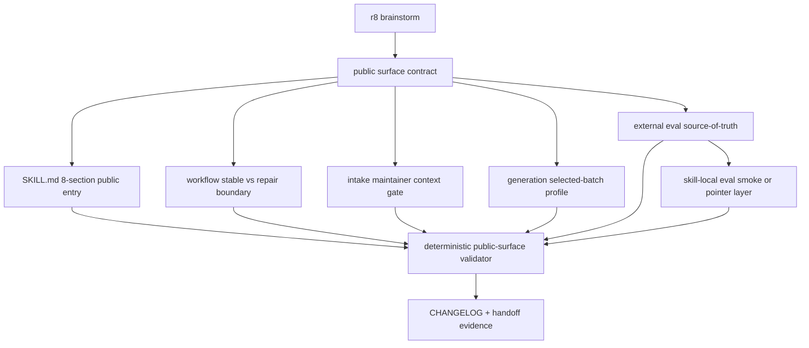
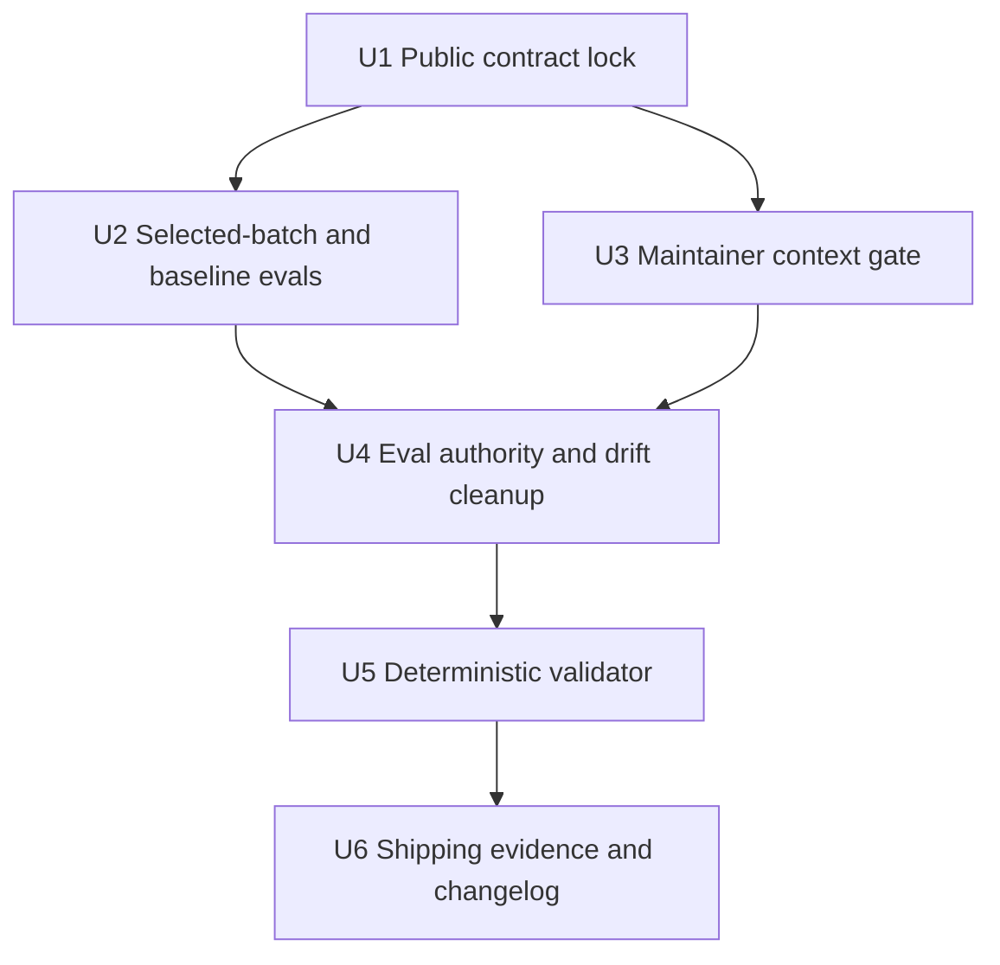

# refactor: project-standard-extractor 公开入口治理与安全收敛

## Summary

本计划把 `project-standard-extractor` 的公开入口治理收敛为可执行的 deep 技术方案：公开稳定路径只保留 `profile-first` 和 `selected-batch`，Phase 2 / force-rebuild 维持 repair-only，destructive 能力通过 maintainer context gate 隔离，并补一条确定性验证链防止多层契约再次漂移。

---

## Problem Frame

`project-standard-extractor` 已经历多轮结构重构、Phase 2 维度框架建设和 force-rebuild 维护工具迁移。r8 brainstorm 已确认：A+C 主体已经在当前源码中基本落地，当前工作不是重开 Phase 2 实现，而是把公开入口、内部契约、外部 evals、maintainer 工具边界和后续验证方式统一到同一套可执行标准。

核心问题有三类：

- 公开入口必须准确承诺可用能力：`profile-first -> batch-plan` 与 `selected-batch -> draft standard / ai-rules / review-checklist`。
- 维护者能力必须可达但不可误触发：`force-rebuild` / `restore` / `pin` / `unpin` / `list` 只能在 maintainer / repair-only 上下文下进入 backup-manager。
- 多层文档必须避免再次漂移：`SKILL.md`、`references/workflow.md`、`references/agents/*`、skill-local evals、外部 evals 和 maintainer README 不能各写一套互相冲突的契约。

---

## Requirements

- R1. `SKILL.md` 公开入口必须保留 `project-standard-extractor` 名称和 draft 规范产出承诺，但明确两条稳定路径：`profile-first` 和 `selected-batch`。
- R2. `baseline-only` 只能作为 Phase 2 repair fallback 验收场景，不进入 `SKILL.md` description 的公开稳定路径。
- R3. `generation_profile: phase1-selected-batch` 必须在 selected-batch 路径可达，且不要求 `activation-report`、不读取 `dimension-activator`。
- R4. Phase 2 `dimension-activator` / cross-project / EA-Doc / securities PoC / force-rebuild runtime 必须继续标记为 `blocked / repair-only`，直到对应 repair 验证单独通过。
- R5. `SKILL.md` 的 `Inputs` 与公开稳定流程不得暴露 `output_action` / `domain` / `restore_from` / `keep` / `full` 作为公开调用字段或公开步骤。
- R6. `output_action != append` 必须带显式 `maintainer_context = true`，否则返回 `MAINTAINER_CONTEXT_REQUIRED`，且不得进入 backup-manager。
- R7. Maintainer 工具只能位于 `tools/maintainer/project-standard-extractor/`，不得回到 `skills/project-standard-extractor/` 包内。
- R8. `SKILL.md` frontmatter 必须包含 `x-external-evals-root: docs/evals/project-standard-extractor/`，且该目录是完整 eval source-of-truth。
- R9. G4 不再使用 `SKILL.md` 行数硬门槛；以 8 小节完整性、公开说明质量、安全边界和 maintainer 指针清晰度作为验收标准。
- R10. 外部 evals、skill-local evals 与 maintainer references 必须有明确权威关系，避免相同场景在不同层写出不同期望。
- R11. 验证方式必须包含确定性检查：frontmatter、公开字段、selected-batch、baseline fallback、maintainer gate、旧脚本引用、package boundary、eval drift。
- R12. 所有项目 source 改动必须同步 `CHANGELOG.md`，作者使用 `.codex/spec-first/.developer` 中的 `leokuang`。
- R13. origin 的基线锁定意图必须保留：implementation closeout 应在 runtime 允许时运行 `spec-skill-audit` 作为前后对比证据；若 workflow 不可用或 audit artifact 不适合当前边界，必须显式记录 degraded-not-run，而不是静默跳过。

---

## Scope Boundaries

- 不实现 Phase 2 cross-project、EA-Doc、securities PoC 或 force-rebuild runtime 新能力。
- 不修改 `project-standard-extractor` 的核心业务算法或真实规范萃取产物。
- 不把 maintainer 工具做成公开 skill 触发面。
- 不用行数作为 SKILL 质量门槛；必要时可以增加说明，只要公开面不混入 repair-only 细节。
- 不依赖 GitNexus 图谱作为本计划的主证据；当前图谱 query 不可作为 primary impact evidence。
- 不修改 generated mirrors：`.claude/**`、`.codex/**`、`.agents/skills/**`。

### Deferred to Follow-Up Work

- 将 `package_skill.py` / `quick_validate.py` 恢复到当前 checkout 或引入统一 package validation workflow。
- 将 external evals 接入 CI 或 `spec-skill-audit` 的可重复执行入口。
- 为多个 skill 共用的 `tools/maintainer/README.md` 建立仓库级 maintainer 索引。
- Phase 2 runtime 解 blocked 后，再单独设计 force-rebuild / cross-project / EA-Doc 的发布计划。

---

## Graph Readiness

- target_repo: ai-engineering-standards
- status: stale
- source_revision: c3365c3c7ec5d17749c74ef55c82f5375082ab62
- current_revision: ea3c746b372fa38c85e1687ebcf085fafc7dd2fa
- stale: true
- primary_providers: none
- degraded_providers: gitnexus query-not-applicable / definitions-only
- fallback_capabilities: bounded direct repo reads, `rg`, document diff checks, local deterministic assertions
- runtime_mcp_evidence: session-local GitNexus list/query returned the current repo and definitions-only pointers, no process evidence
- confidence: medium
- limitations: Graph facts are dirty-advisory and indexed before current uncommitted changes; GitNexus `query_global_graph=false`, `query_ready=false`, and no graph impact result is used for scope decisions.

---

## Graph / GitNexus Evidence

- provider: GitNexus
- native_tool_or_resource: `list_repos`, `query`
- repo_scope: ai-engineering-standards
- capability_status: partial
- evidence_grade: stale
- evidence_posture: fallback
- freshness_state: stale
- source_tags: [checked-in-baseline, live-mcp-tool, session-local-inference]
- source_contract_fields: `.spec-first/graph/graph-facts.json`, `capabilities.query_global_graph`, `provider_summary.ready_primary_providers`, `provider_status.providers[].query_ready`
- source_reads_required: mandatory; all planning conclusions are backed by direct source reads.
- impact_on_plan: GitNexus only confirmed likely file pointers; it did not expand implementation scope or provide process/impact evidence.
- capabilities_used: repo orientation and definitions-only query.
- key_findings:
  - `ai-engineering-standards` is indexed but stale relative to current HEAD and dirty worktree.
  - Query for `project-standard-extractor` public surface returned definitions only, including the origin brainstorm, existing plans, SKILL, evals and the contract-drift learning.
- limitations:
  - No GitNexus process symbols, impact radius or route/tool surface evidence was available.
  - Plan uses bounded direct source reads as primary evidence.

---

## Context & Research

### Relevant Code and Patterns

- `skills/project-standard-extractor/SKILL.md` is the public trigger surface. It already has 8 public sections and `x-external-evals-root`.
- `skills/project-standard-extractor/references/workflow.md` is the stable/repair boundary reference. It already separates Stable Public Workflow and Maintainer / Repair-Only.
- `skills/project-standard-extractor/references/agents/intake-and-scope.md` owns `output_action` and `maintainer_context` gate semantics.
- `skills/project-standard-extractor/references/agents/generation.md` owns `phase1-selected-batch` and `phase2-dimension-aware` input profiles.
- `skills/project-standard-extractor/references/agents/dimension-activator.md` owns baseline dimensions entering `dimensions[]` for Phase 2.
- `tools/maintainer/project-standard-extractor/README.md` documents maintainer-only backup / force-rebuild scripts outside the skill package.
- `docs/evals/project-standard-extractor/` contains the external eval source-of-truth for trigger, failure, expected behavior and dimension fallback cases.
- `skills/project-standard-extractor/evals/` still contains skill-local public evals that currently differ from the external evals; this is a drift risk that should be resolved explicitly, not left implicit.
- `package_skill.py` and `quick_validate.py` are not present in the current checkout; package-level checks need a fallback validation strategy until canonical tooling is restored.

### Institutional Learnings

- `docs/solutions/architecture-patterns/multi-layer-skill-contract-drift-2026-05-23.md` applies directly. It warns that Skill reliability collapses when `SKILL.md`、workflow、agents、prompts、templates、examples、evals carry competing contracts. This plan therefore treats `references/agents/*` and external evals as contract anchors, and requires drift checks rather than prose-only cleanup.

### External References

- No external research used. The work is repository-local prompt/skill governance, and current repo evidence is more authoritative than general best-practice material.

---

## Key Technical Decisions

| Decision | Choice | Rationale |
| --- | --- | --- |
| Public stable path | Keep only `profile-first` and `selected-batch` in public SKILL language | Matches r8 and current `workflow.md`; avoids advertising Phase 2 blocked paths. |
| Baseline-only | Treat as repair fallback eval, not public path | It validates Phase 2 robustness without confusing ordinary users. |
| Maintainer gate | Require `maintainer_context=true` for `output_action != append` | Omitting destructive fields from public inputs lowers trigger probability but is not a security boundary by itself. |
| G4 quality standard | 8 sections + clarity + safety boundaries, no line-count cap | User explicitly prioritized final skill quality over line count. |
| Eval authority | External `docs/evals/project-standard-extractor/` is full source-of-truth; skill-local evals must be either synchronized smoke subset or pointer stubs | Current duplicate evals differ; leaving both authoritative would recreate contract drift. |
| Validation tooling | Add/maintain a repo-local deterministic public-surface validator while package tooling is unavailable | The previous local assertions proved the shape; making them durable prevents ad hoc rework. |
| GitNexus evidence | Record degraded/stale posture and use direct reads | Current GitNexus is definitions-only and stale, not suitable for impact claims. |

---

## Open Questions

### Resolved During Planning

- Should this be a deep plan even though some fixes already landed? Yes. The user explicitly requested `deep plan`; the plan should document the remaining hardening path and make validation durable.
- Should `SKILL.md` line count remain an acceptance criterion? No. r8 removes the hard gate; quality and boundary clarity win.
- Should maintainer scripts be hidden or deleted? No. They are valid maintainer tools and should remain explicitly reachable from `tools/maintainer/project-standard-extractor/`.
- Should external evals replace or coexist with skill-local evals? They may coexist only if their authority is explicit. The plan chooses external evals as complete source-of-truth and skill-local evals as package-local smoke/pointer surface.

### Deferred to Implementation

- Exact validator language: Bash is consistent with existing maintainer tools, but implementation may choose Node if it keeps path handling simpler.
- Whether to delete skill-local evals or convert them to pointer stubs: implementation should inspect packaging expectations before choosing; either outcome must avoid divergent assertions.
- Whether package tooling can be restored from another repo or plugin: if found during implementation, run it as canonical validation; otherwise keep deterministic local checks as fallback.

---

## High-Level Technical Design

> *This illustrates the intended approach and is directional guidance for review, not implementation specification. The implementing agent should treat it as context, not code to reproduce.*

---

## Implementation Units

### U1. Public contract lock

**Goal:** Make the public surface contract explicit and stable: `SKILL.md` describes only the stable public routes, while `workflow.md` carries repair-only detail.

**Requirements:** R1, R2, R4, R5, R8, R9

**Dependencies:** None

**Files:**
- Modify: `skills/project-standard-extractor/SKILL.md`
- Modify: `skills/project-standard-extractor/references/workflow.md`
- Test: `docs/evals/project-standard-extractor/expected-behavior.md`

**Approach:**
- Keep `SKILL.md` in 8 public sections: When To Use, When Not To Use, Inputs, Workflow, Outputs, Safety Boundaries, Failure Modes, Maintainer References.
- Ensure `SKILL.md` public inputs stay limited to `project_paths`, `output_dir`, `extraction_mode`, `selected_batch`, and `run_mode`.
- Keep Phase 2 and force-rebuild detail in `references/workflow.md`, not in the public Workflow steps.
- Preserve `x-external-evals-root` in frontmatter.
- Keep r8 acceptance wording quality-first: no line-count gate.

**Patterns to follow:**
- `docs/solutions/architecture-patterns/multi-layer-skill-contract-drift-2026-05-23.md`: one authority layer, downstream layers reference rather than inventing parallel contracts.
- Current `SKILL.md` 8-section structure.

**Test scenarios:**
- Happy path: a broad project extraction request maps to `profile-first` and stops at project profile / extraction map / batch plan.
- Happy path: a selected batch request maps to `generation_profile: phase1-selected-batch`.
- Edge case: `SKILL.md` grows past a prior line budget but remains structurally clear and does not expose repair-only internals.
- Error path: public input includes `full`, `output_action`, `restore_from` or `keep`; public entry rejects or ignores it instead of treating it as stable API.
- Integration: `expected-behavior.md` safety section matches the public SKILL wording and workflow boundary.

**Verification:**
- Public contract fields and section headings are present.
- No destructive field appears as a public input or stable workflow step.
- `SKILL.md` frontmatter points at external eval root.

---

### U2. Selected-batch and baseline fallback regression coverage

**Goal:** Lock both r8 behavior anchors: selected-batch works without activation-report, while baseline-only remains a Phase 2 repair fallback that can generate minimal draft content without promoting baseline into AI default rules.

**Requirements:** R2, R3, R4, R8, R11

**Dependencies:** U1

**Files:**
- Modify: `skills/project-standard-extractor/references/agents/generation.md`
- Modify: `skills/project-standard-extractor/references/agents/dimension-activator.md`
- Modify: `docs/evals/project-standard-extractor/trigger-cases.md`
- Modify: `docs/evals/project-standard-extractor/dimension-framework/three-state-cases.md`
- Test: `docs/evals/project-standard-extractor/trigger-cases.md`
- Test: `docs/evals/project-standard-extractor/dimension-framework/three-state-cases.md`

**Approach:**
- Treat `phase1-selected-batch` as the stable public generation profile.
- Keep `phase2-dimension-aware` as repair-only and validate baseline-only through external evals.
- Assert selected-batch does not require `activation-report` and does not read `dimension-activator`.
- Assert baseline-only does not throw `EMPTY_ACTIVATION_REPORT` or `NO_DIMENSION_CAN_GENERATE`, and its content comes from `baseline-dimensions.yaml.default_content`.

**Patterns to follow:**
- `generation.md` input profile table and A0 profile loader.
- `dimension-activator.md` baseline rule: baseline dimensions always enter `dimensions[]` with `state=baseline`.

**Test scenarios:**
- Happy path: selected batch with `selected_batch_summary.batch_id`, `code_facts`, and `classification` generates draft standard, AI rules and checklist without activation-report.
- Edge case: selected batch with no representative evidence writes pending / review summary instead of AI-executable rules.
- Repair fallback: activation-report contains only baseline dimensions and empty `code_facts`; generation produces minimal draft sections and no must-level AI rule.
- Error path: Phase 2 activation-report with empty `dimensions[]` still fails as schema/contract violation.
- Integration: external trigger and three-state evals cite the same profile names and failure modes as `generation.md`.

**Verification:**
- The eval text and agent contract agree on `phase1-selected-batch`.
- Baseline-only appears only in Phase 2 repair fallback contexts.
- No eval implies baseline-only is a public stable path.

---

### U3. Maintainer context gate and destructive surface isolation

**Goal:** Make destructive or state-changing maintainer actions impossible through the ordinary public path while keeping maintainer tools explicitly usable by repository maintainers.

**Requirements:** R5, R6, R7, R11

**Dependencies:** U1

**Files:**
- Modify: `skills/project-standard-extractor/references/agents/intake-and-scope.md`
- Modify: `skills/project-standard-extractor/references/workflow.md`
- Modify: `tools/maintainer/project-standard-extractor/README.md`
- Modify: `docs/evals/project-standard-extractor/failure-cases.md`
- Modify: `docs/evals/project-standard-extractor/expected-behavior.md`
- Test: `docs/evals/project-standard-extractor/failure-cases.md`

**Approach:**
- Keep `output_action` as an internal / maintainer field in `intake-and-scope.md`, not a public SKILL input.
- Require `maintainer_context=true` for every `output_action != append`.
- Ensure missing context returns `MAINTAINER_CONTEXT_REQUIRED` before any backup-manager handoff.
- Keep tool paths under `tools/maintainer/project-standard-extractor/`.
- State that maintainer trigger is designed to be reachable manually; it is not a public skill route.

**Patterns to follow:**
- Current `intake-and-scope.md` Step 4.5 gate.
- `tools/maintainer/project-standard-extractor/README.md` 使用边界 section.

**Test scenarios:**
- Happy path: ordinary profile-first request has no `output_action`, defaults to append and does not call backup-manager.
- Error path: request includes `output_action: force-rebuild` with `maintainer_context: false`; it returns `MAINTAINER_CONTEXT_REQUIRED` and does not call backup scripts.
- Error path: maintainer action with missing domain remains rejected even if maintainer context is true.
- Integration: `expected-behavior.md` safety section and `failure-cases.md` FC-008 align with `intake-and-scope.md` failure mapping.

**Verification:**
- Public SKILL path cannot set maintainer context.
- `backup-manager` references remain only in repair-only / maintainer references, not stable workflow.
- Old skill-local `scripts/backup.sh` and `scripts/force-rebuild-validate.sh` paths are not used as active script locations.

---

### U4. Eval authority and drift cleanup

**Goal:** Remove ambiguity between package-local evals and external evals so future reviewers know which layer is authoritative and can detect drift.

**Requirements:** R8, R10, R11

**Dependencies:** U2, U3

**Files:**
- Modify: `skills/project-standard-extractor/evals/trigger-cases.md`
- Modify: `skills/project-standard-extractor/evals/failure-cases.md`
- Modify: `skills/project-standard-extractor/evals/expected-behavior.md`
- Modify: `docs/evals/project-standard-extractor/README.md`
- Modify: `docs/evals/project-standard-extractor/trigger-cases.md`
- Modify: `docs/evals/project-standard-extractor/failure-cases.md`
- Modify: `docs/evals/project-standard-extractor/expected-behavior.md`
- Test: `docs/evals/project-standard-extractor/trigger-cases.md`
- Test: `docs/evals/project-standard-extractor/failure-cases.md`
- Test: `docs/evals/project-standard-extractor/expected-behavior.md`

**Approach:**
- Choose one of two acceptable outcomes during implementation:
  - Synchronize skill-local public evals as a strict subset of external evals, with a header that external evals are complete source-of-truth.
  - Replace skill-local eval bodies with small pointer/smoke cases that explicitly link to external evals.
- Do not let skill-local evals contradict external evals on selected-batch, maintainer context, or quality-first G4.
- Keep Phase 2 force-rebuild / dimension-framework evals external unless they are intentionally packaged as public smoke tests.

**Patterns to follow:**
- Contract drift learning: evals are regression tests, not a second requirements document.
- Current external evals under `docs/evals/project-standard-extractor/`.

**Test scenarios:**
- Happy path: skill-local trigger cases include selected-batch `phase1-selected-batch` and do not mention activation-report.
- Error path: skill-local failure cases include `MAINTAINER_CONTEXT_REQUIRED` or explicitly delegate that full case to external evals.
- Edge case: external evals contain richer Phase 2 repair fallback cases that are not silently copied into public skill trigger surface.
- Integration: `SKILL.md` maintainer references accurately state where public and external evals live.

**Verification:**
- Duplicate eval files no longer carry conflicting expectations.
- External eval root remains the complete source-of-truth.
- Package-local evals, if retained, are small and clearly scoped.

---

### U5. Deterministic public-surface validator

**Goal:** Convert ad hoc G1-G7 checks into a durable repo-local validation helper so future `spec-work` runs can verify the public surface without recreating one-off scripts.

**Requirements:** R1-R11

**Dependencies:** U1, U2, U3, U4

**Files:**
- Create: `tools/maintainer/project-standard-extractor/public-surface-validate.sh`
- Modify: `tools/maintainer/project-standard-extractor/README.md`
- Modify: `docs/evals/project-standard-extractor/README.md`
- Test: `tools/maintainer/project-standard-extractor/public-surface-validate.sh`

**Approach:**
- Add a read-only validator that checks the source tree, not production project paths.
- Cover at least:
  - frontmatter presence and `x-external-evals-root`
  - public 8-section headings
  - destructive field absence from public Inputs / stable workflow
  - selected-batch eval and generation profile alignment
  - baseline-only repair fallback eval presence
  - maintainer context gate and failure case presence
  - old skill-local script path absence
  - skill-local eval vs external eval authority rule
  - optional package-tool presence, with explicit degraded result when `package_skill.py` / `quick_validate.py` are unavailable
- Keep the validator read-only and non-destructive.

**Patterns to follow:**
- Existing maintainer scripts under `tools/maintainer/project-standard-extractor/`.
- Existing workflow guidance that maintainer tools are repository governance assets, not public skill routes.

**Test scenarios:**
- Happy path: current r8-compliant source tree passes all active checks.
- Error path: adding `output_action:` to `SKILL.md` Inputs fails validation.
- Error path: removing `MAINTAINER_CONTEXT_REQUIRED` from failure cases fails validation.
- Error path: reintroducing `skills/project-standard-extractor/scripts/backup.sh` or old references fails validation.
- Degraded path: package tooling is absent; validator reports package validation as unavailable rather than silently passing it.

**Verification:**
- Validator can be run from repo root and exits non-zero on contract violations.
- Validator output distinguishes pass, fail and degraded-not-run checks.
- README documents the validator's boundary and that it does not execute backup / restore / force-rebuild.

---

### U6. Shipping evidence, changelog and handoff

**Goal:** Close the hardening work with traceable evidence that matches project governance and gives `spec-work` / reviewers a clear handoff.

**Requirements:** R11, R12, R13

**Dependencies:** U5

**Files:**
- Modify: `CHANGELOG.md`

**Approach:**
- Add a single user-visible changelog entry for implementation changes.
- Capture validation results in the final work summary rather than mutating the plan body as progress state.
- Preserve the origin's baseline-lock intent by running `spec-skill-audit` before and after implementation when the workflow/runtime boundary allows it.
- Treat any `.spec-first/audits/**` output as workflow-owned audit evidence only; do not hand-edit audit artifacts or use them as ordinary planning source.
- If package validation tooling is still unavailable, explicitly report the degraded validation boundary.

**Patterns to follow:**
- Root `CHANGELOG.md` format and author from `.codex/spec-first/.developer`.
- `spec-work` closeout convention: changed files, checks run, residual risks.

**Test scenarios:**
- Happy path: changelog contains one user-visible entry describing public surface hardening and validator coverage.
- Happy path: skill audit before/after evidence shows no new P1 regression, or the closeout explicitly records why audit evidence is degraded-not-run.
- Edge case: package tooling unavailable; final handoff names the exact unavailable tooling and fallback validator result.
- Integration: final status does not claim GitNexus primary evidence, package validation, or Phase 2 runtime release unless those checks actually ran.

**Verification:**
- `CHANGELOG.md` follows existing format.
- Baseline-lock evidence is present or explicitly degraded with a concrete reason.
- Plan remains a decision artifact; progress is not stored as checkboxes.
- Final handoff lists changed files, validation commands/results, graph limitations and residual follow-ups.

---

## System-Wide Impact

- **Interaction graph:** Public skill trigger flows through `SKILL.md -> workflow.md -> intake-and-scope.md -> generation.md`; maintainer actions flow through `tools/maintainer/...` and repair-only references.
- **Error propagation:** Public path errors should stop at intake/generation with explicit failure modes; maintainer action errors must not be downgraded into ordinary extraction warnings.
- **State lifecycle risks:** The main state risk is accidentally treating repair-only / force-rebuild state as public runtime state.
- **API surface parity:** `SKILL.md`, skill-local evals and external evals must describe the same public API.
- **Integration coverage:** Text-only unit checks are insufficient; the validator should check cross-file invariants such as selected-batch profile and maintainer gate appearing in both contract and evals.
- **Unchanged invariants:** Draft-only generation, append-only merge, evidence-first rules and sensitive-file non-read policy stay unchanged.

---

## Risks & Dependencies

| Risk | Mitigation |
| --- | --- |
| Skill-local evals and external evals keep drifting | Make external evals authoritative and validate skill-local evals as subset or pointer only. |
| Validator becomes another contract source | Keep validator assertions traceable to G1-G7 and current source files; do not encode new product behavior in it. |
| Maintainer tool docs tempt ordinary users into force-rebuild | Keep maintainer references one hop away and require explicit `maintainer_context=true` before routing. |
| Package validation remains unavailable | Record degraded status; use source-tree validator until canonical tooling returns. |
| GitNexus stale evidence leads to false confidence | Plan and closeout must state fallback direct reads as primary evidence. |
| Phase 2 repair fallback language leaks into public path | Keep baseline-only under external dimension-framework evals and repair-only workflow sections. |

---

## Alternative Approaches Considered

- **Only update `SKILL.md` prose:** rejected because prior learning shows surface prose alone does not stop multi-layer contract drift.
- **Delete all skill-local evals:** acceptable only if packaging no longer expects local evals; otherwise it removes useful smoke coverage. The plan prefers explicit authority plus sync/pointer strategy.
- **Make maintainer actions a second public skill:** deferred. The current need is boundary hardening, not a new user-facing workflow.
- **Use line count as SKILL quality proxy:** rejected by r8 and user instruction; it encourages deleting useful boundary text.
- **Wait for GitNexus refresh before planning:** rejected. This is primarily docs/skill contract planning, and bounded source reads provide enough evidence.

---

## Success Metrics

- Public extraction requests route to `profile-first` or `selected-batch` without touching Phase 2 repair-only paths.
- `MAINTAINER_CONTEXT_REQUIRED` blocks maintainer actions without explicit context.
- External evals and skill-local evals no longer disagree on selected-batch or maintainer gate behavior.
- Public-surface validator catches deliberate reintroduction of destructive fields or stale script paths.
- Reviewers can identify the authority chain in one pass: `SKILL.md` for public trigger, `workflow.md` for stable/repair split, `agents/*` for machine contracts, `docs/evals/*` for full evals.

---

## Phased Delivery

### Phase 1 — Contract and eval alignment

- Complete U1-U4 first.
- Goal: make the public/repair boundary and eval authority unambiguous before adding tooling.

### Phase 2 — Durable validation

- Complete U5.
- Goal: turn G1-G7 from manually reconstructed checks into a stable maintainer helper.

### Phase 3 — Shipping evidence

- Complete U6.
- Goal: record changelog, validation limitations and residual follow-ups without mutating source plans as progress state.

---

## Documentation Plan

- `SKILL.md`: public entry and boundary language only.
- `references/workflow.md`: stable path plus repair-only / maintainer boundary.
- `docs/evals/project-standard-extractor/README.md`: source-of-truth explanation and validator relationship.
- `tools/maintainer/project-standard-extractor/README.md`: maintainer tool and validator usage boundaries.
- `CHANGELOG.md`: user-visible summary of the hardening and validation work.

---

## Operational / Rollout Notes

- This change is source/docs governance; no production rollout or migration is required.
- Do not execute real backup / restore / force-rebuild as part of public surface validation.
- If implementation finds package tooling, run it after the source-tree validator; if not, report package validation as not-run/degraded.
- Because the current worktree is dirty and GitNexus facts are stale, implementation closeout must not claim graph-backed impact evidence.

---

## Sources & References

- **Origin document:** [docs/brainstorms/2026-05-25-004-project-standard-extractor-public-surface-hardening.md](docs/brainstorms/2026-05-25-004-project-standard-extractor-public-surface-hardening.md)
- **Public skill:** `skills/project-standard-extractor/SKILL.md`
- **Workflow boundary:** `skills/project-standard-extractor/references/workflow.md`
- **Intake gate:** `skills/project-standard-extractor/references/agents/intake-and-scope.md`
- **Generation profile:** `skills/project-standard-extractor/references/agents/generation.md`
- **Dimension baseline contract:** `skills/project-standard-extractor/references/agents/dimension-activator.md`
- **Maintainer tools:** `tools/maintainer/project-standard-extractor/README.md`
- **External evals:** `docs/evals/project-standard-extractor/`
- **Contract drift learning:** `docs/solutions/architecture-patterns/multi-layer-skill-contract-drift-2026-05-23.md`
- **Prior structure plan:** `docs/plans/2026-05-25-002-refactor-skill-structure-optimization-plan.md`
- **Prior Phase 2 repair plan:** `docs/plans/2026-05-25-001-fix-phase-2-dimension-framework-repair-plan.md`
