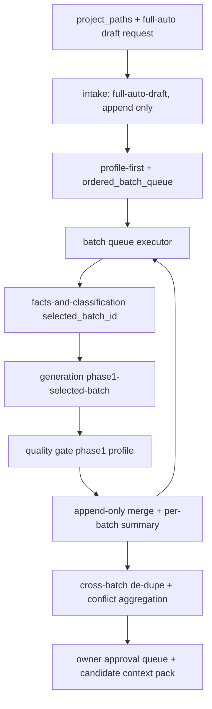
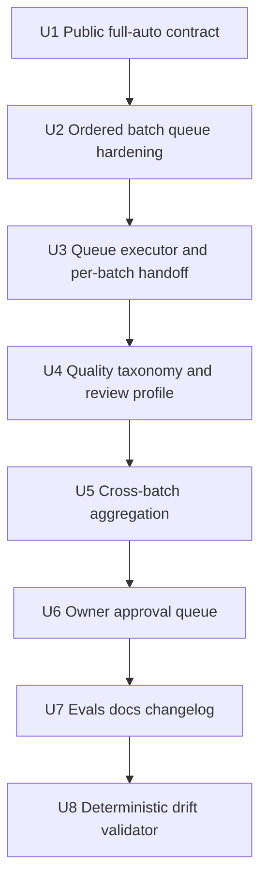

# feat: project-standard-extractor full-auto draft pipeline

## Summary

本计划将 `project-standard-extractor` 从“完整仓库先画像，再由人选择单个 ready batch”的稳定路径，扩展为“完整单仓库输入后自动遍历 ready batch，生成完整 draft 候选规范资产”的受控能力。实现重点不是放宽 evidence 边界，而是把单 batch 边界封装成自动队列执行、质量分层、跨 batch 汇总和 owner approval queue；所有新规范仍默认 `draft`，`active` 仍由 owner 手动批准。

---

## Problem Frame

当前公开稳定路径刻意克制：完整仓库必须先 `profile-first`，生成 project profile / extraction map / batch plan，然后用户选择单个 `ready` batch 继续 `batch-extraction`。这保证了 evidence 可审查，但对“给一个仓库，一次生成完整候选规范”的团队推广场景不够顺滑。

需求文档已经确认新的产品目标：使用最强、专业的 LLM 自动完成全流程 draft 生产，但不让模型直接替团队发布规范承诺。计划因此把人工参与从“中途选择 batch”后移到“最终审批候选规则”：pipeline 自动跑完整 ready batch 队列，owner 通过 review summary / approval queue 判断哪些规则能升级 `active`，哪些保持 pending、conflict 或 rejected。

---

## Requirements

**Full-auto draft pipeline**

- R1. 支持完整单仓库输入启动 full-auto draft 生成，运行中不要求用户手动选择单个 batch。
- R2. 必须先完成仓库画像和 batch 规划，再进入逐 batch 萃取；不得把完整仓库作为一个无边界上下文直接生成规范。
- R3. 只自动执行 `ready` batch；`pending`、`skipped`、`blocked` batch 写入 summary，不强行萃取。
- R4. 按排序队列逐 batch 执行；单 batch 失败、证据不足或冲突不得污染其他 batch。

**Professional LLM judgment boundary**

- R5. LLM 可负责事实归纳、规则抽象、反例识别、legacy 判断、冲突分析和规范文案生成，但每个判断必须保留 evidence 或推断依据。
- R6. 必须区分 recommended、forbidden、legacy、pending、conflict、rejected，不能只因代码存在就生成推荐规范。
- R7. 必须识别历史兼容、迁移过渡、临时方案、低维护模块和单点样例过度泛化等代表性风险。
- R8. 每条候选规则必须进入可解释质量分层：high-confidence draft、low-coverage draft、pending-confirmation、conflict 或 rejected。

**Quality gates**

- R9. 每条 draft 规则必须通过 evidence gate；无可追溯 evidence 的内容只能进入 pending 或 rejected。
- R10. 每条 draft 规则必须通过 AI 可执行性 gate；不可执行、过度抽象或含糊表达不能进入 high-confidence draft。
- R11. 每条 draft 规则必须通过 Review 可检查性 gate；Reviewer 无法二值判断的内容不能进入 high-confidence draft。
- R12. 必须对跨 batch 相似规则做去重或合并建议，对相反规则写入 conflict，不得静默选择一边。

**Output and approval experience**

- R13. 全自动运行的所有新规范默认状态必须是 `draft`，不得自动发布 `active`。
- R14. 必须生成 owner approval queue，按优先级展示建议升级、保持 draft、移入 pending、标记 conflict 或 rejected 的候选项。
- R15. 候选索引和 AI 上下文包必须保持 candidate 状态，不能自动覆盖正式索引或默认强约束入口。

**Quality evaluation and feedback**

- R16. 成功标准必须以规范质量和真实使用效果为核心，而不是生成文件数量或规则数量。
- R17. 必须输出质量摘要，覆盖 high-confidence draft、pending、conflict、rejected 数量、主要风险和 owner 决策项。
- R18. 后续评估必须覆盖真实 AI 开发和 Review 反馈，包括返工是否减少、重复解释是否减少、规则误导是否出现。

**Origin actors:** A1 Skill 使用者, A2 Full-auto pipeline, A3 专业 LLM, A4 规范 owner, A5 Reviewer / AI 重度使用者

**Origin flows:** F1 全仓 draft 自动生成, F2 质量分层与风险显性化, F3 owner approval queue, F4 使用反馈与质量闭环

**Origin acceptance examples:** AE1 covers R1/R2/R3/R13, AE2 covers R6/R7/R8/R9, AE3 covers R10/R11, AE4 covers R12/R14, AE5 covers R14/R15, AE6 covers R16/R17/R18

---

## Assumptions

- A1. V1 只面向单仓库；多仓库统一规范继续作为后续独立能力处理。
- A2. “全流程自动化”指自动生成完整 draft 候选资产和审批队列，不包括自动把规则升级为 `active`。
- A3. V1 基于现有 Phase 1 selected-batch 语义循环实现，不依赖 Phase 2 `dimension-activator` 或 `activation-report` 解 blocked。
- A4. 实现阶段允许新增 run-level state / orchestrator contract，但不得把 destructive maintainer 字段暴露给公开 skill 调用。

---

## Scope Boundaries

- V1 聚焦 `project-standard-extractor` 单仓库 full-auto draft pipeline。
- 不发布多仓库 / cross-project 统一规范能力。
- 不把 `force-rebuild`、`restore`、`pin`、`unpin`、`list` 作为主线能力。
- 不允许 LLM 或 Skill 自动把任何新规则发布为 `active`。
- 不取消 evidence gate、质量门禁、冲突记录和 owner approval。
- 不把 high-confidence / low-coverage 等展示分层扩展为新的持久化 `status` 枚举；规则 `status` 仍沿用 `draft` / `active` 等既有治理口径。
- 不以生成规则数量作为主要成功指标。
- 不修改 generated mirrors：`.claude/**`、`.codex/**`、`.agents/skills/**`。

### Deferred to Follow-Up Work

- 多仓库统一规范、cross-project aggregator 默认发布路径。
- Phase 2 dimension-aware runtime 解 blocked 后的 full-auto 维度激活版本。
- force-rebuild 系列 maintainer 工具的公开发布计划。
- 将真实 AI 开发 / Review 反馈接入可重复指标面板。

---

## Graph Readiness

- target_repo: ai-engineering-standards
- status: degraded-fallback
- source_revision: ce4a6773a33a1e9e9e460b74c1a484e77b5d2d8f
- current_revision: d996052cdf268f898aed2f29567711a2b50b04e9
- stale: true
- primary_providers: gitnexus
- degraded_providers: GitNexus stale / definitions-only / no impact context
- fallback_capabilities: direct source reads, `rg`, focused file inspection, deterministic doc/eval checks
- runtime_mcp_evidence: GitNexus query returned relevant file definitions but no process graph or impact graph.
- confidence: medium
- limitations: `.spec-first/graph/graph-facts.json` is stale relative to current HEAD and marked dirty-advisory; `impact_context=false`, so this plan does not use GitNexus for blast-radius claims.

---

## Graph / GitNexus Evidence

- provider: GitNexus
- native_tool_or_resource: `.spec-first/graph/graph-facts.json`, `mcp__gitnexus__.query`
- repo_scope: ai-engineering-standards
- capability_status: partial
- evidence_grade: advisory
- evidence_posture: fallback
- freshness_state: stale
- source_tags: [checked-in-baseline, live-mcp-tool, session-local-inference]
- source_contract_fields: `capabilities.query_global_graph`, `capabilities.impact_context`, `provider_summary.ready_primary_providers`, `freshness_state`, `source_revision`
- source_reads_required: mandatory; all actionable plan conclusions are backed by direct source reads.
- impact_on_plan: GitNexus confirmed likely files (`SKILL.md`, `workflow.md`, `intake-and-scope.md`, evals, prior public-surface plan, contract-drift learning), but did not expand scope or provide dependency impact evidence.
- capabilities_used: repo/file orientation only.
- key_findings:
  - GitNexus is available but stale and definitions-only for this task.
  - Current plan must treat graph data as advisory and prefer direct reads of skill contracts and eval docs.
- limitations:
  - No process symbols, route maps, API impact or related-test evidence was available.
  - Plan verification must rely on deterministic document checks and eval coverage updates.

---

## Context & Research

### Relevant Code and Patterns

- `skills/project-standard-extractor/SKILL.md` currently exposes the stable public path only: `profile-first` and selected single `batch-extraction`; Phase 2 and maintainer tools are explicitly out of public scope.
- `skills/project-standard-extractor/references/workflow.md` defines the Stable Public Workflow as `intake-and-scope -> profile-and-batch-planner -> stop-for-batch-selection -> facts-and-classification(selected batch only) -> generation(phase1-selected-batch) -> review-and-quality-gate -> merge-coordinator(draft-only append)`.
- `skills/project-standard-extractor/references/agents/profile-and-batch-planner.md` already defines `ordered_batch_queue` for auto mode and states that `pending-confirmation` / `skipped` batch 不进入队列。
- `skills/project-standard-extractor/references/agents/facts-and-classification.md` currently requires `selected_batch_id` and enforces `status == ready`; this is the right unit boundary for full-auto per-batch workers.
- `skills/project-standard-extractor/references/agents/generation.md` already separates `phase1-selected-batch` and `phase2-dimension-aware`; V1 should reuse `phase1-selected-batch` and avoid fake `activation-report`.
- `skills/project-standard-extractor/references/agents/review-and-quality-gate.md` has 8 persona, Gate A content review, conflict debate, `target_state`, `recommended_action`, and `confidence`; full-auto should extend aggregation and display buckets without inventing a new rule status model.
- `skills/project-standard-extractor/references/agents/merge-coordinator.md` already owns append-only merge, candidate artifacts, conflict/merge-suggestion routing and final review-summary generation.
- `skills/project-standard-extractor/references/config/output-targets.md` defines temp review summary、candidate rules-index / llms / AI context pack and draft-only publication boundary.
- `docs/evals/project-standard-extractor/boundary-cases.md` already contains BC-006: auto mode may traverse multiple ready batch, but each batch remains an independent read boundary.
- `docs/03-用户手册/AI辅助研发工程规范用户手册.md`, `docs/03-用户手册/project-standard-extractor-execution-analysis.md`, and `docs/03-用户手册/project-standard-extractor-sharing-script.md` currently teach the two-step stable path and must be updated when full-auto draft becomes public.

### Institutional Learnings

- `docs/solutions/architecture-patterns/multi-layer-skill-contract-drift-2026-05-23.md` applies directly. It documents that `SKILL.md`、workflow、agents、prompts、templates、examples、evals 任一层漂移都会让 Skill 运行时选择错误契约。本计划因此把 implementation units 切到多层同步，而不是只改公开入口。

### External References

- No external research used. This is a repo-local skill contract and governance change; current source files and evals are more authoritative than generic LLM workflow guidance.

---

## Key Technical Decisions

| Decision | Choice | Rationale |
| --- | --- | --- |
| Public mode name | Use `extraction_mode: full-auto-draft` or equivalent explicit public wording; do not expose generic `full` | `full` previously mixed with internal mode language and can be mistaken for unrestricted full-repo rule generation. |
| V1 execution base | Orchestrate existing `phase1-selected-batch` per ready batch | Preserves evidence boundary and avoids reopening Phase 2 blocked runtime. |
| Batch boundary | Full-auto loops over `ordered_batch_queue`, but each worker receives exactly one `selected_batch_id` | Satisfies automation goal without cross-batch evidence contamination. |
| Queue eligibility | Only `ready` batch enter execution queue; pending/skipped/blocked go to summary | Matches current profile planner and origin R3. |
| Quality classes | Derive high-confidence / low-coverage / pending / conflict / rejected from `quality_gate_decisions[]`, `target_state`, `recommended_action`, and `confidence`; do not add persistent `status` enum | Avoids schema drift and keeps `status` governance simple. |
| Review profile | Add explicit review profile for Phase 1 full-auto: Gate A + legacy/coverage checks; Gate B remains Phase 2-only when activation-report exists | Current review doc assumes activation-report in places; V1 must not fake one. |
| Failure isolation | Default continue to next batch after recoverable batch-level failure; stop only on global safety violations | Produces a complete approval queue while preserving safety. |
| Owner approval | Owner queue is a run-level artifact, not automatic publication | Keeps A4 as final authority for `active`. |
| Candidate context | `rules-index-candidate.json`, `llms-candidate.txt`, and `ai-context-pack.md` stay candidate / non-default | Prevents pending/conflict material from entering AI default context. |
| Docs rollout | Update user manual and sharing script in same implementation slice as public surface | The current docs strongly say “不能一次处理多个 batch”; public behavior must not drift. |

---

## Open Questions

### Resolved During Planning

- Should full-auto consume Phase 2 `dimension-activator`? No. V1 uses Phase 1 selected-batch loop; Phase 2 remains blocked / repair-only.
- Should high-confidence draft become a new `status` value? No. It is a review-summary / owner-queue display bucket derived from existing decision fields.
- Should full-auto automatically promote strong model output to `active`? No. Stronger models improve draft quality but do not replace owner confirmation.
- Should full-auto ignore batch limits to satisfy “完整”? No. It should attempt all ready batch by default, but budget / safety stops must be explicit and recorded as deferred or incomplete, never silent.

### Deferred to Implementation

- Exact public input shape: implementation should choose the smallest public addition, likely `extraction_mode: full-auto-draft` plus optional `full_auto_limits`.
- Exact run budget defaults: implementation should inspect current expected project sizes before setting defaults; any cap must record unprocessed ready batch in review summary.
- Whether to implement a separate shell validator or extend an existing maintainer validator: choose based on current tooling shape, but ensure the check is deterministic and repo-local.

---

## Output Structure

```text
skills/project-standard-extractor/
  references/
    agents/
      full-auto-draft-orchestrator.md        # new contract, if implementation chooses a separate orchestrator
    workflow.md                              # public full-auto draft path
  assets/
    review-summary-template.md               # owner approval queue additions
  evals/
    *.md                                     # package-local smoke subset aligned to external evals

docs/
  evals/project-standard-extractor/
    trigger-cases.md
    boundary-cases.md
    expected-behavior.md
    failure-cases.md
  03-用户手册/
    AI辅助研发工程规范用户手册.md
    project-standard-extractor-execution-analysis.md
    project-standard-extractor-sharing-script.md

tools/maintainer/project-standard-extractor/
  full-auto-contract-validate.sh             # optional deterministic drift guard
```

---

## High-Level Technical Design

> This illustrates the intended approach and is directional guidance for review, not implementation specification. The implementing agent should treat it as context, not code to reproduce.



**Run-state sketch:**

```yaml
full_auto_run_state:
  schema: full-auto-draft-run.v1
  run_id: "{run_id}"
  mode: full-auto-draft
  queue_source: "temp/{run_id}-batch-plan.md"
  queue:
    ready_total: 0
    executed: []
    failed: []
    deferred: []
    skipped: []
  global_quality_summary:
    high_confidence_draft: 0
    low_coverage_draft: 0
    pending_confirmation: 0
    conflict: 0
    rejected: 0
  owner_approval_queue: []
```

---

## Implementation Units



### U1. Public full-auto draft contract

**Goal:** Add a public, non-destructive full-auto draft mode while preserving the current stable paths and maintainer boundary.

**Requirements:** R1, R2, R13, R15

**Dependencies:** None

**Files:**
- Modify: `skills/project-standard-extractor/SKILL.md`
- Modify: `skills/project-standard-extractor/references/workflow.md`
- Modify: `skills/project-standard-extractor/references/agents/intake-and-scope.md`
- Test: `docs/evals/project-standard-extractor/trigger-cases.md`
- Test: `skills/project-standard-extractor/evals/trigger-cases.md`

**Approach:**
- Add an explicit public route for full-auto draft, preferably `extraction_mode: full-auto-draft`.
- Keep `profile-first` and selected `batch-extraction` unchanged.
- Do not reintroduce public `output_action`, `full`, `domain`, `restore_from`, `keep` or maintainer-only fields.
- In `workflow.md`, define full-auto draft as `profile-first -> ordered_batch_queue -> repeated selected-batch worker -> aggregate summary`.
- State clearly that full-auto only produces draft / candidate artifacts and never upgrades `active`.

**Execution note:** Contract-first. Update public wording and eval expectations before implementation touches generation or merge semantics.

**Patterns to follow:**
- `docs/plans/2026-05-26-001-refactor-project-standard-extractor-public-surface-plan.md` for public/maintainer boundary language.
- `skills/project-standard-extractor/SKILL.md` current 8-section structure.

**Test scenarios:**
- Happy path: full repository input with `extraction_mode: full-auto-draft` routes to profile-first and then queue execution.
- Happy path: existing `profile-first` request still stops after profile / extraction map / batch plan.
- Happy path: existing selected `batch-extraction` still requires exactly one ready batch.
- Error path: public request includes `output_action`, `restore_from`, `keep` or `full`; skill refuses to treat it as public full-auto API.
- Integration: full-auto run declares all outputs as draft or candidate; no active publication step appears.

**Verification:**
- Public inputs list the new mode but no maintainer-only fields.
- `workflow.md` has a single full-auto draft flow and still marks Phase 2 / force-rebuild as blocked or repair-only.
- Trigger evals cover full-auto, profile-first, selected-batch and maintainer rejection.

---

### U2. Ordered batch queue hardening

**Goal:** Make `ordered_batch_queue` reliable enough to drive unattended execution without broadening evidence boundaries.

**Requirements:** R2, R3, R4, R7

**Dependencies:** U1

**Files:**
- Modify: `skills/project-standard-extractor/references/agents/profile-and-batch-planner.md`
- Modify: `skills/project-standard-extractor/references/config/extraction-batch-policy.md`
- Modify: `skills/project-standard-extractor/assets/batch-plan-template.md`
- Test: `docs/evals/project-standard-extractor/boundary-cases.md`
- Test: `docs/evals/project-standard-extractor/expected-behavior.md`

**Approach:**
- Keep queue membership restricted to `status: ready`.
- Add explicit scoring dimensions for representativeness, current-maintained code, owner docs, positive/negative evidence coverage, recentness when available, and sensitive exclusions.
- Record `pending-confirmation`, `skipped`, `blocked`, and budget-deferred batch outside the queue with reason codes.
- Preserve per-batch `candidate_files`, `excluded_paths`, `evidence_limit`, `rule_limit`, and `stop_conditions`.
- Add a run-level queue summary so the orchestrator can report what was executed, skipped or deferred.

**Patterns to follow:**
- Current `profile-and-batch-planner.md` `ordered_batch_queue` contract.
- Existing `BC-006` rule: auto may traverse multiple ready batch, but each batch stays independent.

**Test scenarios:**
- Happy path: multiple ready batch are sorted with stable reason codes and only ready batch enter the queue.
- Edge case: a legacy migration module has code signals but low representativeness; it is downgraded or tagged for owner attention.
- Edge case: sensitive paths exist; queue excludes them and records sanitized reason.
- Error path: no ready batch; full-auto stops after profile with summary, not fake rules.
- Integration: batch-plan template contains enough fields for the executor to call the selected-batch worker without re-planning.

**Verification:**
- Queue ordering and exclusion reasons are documented.
- Evals assert pending/skipped/blocked batch are not executed.
- No cross-batch candidate_files merge appears in planner output.

---

### U3. Batch queue executor and per-batch handoff

**Goal:** Introduce a full-auto orchestration contract that executes ready batch one by one while reusing the existing selected-batch worker semantics.

**Requirements:** R1, R3, R4, R5

**Dependencies:** U2

**Files:**
- Create: `skills/project-standard-extractor/references/agents/full-auto-draft-orchestrator.md`
- Modify: `skills/project-standard-extractor/references/workflow.md`
- Modify: `skills/project-standard-extractor/references/agents/facts-and-classification.md`
- Modify: `skills/project-standard-extractor/references/agents/generation.md`
- Test: `docs/evals/project-standard-extractor/boundary-cases.md`
- Test: `docs/evals/project-standard-extractor/failure-cases.md`

**Approach:**
- Define the orchestrator as a run-level controller, not a new evidence extractor.
- For each queue item, call facts/classification with exactly one `selected_batch_id`.
- Ensure generation uses `generation_profile: phase1-selected-batch` for V1 full-auto.
- Maintain run-state with per-batch `started`, `succeeded`, `failed`, `deferred`, and `skipped` outcomes.
- Continue after recoverable batch-level failures; stop on global safety failures such as sensitive read requirement, output target corruption, or contract violation.
- Prevent cross-batch context leakage: batch N may read previous batch summaries only for de-dupe/conflict in merge, not for evidence classification.

**Execution note:** Characterization-first. Before adding new behavior, capture current single-batch behavior as the invariant full-auto must preserve.

**Patterns to follow:**
- `facts-and-classification.md` selected batch validation steps.
- `generation.md` `phase1-selected-batch` profile loader.

**Test scenarios:**
- Happy path: three ready batch execute in queue order and produce three isolated per-batch summaries.
- Edge case: batch 2 lacks representative evidence; it records pending/rejected outcome and batch 3 still runs.
- Error path: a batch tries to read outside `candidate_files`; run records violation and prevents that batch from writing rules.
- Error path: global sensitive-file violation stops run and writes no unsafe raw content.
- Integration: repeated selected-batch execution does not require `activation-report`.

**Verification:**
- A full-auto run can be described as repeated selected-batch calls.
- Per-batch evidence boundaries are auditable from run-state and review summary.
- No implementation path invokes Phase 2 activator for V1 full-auto.

---

### U4. Quality taxonomy and review profile

**Goal:** Map professional LLM output into auditable quality buckets without expanding persistent rule status.

**Requirements:** R5, R6, R7, R8, R9, R10, R11, R17

**Dependencies:** U3

**Files:**
- Modify: `skills/project-standard-extractor/references/agents/review-and-quality-gate.md`
- Modify: `skills/project-standard-extractor/references/quality-gate.md`
- Modify: `skills/project-standard-extractor/references/config/frontmatter-format.md`
- Modify: `skills/project-standard-extractor/assets/standard-review-report-template.md`
- Test: `docs/evals/project-standard-extractor/expected-behavior.md`
- Test: `docs/evals/project-standard-extractor/failure-cases.md`

**Approach:**
- Add `review_profile` or equivalent distinction:
  - `phase1-selected-batch`: Gate A content/evidence/executability/reviewability + legacy/coverage checks; no activation-report required.
  - `phase2-dimension-aware`: current Gate A + Gate B activation behavior, still repair-only.
- Derive owner-facing quality buckets:
  - `high-confidence draft`: `target_state=draft`, `confidence=high`, no blocking findings, evidence representative, AI executable, reviewer checkable.
  - `low-coverage draft`: `target_state=draft` with low evidence coverage, weak representativeness, or `recommended_action=keep-draft-low-coverage`.
  - `pending-confirmation`: `target_state=pending-confirmation` or owner confirmation required.
  - `conflict`: `target_state=conflict` or `quality_gate_decisions[].status=conflict`.
  - `rejected`: `target_state=rejected` or `recommended_action=reject`.
- Keep rule metadata `status: draft` for generated rules; bucket is review-summary classification, not publication status.
- Strengthen fuzzy wording gate for expressions like “合理”“尽量”“适当”“保持清晰”.
- Ensure `recommended_action` stays in existing enum or explicitly extends enum with migration note if implementation proves necessary.

**Patterns to follow:**
- Existing 8 persona review checklist.
- `frontmatter-format.md` `recommended_action` enum.
- `quality-gate.md` confidence computation.

**Test scenarios:**
- Happy path: evidence-backed, executable, checkable rule becomes high-confidence draft but remains `status: draft`.
- Edge case: rule has evidence but only one low-coverage file; becomes low-coverage draft, not high-confidence.
- Error path: no evidence; moves to pending or rejected.
- Error path: vague rule wording; cannot enter high-confidence draft until rewritten.
- Error path: industry/security high-risk rule without owner confirmation; forced pending.
- Integration: review summary can count all five buckets from `quality_gate_decisions[]`.

**Verification:**
- Review contract works with Phase 1 full-auto without activation-report.
- Quality buckets are derived and documented.
- No new persistent `status` values are introduced for high-confidence or low-coverage.

---

### U5. Cross-batch aggregation, de-dupe and conflict handling

**Goal:** Aggregate multiple batch outputs into a coherent draft candidate set without overwriting active rules or duplicating near-identical rules.

**Requirements:** R4, R6, R12, R15

**Dependencies:** U4

**Files:**
- Modify: `skills/project-standard-extractor/references/agents/merge-coordinator.md`
- Modify: `skills/project-standard-extractor/assets/merge-suggestions-template.md`
- Modify: `skills/project-standard-extractor/assets/conflicts-template.md`
- Modify: `skills/project-standard-extractor/references/config/output-targets.md`
- Test: `docs/evals/project-standard-extractor/boundary-cases.md`
- Test: `docs/evals/project-standard-extractor/failure-cases.md`

**Approach:**
- Add run-local cross-batch aggregation over rule title fingerprints, source target, domain/sub_domain/task_type and semantic overlap.
- Treat exact duplicates as merge suggestions, not repeated rule writes.
- Treat contradictions with existing `active` as conflict; never overwrite or downgrade active.
- Treat contradictions among new draft candidates as conflict or owner queue item; do not silently choose one.
- Keep append-only behavior for draft files; if historical file frontmatter is missing or risky, write suggestions instead of mutating it.
- Ensure candidate index artifacts stay in `temp/` and retain candidate status.

**Patterns to follow:**
- `merge-coordinator.md` append-only and conflict severity rules.
- `output-targets.md` candidate rules-index / llms / AI context pack rules.

**Test scenarios:**
- Happy path: two batch produce compatible complementary rules; both appear as draft candidates with separate evidence.
- Edge case: two batch produce same title with different evidence; one draft plus merge suggestion, no duplicate rule spam.
- Error path: new draft conflicts with active; conflict is recorded and active is untouched.
- Error path: two new draft candidates contradict; owner queue marks conflict.
- Integration: candidate artifacts are written as candidate and do not overwrite official index files.

**Verification:**
- `conflicts.md` contains every active conflict.
- `merge-suggestions.md` contains near-duplicates and consolidation suggestions.
- No formal index or active rule is overwritten.

---

### U6. Owner approval queue and full-auto review summary

**Goal:** Turn full-auto output into an owner-friendly decision queue that makes final human approval efficient.

**Requirements:** R13, R14, R15, R16, R17, R18

**Dependencies:** U5

**Files:**
- Modify: `skills/project-standard-extractor/assets/review-summary-template.md`
- Modify: `skills/project-standard-extractor/references/agents/merge-coordinator.md`
- Modify: `skills/project-standard-extractor/references/config/output-targets.md`
- Test: `docs/evals/project-standard-extractor/expected-behavior.md`
- Test: `docs/evals/project-standard-extractor/failure-cases.md`

**Approach:**
- Add an `owner_approval_queue` section sorted by recommended action, risk, confidence, evidence quality, and conflict severity.
- Include five bucket counts: high-confidence draft, low-coverage draft, pending-confirmation, conflict, rejected.
- Include per-item fields: rule locator, batch id, quality bucket, evidence summary, risk tag, recommended action, owner question, and next step.
- Add a “not processed / deferred” section for ready batch skipped by budget or failures.
- Preserve the existing instruction: owner manually upgrades accepted rules from `draft` to `active`.
- Include downstream feedback prompts for whether the resulting active rules reduce AI coding rework and review repetition.

**Patterns to follow:**
- Existing `review-summary-template.md` manual owner action section.
- Origin flow F3 / F4.

**Test scenarios:**
- Happy path: high-confidence rules appear first with evidence and owner action.
- Edge case: low-coverage draft is visible but not mixed with high-confidence.
- Error path: pending and conflict items are present but excluded from default AI execution guidance.
- Integration: summary reports both generated assets and unprocessed/deferred batch.
- Integration: owner queue never asks user to publish candidate index automatically.

**Verification:**
- Review summary lets owner decide without opening every generated file first.
- Queue includes all required buckets and recommended actions.
- Manual `active` upgrade boundary remains explicit.

---

### U7. Evals, user docs, sharing script and changelog

**Goal:** Update all public documentation and regression cases so the new full-auto draft capability is understandable and testable.

**Requirements:** R1-R18

**Dependencies:** U1-U6

**Files:**
- Modify: `docs/evals/project-standard-extractor/trigger-cases.md`
- Modify: `docs/evals/project-standard-extractor/boundary-cases.md`
- Modify: `docs/evals/project-standard-extractor/expected-behavior.md`
- Modify: `docs/evals/project-standard-extractor/failure-cases.md`
- Modify: `skills/project-standard-extractor/evals/trigger-cases.md`
- Modify: `skills/project-standard-extractor/evals/boundary-cases.md`
- Modify: `skills/project-standard-extractor/evals/expected-behavior.md`
- Modify: `skills/project-standard-extractor/evals/failure-cases.md`
- Modify: `docs/03-用户手册/AI辅助研发工程规范用户手册.md`
- Modify: `docs/03-用户手册/project-standard-extractor-execution-analysis.md`
- Modify: `docs/03-用户手册/project-standard-extractor-sharing-script.md`
- Modify: `docs/03-用户手册/README.md`
- Modify: `CHANGELOG.md`

**Approach:**
- Add trigger cases for full-auto draft, profile-first, selected-batch and maintainer-only rejection.
- Extend BC-006 from “auto may traverse multiple ready batch” into explicit full-auto proof: per-batch boundary must remain independent.
- Add failure cases for legacy overgeneralization, fuzzy rules, active conflict, candidate index leakage, no-ready-batch, and budget-deferred queue.
- Update user manual FAQ currently saying “不能一次处理多个 batch” to the new nuance: stable manual path still supports one batch; full-auto draft path can auto traverse ready batch while preserving one-batch evidence boundaries.
- Update sharing script for the developer/team presentation: explain that full-auto draft is now the target capability, but `active` remains owner-gated.
- Record user-visible changelog entry for docs/source changes.

**Patterns to follow:**
- `docs/evals/project-standard-extractor/` as external source-of-truth.
- Current user manual structure and sharing script tone.

**Test scenarios:**
- Happy path: full-auto draft eval describes complete ready queue execution and draft-only output.
- Edge case: no ready batch produces profile + summary, not fake standard files.
- Error path: fuzzy rule rejected or downgraded.
- Error path: conflict with active writes conflict and blocks default AI use.
- Integration: skill-local evals remain synchronized smoke subset, not divergent authority.

**Verification:**
- Evals mention full-auto, draft-only, owner approval and candidate index boundaries.
- User docs no longer contradict public full-auto draft behavior.
- `CHANGELOG.md` has user-visible entry with current developer profile author.

---

### U8. Deterministic drift validator

**Goal:** Add a lightweight deterministic guard to prevent full-auto public contract, agent contracts, evals and docs from drifting apart again.

**Requirements:** R1, R2, R8, R13, R15

**Dependencies:** U7

**Files:**
- Create: `tools/maintainer/project-standard-extractor/full-auto-contract-validate.sh`
- Modify: `tools/maintainer/project-standard-extractor/README.md`
- Test: `tools/maintainer/project-standard-extractor/full-auto-contract-validate.sh`

**Approach:**
- Validate public input fields: full-auto draft is present; destructive fields are absent from public SKILL inputs.
- Validate workflow: full-auto draft flow includes profile-first, ordered queue, selected-batch worker, quality gate, append-only merge and owner approval queue.
- Validate draft boundary: generated mode docs mention no automatic `active`, candidate index remains candidate, official indexes are not overwritten.
- Validate eval/docs alignment: external evals and user docs mention full-auto draft with one-batch evidence boundary.
- Validate Phase 2 boundary: V1 full-auto does not require `activation-report` or default to dimension-activator.

**Patterns to follow:**
- Existing maintainer tool location under `tools/maintainer/project-standard-extractor/`.
- Prior public-surface plan’s deterministic validation idea.

**Test scenarios:**
- Happy path: current contract passes all checks.
- Error path: `SKILL.md` exposes `output_action`; validator fails.
- Error path: docs say full-auto publishes active; validator fails.
- Error path: workflow omits selected-batch worker boundary; validator fails.
- Integration: validator can run after docs/source edits without package-generation tools.

**Verification:**
- Validator exits non-zero on known drift patterns.
- README documents the validator as maintainer guard, not public skill runtime.

---

## System-Wide Impact

- **Interaction graph:** Public skill route adds a new full-auto draft branch, but it should internally reuse profile planner, facts/classification, generation, review and merge agents. The key new interaction is the run-level executor between profile planner and selected-batch worker.
- **Error propagation:** Batch-level failures should be recorded in run-state and review summary; global safety or contract failures stop the run. Summary must distinguish partial success from full success.
- **State lifecycle risks:** Repeated batch writes can create duplicate or contradictory draft rules. Merge coordinator must de-dupe, route conflicts and preserve append-only semantics.
- **API surface parity:** `SKILL.md`, `workflow.md`, agents, templates, external evals, skill-local evals and user docs must all describe the same mode name and draft-only boundary.
- **Integration coverage:** Unit-like doc checks are not enough; implementation needs end-to-end fixture-style evals covering multiple ready batch, no-ready-batch, legacy overgeneralization and active conflict.
- **Unchanged invariants:** Sensitive content stays blocked or sanitized; `active` is never automatic; candidate indexes do not replace formal indexes; maintainer destructive tools stay outside public skill runtime.

---

## Dependencies / Prerequisites

- Current public-surface hardening must remain intact: `output_action != append` and maintainer tools cannot leak into public inputs.
- `profile-and-batch-planner` must reliably emit `ordered_batch_queue` and reasons for non-ready batch.
- The implementation agent must be allowed to edit skill source docs, evals, user docs and changelog together; partial edits would recreate contract drift.
- A representative fixture or golden scenario is needed to validate multi-batch behavior beyond prose checks.

---

## Risk Analysis & Mitigation

| Risk | Likelihood | Impact | Mitigation |
| --- | --- | --- | --- |
| Strong LLM overgeneralizes historical code into rules | High | High | Require representativeness scoring, evidence gate, legacy classification, owner queue and rejected/pending routes. |
| Full-auto broadens evidence boundary accidentally | Medium | High | Implement executor as repeated selected-batch calls; validator checks workflow wording and evals assert per-batch candidate_files isolation. |
| Multi-layer contract drift returns | High | High | Update SKILL/workflow/agents/templates/evals/docs together; add deterministic drift validator. |
| Quality bucket becomes a new status enum | Medium | Medium | Keep buckets derived in review summary; do not alter rule `status` lifecycle. |
| Phase 2 blocked runtime leaks into V1 | Medium | High | State V1 uses `phase1-selected-batch`; review profile must not require activation-report. |
| Candidate index becomes default AI context | Medium | High | Keep candidate artifacts in `temp/`, `indexable: false`, and eval leakage checks. |
| Full-auto cost/time becomes unbounded | Medium | Medium | Per-batch limits remain; run-level budget/deferred summary must be explicit. |
| Owner queue too noisy to use | Medium | Medium | Sort by confidence/risk/recommended action; group high-confidence separately from low-coverage/pending/conflict/rejected. |
| Existing docs still teach old FAQ | High | Medium | Update user manual, execution analysis and sharing script in the same delivery slice. |

---

## Phased Delivery

### Phase 1: Contract and queue foundation

- Deliver U1 and U2.
- Outcome: public mode name, workflow shape and ordered queue eligibility are clear.
- Exit check: full-auto trigger eval and batch queue evals describe the intended behavior.

### Phase 2: Orchestration and quality classification

- Deliver U3 and U4.
- Outcome: ready batch can be executed automatically through selected-batch semantics; review output can classify quality buckets without new persistent status.
- Exit check: Phase 1 full-auto path does not require activation-report and can handle recoverable batch failures.

### Phase 3: Aggregation and owner handoff

- Deliver U5 and U6.
- Outcome: cross-batch duplicates/conflicts are visible, candidate artifacts stay candidate, and owner approval queue becomes the primary human handoff.
- Exit check: review summary can be used to approve, defer, reject or resolve conflicts.

### Phase 4: Regression, documentation and drift guard

- Deliver U7 and U8.
- Outcome: evals, user docs, sharing script and deterministic validator all agree on the same full-auto draft contract.
- Exit check: validator and grep checks pass; changelog records user-visible update.

---

## Success Metrics

- Full-auto draft run can process all eligible ready batch or explicitly report deferred batch and reasons.
- Every high-confidence draft rule has traceable evidence, executable AI wording and reviewer-checkable criteria.
- Pending/conflict/rejected items are visible and excluded from default AI execution guidance.
- Owner approval queue lets a maintainer decide the next action without reconstructing state from scattered files.
- Evals cover at least: multi-ready-batch happy path, no-ready-batch, legacy overgeneralization, fuzzy wording, active conflict, candidate index leakage and budget-deferred queue.
- First real pilot evaluates quality by approved active ratio, reuse in AI coding, review repetition reduction and misguidance incidents, not by rule count.

---

## Documentation Plan

- Update `docs/03-用户手册/AI辅助研发工程规范用户手册.md` to explain both manual selected-batch and full-auto draft modes.
- Update `docs/03-用户手册/project-standard-extractor-execution-analysis.md` with the new flow diagram and evidence-boundary explanation.
- Update `docs/03-用户手册/project-standard-extractor-sharing-script.md` so the 30-minute sharing can answer “能不能直接给一个仓库生成全部规范？” with the new answer: yes for full-auto draft candidates, no for automatic `active`.
- Update `docs/03-用户手册/README.md` if navigation labels need to mention full-auto draft.
- Update `tools/maintainer/project-standard-extractor/README.md` only for validator documentation, not as public runtime guidance.

---

## Operational / Rollout Notes

- Roll out as a new explicit draft mode, not as a silent behavior change to `profile-first`.
- Keep single-batch manual path available for high-risk domains or cost-sensitive runs.
- For the first internal pilot, require owner review before any generated rule enters default AI context.
- Record run summaries and owner decisions so later evals can compare generated draft quality against actual adoption.
- If implementation finds current templates cannot represent owner queue cleanly, prefer extending `review-summary-template.md` over adding another scattered handoff file.

---

## Sources & References

- **Origin document:** `docs/brainstorms/2026-05-26-002-project-standard-extractor-full-auto-draft-pipeline-requirements.md`
- `skills/project-standard-extractor/SKILL.md`
- `skills/project-standard-extractor/references/workflow.md`
- `skills/project-standard-extractor/references/agents/intake-and-scope.md`
- `skills/project-standard-extractor/references/agents/profile-and-batch-planner.md`
- `skills/project-standard-extractor/references/agents/facts-and-classification.md`
- `skills/project-standard-extractor/references/agents/generation.md`
- `skills/project-standard-extractor/references/agents/review-and-quality-gate.md`
- `skills/project-standard-extractor/references/agents/merge-coordinator.md`
- `skills/project-standard-extractor/references/config/output-targets.md`
- `skills/project-standard-extractor/references/config/frontmatter-format.md`
- `docs/evals/project-standard-extractor/expected-behavior.md`
- `docs/evals/project-standard-extractor/boundary-cases.md`
- `docs/evals/project-standard-extractor/failure-cases.md`
- `docs/evals/project-standard-extractor/trigger-cases.md`
- `docs/plans/2026-05-26-001-refactor-project-standard-extractor-public-surface-plan.md`
- `docs/solutions/architecture-patterns/multi-layer-skill-contract-drift-2026-05-23.md`
