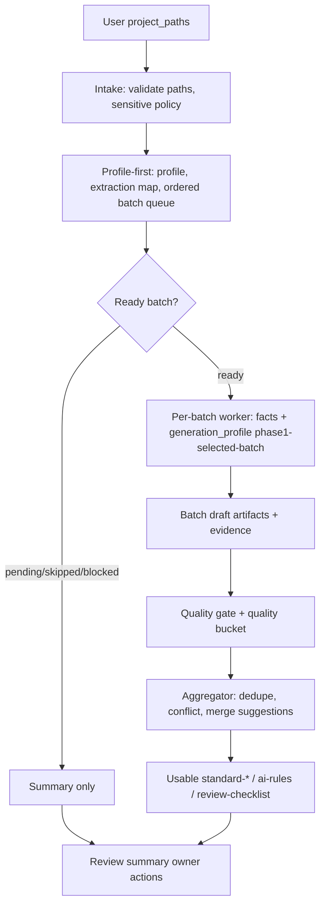

# feat: full-auto code standard extraction

## Summary

本计划把 `project-standard-extractor` 从“先 profile、再人工选择 batch”的稳定路径升级为默认一步生成可使用规范文档：用户提供现有代码路径后，pipeline 自动完成画像、ready batch 队列、逐 batch evidence 萃取、质量门禁、跨 batch 聚合和 review summary，最终产出可直接用于 AI 编码与 Code Review 的 `standard-*`、`ai-rules.md` 和 `review-checklist.md`。

---

## Problem Frame

用户明确期望“一步到位，直接生成可以使用的规范文档”。因此计划不能继续把中途人工选择 batch 作为默认体验。正确实现方式是保留 profile-first 作为内部安全阶段，用它建立 batch queue、敏感排除、预算和 evidence 边界，然后自动执行 ready batch 并聚合输出。可使用不等于自动发布 `active`：high-confidence evidence-backed draft 可以进入 AI rules 和 review checklist；pending、legacy、conflict、rejected 必须显式分流并由 owner 后续裁定（see origin: `docs/brainstorms/2026-06-01-001-project-standard-extractor-code-standard-extraction-requirements.md`）。

---

## Requirements

- R-01. 校验 `project_paths`，无有效路径时停止并给出 `NO_VALID_PROJECT_PATHS`。
- R-02. 完整仓库、多服务、多 manifest、多研发域或范围不明确时先执行内部 profile-first，生成画像、extraction map、batch plan 和 ordered batch queue。
- R-03. profile-first 完成后自动执行 `status: ready` 的 batch；pending、skipped、blocked batch 写入 review summary。
- R-04. 多 batch 执行时，每个 batch 独立读取 candidate files、独立记录 evidence 和 stop conditions，单 batch 失败不得污染其它 batch。
- R-05. facts 阶段只提取当前 batch 的描述性 facts / signals / classification candidates，不写规范结论。
- R-06. 分类必须区分 recommended、forbidden、legacy_compatible、pending_confirmation、conflict、rejected。
- R-07. 每个 ready batch 使用 `phase1-selected-batch` 输入剖面生成 evidence-backed draft standard 内容。
- R-08. ready batch 完成后聚合生成可使用 `standard-*`、`ai-rules.md`、`review-checklist.md`、evidence、pending、conflicts 和 candidate index。
- R-09. `ai-rules.md` 与 `review-checklist.md` 只能从 standard 派生并引用来源章节。
- R-10. 合并必须 append-only，不能覆盖已有 active 或 draft。
- R-11. 敏感配置、生产凭据、token、私钥、用户数据只允许记录脱敏存在事实。
- R-12. 无 evidence、证据不足或需人工判断的候选不得进入 AI 默认强制规则。
- R-13. 跨 batch 相近内容去重或写入 `merge-suggestions.md`；相反规则写入 `conflicts.md`。
- R-14. 质量门禁覆盖 evidence、团队级抽象、AI 可执行性、Review 可检查性、冲突、行业风险、上下文治理和跨 batch 聚合质量。
- R-15. GitNexus 只能作为 advisory pointer；陈旧、dirty、impact-unavailable 时必须降级并记录限制。
- R-16. 运行完成输出 review summary，汇总 batch 结果、draft/pending/conflict/rejected 分布、降级原因和 owner 待处理动作。
- R-17. focused-module 可一步生成，但不得绕过 evidence、敏感信息、draft-only 和 append-only 治理。

**Origin actors:** A1 Skill 使用者, A2 Full-auto pipeline, A3 规范 owner, A4 AI 编码使用者, A5 Reviewer, A6 目标代码仓库

**Origin acceptance examples:** AE-01 covers R-01/R-02/R-03/R-08, AE-02 covers R-04/R-05/R-07, AE-03 covers R-06/R-12, AE-04 covers R-10/R-13, AE-05 covers R-11, AE-06 covers R-09/R-14/R-16, AE-07 covers R-15, AE-08 covers R-17

---

## Assumptions

- A1. “可使用规范文档”指 high-confidence evidence-backed draft 可用于 AI 编码和 Review，同时保留 draft 状态和风险标识。
- A2. `active` 发布仍由规范 owner 手动确认；pipeline 不自动把所有规则升级 active。
- A3. V1 优先支持单仓库 full-auto；多仓库统一规范仍属于后续工作。

---

## Scope Boundaries

- 不自动发布 `active` 规范。
- 不把完整仓库直接作为无边界上下文交给 generation；profile-first 仍是内部前置阶段。
- 不建设规范管理 Web 平台。
- 不执行业务代码修改、bug 修复或 PR 代码评审。
- 不生成脱离代码 evidence 的行业通用最佳实践。
- 不把 Phase 2 dimension-aware、cross-project、EA-Doc、securities PoC、force-rebuild、restore、pin、unpin、list 作为普通用户 runtime。
- 不覆盖已有 active / draft 规则。

### Deferred to Follow-Up Work

- 多仓库统一规范和 partial_activated 差异裁定。
- Phase 2 dimension-aware 发布。
- 规范资产使用效果指标面板。

---

## Completion Criteria

- 用户只提供完整单仓库路径时，workflow 能自动跑完 profile、ready batch queue、generation、quality gate、merge aggregation 和 review summary。
- `standard-*`、`ai-rules.md`、`review-checklist.md` 能在一次运行后生成或追加，并且每条 AI/Review 规则都能追溯到 standard 和 evidence。
- pending、legacy、conflict、rejected 不进入 AI 默认强制规则。
- `tools/maintainer/project-standard-extractor/public-surface-validate.sh` 覆盖 full-auto 入口、ready batch queue、selected-batch worker、quality buckets、safety 和 maintainer boundary，且报告无 FAIL。
- 外部 eval 覆盖 AE-01 到 AE-08。
- 用户手册说明“一步生成”的默认体验、产物消费方式和 owner 后续裁定边界。
- `CHANGELOG.md` 记录实施 source 改动。

---

## Graph Readiness

- target_repo: ai-engineering-standards
- status: stale
- source_revision: ce4a6773a33a1e9e9e460b74c1a484e77b5d2d8f
- current_revision: 12333533f3a0d2a891eaccb4a987288fb6c69f86
- stale: true
- primary_providers: gitnexus
- degraded_providers: GitNexus definitions-only / no impact context / no review context
- fallback_capabilities: bounded direct repo reads, `rg`, deterministic shell validators, Markdown/YAML parsing
- runtime_mcp_evidence: live GitNexus query returned definitions-only pointers for `project-standard-extractor` files and prior plans; no process or impact evidence
- confidence: medium
- limitations: graph facts are dirty-advisory and stale relative to current HEAD and uncommitted PRD/changelog changes; planning scope is grounded in direct source reads, not graph-backed impact.

---

## Graph / GitNexus Evidence

- provider: GitNexus
- native_tool_or_resource: `query`
- repo_scope: ai-engineering-standards
- capability_status: partial
- evidence_grade: stale
- evidence_posture: fallback
- freshness_state: stale
- source_tags: [checked-in-baseline, live-mcp-tool, session-local-inference]
- source_contract_fields: `.spec-first/graph/graph-facts.json`, `capabilities.query_global_graph`, `capabilities.impact_context`, `provider_summary.ready_primary_providers`, `freshness_state`, `source_revision`
- source_reads_required: mandatory
- impact_on_plan: GitNexus confirmed relevant file pointers only; it did not expand scope or provide blast-radius evidence.
- capabilities_used: repo/file orientation.
- key_findings: relevant pointers include `skills/project-standard-extractor/SKILL.md`, `references/workflow.md`, `references/agents/profile-and-batch-planner.md`, `references/agents/generation.md`, `docs/brainstorms/2026-05-26-002-project-standard-extractor-full-auto-draft-pipeline-requirements.md`, `docs/plans/2026-05-26-002-feat-full-auto-draft-pipeline-plan.md`, and `tools/maintainer/project-standard-extractor/public-surface-validate.sh`.
- limitations: no process symbols, impact graph, route/API contracts, or related-test evidence were available from GitNexus.

---

## Context & Research

### Relevant Code and Patterns

- `skills/project-standard-extractor/SKILL.md` owns the public trigger surface, public inputs, outputs, safety boundaries and failure modes.
- `skills/project-standard-extractor/references/workflow.md` owns the stable/repair boundary and must be revised so full-auto becomes the ordinary stable path.
- `skills/project-standard-extractor/references/agents/intake-and-scope.md` owns path validation, broad input, sensitive file handling and maintainer context gate.
- `skills/project-standard-extractor/references/agents/profile-and-batch-planner.md` already defines `ordered_batch_queue`; this becomes the bridge from profile-first to full-auto execution.
- `skills/project-standard-extractor/references/agents/facts-and-classification.md` owns per-batch selected evidence extraction and must remain batch-boundary-safe.
- `skills/project-standard-extractor/references/agents/generation.md` owns `phase1-selected-batch`; full-auto should loop that profile per ready batch instead of inventing a new unbounded generation mode.
- `skills/project-standard-extractor/references/agents/review-and-quality-gate.md` owns multi-persona quality review and should add cross-batch aggregation checks.
- `skills/project-standard-extractor/references/agents/merge-coordinator.md` owns append-only merge, conflicts, pending and candidate artifacts.
- `docs/brainstorms/2026-05-26-002-project-standard-extractor-full-auto-draft-pipeline-requirements.md` and `docs/plans/2026-05-26-002-feat-full-auto-draft-pipeline-plan.md` already frame full-auto draft production; this plan narrows that direction to “directly usable documents” as default UX.
- `docs/evals/project-standard-extractor/` is the full eval source-of-truth; `skills/project-standard-extractor/evals/` is package-local smoke subset.
- `tools/maintainer/project-standard-extractor/public-surface-validate.sh` is the existing deterministic contract validator and should be extended rather than replaced.

### Institutional Learnings

- `docs/solutions/architecture-patterns/multi-layer-skill-contract-drift-2026-05-23.md` applies directly: a skill with `SKILL.md` / workflow / agents / prompts / assets / examples / evals must keep one authority chain, otherwise LLM execution chooses whichever stale contract is easiest to follow.

### External References

- No external research used. This is repository-local skill contract work; current source and evals are more authoritative than generic external guidance.

---

## Key Technical Decisions

- Make full-auto the default user experience: user-provided project paths should end in usable documents, not an intermediate batch-selection stop.
- Keep profile-first as an internal safety phase: it establishes boundaries and queueing, but does not stop the user journey.
- Reuse `phase1-selected-batch` as the per-batch worker profile: this avoids unbounded whole-repo generation and keeps evidence traceability.
- Add explicit Phase 1 full-auto review/merge profiles: quality gate and merge must work without `activation-report`; Phase 2 Gate B remains only for dimension-aware repair paths.
- Treat high-confidence draft as usable: it may enter standard / AI rules / review checklist with draft/risk labels; pending/conflict/rejected stay out of AI default execution.
- Keep `active` manual: direct usability is not automatic formal approval.
- Extend the existing validator and evals instead of creating a second verification system.

---

## Open Questions

### Resolved During Planning

- Should the default remain manual selected-batch? No. User clarified the expected default is one-step generation of usable documents.
- Should full-auto use whole-repo generation? No. It should use profile-first queue plus per-batch selected generation.
- Should generated docs be active immediately? No. They are usable draft with status/risk labels; owner still upgrades active.

### Deferred to Implementation

- Exact batch budget defaults: implementer should choose conservative defaults from current planner contracts and expose them only if existing configs already support it.
- Exact quality threshold naming: implementer should keep terms aligned across review gate, templates and evals while preserving high-confidence / pending / conflict / rejected semantics.
- Exact review-summary layout: implementation may extend current template or introduce owner-action subsections as long as existing consumers remain readable.

---

## High-Level Technical Design

> *This illustrates the intended approach and is directional guidance for review, not implementation specification. The implementing agent should treat it as context, not code to reproduce.*

---

## Implementation Units

### U1. Full-Auto Public Entry And Mode Routing

**Goal:** Make “provide project paths -> generate usable standards” the ordinary public path while preserving maintainer and Phase 2 exclusions.

**Requirements:** R-01, R-02, R-03, R-11, R-17, BR-003, BR-004, BR-007

**Dependencies:** None

**Files:**
- Modify: `skills/project-standard-extractor/SKILL.md`
- Modify: `skills/project-standard-extractor/references/workflow.md`
- Modify: `skills/project-standard-extractor/references/agents/intake-and-scope.md`
- Test: `docs/evals/project-standard-extractor/trigger-cases.md`
- Test: `docs/evals/project-standard-extractor/boundary-cases.md`
- Test: `docs/evals/project-standard-extractor/failure-cases.md`
- Test: `skills/project-standard-extractor/evals/trigger-cases.md`
- Test: `skills/project-standard-extractor/evals/boundary-cases.md`
- Test: `skills/project-standard-extractor/evals/failure-cases.md`

**Approach:**
- Update public description and workflow from “stop for batch selection” to “profile-first internally, then auto-run ready batch queue”.
- Preserve optional manual selected-batch as a diagnostic/focused path, not the default broad-input user journey.
- Keep public inputs free of destructive maintainer fields.
- Maintain `MAINTAINER_CONTEXT_REQUIRED` for `output_action != append`.

**Patterns to follow:**
- `docs/brainstorms/2026-05-26-002-project-standard-extractor-full-auto-draft-pipeline-requirements.md`
- `tools/maintainer/project-standard-extractor/public-surface-validate.sh`

**Test scenarios:**
- Covers AE-01. Happy path: full repo path runs profile plus ready batch queue and produces usable documents without asking user to select batch.
- Covers AE-08. Happy path: focused module path can directly produce usable docs while preserving evidence and draft-only rules.
- Covers AE-05. Error path: sensitive path signal records sanitized existence or stops affected batch with `SENSITIVE_FILE_BLOCKED`.
- Error path: empty `project_paths` yields `NO_VALID_PROJECT_PATHS`.
- Error path: public input tries `force-rebuild` / `restore` / `full`; maintainer gate prevents ordinary execution.

**Verification:**
- Public-surface validator reports no FAIL for full-auto public entry, stable workflow and maintainer gate.
- External and package-local evals describe full-auto as default for broad input.

---

### U2. Ordered Batch Queue And Execution Budget

**Goal:** Turn profile-first output into an executable queue of ready batches with explicit limits, skip reasons and failure isolation.

**Requirements:** R-02, R-03, R-04, R-11, R-15, R-16

**Dependencies:** U1

**Files:**
- Modify: `skills/project-standard-extractor/references/agents/profile-and-batch-planner.md`
- Modify: `skills/project-standard-extractor/assets/project-profile-template.md`
- Modify: `skills/project-standard-extractor/assets/extraction-map-template.md`
- Modify: `skills/project-standard-extractor/assets/batch-plan-template.md`
- Modify: `skills/project-standard-extractor/assets/review-summary-template.md`
- Test: `docs/evals/project-standard-extractor/expected-behavior.md`
- Test: `skills/project-standard-extractor/evals/expected-behavior.md`

**Approach:**
- Make `ordered_batch_queue` a stable handoff field for full-auto.
- Require each queue item to include `batch_id`, priority, sub_domain, status, candidate files, limits and skip reason.
- Keep pending/skipped/blocked out of execution and visible in review summary.
- Define conservative execution limits for batch count, file count and stop conditions using existing planner contracts.

**Patterns to follow:**
- `skills/project-standard-extractor/references/agents/profile-and-batch-planner.md`
- `docs/plans/2026-05-26-002-feat-full-auto-draft-pipeline-plan.md`

**Test scenarios:**
- Covers AE-01. Happy path: profile-first creates ordered queue and begins ready batch execution.
- Covers AE-02. Edge case: one ready batch fails or has insufficient evidence while other ready batches continue.
- Error path: all batches pending/skipped produces review summary with no AI executable rules.
- Covers AE-07. Error path: stale GitNexus is recorded as limitation and does not block direct source fallback.
- Integration: queue entries provide enough context for U3 per-batch worker without global repo reads.

**Verification:**
- Batch-plan template and planner handoff schema match.
- Expected-behavior eval describes full-auto queue semantics and batch isolation.

---

### U3. Per-Batch Worker Reusing Phase1 Selected-Batch

**Goal:** Execute each ready batch through the existing evidence-first selected-batch contract without introducing unbounded whole-repo generation.

**Requirements:** R-04, R-05, R-06, R-07, R-12

**Dependencies:** U2

**Files:**
- Modify: `skills/project-standard-extractor/references/agents/facts-and-classification.md`
- Modify: `skills/project-standard-extractor/references/agents/generation.md`
- Modify: `skills/project-standard-extractor/assets/evidence-template.md`
- Modify: `skills/project-standard-extractor/assets/standard-template.md`
- Modify: `skills/project-standard-extractor/assets/pending-confirmation-template.md`
- Test: `docs/evals/project-standard-extractor/trigger-cases.md`
- Test: `docs/evals/project-standard-extractor/failure-cases.md`
- Test: `docs/evals/project-standard-extractor/expected-behavior.md`

**Approach:**
- Treat each ready queue item as a selected-batch worker invocation.
- Preserve batch boundary checks: facts cannot cross candidate_files unless explicitly allowed as nearby context by existing contract.
- Keep facts descriptive and classification separate from final rule decisions.
- Emit per-batch artifacts or normalized intermediate records that aggregation can merge deterministically.

**Patterns to follow:**
- `skills/project-standard-extractor/references/agents/facts-and-classification.md`
- `skills/project-standard-extractor/references/agents/generation.md`

**Test scenarios:**
- Covers AE-02. Happy path: multiple ready batches execute independently through `phase1-selected-batch`.
- Covers AE-03. Edge case: one historical single-sample pattern becomes legacy/pending, not recommended.
- Error path: candidate files empty yields `NO_REPRESENTATIVE_EVIDENCE` for that batch only.
- Integration: per-batch outputs include source batch, evidence IDs and candidate rule locators for U4 aggregation.

**Verification:**
- No full-auto path requires `activation-report`.
- Per-batch worker never reads Phase 2 dimension state.

---

### U4. Cross-Batch Aggregation Into Usable Docs

**Goal:** Merge ready batch outputs into coherent usable standards, AI rules and review checklist without duplication or silent conflict resolution.

**Requirements:** R-08, R-09, R-10, R-13

**Dependencies:** U3, U5

**Files:**
- Modify: `skills/project-standard-extractor/references/agents/merge-coordinator.md`
- Modify: `skills/project-standard-extractor/references/config/output-targets.md`
- Modify: `skills/project-standard-extractor/assets/ai-rules-template.md`
- Modify: `skills/project-standard-extractor/assets/review-checklist-template.md`
- Modify: `skills/project-standard-extractor/assets/merge-suggestions-template.md`
- Modify: `skills/project-standard-extractor/assets/conflicts-template.md`
- Modify: `skills/project-standard-extractor/assets/rules-index-template.json`
- Modify: `skills/project-standard-extractor/assets/llms-template.txt`
- Modify: `skills/project-standard-extractor/assets/ai-context-pack-template.md`
- Test: `docs/evals/project-standard-extractor/expected-behavior.md`

**Approach:**
- Aggregate by `domain`, `sub_domain`, `source_doc`, `section_title` and normalized title fingerprint.
- Consume U5 quality bucket decisions from the Phase 1 full-auto profile; do not require `activation_report`, `dimension_state` or Phase 2 Gate B fields for Phase 1 merges.
- Keep `standard-{sub_domain}.md` as the source for AI rules and review checklist.
- Write similar rules to merge suggestions and conflicting rules to conflicts.
- Keep candidate index and llms output as candidates unless owner explicitly publishes.

**Patterns to follow:**
- `skills/project-standard-extractor/references/agents/merge-coordinator.md`
- `skills/project-standard-extractor/references/config/output-targets.md`

**Test scenarios:**
- Covers AE-06. Happy path: high-confidence draft rules appear in standard, AI rules and review checklist with source references.
- Covers AE-04. Error path: conflict with existing active writes `conflicts.md` and leaves active untouched.
- Edge case: two batches produce similar rule wording; aggregator writes merge suggestion instead of duplicates.
- Error path: Phase 1 full-auto merge does not fail with `ACTIVATION_REPORT_SCHEMA_INVALID` when no `activation-report` exists.
- Integration: candidate `rules-index` contains no `rule_id` or `anchor` and references generated source docs.

**Verification:**
- Generated outputs satisfy expected-behavior output structure and fast-index candidate rules.
- AI/review derivatives have no independent rules.

---

### U5. Quality Buckets And Owner Handoff

**Goal:** Define exactly when generated content is usable, pending, legacy, conflicting or rejected, and make that visible in review summary.

**Requirements:** R-06, R-12, R-14, R-16, BR-001, BR-002, BR-006

**Dependencies:** U3

**Files:**
- Modify: `skills/project-standard-extractor/references/agents/review-and-quality-gate.md`
- Modify: `skills/project-standard-extractor/assets/review-summary-template.md`
- Modify: `skills/project-standard-extractor/assets/standard-review-report-template.md`
- Modify: `skills/project-standard-extractor/references/config/frontmatter-format.md`
- Test: `docs/evals/project-standard-extractor/expected-behavior.md`
- Test: `docs/evals/project-standard-extractor/failure-cases.md`

**Approach:**
- Define high-confidence draft criteria using evidence presence, representative coverage, AI executability, Review checkability and conflict status.
- Add an explicit `phase1-full-auto` review profile: Gate A evidence/content review, legacy and conflict classification, coverage labeling and owner actions; no `activation-report` required.
- Keep Phase 2 Gate B behavior behind the existing dimension-aware profile when `activation-report` exists; do not fake an activation report for Phase 1.
- Output normalized quality decisions that U4 can merge without relying on Phase 2 `dimension_state`.
- Keep pending/conflict/rejected out of AI default execution.
- Extend review summary with batch results, quality bucket counts and owner actions.
- Keep `active` upgrade manual and out of pipeline automation.

**Patterns to follow:**
- `skills/project-standard-extractor/references/agents/review-and-quality-gate.md`
- `docs/brainstorms/2026-05-26-002-project-standard-extractor-full-auto-draft-pipeline-requirements.md`

**Test scenarios:**
- Covers AE-03. Error path: low-evidence or legacy pattern cannot enter high-confidence draft.
- Covers AE-06. Happy path: review summary lists evidence, AI executability, review checkability and recommended action.
- Edge case: high-confidence draft remains draft but appears in usable docs with status/risk labeling.
- Error path: Phase 1 full-auto quality gate missing `activation-report` does not raise `ACTIVATION_REPORT_SCHEMA_INVALID`.
- Error path: pending/conflict/rejected content is absent from AI default rules.

**Verification:**
- Quality gate and frontmatter recommended actions use a single enum vocabulary.
- Review contract can run in `phase1-full-auto` without `activation-report`; Phase 2 Gate B remains unchanged for dimension-aware repair paths.
- Review summary can drive owner decisions without reading every generated file first.

---

### U6. Safety And Provenance Enforcement

**Goal:** Ensure full-auto does not leak secrets, over-trust GitNexus, or put project-specific absolute paths into rule bodies.

**Requirements:** R-11, R-12, R-15, BR-004, BR-008

**Dependencies:** U1, U2, U3

**Files:**
- Modify: `skills/project-standard-extractor/references/agents/intake-and-scope.md`
- Modify: `skills/project-standard-extractor/references/agents/facts-and-classification.md`
- Modify: `skills/project-standard-extractor/references/config/context-governance.md`
- Modify: `skills/project-standard-extractor/references/config/output-targets.md`
- Test: `docs/evals/project-standard-extractor/boundary-cases.md`
- Test: `docs/evals/project-standard-extractor/failure-cases.md`
- Test: `docs/evals/project-standard-extractor/expected-behavior.md`

**Approach:**
- Keep sensitive file patterns centralized and referenced by intake/facts/generation.
- Require true `source` provenance for evidence; fallback evidence must not be labeled `gitnexus`.
- Require source or owner confirmation before GitNexus-inferred facts become rules.
- Keep absolute local paths out of rules, AI rules and checklist.

**Patterns to follow:**
- `skills/project-standard-extractor/references/config/context-governance.md`
- `docs/evals/project-standard-extractor/expected-behavior.md`

**Test scenarios:**
- Covers AE-05. Error path: secret/token/private-key paths are sanitized or blocked per batch.
- Covers AE-07. Error path: stale graph evidence appears as limitation and cannot be sole evidence.
- Edge case: evidence doc may contain scoped non-sensitive path references, but standard body may not.
- Integration: safety policy is consistent across intake, facts, generation and expected-behavior eval.

**Verification:**
- Public-surface validator and evals catch sensitive-policy and GitNexus-provenance regressions.

---

### U7. Full-Auto Evals And Validator

**Goal:** Make one-step generation testable through durable evals and deterministic contract checks.

**Requirements:** R-01 through R-17

**Dependencies:** U1, U2, U3, U4, U5, U6

**Files:**
- Modify: `docs/evals/project-standard-extractor/README.md`
- Modify: `docs/evals/project-standard-extractor/trigger-cases.md`
- Modify: `docs/evals/project-standard-extractor/boundary-cases.md`
- Modify: `docs/evals/project-standard-extractor/failure-cases.md`
- Modify: `docs/evals/project-standard-extractor/expected-behavior.md`
- Modify: `skills/project-standard-extractor/evals/trigger-cases.md`
- Modify: `skills/project-standard-extractor/evals/boundary-cases.md`
- Modify: `skills/project-standard-extractor/evals/failure-cases.md`
- Modify: `skills/project-standard-extractor/evals/expected-behavior.md`
- Modify: `tools/maintainer/project-standard-extractor/public-surface-validate.sh`

**Approach:**
- Map AE-01 through AE-08 to external eval assertions.
- Update skill-local smoke subset so it reflects full-auto defaults without duplicating all cases.
- Extend validator checks for full-auto public wording, ordered queue, phase1 per-batch worker, candidate outputs, AI/review derivation, safety and maintainer exclusion.

**Patterns to follow:**
- Current `public-surface-validate.sh` pass/fail/degrade structure.
- `docs/evals/project-standard-extractor/README.md` authority language.

**Test scenarios:**
- Happy path: external eval source-of-truth contains full-auto trigger and expected behavior cases.
- Error path: validator fails if broad input still stops at manual batch selection as default.
- Error path: validator fails if full-auto path requires `activation-report`.
- Error path: validator fails if public inputs expose destructive fields.
- Integration: validator runs from repo root or maintainer script directory.

**Verification:**
- Validator exits successfully with no FAIL.
- Every PRD acceptance example has at least one eval assertion or validator check.

---

### U8. User Documentation And Changelog

**Goal:** Teach users the new one-step default and preserve maintainer/deferred boundaries.

**Requirements:** R-08, R-16, R-17

**Dependencies:** U1, U2, U3, U4, U5, U6, U7

**Files:**
- Modify: `docs/03-用户手册/README.md`
- Modify: `docs/03-用户手册/AI辅助研发工程规范用户手册.md`
- Modify: `docs/03-用户手册/project-standard-extractor-execution-analysis.md`
- Modify: `docs/03-用户手册/project-standard-extractor-design-and-internals.md`
- Modify: `docs/03-用户手册/project-standard-extractor-sharing-script.md`
- Modify: `CHANGELOG.md`
- Test: `docs/evals/project-standard-extractor/expected-behavior.md`

**Approach:**
- Update docs from “先 profile，再人工选 batch” to “一次运行自动生成可使用规范文档”。
- Explain quality buckets: high-confidence draft, pending, legacy, conflict, rejected.
- Explain owner next steps: active upgrade, conflict裁定, pending补 evidence.
- Update the sharing script so team-facing material answers “能不能直接给一个仓库生成全部规范？” as: yes for usable draft documents, no for automatic `active`.
- Keep Phase 2/full-auto history and maintainer tools from being confused with ordinary runtime.

**Patterns to follow:**
- `docs/03-用户手册/project-standard-extractor-execution-analysis.md`
- `docs/03-用户手册/project-standard-extractor-design-and-internals.md`

**Test scenarios:**
- Happy path: first-time user can understand that full repo input ends in usable docs.
- Happy path: presentation/sharing material no longer teaches manual batch selection as the default answer.
- Edge case: user looking for force-rebuild sees maintainer boundary.
- Integration: docs artifact list matches output-targets and expected-behavior eval.
- Test expectation: no unit test for prose-only docs; verification is link/path consistency, absence of absolute local paths and alignment with eval/output names.

**Verification:**
- Docs mention one-step full-auto, ready batch queue, quality buckets, usable draft and active owner approval consistently.
- `CHANGELOG.md` has a user-visible entry for implementation changes.

---

## System-Wide Impact

- **Interaction graph:** Public workflow surfaces in `SKILL.md`, `workflow.md`, agent contracts, assets/templates, evals, validator and user docs. Full-auto changes the default path across all those layers.
- **Error propagation:** Per-batch failures must become batch-level summary entries, not global run failure unless all batches are unusable or safety is blocked.
- **State lifecycle risks:** High-confidence draft becomes usable but not active; pending/conflict/rejected stay excluded from AI default execution.
- **API surface parity:** Skill-local smoke evals must remain a package subset of external evals, not a second product contract.
- **Integration coverage:** Validator plus external evals should cover full-auto defaults; prose-only checks are insufficient.
- **Unchanged invariants:** Maintainer destructive tools remain excluded; existing active and draft standards remain append-only protected.

---

## Risks & Dependencies

| Risk | Mitigation |
| --- | --- |
| Full-auto reads too much context or leaks sensitive data | Keep profile-first budget, per-batch candidate files and sensitive path policy mandatory. |
| Multi-batch output creates duplicate or conflicting rules | U4 aggregator dedupes, writes merge suggestions and conflicts, never silently chooses active override. |
| Users mistake draft as formal active | U5/U8 require status/risk labels and owner handoff. |
| Contract drift across layers | U7 extends evals and deterministic validator. |
| Existing Phase 2 `activation-report` contracts leak into Phase 1 full-auto | U5 introduces a Phase 1 review profile and U4 consumes its normalized decisions without requiring Gate B fields. |
| GitNexus stale facts over-influence rules | U6 requires source/owner confirmation for material rules. |

---

## Documentation / Operational Notes

- `$spec-work` should implement this as a source-contract change, not by manually generating standards for one sample project.
- Before closeout, run `tools/maintainer/project-standard-extractor/public-surface-validate.sh` and Markdown/YAML sanity checks.
- All source/doc changes must update `CHANGELOG.md`.

---

## Sources & References

- **Origin document:** [docs/brainstorms/2026-06-01-001-project-standard-extractor-code-standard-extraction-requirements.md](docs/brainstorms/2026-06-01-001-project-standard-extractor-code-standard-extraction-requirements.md)
- Related requirement: `docs/brainstorms/2026-05-26-002-project-standard-extractor-full-auto-draft-pipeline-requirements.md`
- Related plan: `docs/plans/2026-05-26-002-feat-full-auto-draft-pipeline-plan.md`
- Related source: `skills/project-standard-extractor/SKILL.md`
- Related source: `skills/project-standard-extractor/references/workflow.md`
- Related source: `skills/project-standard-extractor/references/agents/intake-and-scope.md`
- Related source: `skills/project-standard-extractor/references/agents/profile-and-batch-planner.md`
- Related source: `skills/project-standard-extractor/references/agents/facts-and-classification.md`
- Related source: `skills/project-standard-extractor/references/agents/generation.md`
- Related source: `skills/project-standard-extractor/references/agents/review-and-quality-gate.md`
- Related source: `skills/project-standard-extractor/references/agents/merge-coordinator.md`
- Related source: `tools/maintainer/project-standard-extractor/public-surface-validate.sh`
- Related evals: `docs/evals/project-standard-extractor/`
- Institutional learning: `docs/solutions/architecture-patterns/multi-layer-skill-contract-drift-2026-05-23.md`
