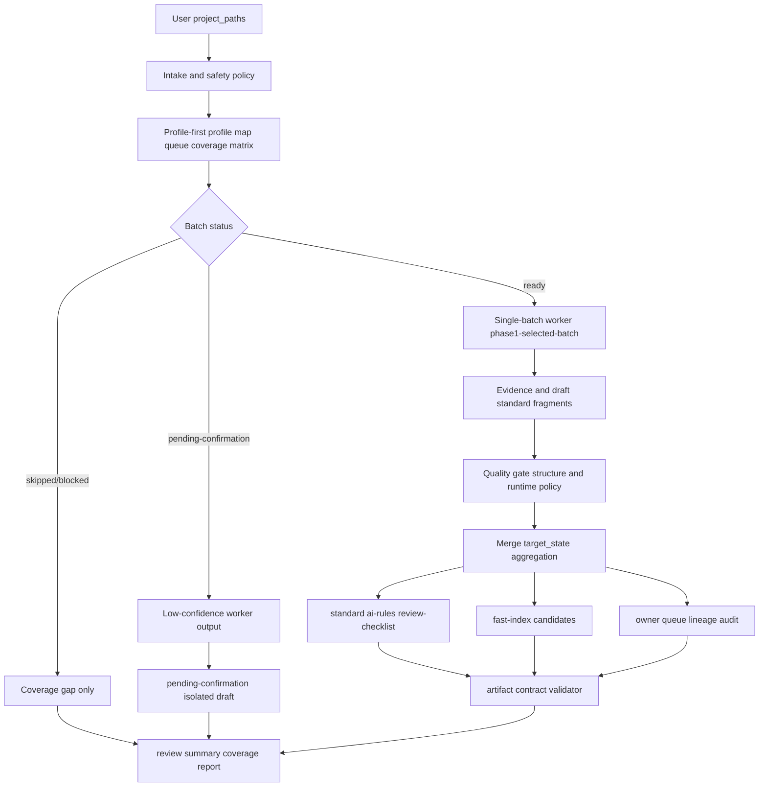
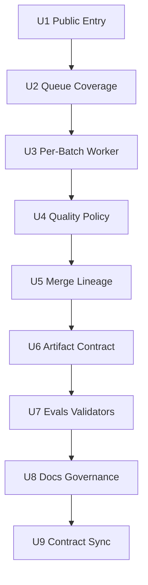

# feat: unified full-auto standard extraction

## Summary

本计划把 `project-standard-extractor` 升级为默认一步生成可使用规范文档的稳定路径，同时把产物契约、fast index、结构完整性 gate、owner decision queue、lineage 审计和 drift validator 纳入同一个实施闭环。用户只提供现有代码路径时，pipeline 应内部完成 profile-first、两档 batch queue、逐 batch worker、质量门禁、跨 batch 聚合、产物契约校验和 review summary，而不是停在人工 batch 选择或只生成不可判定的规则堆。

---

## Problem Frame

统一 PRD 002 明确：001 的“一步生成可使用规范文档”不能单独落地，必须和“产物怎样证明可被稳定消费”的契约治理一起实现。只做 full-auto 会放大低质量 draft、重复规则、候选索引误发布和 owner 决策不清的问题；只做产物契约又无法满足用户“直接从现有代码分析总结开发编码规范”的核心目标（see origin: `docs/brainstorms/2026-06-01-002-project-standard-extractor-output-artifact-contract-requirements.md`）。

本计划采用的核心形态是：`profile-first` 仍作为内部安全阶段，输出 `ordered_batch_queue` 和覆盖矩阵；orchestrator 按 queue 串行执行单 batch worker；ready batch 产出 high-confidence draft 并可进入 AI/Review 工作输入；pending-confirmation batch 可被自动执行但只能产出 low-confidence draft 并隔离到 pending；skipped/blocked 不伪造规范，只进入 coverage report。最终产物必须通过机器可判定契约、index 一致性、lineage 派生校验和 drift linter，才能称为“可使用”。

---

## Requirements

- R-01..R-15. 产物契约、Front Matter、fast index、结构完整性 gate、runtime policy、consumer control surface、owner queue、lineage、drift linter 和 fixtures。
- R-16..R-32. full-auto 入口、内部 profile-first、两档 queue、逐 batch worker、facts/classification/generation、append-only merge、safety、GitNexus provenance、section title 归一化和 focused-module。
- R-33. 覆盖完整性报告，列出 `domain × sub_domain × task_type` 覆盖矩阵、batch 状态、低置信归因、遗漏点和缺口。
- R-34.（plan-local，doc-review 2026-06-02 增补）增量 full-auto：对已生成过规范的仓库重复运行时，应复用已落盘产物作为基线，以 `(source_doc, section_title)` 对齐，只标注「新增 / evidence 变更 / 跨运行置信升级 / 已 superseded」，不重复堆积近义规则。
- R-35.（plan-local）存量刷新检测：当已有 `active` / `draft` 规范与当次新 evidence 不一致时，应**检测并提示 owner**（写入 `conflicts.md` / `merge-suggestions.md` / owner decision queue），**不得自动改写 active**——刷新决策仍归 owner。

**Origin actors:** A1 Skill 使用者, A2 Full-auto orchestrator, A3 Batch worker, A4 规范 owner, A5 AI 编码使用者, A6 Reviewer, A7 规范维护者, A8 目标代码仓库

**Origin acceptance examples:** AE-01..AE-08 cover full-auto generation; AE-09..AE-16 cover artifact contract, fast index, lineage, owner handoff and drift validation.

---

## Assumptions

- A1. “可使用”指 high-confidence evidence-backed draft 可用于 AI 编码和 Review，同时保留 draft 状态、风险标识和 owner 后续确认边界。
- A2.（**定位转向 2026-06-02:萃取即权威,取代原 A2**）通过高置信自动升级闸（PRD BR-016/R-36）的规则**自动标记为可直接使用**(`auto-active`),无需逐条 owner 手动确认;未过闸者降级 draft/pending。owner 保留事后否决/降级权(on-the-loop)。**注意区分两种「active」**:(a) 新萃取规则的自动升级(本转向开放,过闸即可);(b) 对**已存在 active 规范**的改写刷新(仍受 R-35 约束,只检测+提示 owner,不自动改写)——两者不冲突。
- A3. V1 优先支持单仓库 full-auto；多仓库统一规范和 cross-project activation 作为后续工作。
- A4. 机器可判定产物契约可以先以 repo 内 JSON/Markdown 契约和 shell validator 落地，不要求引入新的运行时依赖。

---

## Scope Boundaries

- 不自动发布 `active` 规范。
- 不把完整仓库直接作为无边界上下文交给 generation；profile-first 仍是内部前置阶段。
- 不建设规范管理 Web 平台。
- 不执行业务代码修改、bug 修复或 PR 代码评审。
- 不生成脱离代码 evidence 的行业通用最佳实践。
- 不引入 Rule ID、HTML anchor、向量库或重型知识库。
- 不强制重排所有历史 `engineering-standards/` 目录。
- 不把 Diátaxis 四象限改造成新的物理目录结构。
- 不把 low-evidence 占位规范包装成可执行团队规则。
- 不自动删除或改写用户已有规范内容。
- 不把 Phase 2 dimension-aware、cross-project、EA-Doc、securities PoC、force-rebuild、restore、pin、unpin、list 作为普通用户 runtime。
- 不覆盖已有 active / draft 规则。

### Deferred to Follow-Up Work

- 多仓库统一规范和 `partial_activated` 差异裁定（注:单仓库增量 R-34 已纳入本期 U10;跨仓库增量仍 deferred）。
- **自动改写 active 规范**:本期存量刷新(R-35)只做「检测不一致 + 提示 owner」,owner 确认后更新 active 的受控通道留作 follow-up。
- Phase 2 dimension-aware 正式发布。
- 规范资产使用效果指标面板。
- 将 machine-readable artifact contract 自动派生为用户文档的生成器。

---

## Completion Criteria

- 用户只提供完整单仓库路径时，workflow 能自动跑完 profile、两档 batch queue、per-batch worker、quality gate、merge aggregation、artifact validator、coverage report 和 review summary。
- `standard-*`、`ai-rules.md`、`review-checklist.md` 能在一次运行后生成或追加，并且每条 AI/Review 规则都能追溯到 standard 和 evidence。
- ready batch 中**通过高置信自动升级闸(R-36/BR-016)的规则自动标记为「可直接使用」(`auto-active`),无需逐条 owner 确认**,直接进 AI/Review 默认执行路径;未过闸的 ready 规则与 pending-confirmation batch 产出降级为 draft/low-confidence draft 隔离到 `pending-confirmation.md`;skipped/blocked 只进入 coverage report。owner queue 列出全部 auto-active 规则供事后否决。
- pending、low-confidence draft、legacy、conflict、rejected、none-evidence 和结构不完整内容不进入 AI 默认强制规则。
- coverage report 列出 profile 识别矩阵项、batch 状态分布、疑似遗漏点和缺口。
- 增量(R-34):同仓库重复运行复用 existing_index 对齐,只标注 added/evidence-changed/superseded,不堆积近义规则;coverage 跨运行去重。
- 存量刷新(R-35):已有 active/draft 与新 evidence 不一致时检测并提示 owner(conflicts/merge-suggestions/owner queue),active 不被自动改写。
- artifact validator 能检查 Front Matter、`doc_type`、`indexable`、candidate/formal 边界、`rules-index` 与 H2 一致性、orphan derived rules、lineage 和 drift patterns。
- `tools/maintainer/project-standard-extractor/public-surface-validate.sh` 覆盖 public wording、maintainer boundary 和 token-level 契约；语义质量由外部 eval AE-01..AE-16 覆盖。
- 用户手册说明“一步生成全部规范”的默认体验、两档覆盖语义、产物消费方式、owner 后续裁定和 active 边界。
- `CHANGELOG.md` 记录实施 source 改动。

---

## Graph Readiness

- target_repo: ai-engineering-standards
- status: stale
- source_revision: ce4a6773a33a1e9e9e460b74c1a484e77b5d2d8f
- current_revision: c7e9277f34d9d2f7c71ed5f23c37056413c847c5
- stale: true
- primary_providers: gitnexus
- degraded_providers: GitNexus definitions-only / no impact context / no review context
- fallback_capabilities: bounded direct repo reads, `rg`, deterministic shell validators, Markdown/YAML/JSON parsing
- runtime_mcp_evidence: live GitNexus query returned definitions-only pointers for `project-standard-extractor` files, evals and validators; no process or impact evidence
- confidence: medium
- limitations: graph facts are dirty-advisory and stale relative to current HEAD and uncommitted PRD/plan/changelog changes; planning scope is grounded in direct source reads, not graph-backed impact.

---

## Graph / GitNexus Evidence

- provider: GitNexus
- native_tool_or_resource: `query`
- repo_scope: ai-engineering-standards
- capability_status: partial
- evidence_grade: stale
- evidence_posture: fallback
- freshness_state: dirty-advisory
- source_tags: [checked-in-baseline, live-mcp-tool, session-local-inference]
- source_contract_fields: `.spec-first/graph/graph-facts.json`, `capabilities.query_global_graph`, `capabilities.impact_context`, `provider_summary.ready_primary_providers`, `freshness_state`, `source_revision`
- source_reads_required: mandatory
- impact_on_plan: GitNexus confirmed relevant file pointers only; it did not expand scope or provide blast-radius evidence.
- capabilities_used: repo/file orientation.
- key_findings: relevant pointers include `skills/project-standard-extractor/SKILL.md`, `skills/project-standard-extractor/references/workflow.md`, `skills/project-standard-extractor/references/agents/*`, `docs/evals/project-standard-extractor/*`, `tools/maintainer/project-standard-extractor/public-surface-validate.sh`, and prior plans.
- limitations: no process symbols, impact graph, route/API contracts, or related-test evidence were available from GitNexus.

---

## Context & Research

### Relevant Code and Patterns

- `skills/project-standard-extractor/SKILL.md` owns public trigger surface, inputs, outputs, safety boundaries and failure modes.
- `skills/project-standard-extractor/references/workflow.md` owns stable/repair boundaries and must describe full-auto as the ordinary stable path.
- `skills/project-standard-extractor/references/agents/intake-and-scope.md` owns path validation, broad input, sensitive file handling and maintainer context gate.
- `skills/project-standard-extractor/references/agents/profile-and-batch-planner.md` already defines `ordered_batch_queue`; this becomes the bridge from profile-first to full-auto execution and coverage reporting.
- `skills/project-standard-extractor/references/agents/facts-and-classification.md` owns per-batch selected evidence extraction and classification vocabulary.
- `skills/project-standard-extractor/references/agents/generation.md` owns `phase1-selected-batch`; full-auto should reuse it per batch instead of inventing whole-repo generation.
- `skills/project-standard-extractor/references/agents/review-and-quality-gate.md` owns multi-persona quality review and should add phase1 full-auto quality buckets, structure gate and `usable_now`.
- `skills/project-standard-extractor/references/agents/merge-coordinator.md` owns append-only merge, conflicts, pending, target-state routing and candidate artifacts.
- `skills/project-standard-extractor/references/config/output-targets.md` and `frontmatter-format.md` are current prose contracts for output files, doc types, Front Matter, candidate index and no Rule ID / anchor.
- `docs/evals/project-standard-extractor/` is the full eval source-of-truth; `skills/project-standard-extractor/evals/` is package-local smoke subset.
- `tools/maintainer/project-standard-extractor/public-surface-validate.sh` is the existing deterministic token-level validator and should be extended, not replaced.

### Institutional Learnings

- `docs/solutions/architecture-patterns/multi-layer-skill-contract-drift-2026-05-23.md` applies directly: a skill with SKILL/workflow/agents/prompts/assets/examples/evals must keep one authority chain, otherwise LLM execution chooses whichever stale contract is easiest to follow.

### External References

- No external research used. This is repository-local skill contract work; current source and evals are more authoritative than generic external guidance.

---

## Key Technical Decisions

| Decision | Chosen answer | Rationale |
| --- | --- | --- |
| Default user path | Full-auto one-step generation | Matches user-stated product goal and unified PRD 002. |
| Full-auto execution model | Outer orchestrator loops over single-batch worker | Preserves context-governance single-batch invariant while removing manual selection from default UX. |
| Batch coverage model | ready + pending-confirmation execute; skipped/blocked report only | Balances “run everything possible” with evidence governance. |
| Rule usability（定位转向 2026-06-02:萃取即权威） | 通过高置信自动升级闸（PRD BR-016/R-36）的规则**自动标记为可直接使用**,无需逐条 owner 确认;未过闸者降级 draft/pending;owner 保留事后否决权 | 满足「萃取即可用」终极目标,高置信闸防止单样本/坏味道升权威 |
| Structure gate | Skeleton-required sections when available; generic minimum fallback otherwise | Prevents rule piles while reusing existing skeleton assets. |
| Merge routing | Phase1 quality buckets map to existing `target_state` route | Avoids inventing fake activation reports or coupling Phase1 to `dimension_state`. |
| Fast index | Treat candidate/formal index boundary as product API | Prevents AI default loading of candidate artifacts. |
| Validator approach | Extend public validator and add artifact-contract validator | Keeps existing maintenance surface while separating token-level and semantic checks. |

---

## Open Questions

### Resolved During Planning

- Should 002 replace 001 as planning origin? Yes. User explicitly requested 001 be fused into 002 and written into this plan.
- Should full-auto skip profile-first? No. Profile-first remains the internal safety and batching phase.
- Should full-auto process multiple batches in one worker call? No. Use outer orchestrator loop with one selected batch per worker call.
- Should pending-confirmation batch be ignored? No. Execute it as low-confidence draft and isolate output from AI default execution.
- Should Phase1 fabricate an activation report? **No(已确认),且 review/merge 必须跟随 generation 分叉。** 三 agent 用同一个「`activation_report` 是否存在」信号分流:phase1 缺失 report → review 只跑 Gate A、merge 直接走 target_state 二级路由。不合成 report、不加 `routing_mode` 新字段。完整改动清单见 Must Resolve P0-A(已选定方案 A)。
- Should validator alone prove semantic correctness? No. Validator covers deterministic/token-level contract; external evals and review cover semantics.

### Must Resolve Before Work（doc-review 2026-06-02 发现）

> 本区块由 4-persona doc-review 跨 persona 一致命中的阻塞/高风险缺口。根因:`project-standard-extractor` 的生成链路中 **generation 层已分叉支持 phase1（`generation.md:39/134` 不读 activation-report），但 review 层和 merge 层尚未分叉**——它们仍硬性消费 activation-report。实现者在以下决策落定前无法跑通 AE-01/AE-06。

- **[P0-A][U3/U4/U5] phase1 full-auto 链路在 review+merge 层撞 activation-report 硬门禁。已选定方案 A(独立 phase1 链路,复用既有 report-存在性信号)。** 根因:`generation.md:42-44` 已用「`activation_report` 存在→phase2;不存在但有 `batch_id`→phase1」做分流,但 `review-and-quality-gate.md:5/38/46`(Gate B 基于 activation-report 且优先于 Gate A)和 `merge-coordinator.md:170-172`(Step 1.5 无条件加载 report)/`:183`(一级路由按 dimension_state)尚未跟随分叉。

  **决策:方案 A — 三 agent 复用同一个分流信号(`activation_report` 是否存在),不引入 `routing_mode` 新字段、不合成 report、不引入假数据。** review 的 Gate A 与 merge 的 target_state 二级路由是 phase1 已经需要、且本就不依赖 dimension_state 的既有能力,只是当前被锁住——方案 A 是解锁,不是新建并行系统。精确改动清单:

  - `review-and-quality-gate.md`:入口按 `activation_report` 存在性分流。**缺失 + 有 `selected_batch_summary.batch_id` → phase1**:只跑 Gate A(P1-P8 content gate),`final_gate_decision` 直接取 Gate A 决议,**不跑 Gate B、不做 activation-report 收口校验**。失败模式 `:334`「缺失→停止评审」改为「缺失 + 有 batch_id → phase1 单门禁;缺失 + 无 batch_id → 报错」。(Gate A 本就只审 evidence/AI可执行/Review可检查,与 activation-report 无关,phase1 复用天然成立。)
  - `merge-coordinator.md`:phase1 模式下 **Step 1.5 跳过** activation-report 加载与 schema 门禁;**Step 183 一级 `dimension_state` 路由跳过**,所有规则直接走 `:193-202` 的 **target_state 二级路由**(该表已覆盖 phase1 全部 6 个去向:draft→standard+ai-rules、pending-confirmation→pending、conflict→conflicts、legacy-compatible→evidence、rejected→不写)。Step 6 self-check `:427`「pending-confirmation.md 须含所有 dimension_state: pending-confirmation 维度」在 phase1 改为**只校验 target_state 维度**,不要求 dimension_state(否则 phase1 self-check 永远失败)。
  - **新不变量(U7 validator 守护)**:phase1 run 全程**不得产出** `activation_report.json`——否则 generation 分流规则#1 会把 phase1 误判进 phase2。validator 检查:phase1 run 的 `temp/` 不含 `activation-report.json`。
  - **连带收益**:此方案让 review/merge 在 phase1 不再中断,直接消除 P1-2 的失败级联根因(门禁中断→半成品+残缺 lineage→validator 误报满屏 orphan);并为 P1-1 的 low-confidence draft 提供干净落点(`target_state=pending-confirmation`)。
  - **为何不选方案 B(合成最小 report)**:合成 report 会触发 `generation.md:42` 规则#1 把 phase1 误判进 phase2;且 report 的 `dimensions[]` 在 phase1 未跑 dimension-activator,只能填假数据,违反 evidence-first。已弃用。
- **[P0-B][U2] pending 进队列只列 2 个文件,漏改 2 处强制契约。** `planner:53` 规定 pending-confirmation 不进队列;但还需同步改 `context-governance.md §3`(「每次正式萃取 batch 数=1」仍会在规则层挡住多 batch 循环)和 `facts-and-classification.md`(对未选/pending batch 抛 `BATCH_NOT_SELECTED` 停止)。U2 Files 当前只列 planner + extraction-batch-policy。**决策项**:U2 Files 补 `context-governance.md` 与 `facts-and-classification.md`;Approach 说明 orchestrator 循环 pending batch 时每次仍单 batch 单 worker call,与 §3「一次一个」语义一致。
- **[P1-1][U4/U5] 「low-confidence draft」在 frontmatter 契约无落点,且跨运行置信升级未定义。** `frontmatter-format.md §4.2` 规则级 status 枚举无 low-confidence 值;且 append-only + 重复运行下,同规则 Run1 low(pending-confirmation.md)+ Run2 high(standard)并存,消费端读哪个、coverage 是否重复计数均无解。**决策项**:U4 把 low-confidence 映射到现有枚举(建议 `status: draft` + 新增 `confidence_tier: low|normal` 字段并补进 frontmatter-format.md §4),不新造第六套 status;U5 定义跨运行 supersede 语义(Run2 high 落地时标记 Run1 pending 条目为 superseded,coverage 去重)。
- **[P1-2][U5/U7] lineage 落地成本被低估,且失败态级联误报 orphan。** merge 现有 Step3/4 无 lineage 产出逻辑,要在 5 个写入路径各加 lineage 边——「Modify merge-coordinator.md」一行藏了大工作量;且若 P0-A 门禁中断,merge 留下半成品产物 + 缺失 lineage,validator 会把每条规则误判为 orphan 全量 BLOCK。**决策项**:U5 定义 lineage 写入时机(每写入点实时 append)+ V1 最小字段集(`evidence_id`/`source_doc`/`section_title`/`derived_view_type`/`gate_result`,**不复制规则正文**);U7 validator 区分 `LINEAGE_INCOMPLETE` 与 `ORPHAN_RULE`,不把残缺账本当孤儿证据。
- **[P1-3][U6] artifact-contract.json 是第五套契约,「reference rather than redefine」不解决漂移、validator 也查不了。** grep validator 查不出「json 与 md 两份 doc_type 枚举发散」这类语义漂移;orphan lineage 是跨 4 类文件引用完整性,shell grep 做不到。**决策项**:U6 选一致性机制——(a,推荐) artifact-contract-validate.sh 把 json 枚举与 `frontmatter-format.md §3`/`output-targets.md` 枚举做文本比对,不一致 FAIL;或 (b) md 枚举段由 json 生成(单一真源)。并明确 validator 的结构校验用 `jq`+`awk` 还是 Python 单文件,不留给实现者发明。
- **[P1-4][U2/U8] coverage report 的「全部」只是 profile 视野内的全部,对盲区结构性失明。** 矩阵来自 profile,profile 漏识别的子领域根本不在矩阵→coverage 会诚实报「100% 覆盖」却漏盲区,撑不起「自动跑出全部」承诺。**决策项**:R-33 coverage report 显式区分(a)矩阵内覆盖率 +(b)profile 盲区声明(列出 profile 跳过/未解析的顶层路径作为潜在盲区);U8 文档把「全部规范」措辞降级为「profile 识别范围内的规范」。
- **[P1-5][U4/U8] usable_now 在真实新仓库几乎恒为 no,价值主张未压测。** U4 硬门槛「single-sample/single-project 不得 high-confidence」+ 新仓库样本稀疏→几乎全进 pending→usable_now 恒 no,「一步生成可用规范」实际产出「一步生成大 TODO 列表」。**决策项**:Risks/Completion 加一条——usable_now 全 no 时 review summary 明确告知「evidence 稀疏,本次未产出可直接使用规范」而非让用户以为运行失败;U8 诚实管理「一步到位仅在 evidence 充足的成熟仓库成立,新仓库主要产出 pending」的预期。

### Deferred to Implementation

- Exact machine-readable artifact contract JSON shape: implementation may refine field names while preserving R-01/R-02/R-03/R-05/R-08/R-11/R-12 semantics（注:字段名可调,但 doc_type/status/indexable 枚举须与 P1-3 的一致性机制绑定）。
- Exact coverage report file placement: may be a structured section in `temp/{run_id}-review-summary.md` first; split to a dedicated artifact only if complexity warrants（注:须含 P1-4 的 profile 盲区声明)。
- Retry/timeout behavior: V1 should not add retry or wall-clock timeout unless implementation finds an existing local pattern to reuse.
- Root registry filename: plan assumes explicit root/domain responsibilities; final file names may settle during implementation as long as candidate/formal boundaries stay clear.

---

## Alternative Approaches Considered

| Alternative | Decision | Reason |
| --- | --- | --- |
| Keep manual selected-batch as default | Rejected | Contradicts user’s “一步到位” requirement. |
| Whole-repo generation in one call | Rejected | Breaks context governance and evidence traceability. |
| Only execute ready batches | Rejected | Does not satisfy “自动跑出全部”的 practical expectation; pending-confirmation should produce isolated low-confidence draft. |
| Generate fake `activation-report` for Phase1 | Rejected | Creates undefined mapping and violates Phase2 ownership boundary. |
| Make `.index/` the hard root contract immediately | Deferred | Need root/domain registry responsibilities first; physical path can settle in implementation. |
| Diátaxis physical directory rewrite | Rejected | Useful as consumer-entry labeling, too disruptive as V1 directory topology. |

---

## High-Level Technical Design

> *This illustrates the intended approach and is directional guidance for review, not implementation specification. The implementing agent should treat it as context, not code to reproduce.*

---

## Implementation Units

### U1. Full-Auto Public Entry And Mode Routing

**Goal:** Make “provide project paths -> generate usable standards” the ordinary public path while preserving maintainer-only and Phase 2 exclusions.

**Requirements:** R-16, R-17, R-25, R-32, BR-003, BR-004, BR-005, BR-008, BR-015

**Dependencies:** None

**Files:**
- Modify: `skills/project-standard-extractor/SKILL.md`
- Modify: `skills/project-standard-extractor/references/workflow.md`
- Modify: `skills/project-standard-extractor/references/agents/intake-and-scope.md`
- Modify: `skills/project-standard-extractor/references/config/context-governance.md`
- Test: `docs/evals/project-standard-extractor/trigger-cases.md`
- Test: `docs/evals/project-standard-extractor/boundary-cases.md`
- Test: `docs/evals/project-standard-extractor/failure-cases.md`
- Test: `skills/project-standard-extractor/evals/trigger-cases.md`
- Test: `skills/project-standard-extractor/evals/boundary-cases.md`
- Test: `skills/project-standard-extractor/evals/failure-cases.md`

**Approach:**
- Update public description and workflow from “profile then user selects one batch” to “profile internally then auto-run eligible queue”.
- Keep selected-batch as focused/diagnostic path, not broad-input default.
- Explicitly model full-auto as outer orchestrator calling the single-batch pipeline repeatedly.
- Preserve public input exclusion for destructive/maintainer fields and keep `MAINTAINER_CONTEXT_REQUIRED`.
- Treat focused-module as a natural smaller input to the same flow unless implementation discovers unavoidable separate routing.

**Patterns to follow:**
- `skills/project-standard-extractor/SKILL.md`
- `skills/project-standard-extractor/references/workflow.md`
- `tools/maintainer/project-standard-extractor/public-surface-validate.sh`

**Test scenarios:**
- Covers AE-01. Happy path: full repo path runs profile plus eligible queue and produces usable documents without asking user to select batch.
- Covers AE-08. Happy path: focused module path can produce usable docs while preserving evidence, draft-only, structure gate and append-only rules.
- Covers AE-05. Error path: sensitive path signal records sanitized existence or stops affected batch with `SENSITIVE_FILE_BLOCKED`.
- Error path: empty `project_paths` yields `NO_VALID_PROJECT_PATHS`.
- Error path: public input tries `force-rebuild` / `restore` / `full`; maintainer gate prevents ordinary execution.

**Verification:**
- Public-surface validator reports no FAIL for full-auto public entry, stable workflow and maintainer gate.
- External and package-local evals describe full-auto as default for broad input.

---

### U2. Ordered Queue, Coverage Report And Provenance

**Goal:** Turn profile-first output into an executable two-tier queue with explicit coverage, skip reasons and candidate-file provenance.

**Requirements:** R-17, R-18, R-19, R-29, R-33

**Dependencies:** U1

**Files:**
- Modify: `skills/project-standard-extractor/references/agents/profile-and-batch-planner.md`
- Modify: `skills/project-standard-extractor/assets/project-profile-template.md`
- Modify: `skills/project-standard-extractor/assets/extraction-map-template.md`
- Modify: `skills/project-standard-extractor/assets/batch-plan-template.md`
- Modify: `skills/project-standard-extractor/assets/review-summary-template.md`
- Modify: `skills/project-standard-extractor/references/config/extraction-batch-policy.md`
- Test: `docs/evals/project-standard-extractor/expected-behavior.md`
- Test: `docs/evals/project-standard-extractor/trigger-cases.md`
- Test: `skills/project-standard-extractor/evals/expected-behavior.md`

**Approach:**
- Promote existing `ordered_batch_queue` from optional auto-mode detail to required broad-input output.
- Split queue entries into executable high-confidence `ready`, executable low-confidence `pending-confirmation`, and non-executable `skipped` / `blocked`.
- Add `coverage_report` data to profile/batch-plan/review-summary: profile matrix, batch status, candidate coverage, suspicious gaps and skip/block reasons.
- Add `selection_provenance` to candidate files (`direct-scan`, `gitnexus-pointer`, `manifest`, `readme`, or equivalent); stale GitNexus candidates require direct-scan existence/representativeness confirmation before facts extraction.
- Align evidence limits to existing authoritative defaults instead of inventing a new full-auto budget.

**Patterns to follow:**
- `skills/project-standard-extractor/references/agents/profile-and-batch-planner.md`
- `skills/project-standard-extractor/references/config/extraction-batch-policy.md`

**Test scenarios:**
- Covers AE-01. Happy path: profile-first creates ordered queue and begins eligible batch execution.
- Covers AE-02b. Happy path: ready, pending-confirmation, skipped and blocked entries produce the correct high-confidence, low-confidence or coverage-only outcomes.
- Covers AE-07. Error path: stale GitNexus-derived candidate file is marked and direct-scan checked before it can produce evidence.
- Edge case: all batches are skipped/blocked; output has coverage report and no AI executable rules.
- Integration: queue entries provide enough context for U3 without global repo reads.

**Verification:**
- Batch-plan and review-summary templates expose queue, coverage and provenance fields consistently.
- Expected-behavior eval describes two-tier queue semantics and coverage reporting.

---

### U3. Per-Batch Facts, Classification And Phase1 Generation

**Goal:** Execute each eligible batch through evidence-first facts, classification and `phase1-selected-batch` generation without reintroducing whole-repo generation or Phase 2 activation dependencies.

**Requirements:** R-19, R-20, R-21, R-22, R-26

**Dependencies:** U2

**Files:**
- Modify: `skills/project-standard-extractor/references/agents/facts-and-classification.md`
- Modify: `skills/project-standard-extractor/references/agents/generation.md`
- Modify: `skills/project-standard-extractor/assets/evidence-template.md`
- Modify: `skills/project-standard-extractor/assets/standard-template.md`
- Modify: `skills/project-standard-extractor/assets/pending-confirmation-template.md`
- Modify: `skills/project-standard-extractor/references/prompts/code-facts.md`
- Modify: `skills/project-standard-extractor/references/prompts/pattern-classification.md`
- Modify: `skills/project-standard-extractor/references/prompts/rule-generation.md`
- Test: `docs/evals/project-standard-extractor/trigger-cases.md`
- Test: `docs/evals/project-standard-extractor/failure-cases.md`
- Test: `docs/evals/project-standard-extractor/expected-behavior.md`

**Approach:**
- Treat each eligible queue item as a selected-batch worker invocation.
- Preserve facts-before-rules: facts stage can only extract descriptive facts/signals/classification candidates.
- Expand classification vocabulary to include `rejected` and keep it distinct from batch statuses.
- Keep `phase1-selected-batch` independent from `activation-report` and `dimension-activator`.
- Allow pending-confirmation batches to produce low-confidence draft artifacts, but force downstream isolation through U4/U5.

**Patterns to follow:**
- `skills/project-standard-extractor/references/agents/facts-and-classification.md`
- `skills/project-standard-extractor/references/agents/generation.md`

**Test scenarios:**
- Covers AE-02. Happy path: multiple batches execute independently through `phase1-selected-batch`; one insufficient batch does not contaminate another.
- Covers AE-03. Edge case: single historical pattern becomes legacy/pending, not recommended high-confidence draft.
- Error path: candidate files empty yields `NO_REPRESENTATIVE_EVIDENCE` for that batch only.
- Error path: Phase1 generation does not require or fabricate `activation-report`.
- Integration: per-batch outputs include batch id, evidence IDs, candidate rule locators and quality inputs for U4.

**Verification:**
- No full-auto path requires Phase 2 activation state.
- Per-batch worker never reads outside its selected candidate boundary except explicitly allowed nearby context.

---

### U4. Quality Gate, Structure Gate And Runtime Policy

**Goal:** Define exactly when generated content is high-confidence usable draft, low-confidence isolated draft, pending, legacy, conflicting or rejected.

**Requirements:** R-06, R-07, R-10, R-14, R-21, R-26, R-28, R-30, R-36, BR-001, BR-002, BR-007, BR-013, BR-016

**Dependencies:** U3

**Files:**
- Modify: `skills/project-standard-extractor/references/agents/review-and-quality-gate.md`
- Modify: `skills/project-standard-extractor/assets/review-summary-template.md`
- Modify: `skills/project-standard-extractor/assets/standard-review-report-template.md`
- Modify: `skills/project-standard-extractor/references/config/frontmatter-format.md`
- Modify: `skills/project-standard-extractor/assets/skeletons/overview.md`
- Modify: `skills/project-standard-extractor/assets/skeletons/sub-domain-skeleton.md`
- Test: `docs/evals/project-standard-extractor/expected-behavior.md`
- Test: `docs/evals/project-standard-extractor/failure-cases.md`
- Test: `skills/project-standard-extractor/evals/expected-behavior.md`

**Approach:**
- Add a `phase1-full-auto` quality profile: evidence/content review, structure completeness, runtime policy, conflicts, low-confidence isolation and owner actions。**phase1 分流(P0-A 方案 A)**:review 入口按 `activation_report` 存在性分流——缺失 + 有 batch_id → **只跑 Gate A**(P1-P8 content gate),`final_gate_decision` 取 Gate A 决议,不跑 Gate B、不做 activation-report 收口校验;失败模式 `:334` 相应改写。Gate A 本就不依赖 activation-report,phase1 复用天然成立。
- Use skeleton-required sections when a domain/sub-domain skeleton exists; otherwise use the generic minimum set: technology stack, core layering/roles, at least three rule sections covering multiple roles, positive evidence for AI-executable rules, forbidden evidence for forbidden rules, and binary-reviewable checks.
- **高置信自动升级闸（PRD BR-016/R-36,定位转向 2026-06-02:萃取即权威）**:满足 `occurrences ≥ 2` + `confidence: high` + 多角色/多文件覆盖 + evidence 充分 + 无未裁定 conflict + 通过结构完整性 gate 的规则,**自动升为「可直接使用」**(写入 standard/ai-rules/review-checklist 默认执行路径,状态用 `auto-active` 或等价值,需在 frontmatter-format.md §4.2 新增该枚举),**不再逐条等 owner 手动确认**。未过闸者降级 draft/pending。单样本 / `single-project` 孤证 / 有 conflict / 结构不足者一律不得自动升级。owner decision queue 仍列出全部 `auto-active` 规则,供 owner 事后否决或降级(on-the-loop 保留否决权,不阻塞默认产出)。
- Define low-confidence draft as structured and traceable but non-executable by default; write to pending surfaces only.
- Add `usable_now: yes/no`, reason, blocking items and owner action queue in review summary.
- Map quality buckets to merge `target_state`: recommended -> draft, forbidden -> draft with `FORBIDDEN`, pending_confirmation/low-confidence -> pending-confirmation, legacy_compatible -> legacy-compatible, conflict -> conflict, rejected -> rejected.

**Patterns to follow:**
- `skills/project-standard-extractor/references/agents/review-and-quality-gate.md`
- `skills/project-standard-extractor/assets/skeletons/`

**Test scenarios:**
- Covers AE-06. Happy path: high-confidence draft passes evidence, structure, AI executability and review-checkability gates.
- Covers AE-12. Error path: evidence-backed but structurally thin batch is downgraded and excluded from AI default rules.
- Covers AE-02b. Happy path: pending-confirmation batch produces low-confidence draft in pending, not AI rules.
- Edge case: FORBIDDEN rule must have forbidden evidence or become pending.
- Error path: pending/conflict/rejected/none-evidence content absent from AI default execution.

**Verification:**
- Quality gate outputs a normalized decision format that U5 can merge without `dimension_state`.
- Review summary can drive owner decisions without reading every generated file first.

---

### U5. Merge Aggregation, Lineage And Append-Only Rules

**Goal:** Merge per-batch outputs into coherent standard, AI rules, review checklist, lineage and owner artifacts without duplication, silent conflict resolution or active overwrite.

**Requirements:** R-08, R-10, R-11, R-23, R-24, R-27, R-31, BR-006

**Dependencies:** U4

**Files:**
- Modify: `skills/project-standard-extractor/references/agents/merge-coordinator.md`
- Modify: `skills/project-standard-extractor/references/config/output-targets.md`
- Modify: `skills/project-standard-extractor/assets/standard-template.md`
- Modify: `skills/project-standard-extractor/assets/ai-rules-template.md`
- Modify: `skills/project-standard-extractor/assets/review-checklist-template.md`
- Modify: `skills/project-standard-extractor/assets/merge-suggestions-template.md`
- Modify: `skills/project-standard-extractor/assets/conflicts-template.md`
- Modify: `skills/project-standard-extractor/assets/rule-state-decision-template.md`
- Create: `skills/project-standard-extractor/assets/lineage-ledger-template.json`
- Create: `skills/project-standard-extractor/assets/owner-decision-queue-template.json`
- Test: `docs/evals/project-standard-extractor/expected-behavior.md`
- Test: `docs/evals/project-standard-extractor/failure-cases.md`

**Approach:**
- **phase1 merge 分流(P0-A 方案 A,替代原 sentinel 设想)**:phase1 模式(`activation_report` 缺失)下 Step 1.5 **跳过** activation-report 加载与 schema 门禁;Step 183 一级 `dimension_state` 路由 **跳过**,所有规则直接走 `:193-202` 的 target_state 二级路由(已覆盖 6 去向)。Step 6 self-check `:427` 在 phase1 **只校验 target_state 维度**,不要求 dimension_state。不用 sentinel/nullable 字段——直接复用 generation 同款「report 是否存在」信号。
- Keep `standard-{sub_domain}.md` as source of truth; AI rules, review checklist, fast index and context pack are derived.
- Aggregate by domain, sub_domain, stable section title, `(source_doc, section_title)`, evidence IDs and normalized title fingerprint.
- Add section title normalization for same sub_domain and repeated runs; compare with existing index before append.
- Record lineage edges from evidence to standard section to AI rule/review check/index entry.
- Record owner queue entries with locator, evidence, risk, recommended action, `usable_now` and blocking reason.
- Preserve cross-project/dimension-aware sections in merge coordinator as deferred Phase 2 / follow-up logic; do not delete them while adding Phase1 branches.

**Patterns to follow:**
- `skills/project-standard-extractor/references/agents/merge-coordinator.md`
- `skills/project-standard-extractor/references/config/output-targets.md`

**Test scenarios:**
- Covers AE-04. Error path: conflict with existing active writes `conflicts.md` and leaves active untouched.
- Covers AE-14. Error path: derived AI rule without standard/evidence lineage is reported as orphan and blocked.
- Edge case: two batches produce similar rule wording; merge writes suggestion rather than duplicate standards.
- Edge case: repeated run aligns to existing index and avoids unbounded near-duplicate appends.
- Integration: lineage and owner queue reference the same stable locators as `rules-index`.

**Verification:**
- Generated outputs satisfy append-only, derived-view and lineage requirements.
- No Phase1 merge path fails due to missing `activation-report`.

---

### U6. Artifact Contract, Fast Index And Consumer Surface

**Goal:** Make generated output structure and fast-index consumption machine-checkable, with clear candidate/formal boundaries and role-specific entry points.

> **scope note（doc-review P2-3）**：U6 当前承担三层(contract 定义 + 8 模板引用改造 + validator),10 文件、内聚度偏低。实现时建议分两步落地:**U6a** 先定义 `output-artifact-contract.json` 并改 `output-targets.md` / `frontmatter-format.md`(≤3 文件,可先于 U5 完成,顺带解决 P1-2 lineage 缺 contract 定义的依赖);**U6b** 再改其余模板 + consumer surface + 创建 `artifact-contract-validate.sh`。两步不拆 U-ID,仅作实施顺序指引。

**Requirements:** R-01, R-02, R-03, R-04, R-05, R-09, R-13, BR-009, BR-010, BR-011, BR-012, BR-014

**Dependencies:** U5

**Files:**
- Create: `skills/project-standard-extractor/references/config/output-artifact-contract.json`
- Modify: `skills/project-standard-extractor/references/config/output-targets.md`
- Modify: `skills/project-standard-extractor/references/config/frontmatter-format.md`
- Modify: `skills/project-standard-extractor/assets/overview-template.md`
- Modify: `skills/project-standard-extractor/assets/rules-index-template.json`
- Modify: `skills/project-standard-extractor/assets/llms-template.txt`
- Modify: `skills/project-standard-extractor/assets/ai-context-pack-template.md`
- Modify: `skills/project-standard-extractor/assets/evidence-readme-template.md`
- Modify: `skills/project-standard-extractor/assets/examples-readme-template.md`
- Create: `tools/maintainer/project-standard-extractor/artifact-contract-validate.sh`
- Test: `docs/evals/project-standard-extractor/expected-behavior.md`

**Approach:**
- Introduce one machine-readable artifact contract for required/optional files, doc types, indexability, candidate/formal status, role consumption and publish conditions.
- Make `output-targets.md` and `frontmatter-format.md` reference the machine contract rather than redefining incompatible field semantics.
- Define root/domain registry responsibilities without forcing a root `.index/` physical migration in this unit.
- Extend domain overview or README templates as consumer control surfaces: AI coding, reviewer, owner and maintainer entry points plus “not executable” warnings for placeholder/no-evidence domains.
- Validate `rules-index` entries against existing `source_doc`, exact H2 `section_title`, no `rule_id`, no `anchor`, correct candidate/formal boundary and `indexable` rules.

**Patterns to follow:**
- `skills/project-standard-extractor/references/config/output-targets.md`
- `skills/project-standard-extractor/references/config/frontmatter-format.md`
- `docs/02-技术方案/AI快速索引最终方案.md`

**Test scenarios:**
- Covers AE-09. Error path: missing Front Matter or invalid `doc_type` reports BLOCK.
- Covers AE-10. Error path: candidate index cannot overwrite formal index or root/domain entry.
- Covers AE-11. Error path: `rules-index.section_title` mismatch with H2 blocks formal publish.
- Covers AE-13. Edge case: placeholder/no-evidence domain is explicitly marked non-executable for AI default.
- Covers AE-15. Happy path: review summary and domain entry surface `usable_now`, readable/non-readable file lists, owner decision queue and per-item recommended action without reading every generated file first.
- Integration: AI context pack references only source doc + section title locators.

**Verification:**
- Artifact validator can classify PASS / BLOCK / WARN for a generated domain directory.
- Contract docs and templates do not disagree on `doc_type`, `indexable`, candidate/formal or locator semantics.

---

### U7. Evals, Drift Linter And Public Surface Validator

**Goal:** Encode the unified behavior in durable evals and deterministic validators so later prompt/template edits cannot drift.

**Requirements:** R-12, R-15, R-28, AE-01..AE-16

**Dependencies:** U1, U2, U3, U4, U5, U6

**Files:**
- Modify: `docs/evals/project-standard-extractor/README.md`
- Modify: `docs/evals/project-standard-extractor/trigger-cases.md`
- Modify: `docs/evals/project-standard-extractor/boundary-cases.md`
- Modify: `docs/evals/project-standard-extractor/failure-cases.md`
- Modify: `docs/evals/project-standard-extractor/expected-behavior.md`
- Modify: `skills/project-standard-extractor/evals/trigger-cases.md`
- Modify: `skills/project-standard-extractor/evals/boundary-cases.md`
- Modify: `skills/project-standard-extractor/evals/failure-cases.md`
- Modify: `skills/project-standard-extractor/evals/expected-behavior.md`
- Modify: `tools/maintainer/project-standard-extractor/public-surface-validate.sh`
- Create: `docs/evals/project-standard-extractor/artifact-contract-cases.md`（R-15 golden fixtures,**P2 / optional for V1 ship**——可在 U9 之后或 follow-up 补充,不阻塞 U8/U9 主线，见 doc-review P2-5）

**Approach:**
- Map AE-01..AE-16 to external eval assertions.
- Keep skill-local evals as package-local smoke subset pointing to external eval authority.
- Extend `public-surface-validate.sh` for token-level checks: full-auto wording, no manual batch default, no Phase1 activation-report requirement, no destructive public inputs, smoke eval pointers.
- Use `artifact-contract-validate.sh` for structural/generated artifact checks, while external evals cover semantic quality that shell grep cannot prove.
- Add drift checks for old paths, `Rule ID`, HTML anchors, candidate overwrite language, auto active, schema naming drift and Phase1 `activation-report` leakage。**P0-A 不变量守护**:phase1 run 的 `temp/` 不得含 `activation-report.json`(否则 generation 会把 phase1 误判进 phase2);并校验 review/merge 的 phase1 分支存在(缺失 report 时 review 只跑 Gate A、merge 走 target_state 二级路由)。

**Patterns to follow:**
- `tools/maintainer/project-standard-extractor/public-surface-validate.sh`
- `docs/evals/project-standard-extractor/README.md`

**Test scenarios:**
- Happy path: external eval source-of-truth covers all 16 acceptance examples.
- Error path: validator fails if broad input still stops at manual batch selection by default.
- Error path: validator fails if Phase1 full-auto requires `activation-report`.
- Error path: drift linter catches `rule_id`, anchor, auto active and candidate overwrite regressions.
- Integration: validators can run from repo root or maintainer script directory.

**Verification:**
- Public-surface validator and artifact-contract validator report no FAIL on the updated source.
- Evals clearly distinguish token-level deterministic checks from semantic review requirements.

---

### U8. User Documentation And Governance Copy

**Goal:** Teach users the new one-step default and preserve owner/maintainer/deferred boundaries.

**Requirements:** R-09, R-14, R-30, R-33

**Dependencies:** U1, U2, U4, U5, U6, U7

**Files:**
- Modify: `docs/03-用户手册/README.md`
- Modify: `docs/03-用户手册/AI辅助研发工程规范用户手册.md`
- Modify: `docs/03-用户手册/project-standard-extractor-execution-analysis.md`
- Modify: `docs/03-用户手册/project-standard-extractor-design-and-internals.md`
- Modify: `docs/03-用户手册/project-standard-extractor-sharing-script.md`
- Modify: `README.md`
- Modify: `CHANGELOG.md`
- Test: `docs/evals/project-standard-extractor/expected-behavior.md`

**Approach:**
- Update user-facing docs from “profile-first then manually choose batch” to “one run produces usable draft docs” while explaining profile-first remains internal.
- Explain high-confidence draft, low-confidence draft, pending, legacy, conflict, rejected and active.
- Explain owner migration from in-the-loop batch choice to on-the-loop approval and conflict裁定.
- Explain coverage report: produced coverage, low-confidence coverage, skipped/blocked gaps and suspected omissions.
- Keep force-rebuild/restore/pin/unpin/list documented as maintainer/repair-only, not ordinary runtime.
- Update sharing material first because it is most likely to repeat stale default behavior.

**Patterns to follow:**
- `docs/03-用户手册/project-standard-extractor-execution-analysis.md`
- `docs/03-用户手册/project-standard-extractor-sharing-script.md`

**Test scenarios:**
- Happy path: first-time user can understand that a full repo path ends in usable draft docs.
- Happy path: sharing material answers “能不能直接给一个仓库生成全部规范？” with ready + pending + coverage semantics.
- Edge case: user looking for active publication sees owner approval boundary.
- Edge case: user looking for force-rebuild sees maintainer boundary.
- Test expectation: no unit test for prose-only docs; verification is link/path consistency, absence of absolute local paths and alignment with eval/output names.

**Verification:**
- Docs mention full-auto, two-tier coverage, usable draft, `active` owner approval and candidate/formal index consistently.
- `CHANGELOG.md` has a user-visible entry for implementation changes.

---

### U9. Final Contract Synchronization

**Goal:** Align all source-of-truth layers after the feature units land, preventing a partially updated skill package.

> **scope note（doc-review P2-2）**：downstream prompt/example 的更新职责应归还产生该契约变更的单元(U3 改 generation 时顺带改 rule-generation.md / code-facts.md;U4 改 quality gate 时顺带改 quality-review.md;U2 改 planner 时顺带改 batch-plan-generation.md / project-profile.md),避免「各单元建契约、U9 二次扫描补漏」的两步走。U9 收敛为**验证单元**:只运行 public-surface-validate.sh + artifact-contract-validate.sh 做最终一致性校验,不持有写入职责。注意 P1-3:U9 的 grep 扫不出 json↔md 语义漂移,该一致性须由 U6 的 validator 机制保证,U9 不制造「已防护」假象。

**Requirements:** R-01..R-33（验证性收口,非新写入）

**Dependencies:** U1, U2, U3, U4, U5, U6, U7, U8

**Files:**
- Modify: `skills/project-standard-extractor/references/examples/golden-sample-run.md`
- Modify: `skills/project-standard-extractor/references/examples/thin-dogfood-run.md`
- Modify: `skills/project-standard-extractor/references/prompts/batch-plan-generation.md`
- Modify: `skills/project-standard-extractor/references/prompts/project-profile.md`
- Modify: `skills/project-standard-extractor/references/prompts/quality-review.md`
- Modify: `skills/project-standard-extractor/references/prompts/ai-rules-generation.md`
- Modify: `skills/project-standard-extractor/references/prompts/review-checklist-generation.md`
- Modify: `skills/project-standard-extractor/references/prompts/context-pack-generation.md`
- Test: `tools/maintainer/project-standard-extractor/public-surface-validate.sh`
- Test: `tools/maintainer/project-standard-extractor/artifact-contract-validate.sh`

**Approach:**
- Sweep prompts/examples after contract changes so execution prompts, examples, assets and evals all describe the same flow.
- Prefer references to shared contract files over restating field lists in every prompt.
- Keep Phase2 examples intact but clearly scoped to repair/dimension-aware flows.
- Run consistency checks for legacy language: manual-batch default, auto active, fake activation report, Rule ID/anchor and old path references.

**Patterns to follow:**
- `docs/solutions/architecture-patterns/multi-layer-skill-contract-drift-2026-05-23.md`

**Test scenarios:**
- Error path: stale prompt still tells LLM to require `activation-report` for Phase1; validator or eval catches it.
- Error path: example publishes candidate index as formal; drift linter catches it.
- Integration: golden and thin dogfood examples follow the same public flow as SKILL/workflow/evals.
- Test expectation: no separate product behavior beyond synchronization; verification is consistency checks and eval alignment.

**Verification:**
- No active source layer contradicts the unified flow.
- Examples and prompts are usable as execution context without overriding agent contracts.

---

### U10. Incremental Full-Auto And Staleness Detection

**Goal:** 让 full-auto 在重复运行时做增量(只标注变化、不堆积近义规则),并对已有 active/draft 与新 evidence 不一致做检测+提示 owner,而不改写 active。

**Requirements:** R-34, R-35, R-31, BR-001, BR-002

**Dependencies:** U5（增量建立在 merge append-only + existing_index 之上）

> **复用既有基建(doc-review 2026-06-02 可行性评估)**：该 skill 已有 4 块增量基础设施,但全部绑在 Phase 2 维度坐标系上,phase1 需移植到 batch/规则坐标系:
> - `merge-coordinator.md:25/168/250` 的 `existing_index`——以 `(source_doc, section_title)` 对齐已落盘规范,**与 dimension 无关,phase1 可直接复用**,这是存量对齐最关键的一块。
> - `merge-coordinator.md:356-366` 的 `evolution{}`——按 `dimension_id` 比对 `state` 变迁;phase1 没有 dimension_state,**需做一个 batch/规则级 evolution 变体**(按 source_doc+section_title 比对,识别 added/evidence-changed/superseded)。
> - `intake-and-scope.md:32/96` 的 `extraction_mode: diff` + `diff-scoper`——已存在,但返回「受影响维度集合」;phase1 可让 diff-scoper fallback 到「受影响路径→受影响 batch」而非维度。
> - P1-1 的跨运行 supersede 语义是本单元的子集,在此统一落地。

**Files:**
- Modify: `skills/project-standard-extractor/references/agents/merge-coordinator.md`（新增 phase1 batch 级 evolution + 存量不一致检测路由）
- Modify: `skills/project-standard-extractor/references/agents/intake-and-scope.md`（`extraction_mode: diff` 在 phase1 路径下 fallback 到路径→batch 映射）
- Modify: `skills/project-standard-extractor/references/config/output-targets.md`（明确增量重复运行的 append-only + existing_index 对齐语义）
- Modify: `skills/project-standard-extractor/assets/review-summary-template.md`（review summary 增「本次增量:新增/变更/superseded/待 owner 刷新」段）
- Modify: `skills/project-standard-extractor/assets/conflicts-template.md`（存量 active 与新 evidence 不一致的「待刷新」条目格式）
- Test: `docs/evals/project-standard-extractor/expected-behavior.md`
- Test: `docs/evals/project-standard-extractor/failure-cases.md`

**Approach:**
- **增量(R-34)**:重复运行同一仓库时,merge 先用已落盘 `existing_index` 做 `(source_doc, section_title)` 对齐——已存在且内容等价→只追加 evidence/不重写;已存在但 evidence 变更→记 `evidence-changed`;首次出现→`added`。配合 U5 的 section title 归一化(R-31),避免措辞漂移导致近义堆积。
- **跨运行置信升级(P1-1)**:某规则上次是 low-confidence(pending-confirmation.md)、本次升 high-confidence(进 standard)时,在 pending 条目标 `superseded_by: standard-{sub_domain}.md「...」`,coverage 去重。
- **存量刷新检测(R-35,只检测+提示)**:已有 `active`/`draft` 规范与当次新 evidence 语义不一致时,写入 `conflicts.md`(冲突)或 `merge-suggestions.md`(可合并),并进 owner decision queue 标 `stale-active-needs-owner-review`。**绝不自动改写 active**(沿用 merge-coordinator.md:5/250 的「写入即固化、不可隐性覆盖」铁律)。
- **降级**:无 baseline(首次运行)→ `evolution.previous_report_path = null`,只记当次快照,提示 `LIMITATIONS_NO_BASELINE`(沿用现有语义)。

**Patterns to follow:**
- `skills/project-standard-extractor/references/agents/merge-coordinator.md`（existing_index + evolution 现成结构）
- `skills/project-standard-extractor/references/agents/intake-and-scope.md`（extraction_mode 决策）

**Test scenarios:**
- Covers R-34. Happy path: 同仓库二次运行,未变规则只追加 evidence、不产生近义重复;新增子领域规则标 `added`。
- Covers R-34/P1-1. Edge case: 某规则从 low-confidence(pending)升为 high-confidence(standard),pending 条目被标 superseded,coverage 不重复计数。
- Covers R-35. Error path: 已有 active 规则与新 evidence 冲突 → 写 conflicts.md + owner queue 标 stale-needs-review,active 文件**未被改写**。
- Error path: 首次运行无 baseline → 不报错,记当次快照 + `LIMITATIONS_NO_BASELINE`。
- Integration: 增量 evolution 用 `(source_doc, section_title)` 而非 `dimension_id`,phase1 全程不依赖 activation-report(守 P0-A 不变量)。

**Verification:**
- 二次运行不产生近义重复规则;coverage 跨运行去重。
- active 规范在任何增量/刷新路径下都不被自动改写,只产出 owner 待办。
- 增量路径不引入 dimension_state / activation-report 依赖。

---

## System-Wide Impact

- **Interaction graph:** Public workflow surfaces in `SKILL.md`, `workflow.md`, agents, prompts, assets/templates, evals, validators and user docs. Full-auto changes the default path across all layers.
- **Error propagation:** Per-batch failures become batch-level summary entries and coverage gaps, not global run failure unless all batches are unusable or safety blocks the run.
- **State lifecycle risks:** High-confidence draft becomes usable but not active; low-confidence/pending/conflict/rejected stay out of AI default execution.
- **API surface parity:** External evals remain the full source-of-truth; skill-local evals remain smoke subset.
- **Integration coverage:** Validator plus evals must cover full-auto defaults, artifact contract and drift patterns; prose-only checks are insufficient.
- **Unchanged invariants:** Maintainer destructive tools stay excluded; existing active/draft standards remain append-only protected; no Rule ID/anchor is introduced.

---

## Risks & Dependencies

| Risk | Mitigation |
| --- | --- |
| Full-auto reads too much context or leaks sensitive data | Keep profile-first budget, per-batch candidate files, sensitive path policy and per-batch stop conditions mandatory. |
| Two-tier queue confuses AI consumers | Low-confidence draft is isolated in pending and excluded from AI default rules; consumer docs and runtime policy explain it. |
| Multi-batch output creates duplicates | U5 section-title normalization and existing-index alignment prevent near-duplicate append growth. |
| Users mistake draft as formal active | U4/U8 require status/risk labels, owner queue and active approval boundary. |
| Contract drift across layers | U7/U9 extend evals, validators and prompt/example sweeps. |
| Phase2 activation contracts leak into Phase1（doc-review P0-A：generation 已分叉但 review/merge 未分叉） | **已选定方案 A(见 Must Resolve P0-A)**:review/merge 复用 generation 同一个「activation_report 是否存在」信号——phase1 缺失 report 时 review 只跑 Gate A、merge 直接走 target_state 二级路由,不合成 report、不加新字段;U7 validator 守护「phase1 不产出 activation_report.json」不变量。 |
| GitNexus stale facts over-influence rules | U2/U6 require selection provenance and direct-source confirmation. |

---

## Documentation / Operational Notes

- `$spec-work` should implement this as a source-contract change, not by manually generating standards for one sample project.
- Before closeout, run public-surface validation, artifact-contract validation, YAML/Markdown sanity checks and relevant eval review.
- All source/doc changes must update `CHANGELOG.md`.
- Plan file renamed to `docs/plans/2026-06-01-002-feat-output-artifact-contract-and-full-auto-plan.md` so the filename matches its 002 identity; frontmatter origin/spec identity follows PRD 002. This plan absorbed the earlier 001 full-auto plan content (001 requirements is superseded by 002).

---

## Sources & References

- **Origin document:** [docs/brainstorms/2026-06-01-002-project-standard-extractor-output-artifact-contract-requirements.md](docs/brainstorms/2026-06-01-002-project-standard-extractor-output-artifact-contract-requirements.md)
- Previous origin absorbed into 002: `docs/brainstorms/2026-06-01-001-project-standard-extractor-code-standard-extraction-requirements.md`
- Related requirement: `docs/brainstorms/2026-05-26-002-project-standard-extractor-full-auto-draft-pipeline-requirements.md`
- Ideation source: `docs/ideation/2026-06-01-project-standard-extractor-output-artifacts-ideation.md`
- Related plan history: `docs/plans/2026-05-26-002-feat-full-auto-draft-pipeline-plan.md`
- Related source: `skills/project-standard-extractor/SKILL.md`
- Related source: `skills/project-standard-extractor/references/workflow.md`
- Related source: `skills/project-standard-extractor/references/agents/intake-and-scope.md`
- Related source: `skills/project-standard-extractor/references/agents/profile-and-batch-planner.md`
- Related source: `skills/project-standard-extractor/references/agents/facts-and-classification.md`
- Related source: `skills/project-standard-extractor/references/agents/generation.md`
- Related source: `skills/project-standard-extractor/references/agents/review-and-quality-gate.md`
- Related source: `skills/project-standard-extractor/references/agents/merge-coordinator.md`
- Related source: `skills/project-standard-extractor/references/config/output-targets.md`
- Related source: `skills/project-standard-extractor/references/config/frontmatter-format.md`
- Related source: `tools/maintainer/project-standard-extractor/public-surface-validate.sh`
- Related evals: `docs/evals/project-standard-extractor/`
- Institutional learning: `docs/solutions/architecture-patterns/multi-layer-skill-contract-drift-2026-05-23.md`
