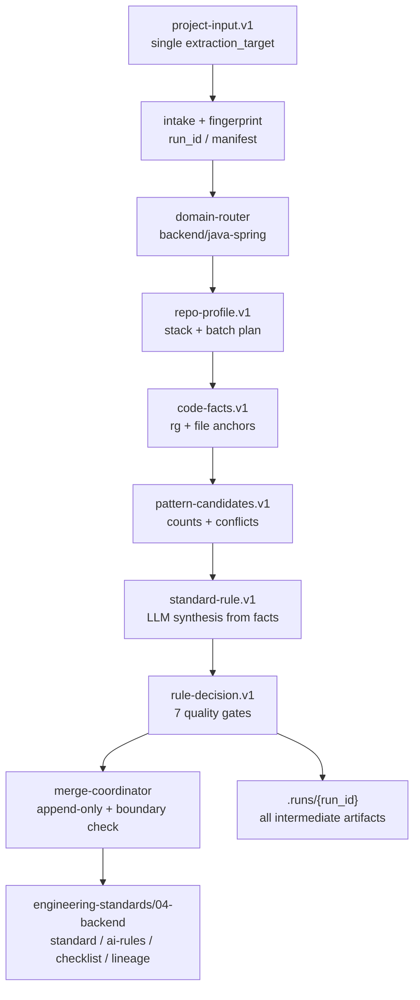
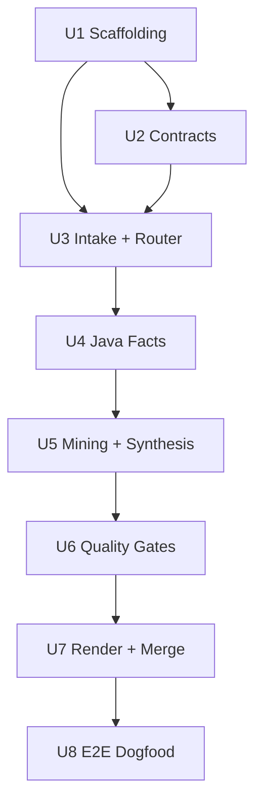

# feat: Implement project-standard-extractor Phase 0

## Summary

本计划把 `project-standard-extractor` 从设计基线落成可运行的 Phase 0 skill：一次性建立共享骨架、9 个版本化 JSON Schema 合同、7 道质量门禁、Node.js 脚本链路、`backend/java-spring` collector/miner/template，并用 evidence-backed 的 Java 单端闭环证明 `.runs/` 中间产物、正式规范产物、派生纪律和跨端输出边界成立。

---

## Problem Frame

部门已有 1000+ 工程的隐性研发规范，但当前规范沉淀方式容易在两个方向失真：人写通用最佳实践会脱离真实代码，LLM 直接读代码生成规范又会伪造 evidence、把局部习惯误升为部门规则，或绕过高风险 Owner 裁定。源需求已锁定产品形态：`project-standard-extractor` 是 domain-scoped extractor，不是 all-in-one generator；LLM 只能基于确定性代码事实归纳规则候选，不能直接立法。

本轮实现的重点是把 `docs/技术方案/README.md` 的设计基线落为可执行骨架，并只跑通 `backend/java-spring` 单端闭环。前端、APP、PC、CodeGraph、CodeWiki、PR Review Mining、Owner UI 和跨端公共规范提炼全部保持后置。

---

## Requirements

- R1. 每次运行必须绑定唯一 `extraction_target{domain, sub_domain}`；输入若混合多个端，必须拒绝并提示拆 run。
- R2. `run_id` 必须采用 `{yyyyMMdd-HHmmss}-{domain}-{sub_domain}-{short_input_hash}`，中间产物写入 `.runs/{run_id}/`，正式产物写入 `engineering-standards/{domain}/`。
- R3. 每个 run 必须生成 `manifest.json`，记录 run、输入指纹、源项目锚点、输出目录和运行状态。
- R4. `fact-collector` 必须用脚本抽取锚点级确定性事实，并为每条事实绑定 file、line、snippet hash 等 evidence。
- R5. Git 项目使用 commit 强锚定；非 Git 项目使用 `snapshot_id + path_hash + file + line + snippet_hash` 中等锚定；无法读取源码则不生成规则。
- R6. 必须实现 Evidence、Actionability、Abstraction、Conflict、Risk、Derivation、GIT-001 七道质量门禁，并输出每条规则的 decision 与 next_action。
- R7. Evidence、Derivation、GIT-001 由可执行结构校验硬判定；Abstraction、Actionability 由 LLM 语义判定；Conflict 由结构检查与 LLM 协同判定。
- R8. 正式产物文件统一带 `sub_domain` 后缀，避免同 domain 下多 sub_domain 覆盖。
- R9. `ai-rules-*.md` 与 `review-checklist-*.md` 只能从已接受 standard 规则派生，不得新增未过门禁的规则或检查项。
- R10. 每条规则必须通过 `rules-index` 与 `lineage-ledger` 回溯来源 run、facts、projects 和状态历史；待裁定项进入 `owner-decision-queue`。
- R11. 本轮必须一次性落地完整共享骨架、8 个 agent、domain-router、merge-coordinator、9 个合同、7 道门禁、scripts、backend 模板和 adapters README 占位。
- R12. auto-active 硬门槛为确定性出现次数不少于 2、高置信、无冲突、低/中风险；高风险域必须 Owner 确认，不得自动 active。
- R13. merge-coordinator 必须 append-only 写入，并校验当前 run 只能写自己的 `engineering-standards/{domain}/` 目录。

**Origin actors:** A1 抽取运行者，A2 规则负责人，A3 下游 AI 消费方，A4 skill 内部 agent 链。
**Origin flows:** F1 单端规范萃取主链路，F2 质量门禁拦截链路。
**Origin acceptance examples:** AE1 混合输入拒绝，AE2 非 Git evidence 降级，AE3 派生纪律阻断 advisory-only，AE4 冲突进入 conflicts/owner queue，AE5 跨端写入阻断，AE6 成功 run 产物落盘。

---

## Assumptions

- A1. 本轮实现允许通过当前 AI 宿主执行 agent 文档中的 LLM 判定步骤；脚本层负责结构不变量、合同校验、evidence 锚定、派生纪律和输出边界。
- A2. 真实 9627 KAZ Java 样本可能不会自然产生 conflict 或 pending；若实施期无法从真实样本触发，使用最小 golden sample 证明 Conflict/Risk gate 会拦截，而不为验收污染真实样本输入。
- A3. 计划不在仓库产物中硬编码本机绝对样本路径；真实样本路径只作为运行输入，由用户或运行配置提供。
- A4. Phase 0 使用 JSON Schema draft-07 与 Ajv v8，避免在首轮引入跨 draft 元 schema 复杂度；合同版本通过文件名、`schema` 字段和 `$id` 表达。

---

## Scope Boundaries

- 不实现前端、APP、PC、Python 等其他端 collector；只保留 domain 配置和占位说明。
- 不引入 AST、tree-sitter、LSP、CodeGraph 或调用图；事实抽取止于 rg、文件扫描、注解和命名锚点。
- 不接入 CodeWiki、CodeGraph、PR Review Mining；`tools/adapters/*/README.md` 只声明定位和后续接入契约。
- 不实现团队级/部门级升级流程和交互式 Owner UI；本轮只产出 `owner-decision-queue` 数据。
- 不做跨端 `00-global/` 公共规范提炼。
- 不引入向量库、图数据库、Web 平台、多 agent 编排框架或 CI 全量扫描平台。

### Deferred to Follow-Up Work

- 多端 collector 实现：在 `frontend`、`app-client`、`pc-client` 子域各自有真实样本后独立规划。
- CodeGraph/AST 增强：在 Phase 0 evidence 和派生纪律稳定后作为 adapter 接入。
- Owner 裁定 UI 与部门级规则升级：在 `owner-decision-queue` 数据格式经真实使用验证后规划。
- `00-global/` 跨端公共规范：等待至少两个端内规范完成后再提炼。

---

## Completion Criteria

- `skills/project-standard-extractor/` 具备薄入口、8 个 agent、workflows、domain-router、merge-coordinator、9 个合同、7 道门禁、scripts、backend/java-spring 配置、模板和 evals。
- 合同 schema、结构门禁、派生纪律和 merge 边界有可执行测试覆盖，且验证样例通过。
- `backend/java-spring` golden sample 能完整生成 `.runs/{run_id}/` 中间产物和 `engineering-standards/04-backend/` 正式产物。
- `ai-rules-java-spring.md` 与 `review-checklist-java-spring.md` 只派生自已接受 standard 规则。
- 至少一个 conflict 或 pending-confirmation 场景在真实样本或 golden sample 中被门禁拦截。
- 非 Git 输入能生成 `snapshot_id` evidence 并按 GIT-001 降级，不阻断抽取。
- `.runs/` 不作为正式产物提交；正式输出不污染其他 domain 目录。

---

## Direct Evidence

- target_repo: `ai-engineering-standards`
- source_refs:
  - `docs/brainstorms/2026-06-04-001-project-standard-extractor-requirements.md`
  - `docs/技术方案/README.md`
  - `docs/技术方案/代码规范skill方案.md`
  - `docs/技术方案/单端抽取方案.md`
  - `docs/技术方案/依赖增强方案.md`
  - `CHANGELOG.md`
  - `README.md`
- current_revision: `686e7349ebe4e4030f29f723daa8183516f4c410`
- worktree_dirty: true；当前仓库多项文件为未跟踪状态，计划只依赖已读文档内容，不假设它们已提交。
- discovery_methods: `rg --files`、`rg` targeted search、`find`、`git status`、`git rev-parse`、有限样本项目只读计数、Context7 官方文档查询。
- tests_or_logs: 当前仓库尚无 `package.json`、`skills/`、`docs/solutions/` 或实现测试；样本项目只读核查显示其不是 Git 仓库，Spring 注解锚点充足。
- confidence: 高。产品范围来自源需求与设计基线；实现路径为 greenfield，局部算法阈值会在实施期通过测试和样本验证收敛。
- limitations: 真实样本 Java 文件数量当前只读计数为 3585，与源需求记录的 3683 不一致；计划把该差异列为实施期复核点，不改变源需求验收意图。未读取业务源码片段内容，未运行任何尚不存在的 extractor 脚本。

---

## Context & Research

### Relevant Code and Patterns

- 仓库当前只有治理与方案文档，未发现现有 `package.json` 或 `skills/project-standard-extractor/` 实现；本计划按 greenfield 实现处理。
- `docs/技术方案/README.md` 是设计基线，已锁定 Node.js 单语言、严格单端运行、`.runs/` 与 `engineering-standards/` 物理分离、Git 可选、P0 只做 rg 注解/命名锚点事实。
- `docs/技术方案/单端抽取方案.md` 明确每次 run 必须绑定单一端域，混合 monorepo 需要拆 run，输出目录必须按 domain 硬边界隔离。
- `docs/技术方案/依赖增强方案.md` 建议根 `package.json` 使用 `type: module`、核心依赖 `ajv`、`ajv-formats`、`fast-glob`、`gray-matter`、`yaml`，测试优先使用 Node 内置 test runner。
- `CHANGELOG.md` 当前格式要求 `- v版本号 YYYY-MM-DD HH:MM:SS 作者: 变更摘要 [(user-visible)]`，作者来自 `~/.spec-first/.developer`，当前为 `leokuang`。

### Institutional Learnings

- 当前仓库未发现 `docs/solutions/`；无可复用历史学习文档。

### External References

- Ajv v8 文档显示 schema 应先校验、数据校验会编译并缓存 validator，错误对象会被后续校验覆盖；实现中需要为每个 artifact 保存当次 errors 快照。
- fast-glob 文档支持 `ignore`、`onlyFiles`、`absolute`、`dot` 等选项；collector 应用 include/exclude scope 映射到 glob pattern 与 ignore，而不是手写递归。
- Node.js v22 文档支持 `node --test` 和默认测试文件发现；Phase 0 可避免引入 Vitest/Jest。

---

## Key Technical Decisions

| Decision | Recommended Answer | Source Tag | Consequence |
| --- | --- | --- | --- |
| KTD1. Phase 0 交付形态 | 一次性建立完整共享骨架，只实现 `backend/java-spring` 闭环 | confirmed | 后续多端可复用合同、gate 和 merge 边界；首轮实现量较大 |
| KTD2. 事实层实现 | 使用 Node.js、fast-glob、rg、文件扫描和注解/命名锚点，不引入 AST | confirmed | 可快速闭环，但不能声明调用关系级 evidence |
| KTD3. 合同治理 | 9 个 JSON Schema 使用 draft-07、`$id`、`schema` 字段和版本化文件名；所有中间产物必须过 Ajv | advisory | 降低首轮复杂度，后续如升级 draft 需显式迁移 |
| KTD4. 非 Git evidence | 非 Git 输入不阻断，生成 `snapshot_id` 并将规则最高状态降级为 draft 或 this-repo auto-active | confirmed | 适配真实企业交付包，同时避免把弱锚定规则升为部门级 |
| KTD5. Gate 分层 | Evidence、Derivation、GIT-001 用脚本硬判定；Actionability、Abstraction、Conflict 语义部分由 agent 输出结构化判定 | confirmed | 保持“LLM 不立法”，但需要明确 agent 输入/输出合同 |
| KTD6. 真实冲突验收 | 优先从真实样本触发 conflict/pending；触发不到时用 golden sample 证明门禁拦截 | session-local | 不污染真实样本，也不让验收依赖偶然数据分布 |
| KTD7. 输出命名 | 采用 `standard-java-spring.md`、`ai-rules-java-spring.md`、`review-checklist-java-spring.md` | confirmed | 覆盖早期方案中 `ai-rules-java.md` 的历史示例，避免同 domain 覆盖 |
| KTD8. 样本路径处理 | 不在源码、测试 fixture 或正式产物中硬编码本机绝对路径 | advisory | 计划和实现可移植；真实 dogfood 通过运行输入提供路径 |

---

## Open Questions

### Resolved During Planning

- 7 道门禁如何划分实现责任：结构和派生不变量由脚本判定，语义质量由 agent 文档约束并输出合同化结果。
- Java collector 初始锚点范围如何确定：以 Spring 注解、Maven 多模块、main/test/resource scope、Controller/Service/Mapper/Repository/Transaction/Exception/Cache/MQ/Job 命名与注解为 P0 范围。
- `snapshot_id` 算法如何取舍：对 include/exclude 后的文件集合流式计算内容指纹，输入指纹只记录路径 hash 和文件 hash，不记录本机绝对路径。
- 8 个 agent 如何交接：每个 agent 文档声明输入合同、输出合同、禁止事项和失败降级，脚本在阶段边界校验 artifacts。
- 若真实样本没有冲突如何满足验收：补 golden sample 作为 gate regression，不伪造真实样本 evidence。

### Deferred to Implementation

- 具体 `rule_id` 命名细节：由实现时的 renderer 与 fixtures 稳定下来，但必须保持可读、可回溯、同一 run 内唯一。
- Actionability/Abstraction 的提示词细节：实现时根据 agent 文档和失败样例调整，计划只锁定输入输出合同与 fail-closed 原则。
- Java 文件数量差异原因：实施期重新运行样本扫描并记录当前计数，不把文件数当作硬编码断言。

---

## Output Structure

```text
package.json
package-lock.json
.gitignore
skills/project-standard-extractor/
  SKILL.md
  README.md
  workflows/
  agents/
  domain-router.md
  merge-coordinator.md
  contracts/
  domains/
    backend/
      java-spring.md
      collectors.json
      rule-taxonomy.md
    app-client/
    frontend/
    pc-client/
  collectors/
    common/
    backend/
  miners/
  quality-gates/
  scripts/
  templates/
    backend/
  tests/
  evals/
    golden-samples/
tools/adapters/
  codewiki/README.md
  codegraph/README.md
  pr-review/README.md
engineering-standards/
  04-backend/
```

---

## High-Level Technical Design

> *This illustrates the intended approach and is directional guidance for review, not implementation specification. The implementing agent should treat it as context, not code to reproduce.*



The design has two hard boundaries: source code is read-only, and only the active `domain/sub_domain` may produce formal output. Everything else is either an intermediate `.runs/{run_id}/` artifact or deferred adapter/domain scaffolding.

---

## Implementation Units



### U1. Scaffold runtime, skill entry, and domain skeleton

**Goal:** 建立 Phase 0 的低依赖 Node.js 项目骨架、薄 `SKILL.md` 入口、workflows、8 个 agent 文档、domain 占位、adapter README 与忽略规则，为后续单端闭环提供稳定目录。

**Requirements:** R1, R2, R8, R11, R13, F1

**Dependencies:** None

**Files:**
- Create: `package.json`
- Create: `package-lock.json`
- Modify: `.gitignore`
- Create: `skills/project-standard-extractor/SKILL.md`
- Create: `skills/project-standard-extractor/README.md`
- Create: `skills/project-standard-extractor/workflows/full-auto.md`
- Create: `skills/project-standard-extractor/workflows/profile-first.md`
- Create: `skills/project-standard-extractor/workflows/batch-extraction.md`
- Create: `skills/project-standard-extractor/workflows/diff-extraction.md`
- Create: `skills/project-standard-extractor/workflows/owner-review.md`
- Create: `skills/project-standard-extractor/agents/01-intake-and-scope.md`
- Create: `skills/project-standard-extractor/agents/02-repo-profiler.md`
- Create: `skills/project-standard-extractor/agents/03-fact-collector.md`
- Create: `skills/project-standard-extractor/agents/04-pattern-miner.md`
- Create: `skills/project-standard-extractor/agents/05-rule-synthesizer.md`
- Create: `skills/project-standard-extractor/agents/06-quality-gate.md`
- Create: `skills/project-standard-extractor/agents/07-publisher.md`
- Create: `skills/project-standard-extractor/agents/08-owner-review.md`
- Create: `skills/project-standard-extractor/domains/backend/java-spring.md`
- Create: `skills/project-standard-extractor/domains/backend/collectors.json`
- Create: `skills/project-standard-extractor/domains/backend/rule-taxonomy.md`
- Create: `skills/project-standard-extractor/domains/app-client/README.md`
- Create: `skills/project-standard-extractor/domains/frontend/README.md`
- Create: `skills/project-standard-extractor/domains/pc-client/README.md`
- Create: `tools/adapters/codewiki/README.md`
- Create: `tools/adapters/codegraph/README.md`
- Create: `tools/adapters/pr-review/README.md`
- Test: `skills/project-standard-extractor/tests/scaffolding.test.mjs`

**Approach:**
- Keep `SKILL.md` thin: purpose, when-to-use, when-not-to-use, default workflow, hard rules.
- Define agent docs as contract-bound instructions, not implementation scripts; each doc names accepted input artifact and emitted output artifact.
- Add root package scripts for profile, facts, mining, validation, rendering, merge, and test, but keep implementation in later units.
- Add `.runs/` and `node_modules/` to `.gitignore`; do not ignore `engineering-standards/` because formal outputs are source-owned assets.

**Patterns to follow:**
- `docs/技术方案/README.md` section 6 directory skeleton.
- `docs/技术方案/代码规范skill方案.md` Skill entry and agent sequence.
- `docs/技术方案/依赖增强方案.md` root `package.json` dependency posture.

**Test scenarios:**
- Happy path: package metadata contains `type: module` and all expected `pse:*` scripts point under `skills/project-standard-extractor/scripts/`.
- Happy path: all 8 agent markdown files exist and name an input and output contract.
- Edge case: `.gitignore` includes `.runs/` but does not ignore `engineering-standards/`.
- Error path: scaffolding test fails if a workflow references a missing agent file.

**Verification:**
- A fresh reader can start from `SKILL.md` and see the full workflow without reading implementation scripts.
- Missing scaffolding files are caught by tests rather than discovered during implementation.

---

### U2. Define versioned contracts and Ajv validation

**Goal:** 建立 9 个版本化 JSON Schema 合同、共享合同加载/校验脚本和 fixture，确保所有中间产物与正式治理数据都有机器可验证结构。

**Requirements:** R3, R4, R5, R6, R7, R10, R11, F1, F2, AE2, AE3, AE6

**Dependencies:** U1

**Files:**
- Create: `skills/project-standard-extractor/contracts/project-input.v1.schema.json`
- Create: `skills/project-standard-extractor/contracts/repo-profile.v1.schema.json`
- Create: `skills/project-standard-extractor/contracts/batch-plan.v1.schema.json`
- Create: `skills/project-standard-extractor/contracts/code-facts.v1.schema.json`
- Create: `skills/project-standard-extractor/contracts/pattern-candidates.v1.schema.json`
- Create: `skills/project-standard-extractor/contracts/standard-rule.v1.schema.json`
- Create: `skills/project-standard-extractor/contracts/rule-decision.v1.schema.json`
- Create: `skills/project-standard-extractor/contracts/lineage-ledger.v1.schema.json`
- Create: `skills/project-standard-extractor/contracts/owner-decision-queue.v1.schema.json`
- Create: `skills/project-standard-extractor/scripts/validate-contracts.mjs`
- Create: `skills/project-standard-extractor/scripts/lib/contracts.mjs`
- Create: `skills/project-standard-extractor/tests/contracts.test.mjs`
- Create: `skills/project-standard-extractor/evals/golden-samples/contracts/valid/`
- Create: `skills/project-standard-extractor/evals/golden-samples/contracts/invalid/`

**Approach:**
- Use draft-07, explicit `$id`, `schema` const fields, required version fields, `additionalProperties: false` for governance-critical objects, and `ajv-formats` for `date-time`.
- Validate both schemas and artifacts; save each validation result's errors immediately so later Ajv calls cannot overwrite diagnostics.
- Model evidence anchors explicitly for Git and non-Git cases. Non-Git anchors must require `snapshot_id`, `path_hash`, `file`, `line_range`, and `snippet_hash`.
- Keep schema evolution explicit: new incompatible contract versions create new `*.vN.schema.json` files rather than mutating semantics in place.

**Patterns to follow:**
- Contract list and fields in `docs/技术方案/README.md` section 7.
- Rule lifecycle and output fields in `docs/技术方案/代码规范skill方案.md` sections 9, 14, and 15.
- Ajv v8 official validation pattern: compile/cached validators, schema validation, copied errors.

**Test scenarios:**
- Happy path: each valid fixture validates against its matching contract and carries the expected `schema` value.
- Happy path: schema self-validation passes for all 9 contracts.
- Edge case: a non-Git `code-facts.v1` fixture without `snapshot_id` fails validation.
- Edge case: a `rule-decision.v1` fixture missing one of the seven gate results fails validation.
- Error path: a fixture with an unknown top-level property fails because governance artifacts are closed by default.
- Integration: `validate-contracts.mjs` can validate a directory of artifacts and report all failures, not just the first failure.

**Verification:**
- Contract validation can be run before and after every pipeline stage.
- Invalid evidence, missing gate results, and derivation shape drift are caught by schema tests.

---

### U3. Implement intake, fingerprinting, manifest, and domain routing

**Goal:** 实现单端输入校验、敏感文件识别、run_id/snapshot_id/input_fingerprint 生成、manifest 生命周期和 domain-router 输出边界选择。

**Requirements:** R1, R2, R3, R5, R8, R11, R13, F1, AE1, AE2, AE5, AE6

**Dependencies:** U1, U2

**Files:**
- Create: `skills/project-standard-extractor/domain-router.md`
- Create: `skills/project-standard-extractor/scripts/run-profile.mjs`
- Create: `skills/project-standard-extractor/scripts/lib/input-normalizer.mjs`
- Create: `skills/project-standard-extractor/scripts/lib/fingerprint.mjs`
- Create: `skills/project-standard-extractor/scripts/lib/manifest.mjs`
- Create: `skills/project-standard-extractor/scripts/lib/domain-router.mjs`
- Create: `skills/project-standard-extractor/scripts/lib/sensitive-files.mjs`
- Create: `skills/project-standard-extractor/tests/intake-router.test.mjs`
- Create: `skills/project-standard-extractor/evals/golden-samples/intake/`

**Approach:**
- Normalize `project_paths`, scope include/exclude, and `extraction_target` before hashing.
- Derive `run_id` from local timestamp, `domain`, `sub_domain`, and `input_fingerprint` short hash.
- Derive `snapshot_id` from in-scope file content hashes for non-Git paths; do not store absolute paths in artifacts beyond path hashes and user-facing manifest metadata needed for traceability.
- Reject mixed domain inputs when the provided paths or detected stack imply multiple domains. For ambiguous single-domain inputs, emit mismatch warnings rather than silently changing target.
- Route `backend/java-spring` to `engineering-standards/04-backend/` and refuse writes outside the active domain's allowed output directory.

**Technical design:** Directional routing contract:

```text
project-input.v1
  -> normalize + validate
  -> detect source_type and domain_match
  -> create .runs/{run_id}/manifest.json status=running
  -> emit repo-profile.v1 with batch_plan for selected domain only
```

**Patterns to follow:**
- Run model, manifest and directory layout in `docs/技术方案/README.md` sections 3 and 5.
- Single-domain routing semantics in `docs/技术方案/单端抽取方案.md` sections 8-10.

**Test scenarios:**
- Covers AE1. Happy path: a `backend/java-spring` input with one Java sample path produces a run_id matching the required format and a manifest with status `running`.
- Covers AE1. Error path: an input containing backend and frontend paths is rejected with a split-run diagnostic and writes no `.runs/{run_id}/`.
- Covers AE2. Happy path: a non-Git path produces `source_type=filesystem`, a `snapshot_id`, and no required `git_commit`.
- Covers AE5. Error path: a backend run configured to write `engineering-standards/03-frontend/` is rejected before any output write.
- Edge case: unreadable or missing `project_paths` fail intake and do not generate rules.

**Verification:**
- Every downstream stage starts from a validated manifest and repo profile.
- Run isolation and domain output boundaries are enforced before collectors or renderers run.

---

### U4. Build backend/java-spring profiler and deterministic fact collectors

**Goal:** 用 rg 与文件扫描实现 Java Spring 锚点级事实抽取，覆盖层级、API、事务、异常、日志、缓存、MQ/job 等 P0 范围，并将 facts 绑定 evidence anchor。

**Requirements:** R4, R5, R11, F1, AE2, AE6

**Dependencies:** U2, U3

**Files:**
- Create: `skills/project-standard-extractor/collectors/common/scan-files.mjs`
- Create: `skills/project-standard-extractor/collectors/common/extract-git-metadata.mjs`
- Create: `skills/project-standard-extractor/collectors/common/evidence-anchor.mjs`
- Create: `skills/project-standard-extractor/collectors/backend/collect-java-layer-facts.mjs`
- Create: `skills/project-standard-extractor/collectors/backend/collect-spring-api-facts.mjs`
- Create: `skills/project-standard-extractor/collectors/backend/collect-transaction-facts.mjs`
- Create: `skills/project-standard-extractor/collectors/backend/collect-exception-log-facts.mjs`
- Create: `skills/project-standard-extractor/collectors/backend/collect-cache-facts.mjs`
- Create: `skills/project-standard-extractor/collectors/backend/collect-mq-job-facts.mjs`
- Create: `skills/project-standard-extractor/scripts/run-fact-collection.mjs`
- Create: `skills/project-standard-extractor/tests/java-facts.test.mjs`
- Create: `skills/project-standard-extractor/evals/golden-samples/java-spring/src/`

**Approach:**
- Use fast-glob for scoped file discovery and rg for high-volume annotation/name matching.
- Extract deterministic facts from `@RestController`, `@Controller`, `@Service`, `@Component`, `@Repository`, `@Mapper`, `@Transactional`, request mapping annotations, exception handler/advice annotations, cache annotations, scheduled/job/MQ markers and naming conventions.
- Record line ranges and snippet hashes for each evidence anchor; snippets may be saved under `.runs/{run_id}/evidence/` but formal outputs should reference stable evidence IDs.
- Distinguish `src/main` and `src/test` facts so test-only patterns do not become production rules.
- Treat fact extraction as observation only; no collector should synthesize normative language.

**Patterns to follow:**
- Java dependency and annotation list in `docs/技术方案/依赖增强方案.md` sections 4.1 and 14.
- Code-facts contract in `docs/技术方案/README.md` section 7.

**Test scenarios:**
- Happy path: a sample controller/service/mapper fixture emits layering and API facts with file, line_range and snippet_hash.
- Happy path: a non-Git fixture emits anchors with `snapshot_id` and `path_hash`, not `git.commit`.
- Edge case: generated/build directories are excluded and produce no facts.
- Edge case: test-scope Java files are marked as test facts and do not contribute to production occurrence counts.
- Error path: unreadable files are recorded as blind spots in `repo-profile.v1` instead of producing partial fake facts.
- Integration: `run-fact-collection.mjs` writes a `code-facts.v1.json` artifact that passes contract validation.

**Verification:**
- Fact collection can explain every emitted fact with a concrete source anchor.
- No rule-like language is generated before the pattern/rule stages.

---

### U5. Implement pattern mining and contract-bound rule synthesis handoff

**Goal:** 将 deterministic facts 聚合为模式候选，识别正例、反例、出现次数、模块/角色多样性、风险标签和冲突信号，并为 LLM rule-synthesizer 提供严格的输入/输出边界。

**Requirements:** R6, R7, R10, R11, R12, F1, F2, AE4

**Dependencies:** U2, U4

**Files:**
- Create: `skills/project-standard-extractor/miners/mine-layering-patterns.mjs`
- Create: `skills/project-standard-extractor/miners/mine-naming-patterns.mjs`
- Create: `skills/project-standard-extractor/miners/mine-api-patterns.mjs`
- Create: `skills/project-standard-extractor/miners/mine-error-handling-patterns.mjs`
- Create: `skills/project-standard-extractor/miners/mine-log-patterns.mjs`
- Create: `skills/project-standard-extractor/miners/mine-test-patterns.mjs`
- Create: `skills/project-standard-extractor/miners/mine-forbidden-patterns.mjs`
- Create: `skills/project-standard-extractor/miners/mine-legacy-compatible-patterns.mjs`
- Create: `skills/project-standard-extractor/scripts/run-pattern-mining.mjs`
- Create: `skills/project-standard-extractor/scripts/lib/risk-tags.mjs`
- Create: `skills/project-standard-extractor/tests/pattern-mining.test.mjs`
- Create: `skills/project-standard-extractor/evals/golden-samples/java-spring/conflict/`

**Approach:**
- Start with deterministic miners for P0 categories that can be inferred from fact kinds and anchors; do not infer call graph behavior.
- Emit `pattern-candidates.v1` with occurrence counts, diversity, positive/negative fact IDs, suggested state and risk level.
- Agent `05-rule-synthesizer.md` consumes pattern candidates and emits `standard-rule.v1` candidates only when every normative statement references source facts.
- Fail closed when LLM output lacks evidence references, invents source facts, or emits rules outside the active domain/sub_domain.

**Patterns to follow:**
- Pattern-candidates and standard-rule examples in `docs/技术方案/代码规范skill方案.md` sections 9.4 and 9.5.
- Rule lifecycle states in `docs/技术方案/README.md` section 9.

**Test scenarios:**
- Happy path: two matching controller/service facts produce one high-confidence layering pattern candidate.
- Edge case: a single occurrence produces draft/pending candidate, not auto-active.
- Covers AE4. Error path: positive and negative examples for the same pattern produce a conflict-marked candidate and no auto-active suggestion.
- Error path: a synthesized rule that references a missing fact ID is rejected before quality gate.
- Integration: mined patterns and synthesized standard-rule fixtures both pass their contracts.

**Verification:**
- Rule candidates are traceable to pattern and fact IDs before gate evaluation.
- Conflicts are detected early enough that quality gates can route them to conflicts and owner queue.

---

### U6. Implement seven quality gates and derivation discipline checks

**Goal:** 实现 Evidence、Actionability、Abstraction、Conflict、Risk、Derivation、GIT-001 七道门禁，输出 `rule-decision.v1`，并确保 high-risk、conflict、advisory-only 和 non-Git 升级边界被拦截。

**Requirements:** R6, R7, R9, R10, R12, F2, AE2, AE3, AE4

**Dependencies:** U2, U5

**Files:**
- Create: `skills/project-standard-extractor/quality-gates/evidence-gate.md`
- Create: `skills/project-standard-extractor/quality-gates/actionability-gate.md`
- Create: `skills/project-standard-extractor/quality-gates/abstraction-gate.md`
- Create: `skills/project-standard-extractor/quality-gates/conflict-gate.md`
- Create: `skills/project-standard-extractor/quality-gates/risk-gate.md`
- Create: `skills/project-standard-extractor/quality-gates/derivation-gate.md`
- Create: `skills/project-standard-extractor/quality-gates/git-001-gate.md`
- Create: `skills/project-standard-extractor/scripts/run-quality-gates.mjs`
- Create: `skills/project-standard-extractor/scripts/lib/gates/evidence.mjs`
- Create: `skills/project-standard-extractor/scripts/lib/gates/conflict.mjs`
- Create: `skills/project-standard-extractor/scripts/lib/gates/risk.mjs`
- Create: `skills/project-standard-extractor/scripts/lib/gates/derivation.mjs`
- Create: `skills/project-standard-extractor/scripts/lib/gates/git-001.mjs`
- Create: `skills/project-standard-extractor/tests/quality-gates.test.mjs`
- Create: `skills/project-standard-extractor/tests/derivation.test.mjs`

**Approach:**
- Encode hard gates as executable checks over validated artifacts. Evidence gate requires source evidence; auto-active requires at least two deterministic occurrences.
- GIT-001 explicitly allows non-Git extraction while capping upgrade state and requiring medium-strength anchors.
- Risk gate requires owner confirmation for trading, fund, auth, security, privacy, compliance, release and production-change tags.
- Actionability/Abstraction gate markdown defines LLM rubric and output fields; executable checks validate that semantic results are present and fail closed when absent.
- Derivation gate checks `ai_coding_rule` and review checklist items originate from accepted standard rules and blocks advisory-only rules from downstream outputs.

**Patterns to follow:**
- Gate definitions in `docs/技术方案/README.md` section 8.
- Detailed gate conditions in `docs/技术方案/代码规范skill方案.md` section 13.

**Test scenarios:**
- Covers AE3. Error path: a rule with only advisory evidence fails Evidence/Derivation and never appears in AI rules.
- Covers AE4. Error path: a conflict candidate produces `decision=conflict` or pending owner action and is not auto-active.
- Covers AE2. Happy path: a non-Git rule with valid snapshot anchors can pass extraction but cannot upgrade beyond allowed authority.
- Error path: a high-risk auth/security/payment rule with otherwise strong evidence requires owner confirmation.
- Error path: a vague semantic rule such as "代码要优雅" fails Actionability/Abstraction semantic gate output and cannot enter accepted outputs.
- Happy path: a rule with concrete Must/Must Not text, evidence IDs and reviewer-checkable wording passes semantic gate structure when the agent returns an explicit pass.
- Edge case: a semantic gate result missing from LLM output fails closed rather than defaulting pass.
- Integration: every evaluated rule emits a `rule-decision.v1` artifact with all seven gate entries and next_action.

**Verification:**
- No rule can enter active paths without evidence, accepted derivation, and gate decisions.
- Gate tests prove both passing and blocking behavior, not only happy paths.

---

### U7. Render formal outputs and enforce append-only merge boundaries

**Goal:** 将 accepted/draft/pending/conflict rule decisions 渲染为正式规范产物，维护 rules-index、lineage-ledger、pending/conflicts/owner queue，并由 merge-coordinator 执行 append-only 和跨端硬边界。

**Requirements:** R2, R3, R8, R9, R10, R13, F1, F2, AE3, AE5, AE6

**Dependencies:** U2, U6

**Files:**
- Create: `skills/project-standard-extractor/merge-coordinator.md`
- Create: `skills/project-standard-extractor/templates/backend/standard-template.md`
- Create: `skills/project-standard-extractor/templates/backend/ai-rules-template.md`
- Create: `skills/project-standard-extractor/templates/backend/review-checklist-template.md`
- Create: `skills/project-standard-extractor/templates/backend/evidence-template.md`
- Create: `skills/project-standard-extractor/templates/backend/pending-confirmation-template.md`
- Create: `skills/project-standard-extractor/templates/backend/conflicts-template.md`
- Create: `skills/project-standard-extractor/templates/backend/rules-index-template.json`
- Create: `skills/project-standard-extractor/scripts/render-standards.mjs`
- Create: `skills/project-standard-extractor/scripts/merge-append-only.mjs`
- Create: `skills/project-standard-extractor/scripts/generate-review-summary.mjs`
- Create: `skills/project-standard-extractor/scripts/lib/rendering.mjs`
- Create: `skills/project-standard-extractor/scripts/lib/lineage.mjs`
- Create: `skills/project-standard-extractor/scripts/lib/merge-boundary.mjs`
- Create: `skills/project-standard-extractor/tests/rendering.test.mjs`
- Create: `skills/project-standard-extractor/tests/merge-boundary.test.mjs`
- Create: `engineering-standards/04-backend/.gitkeep`

**Approach:**
- Render standard, AI rules and review checklist using accepted rule decisions only; draft/pending/conflict route to their own sections/files.
- Use `sub_domain` suffix for all formal markdown files and evidence subdirectories.
- Preserve existing owner-confirmed and legacy-compatible records during append-only merge; never overwrite them with unconfirmed auto output.
- Update `rules-index.json` and `lineage-ledger.json` with source run, patterns, facts, projects and status history.
- Validate every intended output path against active domain base dir before write.

**Patterns to follow:**
- Output layout in `docs/技术方案/README.md` section 3.2.
- Formal output design in `docs/技术方案/代码规范skill方案.md` section 15.
- Cross-domain hard boundary in `docs/技术方案/单端抽取方案.md` section 8.

**Test scenarios:**
- Covers AE6. Happy path: a successful backend/java-spring render creates standard, ai-rules, review-checklist, index, lineage, queue and evidence outputs under `engineering-standards/04-backend/`.
- Covers AE3. Error path: a rule failing Derivation gate is absent from `ai-rules-java-spring.md` and `review-checklist-java-spring.md`.
- Covers AE5. Error path: a renderer attempting to write `engineering-standards/03-frontend/` during a backend run is blocked.
- Edge case: an existing owner-confirmed rule remains intact when a new run appends draft rules.
- Integration: lineage ledger records created_by_run and source fact IDs for every rendered rule.

**Verification:**
- Formal outputs are append-only and domain-scoped.
- Downstream AI/review artifacts cannot contain rules absent from accepted standard rules.

---

### U8. Add end-to-end evals and run the backend/java-spring dogfood loop

**Goal:** 用 golden sample 和真实 Java 样本验证整条链路：合同校验、事实抽取、模式挖掘、规则合成、质量门禁、正式产物派生和边界阻断。

**Requirements:** R1, R2, R3, R4, R5, R6, R7, R8, R9, R10, R11, R12, R13, F1, F2, AE1, AE2, AE3, AE4, AE5, AE6

**Dependencies:** U1, U2, U3, U4, U5, U6, U7

**Files:**
- Create: `skills/project-standard-extractor/scripts/run-full-auto.mjs`
- Create: `skills/project-standard-extractor/tests/e2e-java-spring.test.mjs`
- Create: `skills/project-standard-extractor/tests/non-git-evidence.test.mjs`
- Create: `skills/project-standard-extractor/tests/mixed-domain-rejection.test.mjs`
- Create: `skills/project-standard-extractor/evals/golden-samples/java-spring/project-input.json`
- Create: `skills/project-standard-extractor/evals/golden-samples/java-spring/README.md`
- Create: `skills/project-standard-extractor/evals/golden-samples/java-spring/conflict/README.md`
- Create: `engineering-standards/04-backend/standard-java-spring.md`
- Create: `engineering-standards/04-backend/ai-rules-java-spring.md`
- Create: `engineering-standards/04-backend/review-checklist-java-spring.md`
- Create: `engineering-standards/04-backend/rules-index.json`
- Create: `engineering-standards/04-backend/lineage-ledger.json`
- Create: `engineering-standards/04-backend/pending-confirmation.md`
- Create: `engineering-standards/04-backend/conflicts.md`
- Create: `engineering-standards/04-backend/owner-decision-queue.json`
- Create: `engineering-standards/04-backend/evidence/java-spring/`
- Modify: `CHANGELOG.md`

**Approach:**
- Build a tiny Java Spring golden sample that contains one clean pattern, one non-Git evidence path, one conflict/pending case and one derivation-blocked rule.
- Run end-to-end tests against golden sample first; then dogfood with the origin-provided 9627 KAZ sample path as a local input.
- If the real sample produces no conflict/pending, keep the real output honest and rely on golden sample regression for the gate interception criterion.
- Generated `.runs/{run_id}/` artifacts validate implementation but remain ignored unless a future workflow explicitly asks to preserve a run fixture.

**Execution note:** Start with golden sample e2e coverage before running the large real sample so implementation failures are isolated from sample-specific scale or path issues.

**Patterns to follow:**
- Success criteria in the origin requirements document.
- `.runs/` and formal output split in `docs/技术方案/README.md`.

**Test scenarios:**
- Covers AE1. Error path: mixed-domain golden input is rejected and produces no formal output.
- Covers AE2. Happy path: non-Git golden sample facts use `snapshot_id + path_hash + file + line + snippet_hash`.
- Covers AE3. Error path: advisory-only candidate is blocked from AI rules and review checklist.
- Covers AE4. Error path: positive/negative pattern writes conflicts and owner queue.
- Covers AE5. Error path: backend run cannot write other domain directories.
- Covers AE6. Happy path: successful backend/java-spring run writes completed manifest, intermediate artifacts and formal outputs.
- Error path: generated formal outputs containing a local absolute source path are rejected or rewritten to approved path hashes/source anchors before commit.
- Integration: real sample dogfood validates contracts and produces at least one evidence-backed `standard-java-spring.md` rule.

**Verification:**
- Golden sample tests prove deterministic behavior.
- Real sample dogfood proves scale and evidence-backed output on an enterprise Java project.
- Final outputs satisfy origin success criteria without hardcoding sample-specific absolute paths.

---

## System-Wide Impact

- **Skill surface:** Adds a new public skill under `skills/project-standard-extractor/`; downstream users should enter through `SKILL.md`, while scripts remain implementation helpers behind the documented workflow.
- **Repo runtime:** Introduces root Node.js runtime metadata and lockfile; this creates a new install/test surface for the repository and should stay limited to Phase 0 dependencies.
- **Artifact lifecycle:** `.runs/{run_id}/` is transient execution evidence, while `engineering-standards/04-backend/` is source-owned standards output. Tests must prove generated formal outputs are derived from validated run artifacts, not manually invented.
- **Governance consumers:** `rules-index.json`, `lineage-ledger.json`, `owner-decision-queue.json`, `ai-rules-java-spring.md`, and `review-checklist-java-spring.md` become future inputs for AI Coding, review, and Owner adjudication; their schemas and derivation rules are therefore compatibility surfaces.
- **Future adapters:** `tools/adapters/*/README.md` declares adapter boundaries without introducing dependencies, preserving the P0 rule that advisory sources cannot enter facts without source-code verification.
- **Error propagation:** Intake, contract, evidence and merge-boundary failures must fail before formal writes; gate failures with valid evidence route to draft, pending, conflict or owner queue instead of aborting the entire run.
- **State lifecycle risks:** A run can be partially generated before a later gate or merge failure. Manifest status must move from `running` to `completed`, `failed`, or `aborted`, and formal outputs must only be merged after all required validations pass.
- **Unchanged invariants:** Business source projects are read-only; no business code is modified, no cross-domain output is written, and no high-risk rule becomes active without Owner confirmation.

---

## Dependencies / Prerequisites

- Node.js runtime capable of ESM and the built-in test runner.
- Git and ripgrep available in the local environment; Git absence in target source projects is supported, but Git absence in the tool environment still affects metadata checks.
- Core Node dependencies limited to `ajv`, `ajv-formats`, `fast-glob`, `gray-matter`, and `yaml` for Phase 0.
- Current AI host must be able to execute the documented semantic gate and rule-synthesis agent prompts, or implementation must provide a documented manual fallback for those semantic decisions.
- The origin-provided 9627 KAZ Java sample path must remain available for dogfood validation, but implementation must also pass the repo-local golden sample without that external path.

---

## Risks & Dependencies

| Risk | Likelihood | Impact | Mitigation |
| --- | --- | --- | --- |
| LLM synthesis invents evidence or normative rules | Medium | High | Contract-bound agent output, evidence ID validation, fail-closed Derivation/Evidence gates |
| Real Java sample does not trigger conflict/pending | Medium | Medium | Use golden sample for gate regression while keeping real output honest |
| Non-Git evidence is over-promoted | Medium | High | GIT-001 hard gate caps authority and requires snapshot/path/snippet anchors |
| Greenfield implementation grows too broad | Medium | Medium | Keep AST, multi端 collectors, adapters and Owner UI out of this plan |
| Output directory pollution | Low | High | Domain-router and merge-boundary tests block writes outside active domain |
| Contract churn breaks downstream readers | Medium | Medium | Version schema files and add tests for fixture compatibility |
| Large sample scan is slow | Medium | Medium | Use fast-glob include/exclude, rg for search, streaming hashes for snapshot calculation |
| Formal outputs drift from validated run artifacts | Medium | High | Render formal outputs from validated `.runs/{run_id}/` artifacts only and cover derivation with e2e tests |
| Semantic gate support varies by AI host | Medium | Medium | Keep semantic gates contract-bound and fail closed; document manual/Owner fallback for unresolved semantic results |
| Local sample path leaks into committed artifacts | Low | Medium | Store path hashes and repo-relative source anchors where possible; tests should reject hardcoded local absolute paths in generated formal outputs |

---

## Alternative Approaches Considered

- Java-only minimal skeleton: rejected because the origin explicitly requires full shared skeleton now; Java-only would force later multi端接入重写 contracts、gate 和 merge boundaries。
- Full AST/CodeGraph first: rejected for Phase 0 because source requirements lock P0 to rg/file anchors and explicitly exclude AST/call graph.
- One-run all-domain extraction: rejected because single-domain run is a locked product decision and protects output boundary correctness.
- Pure LLM extractor: rejected because it violates “LLM 不立法” and cannot guarantee evidence, derivation and high-risk gate discipline.

---

## Success Metrics

- 9 个 contract schema 全部可校验，并有 valid/invalid fixtures。
- 7 道 gate 都至少有一个 pass 和一个 block/route 测试场景。
- Golden sample e2e 生成完整 `.runs/{run_id}/` 与 `engineering-standards/04-backend/` 输出。
- `standard-java-spring.md` 至少包含一条 evidence-backed 规则。
- `ai-rules-java-spring.md` 和 `review-checklist-java-spring.md` 不包含未 accepted standard 规则。
- 非 Git 样本不阻断抽取，且不会升级到不允许的 authority scope。

---

## Documentation / Operational Notes

- `skills/project-standard-extractor/README.md` 应解释 Phase 0 能力、运行输入、输出目录、限制和后续 adapter 路线。
- `skills/project-standard-extractor/evals/golden-samples/java-spring/README.md` 应解释样例覆盖哪些 gate，不把样例伪装为真实部门规范。
- `tools/adapters/*/README.md` 应明确 CodeWiki 是 advisory、CodeGraph 可作为未来 deterministic evidence、PR Review Mining 是未来团队隐性规范来源。
- `engineering-standards/04-backend/standard-java-spring.md` 应带 frontmatter 和 evidence 索引，方便后续 AI/Review 消费。
- 后续实施凡新增、删除或修改项目 source，都必须按根目录 `CHANGELOG.md` 当前格式追加记录，作者沿用全局 developer profile。

---

## Sources & References

- **Origin document:** `docs/brainstorms/2026-06-04-001-project-standard-extractor-requirements.md`
- **Design baseline:** `docs/技术方案/README.md`
- **Original architecture draft:** `docs/技术方案/代码规范skill方案.md`
- **Single-domain extraction model:** `docs/技术方案/单端抽取方案.md`
- **Dependency strategy:** `docs/技术方案/依赖增强方案.md`
- **Changelog format:** `CHANGELOG.md`
- **Ajv v8 docs:** `https://github.com/ajv-validator/ajv/blob/master/docs/README.md`
- **fast-glob docs:** `https://github.com/mrmlnc/fast-glob/blob/master/README.md`
- **Node.js test runner docs:** `https://nodejs.org/docs/latest-v22.x/api/test.html`
